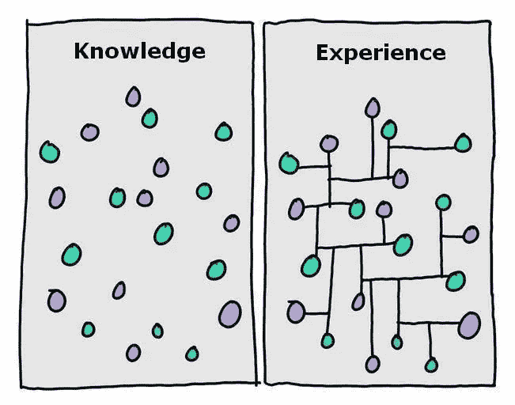
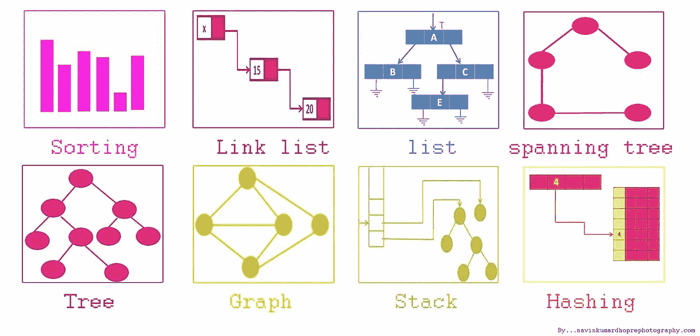

# 在申请亚马逊的软件开发职位之前

> 原文：<https://levelup.gitconnected.com/before-applying-to-software-developer-positions-at-amazon-db65a76a2e4b>

## 来自亚马逊软件工程师和招聘人员的建议


我采访了一位工程师和招聘人员，以了解在亚马逊面试时如何才能成功。以下是申请成为亚马逊软件开发人员之前要做的事情的内幕。如果你做到了这些，你就能在面试中表现出色。

# 软件开发

经验:第一点建议是将经验列在招聘启事上。大多数亚马逊的工作不需要你有四年的学位或 15 年的经验。如果他们列出经验，那是因为他们想要。以下是从招聘启事中摘录的一些他们想要的经历的例子:

*   3 年以上非实习专业软件开发经验
*   计算机科学或相关领域的学士学位
*   相当于学士学位的经验，基于每 1 年教育 3 年的工作经验



来源:[成绩很重要，但经验更重要](https://blogs.mcgill.ca/caps/2017/03/22/grades-matter-but-experience-matters-more/)

亚马逊通常不希望应聘者刚从大学毕业。他们想要熟悉软件开发流程的人。你不必在一家为几十万人制作软件的公司工作。你只需要能够证明，当遇到问题时，你可以将其转化为软件。

**技巧:**这里还有一个让很多人心动的东西。亚马逊需要对算法和数据结构有很强理解的人。在你申请之前，你应该做以下事情。

1.在[ProjectEuler.net](https://projecteuler.net/)上完成前 60 个项目，练习算法编码。这个网站有问题，需要你能够思考你的解决方案的效率。大多数问题都不能靠蛮力解决。下面是其中一个问题的例子。

```
By listing the first six prime numbers: 2, 3, 5, 7, 11, and 13, we can see that the 6th prime is 13.What is the 10,001st prime number?
```

虽然你可以彻底解决它，但是你最终会花费大量的时间去寻找解决方案。如果我记得数学中的任何东西，那么蛮力运算的次数大概是这样的:

```
// Matrix for the number of possible calculations
1 . 2 . 3 ... 120,000
    1 . 2 ... 119,999
        1 ... 119,998
              .
              .
              1You can write the number of calculations as a 120,000 x 120,000 matrix. We can divide that by two as 100,000 X 200 is the same as 200 x 100,000\. Therefore we only need to work half of the matrix120,000 * 120,000 = 1.44x10^10 / 2 = 7,200,000,000 calculations needed to brute force this problem. 
```


来源:[DannyDainton.com](https://dannydainton.com/2017/06/03/aint-nobody-got-time-for-that/)

对于任何在谷歌搜索这个问题的答案时发现这个问题的人来说，它不是 120，000。这是一个占位符，用来展示这个问题的规模，它可能高于或低于。

2.通过查看[HighScaleability.com](http://highscalability.com/blog/category/example)上的示例架构，了解其他公司是如何扩展的。在这里你可以找到关于像 T2 网飞 T3 这样的公司如何建立大规模解决方案的文章。


来源:IBlogZone.com

3.数据结构是大多数算法的核心。如果你需要更新数据算法，直接去 CodeChef.com。在那里你会发现几个问题，可以帮助你刷新链表、b 树、栈和队列。



来源:[math.gcd来避免你必须想出一个算法来寻找最大公分母。

当您完成代码挑战后，它会立即被评分。如果你的解决方案是有效的，并且都可以运行，那么你就可以通过面试了。如果您只完成了一个解决方案或两个解决方案，但效率不高，您将被标记为黄色。黄色状态将被发送审查，然后他们将确定你是否适合。红色表示你被淘汰了。

## 电话面试

接下来是电话面试。这是你回答关于你角色的问题的地方。在这里，你需要举例说明你是如何融入上述文化的。可能会有关于技术挑战的问题，甚至一些电话编码问题。

## 亲自面试

对于面对面的面试，它将和电话面试一样。关于您如何处理困难情况的问题、技术问题以及关于可伸缩性的问题。这是因为对亚马逊来说，你适应任务和能够编码一样重要。

关于采访的更多信息，你可以在这里看到亚马逊的描述。如果这看起来令人生畏，那么亚马逊的策略正在奏效。他们对想在那里工作的人不感兴趣。他们希望找到对他们的工艺充满热情的人，这些人将为他们的客户带来成功。](https://medium.com/u/6e299e2a3893#、Python、Ruby、JavaScript 和 Swift 来解决。选择一种最适合你的语言。熟悉一门语言意味着节省时间。例如，一个问题可以利用<code class=) 

[](https://medium.com/u/6e299e2a3893#、Python、Ruby、JavaScript 和 Swift 来解决。选择一种最适合你的语言。熟悉一门语言意味着节省时间。例如，一个问题可以利用<code class=)