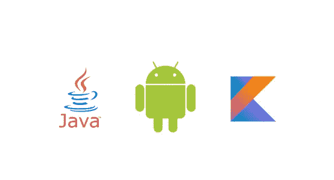
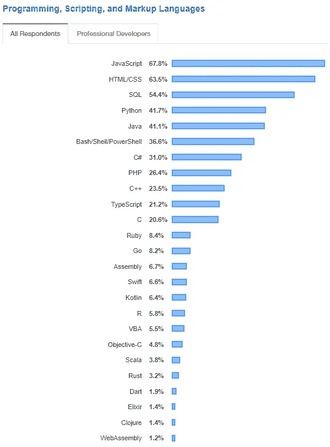

# Android 开发:Java vs kot Lin vs React Native vs Flutter

> 原文：<https://levelup.gitconnected.com/begin-learning-android-in-2019-a-freshers-approach-443b3f436e7d>

页（page 的缩写）s:请将此视为这篇文章的一个很酷的标题图像！

如果你想现在就开始你的 Android 开发生涯，那么你有 4 个受欢迎的选择。

1.Java 语言(一种计算机语言，尤用于创建网站)

2.科特林

3.反应自然

4.摆动

## **仅适用于安卓系统**

如果你想专门为 Android 平台开发应用，那么你可以选择其中任何一个。Android 的原生解决方案是 Java 或者 Kotlin，但是 React Native 和 Flutter 可以编译到 Android。

如果你选择 React-Native 或者 Flutter，Android 和 iOS 可以重新成为朋友。

## **适用于安卓和 iOS 系统**

如果你想同时使用 iOS 和 Android，那么选择 React Native 或 Flutter。在每个平台上部署可能需要一些调整和技巧，但是您可以在两个平台上使用相同的代码库。只需编写一次应用程序代码，就可以同时在 iOS 和 Android 上运行。

## **爪哇还是科特林？**

Java 或者 [Kotlin](https://kotlinlang.org/) 都可以用来开发 android 应用，并且都是官方支持的开发纯原生 Android 应用的语言。Kotlin 对于 Android 开发来说相对较新，并已迅速获得关注。

安卓:尴尬的沉默！

## **Java Android 开发**

如果你有 Java 和/或面向对象编程的知识，那么你可以从基于 Java 的 android 开发开始。尽管 Google 似乎正在向 Kotlin 发展，但 Android API for Java 相当稳定，并且在过去的 10 年里一直存在。所以，你可以暂时依赖 Java，相信它是稳定的。

## **科特林安卓开发**

如果你之前没有任何编程经验或面向对象编程知识，那么我会推荐你从 **Kotlin** 开始。这将为你开发现代 Android 应用提供优势。

据观察，谷歌正试图使 Kotlin 成为其 Android 开发的标准语言。这有各种各样的原因。最重要的是，Java core 和它的编译器都是 Oracle 维护的，Google 在那里没有太大的影响力。

Kotlin 由 JetBrains 于 2011 年开发，到 2017 年，谷歌开始支持 Kotlin 作为开发 Android 应用的替代语言。

如果你熟悉 Android Studio，那么你应该知道这是谷歌和 JetBrains 的联合项目，所以这里的点再次连接。从复杂程度来说，Kotlin 相对于 Java 来说还是相当简单的。

## **扑动或反应原生**

React Native 和 Flutter 的目的几乎相同——它们帮助你使用单一代码库构建 iOS 和 Android 的原生应用。然而，颤振和自然反应有一些基本的和概念上的区别。

> N 注:不要把 Flutter 或者 React Native 和 **Cordova** / **PhoneGap** 混为一谈，他们不是一条线上的！颤动/反应原生构建真正的原生应用。

安卓:嗨，你们俩！

## **反应原生**

[React Native](https://facebook.github.io/react-native/) 最初是由**脸书**为他们**脸书 App** 开发的。React 原生应用最好的例子有(你猜对了！)脸书、Instagram、优步、Pinterest、Skype，这份名单还会持续一段时间……

如果你懂 Javascript，那么你会很快理解 React Native。起初，一些语法可能看起来不熟悉，但它们实际上来自 [Babeljs](https://babeljs.io/) (这是一个 JavaScript 编译器)。

当心！在 React Native 中开发复杂的应用程序可能会变得棘手，因为它严重依赖于第三方库和组件。React Native 最初由脸书在 2015 年 3 月开源。

可以用 [**Expo.io**](https://expo.io/) **试试 React Native。这是一个在线集成开发环境，你可以在这里编码/测试，甚至构建你自己的 Android/iOS /Web 应用。这与最初的 React Native 略有不同，但提供了几乎相同的功能。**

## **飘起**

[颤振](https://flutter.dev/)是谷歌自己研发的！Flutter 使用的是 Dart 编程语言，目前还不是很流行，但是学起来还是挺容易的。Flutter 使用与 React Native 几乎相同的技术。Flutter 的主要区别在于它是一种基于小部件的开发方法。Flutter 带有许多内置的 UI 组件。

Flutter 最初由谷歌于 2017 年 5 月发布。正如你所猜测的，React Native 比 Flutter 历史更久，拥有良好的开发者基础，但谷歌正在尽最大努力将开发者的注意力吸引到 Flutter 上。

## **关注显影剂分布**

在开始使用这些语言之前，检查开发者发行版是非常重要的。如果出于任何原因，你在某个时候陷入困境，你需要有人帮你摆脱困境。这就是❤·斯达克弗洛·❤的用武之地。

> *注意:React 原生使用 JavaScript！所以 JavaScript 和 React 本地开发者可能都选择了 JavaScript。*

来源: [StackOverflow 开发者调查 2019](https://insights.stackoverflow.com/survey/2019)

我想这总结了开发 Android 应用程序的主要选择。

编码快乐！