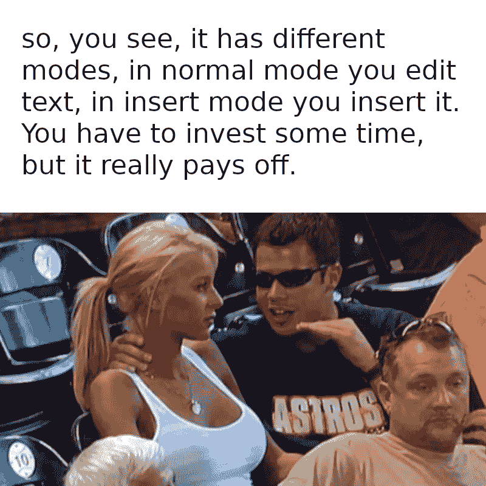
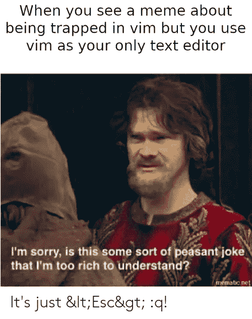

# 初学者指南，开始使用 vim，而不会让你大吃一惊

> 原文：<https://levelup.gitconnected.com/beginner-guide-to-started-with-vim-without-blowing-your-head-off-30313088a9f3>

## 摇滚 vim 而不气馁(我希望！)

信用:[https://github.com/kuator/Vim-memes](https://github.com/kuator/Vim-memes)

如果你想知道为什么要学习 vim，这里有一个[链接](/why-every-software-engineer-should-use-vim-b9fb97e69d97)指向我之前的文章。

首先，我将列出一些灾难的秘诀:

1.  你在网上看到一些文章说 vim 很牛逼。还有，youtube 上一些很酷的家伙在制作编码视频，他们正在使用 vim。
2.  由于高度的兴趣和动力，你开始寻找开始 vim 的方法。
3.  你可以找到一篇关于**如何将 vim 设置为 IDE 并全职使用 vim 的文章或 youtube 视频！**(此时开始走下坡路)。
4.  所以现在，你不是先学会热爱 vim 并意识到 vim 的必要性，而是安装数百个插件，疯狂地重新映射，试图记住按键绑定并迷失在点文件中，变得不知所措。
5.  你放弃了。

我有几个问题要问你

1.  当你对学习新东西感兴趣时，比如说，你会怎么做？
2.  当有一天你意识到你需要更好地照顾自己的健康，并决定去跑步时，你在开始时会做什么？

对于大多数人来说，第一个问题的答案是首先学习 javascript 的基础知识。写一个返回 **HELLO WORLD** 的 API。编写一个 react 应用程序，调用 API 并呈现 **HELLO WORLD** 。如果你开始写一个聊天应用程序(当然是你自己写的，而不是从 GitHub 的某个家伙的代码中克隆的),跳过基础会发生什么？至少你会过得很艰难。而且第一天跑不了 10 公里吧？你开始跑得慢，习惯跑步，一段时间后，你可以轻松地跑 10 公里。在这两种情况下，你至少需要一点奉献精神。

Vim 也不例外。你一直使用鼠标作为浏览文件的主要方式，你对现代的 UI 和 IDE 非常熟悉。然后从终端中的 vim 开始。当然，你会完蛋的。

信用:[https://www.pexels.com/@olly](https://www.pexels.com/@olly)

# 以下是我的建议:

## 从 vimtutor 开始

大多数安装了 vim 的 Unix 和 Linux 系统已经安装了 vimtutor。在终端上写 vimtutor 就行了。你也可以在 Windows 机器上安装它。对于初学者来说，这是获得基础知识和感受 vim 为何如此出色的最佳起点。做互动教程 3-5 次或更多。取决于你的耐心，直到你掌握了基本知识。

## 在你最喜欢的 IDE 中安装 vim 插件

大多数你日常使用的 IDE 可能都有 vim 插件。 [Vscode](https://marketplace.visualstudio.com/items?itemName=vscodevim.vim) 和 [Intellij](https://plugins.jetbrains.com/plugin/164-ideavim) 各有一个。安装并开始在日常生活中使用 vim。一开始可能会有点烦人，但是坚持下去。刚开始的时候，当你真的很烦或者需要快速做一些事情的时候，只要禁用插件，然后重新启用插件。慢慢来，直到你可以在不禁用插件的情况下做任何事情，你会觉得每天使用 vim 真的改善了你的编辑，感觉很直观，你会情不自禁地爱上 vim。

intellij 和 vscode 的演示 vim 插件

每当你在使用 vim(比如复制到剪贴板)的时候觉得有些事情很烦很难的时候，就在 Google 里搜索，因为总有更好的方法。我在 ide 中使用了 vim 6 个月，然后才进入下一步，比如像 IDE 一样在终端中使用 vim(是的，你可以，而且非常值得！).

## 强迫自己用一个星期

如题，强迫自己使用 vim 一周。如果之后你对 vim 没有任何感觉或认识，也不知道你为什么需要它，那么 vim 可能不适合你。至此，您已经学习了足够多的知识，可以不用整天使用 vim。

信用:【https://github.com/kuator/Vim-memes】T4

## 观看此视频

22 分钟后你可以跳过插件部分。这是我找到的关于掌握 vim 语言的最好的视频。如果你有任何其他好的建议，请在评论中告诉我。

现在你已经为下一步做好了准备。此时，如果您仍然有兴趣了解更多关于 vim 的知识，那太好了！因为这篇文章只涉及基础知识，所以我不会深入探讨高级用法，比如将 vim 作为一个具有几乎所有 IDE 特性的 IDE 来使用。这完全值得一试，因为一旦你使用它，你会发现 IDE 真的很慢。

信用:[https://github.com/kuator/Vim-memes](https://github.com/kuator/Vim-memes)

一些 vim 爱好者可能不喜欢这种风格，会说你不是 vim 的铁杆用户。最后，你在学习新的东西来改善你生活的某个方面，而不是让别人开心。你寻找工具来改进，当你找到一个更适合你的工具时，你就切换到另一个工具。vim 也是这些工具之一。

我祝你旅途好运。我的下一篇关于 vim 的文章将分享一些无需任何额外配置就可以在 vim 中完成的令人惊叹的事情，这些事情让我爱上了 vim。