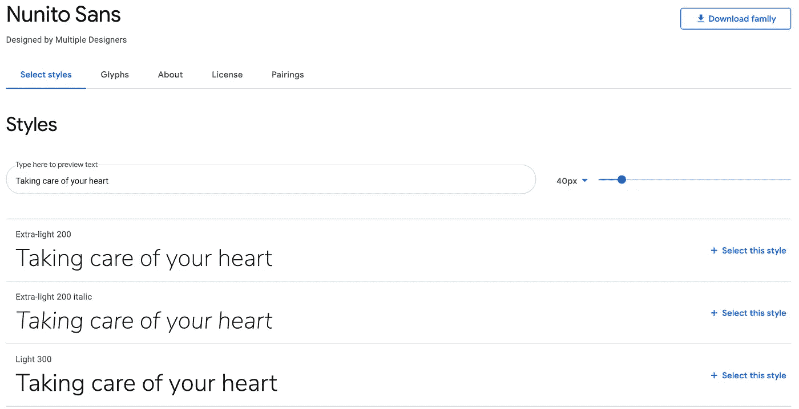
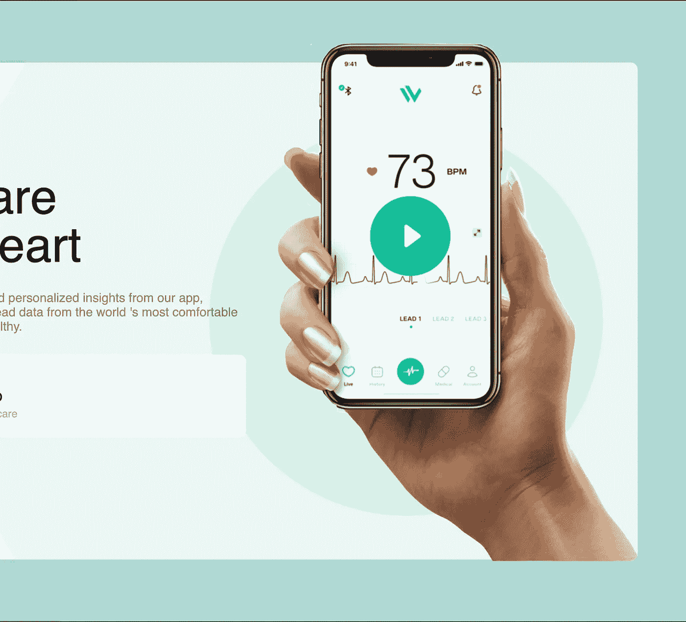

# 【初学者】如何创建带有大特征图像的登陆页面

> 原文：<https://levelup.gitconnected.com/beginner-how-to-create-a-landing-page-with-large-feature-image-4cda94b19985>

一步一步的教程，介绍如何创建一个具有大型功能图像设计的登录页面。

# 内容

1.  介绍
2.  结果演示
3.  先决条件
4.  逐步指南
5.  结论

# 介绍

Web 开发容易学，但是很难掌握。如果你是一个初学者，你可能会发现即使是最简单的 web 用户界面也很难创建，尽管你花了很大力气看在线教程。是因为 web 开发是一项需要动手实践的技能，大量大量的实践。如果你想精通它，你需要做编码练习。我推荐的一个做法是找到一个你喜欢的 UX/UI 参考，然后试着自己编码，看看你有多接近。

在这篇文章中，我将挑选一个由 UI/UX 设计师创建的 UI(在“每日 UI 挑战”中)。如果你想知道它是什么:[https://www.dailyui.co/](https://www.dailyui.co/))并尝试用它创建一个 web 前端。我将一步一步地向您展示我是如何解决这个问题并从头开始创建 web UI 的。

由@ [马丁·马德里克](https://dribbble.com/MartinMaderic)创作的

我选择的设计是@ [Martin Maderic](https://dribbble.com/MartinMaderic) 的“WearLinq ”,这是一个健康应用程序的登录页面，有一个干净的卡片设计和一个大的特征图像(手握手机，显示应用程序)。图像本身重叠，甚至“逃脱”到背景中，创造了一个有趣的动态。

除了图像之外，还要注意背景色是如何以圆圈的形式出现的，较大的圆圈也逸出卡片，就像图像一样。为了创建这种模式，我们需要仔细规划我们的代码层次。

# 结果演示

这是我们将创造的最终结果

Codepen 演示:[https://codepen.io/josephwong2004/pen/oNLRJYp?editors=1010](https://codepen.io/josephwong2004/pen/oNLRJYp?editors=1010)

# 先决条件

*   HTML 和 CSS 的基础知识(我也会用到一些 SCSS)
*   对 jquery 有一点了解
*   您选择的文本编辑器(如果您没有， [codepen](https://codepen.io/) 是个好主意)

# 逐步指南

**第一步:快速草稿**

让我们快速的画一张草图，试着找出我们需要注意的地方

抱歉画得不好

我做的第一件事是确定这个设计的不同组成部分。我们有“卡”容器，它应该在最低的 z 索引位置(设为 1)。

> z-index 控制 html 元素在屏幕上的顺序，它类似于 photoshop 中的“层”

在卡内，我们有“标题”，其中包含“导航标签”。页眉位于卡片的顶部，应该占据整个宽度。我们也有“内容”卡内，显示标题，描述和行动卡。而在右边，我们有一个带颜色的圆圈，与卡片本身重叠，因此应该放在 z-index: 2 中。同样，特征图像在圆的上方，应该放在 z-index: 3 中。由于这两个元素都在它的父元素(card)之外扩展，为了方便起见，我们可能会对它们使用“绝对”位置。

**第二步:准备资源**

草稿和计划已经确定，让我们准备用代码创建这个 UI 所需的资源。显然，我们首先需要的是特征图像，这是整个设计的面包和黄油。

我用 photoshop 把原始设计中的图像裁剪掉了。由于这不是一个 photoshop 教程，我不打算详细讲述我是如何做到的。边缘仍然有点生锈(因为缺乏耐心)，但我认为对于教程和练习来说应该足够好了。我也上传这张图片到 imgur，以便以后导入。

根据本文调整图像大小，而不是原始大小

接下来，让我们弄清楚设计中使用的字体。我找不到 100%匹配的字体，最终在谷歌字体中选择了“Nunito San”。虽然“机器人”和“诺托桑”也是不错的选择。

最后但同样重要的是，让我们从图像中获取颜色代码。(你可以在这里查看调色板:【https://coolors.co/f4f9f9-d7f1eb-15c199-f84040-181a1a】T2)

大多数元素是前两种颜色，其余的颜色是按钮，文本或小细节。

**第三步:设置环境**

让我们设置我们的环境，并准备编码。我正在使用 codepen，所以设置将更加面向 codepen。首先，让我们将字体从 google 导入到项目中，并设置一些颜色变量供以后使用。我还为这个项目添加了一些基本的风格。

环境都设置好了，让我们开始编码。

**第四步:创建卡片容器和内容**

第一件事是创建卡片容器。卡片位于主体的中心，我们可以先使用百分比大小来粗略标记卡片，因为我们可能需要稍后根据图像来调整它。此外，让我们添加的内容以及他们非常简单明了。

HTML:

SCSS:

同样，我粗略地设计了元素的布局，其大小随后会发生变化。(正如您可能看到的，对于整个设计来说，内容可能太大了)。当画面更清晰时，我们可以微调细节尺寸和比例。此外，您可能会注意到按钮不见了。我们将在最后一步添加它。

**第五步:创建圆形形状和图像**

接下来，让将圆形颜色和特征图像放入卡片中。如前所述，这两个元素应该处于绝对位置，并且应该被允许“逃离”到卡片之外的背景中。圆形的颜色是半透明的，你可以在卡片的边缘看到它的颜色变化。还有一个与背景颜色相同的“内”圆。

此外，我认为与其使用 z-index(根据我自己的经验，这可能会导致一些奇怪的问题),不如简单地使用 html 的默认顺序。(较低的代码块在层次中排在第一位)

另外，我没有画两个圆形，而是画了一个(内圆)然后给它一个纯色(透明)的阴影。

HTML:

SCSS:

结果:

手的底部是硬编码的，让它看起来像是被牌角“割”的，其实不是。为了将图像限制在卡片上，我们需要在卡片容器上使用`overflow: hidden`,它也遮挡了图像的顶部。实现这一点的一个更简单的方法是准备一个底部尖而直的图像，然后使用 bottom: 0 定位。

**第六步:创建标题和导航条**

现在让我们填写卡片的标题和导航条。标题容器包括一个图像、一个导航条和一个按钮。我们可以在标题中使用 flex 容器来布局这些元素。我们还要更新“内容”元素，将按钮放回那里。

在选项卡上有一个黑色和绿色圆点的所选导航项目的指示器，在用户选择时，选项卡和样式应该会改变。我们将把它作为最终润色添加进去。现在，让我们为选中的选项卡添加一个“活动”类。

HTML(带有更新的行动卡):

SCSS:

对于活动选项卡项目的“点”,我们使用一个:after 元素，该元素仅适用于带有“”的选项卡。活跃”类。

标题和导航栏

更新了带按钮的活动卡片

**第七步:激活标签改变样式**

为了改变 select 上的标签样式，我们需要使用一点 jquery。基本上，当用户点击标签时，我们会添加一个类”。主动“对它，并除去其他一切”。活动”类(如果存在)。

代码非常简单，将 jquery 导入到您的项目后，添加以下内容:

我们添加一个点击事件来添加。nav-item 类，然后单击，移除所有。活动类，并将其添加回单击的类。

有了这最后一点细节，我们的 UI 就完成了。

熟悉吗？这就是你一开始看到的图像

# 结论

当你有一个产品要展示的时候，在登陆页面上有一张图片的模式是非常有用的。我喜欢这种设计的简单性，以及它通过元素的巧妙定位创造的分层效果。

在这个例子中，我忽略了很多东西(比如响应能力)，还有按钮用户交互。如果你想要一个完整的部分，需要更多的测试来看看 UI 在不同的屏幕尺寸下是什么样子的。