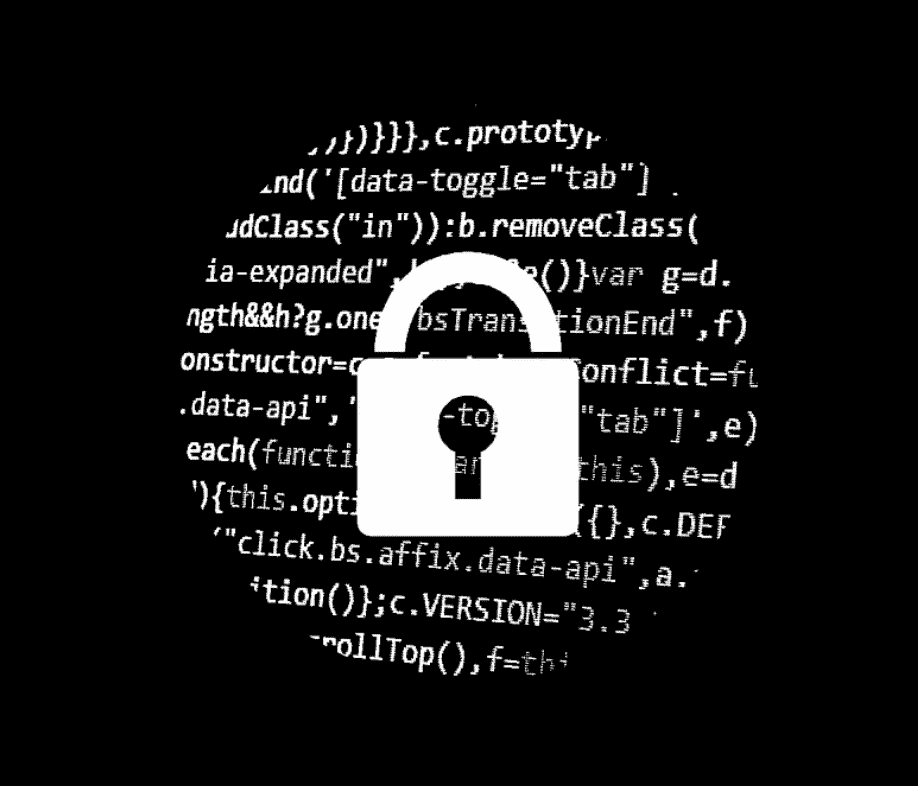
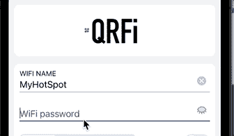
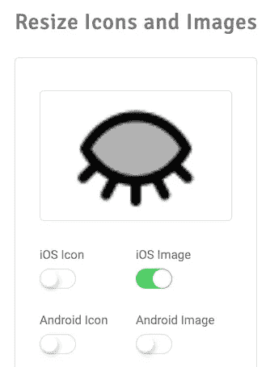
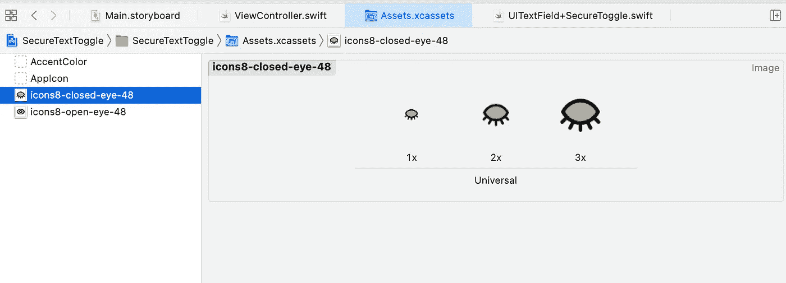

# Swift iOS 密码切换—在 UITextField 中嵌入安全文本输入切换按钮

> 原文：<https://levelup.gitconnected.com/beginner-ios-dev-embed-a-secure-text-entry-toggle-button-into-a-uitextfield-17bacfc87608>

## 初级 iOS 开发

和我的大多数文章一样——以上是我为自己的一个[应用](http://bit.ly/QRFi_app)所做的事情。这需要一点研究，所以我想我会写在这里，节省你的时间:)

正如 iOS 开发中的许多事情一样，有几种方法可以解决这个问题。在构建了一个类和一个扩展来创建按钮之后，我发现了另一种更简单的方法，只使用 UITextField 的一个扩展

让我们为我们的按钮获取一些图像——我的 goto 是 icons8.com，在那里我找到了两张不算太差的图像，一张[睁眼](https://icons8.com/icon/89226/eye)和一张[闭眼](https://icons8.com/icon/121531/closed-eye)。下载 48px png 格式的图片。通常在应用程序中，你会发现隐藏的图像是一只眼睛，有一条对角线穿过它，但这些也可以:)将这些图像添加到您的项目的资产文件夹中。

暂时把它们放进三个空间，x1，x2，x3。为了清楚起见，我把睁眼的名字改成了 icons 8-睁眼-48。

将 UITextfield 添加到情节提要中。如果这是一个现有的应用程序，你也需要一个出口或对文本字段的引用。

我们现在将添加扩展名。

创建一个新文件，并将其命名为“UITextField+SecureToggle.swift”

将以下内容添加到文件中:

在代码中，我们将按钮的图像设置为两种状态。选中并。然后在 togglePasswordView 函数中，我们切换按钮的 isSelected 属性和文本字段的 isSecureEntry 属性。

我已经改变了眼睛的阿尔法，我觉得这让它融合得更好。

现在在视图控制器视图中添加:

password.enablePasswordToggle()

如果你给你的 uitextfield 一个不同的名字，当然要使用它。

差不多就是这样。运行项目，在字段中输入几个字符，然后测试切换按钮。

现在，根据你使用的设备类型，按钮要么看起来很大，要么很大。一台 iphone8 及以下看起来应该太大了。但在 7 plus 或 iPhone 12 Pro 上是正确的。

为了解决这个问题，我们需要正确地确定我们的资产规模。从资源文件夹中移除所有眼睛资源。

我发现这个[网站](https://hotpot.ai/icon-resizer)可以做这项工作，当然这只是其中之一，所以如果你喜欢，可以试试其他的。

拖动网站上的第一个图像，选择 iOS 图像并点击转换。

您将下载一个包含新转换图像的压缩文件夹。

单击要解压缩的文件夹，打开文件夹，将图像拖到右侧窗口的 assets 文件夹中。

它应该是这样的:

就像我之前做的那样，我把“icons8-eye-48”重新命名为“icons8-open-eye-48”。

运行该项目，它应该在所有尺寸的 iPhone 上都很好看。当然，您可以使用 SFSymbols 或 SVG 文件来避免调整大小的需求。

感谢阅读