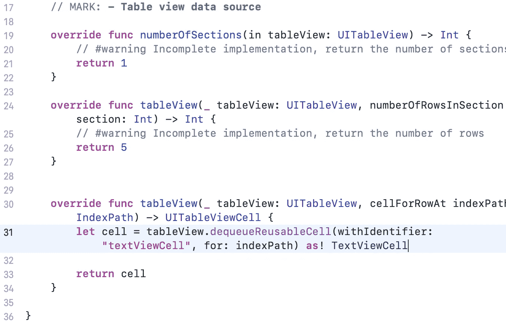
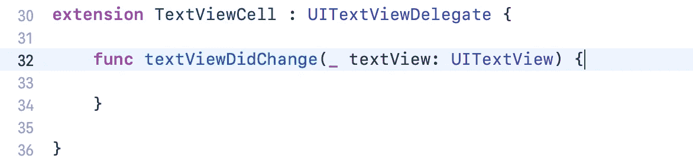

# 初级 iOS 开发人员—在 UITableView 单元格中嵌入 UITextView

> 原文：<https://levelup.gitconnected.com/beginner-ios-dev-embedded-uitextview-inside-a-uitableview-cell-56f59f3d0b45>

对于像 todo 应用程序这样可能需要多行文本而 UILabel 不能满足要求的应用程序来说，这是一种方便的技术。不过，你确实失去了占位符的功能，但那是另一回事。

因此，让我们首先创建一个新的基本 iOS 项目—删除 ViewController 及其关联的 ViewController.swift 文件。将 TableViewController 拖到它所在的位置。不要忘记将新的控制器设置为初始的 viewController。

添加一个新的 cocoa touch 文件—选择“UITableViewController”作为子类，这个类将是“TableViewController”

选择新的 TableViewController，并在右侧将自定义类更改为“TableViewController”

在内容视图的正下方(或者说内部)添加一个文本视图，如下所示:

选择文本视图并禁用滚动。

将文本视图背景的颜色改为灰色。例如，我使用“系统灰色 5 色”并将字体大小改为 30。

接下来，选择表格视图，并将样式更改为插入分组。这给了 tableview 一个圆角，看起来更像我们例子中的记事本。

选择 tableView 下的单元格，并添加一个重用标识符“textViewCell”

我们将向文本视图添加简单的约束，基本上是将它固定在其超级视图 ContentView 的两侧。

我们正在创建一个自定义的表格视图单元格，所以让我们创建一个适当的 CocoaTouch 文件，这次是“UItable view cell”的子类，我们将该类称为“TableViewCell”。

创建后，您可以将自定义类添加到单元格中。

我们将需要一个到 TextView 的 IBoutlet，有几种方法可以做到这一点，但我总是选择 textViewCell，然后键入 alt，用指针单击 TextViewCell.swift 文件，然后按住 ctrl，拖动到代码上。

让我们回到“TableViewController”并设置数据源，很简单，我们说我们想要一个 5 行的部分。

如图所示，在 cellForRowAt 委托函数下添加定义单元格本身的行。文件里应该已经有例子了，取消注释修改就行了。

如果您现在构建并运行，您应该会看到如下图所示的内容，您可以在单元格中键入内容，但单元格不会扩展。

为了让一切正常工作，我们需要设置几个快速代理。

首先，我们需要捕获对 textView 的任何更改，将这个扩展添加到 TextViewCell.swift 文件的底部。

我们还需要添加一行，说明这个类是 textView 的委托，所以仍然在 TextViewCell 中。

现在，我们需要创建我们自己的委托函数，我们将调用“TextViewCellDelegate ”,以使我们能够在 TableViewController 中执行一些操作(在我们的示例中是更新 tableViewCell 的高度)。仍然在 TextViewCell.swift 的顶部添加一个协议定义。

对新委托进行引用。

最后，在这个文件中要做的最后一件事是，每当我们在文本视图中输入任何内容时，就调用这个函数。

整个文件应该是这样的(参见下面的要点):

还在吗？:)

现在只需要做几件小事。

将实际的“执行”函数添加到 TableViewController.swift 文件:

如果我引用[苹果文档](https://developer.apple.com/documentation/uikit/uitableview/1614908-beginupdates)，开始和结束更新的目的是非常清楚的——“…在不重新加载单元格的情况下动画显示行高变化的方法。这组方法必须以调用`[endUpdates()](https://developer.apple.com/documentation/uikit/uitableview/1614890-endupdates)`结束。

最后，我们还需要通过向 CellForRow at 函数添加“cell.delegate = self ”,告诉类它是 TextViewCellDelegate 的委托。

现在，如果我们建立并运行，你应该有一个工作的例子。

如果你到了这里，做得很好，感谢你的阅读。如果你喜欢这个或者觉得它有用，看看下面我的其他一些中型职位。

 [## 初学者 iOS 开发-自定义用户界面按钮-阴影，切换按钮，动画帧，可设计…

### 我最近整理了一个项目作为自己的参考，一种记录不同构建技术的方式…

iosdevnewbie.medium.com](https://iosdevnewbie.medium.com/beginner-ios-dev-uibuttons-shadow-buttons-toggle-buttons-animated-with-frames-designable-6beacf1d96ca)  [## 初学者 iOS 开发-通过 SwiftyStoreKit 简化应用程序内购买(IAP)。

### SwiftyStoreKit 真的让基本的应用程序购买变得非常简单。在这个例子中，我将展示…

levelup.gitconnected.com](/beginner-ios-dev-in-app-purchase-iap-made-simple-with-swiftystorekit-3add60e9065d)  [## Swift / Xcode:在视图控制器之间共享数据。

### 在视图控制器之间共享数据是 iOS 开发人员的基本职责之一，想象一下一个应用程序拥有…

levelup.gitconnected.com](/swift-xcode-sharing-data-between-view-controllers-8d270e99ca1e)