# 初学者 iOS 开发-通过 SwiftyStoreKit 简化应用程序内购买(IAP)。

> 原文：<https://levelup.gitconnected.com/beginner-ios-dev-in-app-purchase-iap-made-simple-with-swiftystorekit-3add60e9065d>

SwiftyStoreKit 让基本的应用程序购买变得非常简单。在这个例子中，我将展示如何把一个不可消费的 IAP 放到一个简单的应用程序中。苹果非消耗品的例子是“汽车游戏中的赛道”，它也可以是提供额外功能的解锁专业选项。

在我的例子中，非消耗性的将是改变应用程序蓝色背景颜色的能力(退出嗯？)—否则只有红色选项可用。顺便说一句，如果你想实现某种小费罐，我建议你使用消耗品，这段代码运行得非常好(你甚至不需要恢复功能——除非你做了一些额外的事情，比如删除广告)。

我已经在几个通过了可怕的 AppStore 审查程序的应用程序中使用了这段代码——你可以在这里[和这里](https://apple.co/2YlBlui)[查看它们的例子](https://bit.ly/PuzlyApp)。

我假设你有一个苹果开发者帐户，这是创建一个应用程序(在 AppStore Connect 上)所必需的，然后添加应用程序购买，这是相当简单的，我不会在这里进入细节。另外，SwiftyStoreKit 是一个额外的框架，通常使用 [Cocoapods](https://www.raywenderlich.com/7076593-cocoapods-tutorial-for-swift-getting-started) 安装，所以你也需要知道它是如何工作的。最后是 Xcode / Swift 和故事板的基础知识。

应用购买中的测试也需要物理设备。

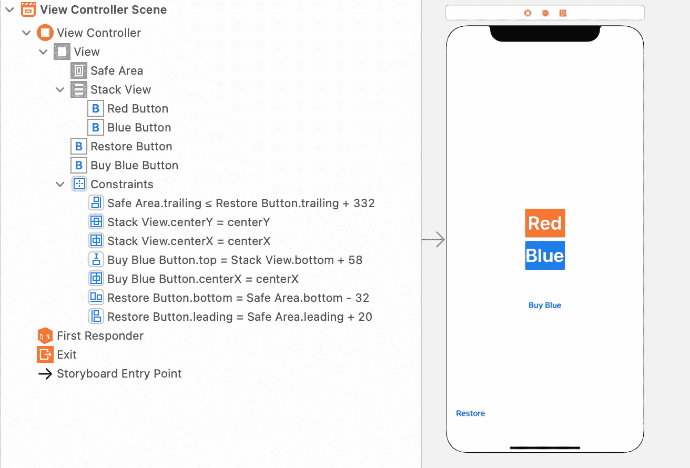

如上图所示，你有 4 个按钮，红色和蓝色在堆栈视图中，堆栈视图水平和垂直居中。“购买蓝色”按钮固定在堆栈视图下方。还原按钮固定在屏幕的左下方。文本大小为 40。

接下来，您需要设置 2 个插座，一个用于“蓝色按钮”,我们将在稍后的代码中操作它，另一个用于“购买蓝色”按钮，因为我们将更改它的标题以反映购买的价格。

蓝色按钮在 Xcode 中被停用，这是通过“属性”检查器完成的，选择蓝色按钮，您应该会在右侧看到“状态/启用”选项，请确定已取消选择该选项。

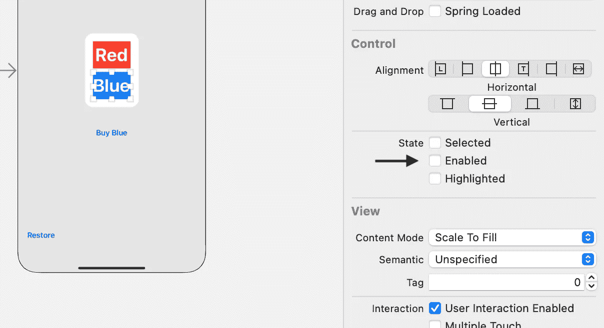

当然，这也可以在代码中使用 outlet 名称和 isEnabled 函数来完成，您可以将它们放在 ViewDidLoad 中。

接下来，我们设置 4 个按钮的动作。

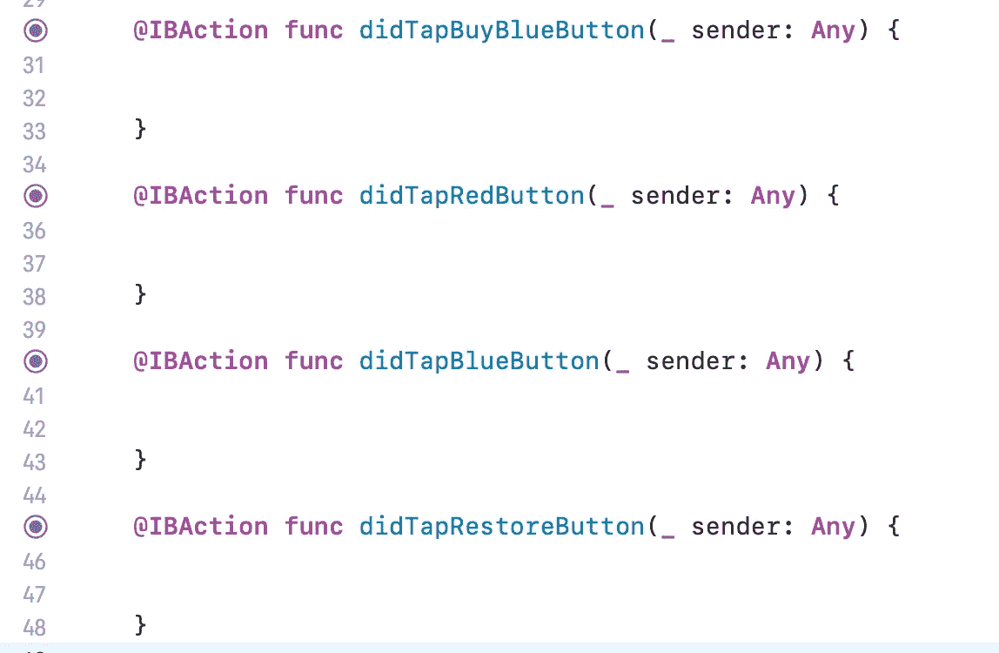

在这里，我们可以为蓝色和红色按钮添加一些功能。

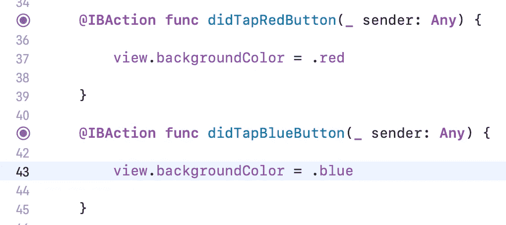

如果你现在运行这个应用，我顺便把我的叫做“Inappr”。你应该能够点击红色按钮，视图的背景颜色会变成红色，当然蓝色按钮被停用没有任何作用。

现在让我们转到 SwiftyStoreKit。您需要在 AppDelegate 文件中添加一段代码来注册一个事务观察者。

“在启动时添加应用的观察者可确保它在应用的所有启动过程中保持不变，从而允许应用接收所有支付队列通知。”

如果您从 SwiftStoreKit Github 添加代码，您将在 Xcode 中得到一个需要修复的错误。(至少从 Xcode 版本 12.4 开始)。

以下是更正后的版本。

将它复制到 func 应用程序中，应该如下所示:

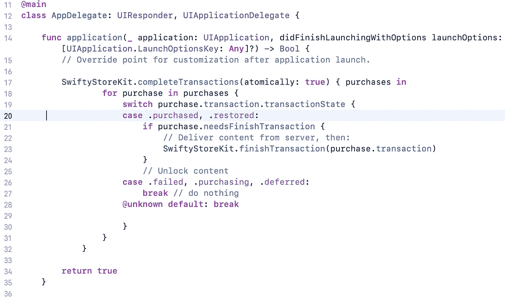

并且不要忘记在 AppDelegate 文件的顶部导入 SwiftyStoreKit。

完成后，我们需要创建一个助手类来处理动作并将状态返回给 ViewController。我们将使用由 SwiftyStoreKit 提供的另一个代码块，我们将把它封装到几个函数中，并添加一些委托协议魔术。这也将使所有的 StoreKit 代码远离 ViewController。

创建一个新的 swift 文件，将其命名为“IAPHelper ”,并插入以下代码:

这看起来像很多代码，但它是处理 IAP 的基本操作、购买操作、恢复操作和检索商品的本地价格所必需的。最后一个选项并不完全需要，因为当地价格会在购买前显示，但如果能够事先在您的应用程序中显示，那就更好了。完全由你决定。

同样有用但不是必需的是“付款取消”选项，这是当用户取消付款动作时，我发现它对停止一个活动指示器(旋转器)很有用。你可以在这个[应用](https://bit.ly/PuzlyApp)中看到这一点。

“没有要恢复的内容”的情况也很有用。很高兴显示一条消息说，对不起，如果什么都没有找到，没有什么可以恢复。

还有一个选项我目前还没有实现，那就是不允许用户购买的情况，比如儿童限制。这里的情况是“不允许付款”，我会离开你设置这是一个挑战。

将 productID 改为你的产品的 productID，“blue”顺便提一下并不是一个很好的 productID 名称，理想情况下它应该是这样的格式*com . your company . your product .*

现在让我们回到您的 ViewController 并遵从我们的委托。

开始购买添加到文件的末尾，我更喜欢添加到末尾作为一个扩展，所以:

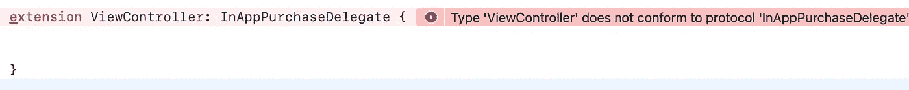

您应该也看到了和我一样的错误，只需点击它并点击 fix 来添加协议存根。

然后，只要有了“Code”占位符，就用//替换它，以消除错误。

只需在 ViewController 的开头添加几行代码:

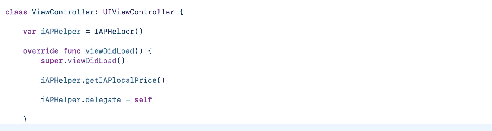

我们创建了一个 IAPHelper 实例，这样我们就可以使用 ViewController 中的功能。在 ViewDidLoad 中，我们调用检索商品的本地价格的方法。这将直接进一步触发委托方法。和委托一样，VC 被设置为委托。

让我们添加更新屏幕上价格的代码。

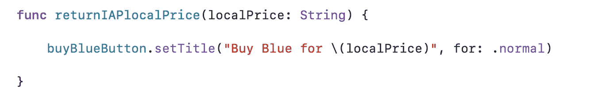

接下来，我们需要考虑解锁商品，并跟踪它已经被购买的事实。这是通过 userDefaults 和一个简单的布尔值来完成的。

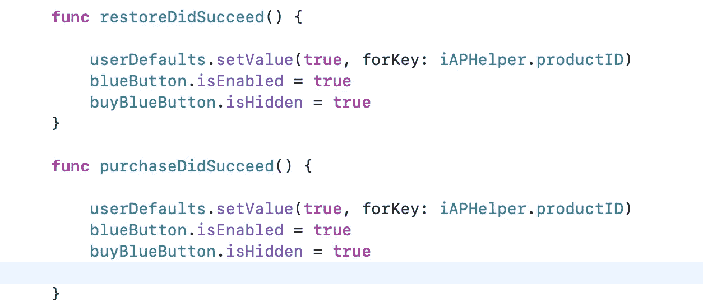

我已经做得很简单了，但是你可以创建一个函数，这样就不会重复相同的代码两次，正如你看到的，我们还启用了蓝色按钮，并隐藏了购买按钮。

最后要做的事情是检查应用程序何时启动，如果该项目已被购买或没有。同样，我将非常简单地做这件事，但是创建一个检查用户默认值状态的函数是很好的。我通常称之为‘is purchased’并在需要的地方使用它。

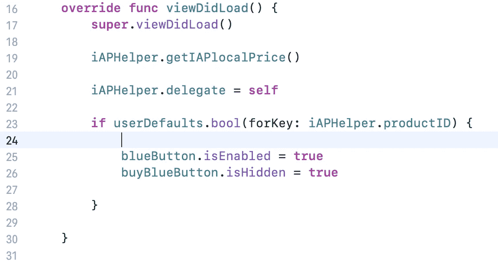

ViewController 的最终代码:

好了，现在你终于可以运行你的应用了，它看起来应该是这样的:

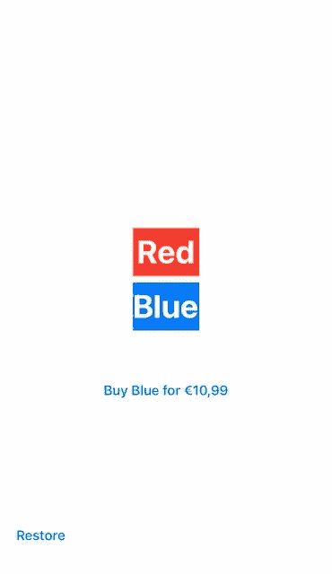

如你所见，我的蓝色选项相当昂贵:)

测试应用程序购买可能是这个过程中最不有趣的部分，但它必须完成:)我不会在这里进入太多的细节，但你基本上需要在 AppStore Connect 的用户和访问下创建一个“沙盒”帐户和沙盒测试器。

我建议你使用 maildrop.cc 这样的服务来创建一次性测试电子邮件帐户，但记住这些是公共帐户，所以不要发送任何敏感信息。

这个教程很好地解释了产品 ID 的创建和测试过程。

我希望你觉得这很有用——在评论中留下你的想法，为什么不粘贴一个链接到你的第一个应用程序，包括在应用程序购买中。

感谢阅读。

觉得这篇文章有用？在 Medium 上关注我，看看我下面最受欢迎的文章！请👏这篇文章分享一下吧！

如果你愿意支持我成为一名作家，可以考虑注册[成为一名媒体成员](https://iosdevnewbie.medium.com/membership)。每月只需 5 美元就可以无限制使用。如果没有，请点击“跟随”按钮。再次感谢

 [## Swift / Xcode:在视图控制器之间共享数据。

### 在视图控制器之间共享数据是 iOS 开发人员的基本职责之一，想象一下一个应用程序拥有…

levelup.gitconnected.com](/swift-xcode-sharing-data-between-view-controllers-8d270e99ca1e) 

[https://iosdevnewbie . medium . com/swift-real-world-JSON-API-example-building-a-bike-sharing-app-b 51 AAA 4c 5637](https://iosdevnewbie.medium.com/swift-real-world-json-api-example-building-a-bike-sharing-app-b51aaa4c5637)