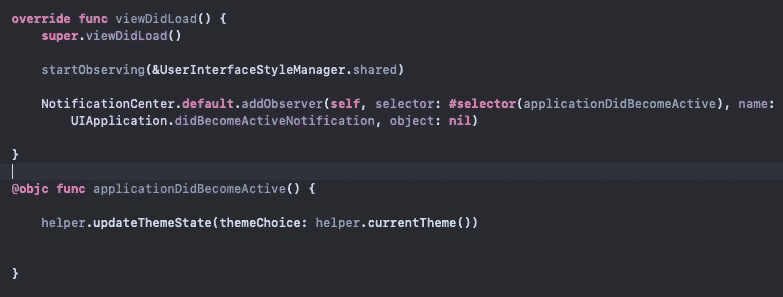

# 初学 iOS 开发—在 Swift/iOS 中切换亮/暗和跟随系统模式

> 原文：<https://levelup.gitconnected.com/beginner-ios-dev-toggle-light-dark-follow-system-modes-in-swift-ios-8b427127df79>

在 iOS 中采用明暗模式，并允许用户在主题(或模式)之间切换，这是令人惊讶的复杂(至少我是这么认为的……我还在学习)。

它分为两部分，为黑暗模式选择颜色(除非你乐意使用系统颜色，在这种情况下 iOS 可以为你切换)。允许用户独立于系统在明暗模式(或主题)之间切换，并且还具有“跟随系统”设置是另一个挑战。

我将着眼于后者。

在网上快速搜索给出了一些现成的解决方案，使用观察协议是一种方法。我在这里找到了 Lee Kah Seng 的一篇很棒的文章，这里使用的大部分代码都来自这篇文章。但不幸的是，它没有提到“跟随系统设置”的方法——这是可以理解的，因为它给文章增加了一点复杂性。

但这是目前大多数应用程序的标准功能。

因此，为了缩短一个相当短的故事，让它更短，我做了一个解决方案，这就是。(如果你有兴趣看到这个解决方案在一个生产应用中工作，这里有一个[链接](https://apps.apple.com/en/app/use-your-words-aac-buttons/id1580455486?l=en)

演示不会像上面的 gif 那样花哨，这里有一个截图。

我不会去详细说明，因为我认为代码是相当自明的。但是如果你有任何问题，不要犹豫。缺少的主要部分(遵循系统模式)基本上是使用 NotificationCenter 和“didBecomeActiveNotification ”,当然当应用程序激活时适当地切换模式。

如果你觉得这有用，请让我知道，特别是如果你用完全不同的方法做这件事，我很想知道。一如既往，我不会说这是唯一的方法:)

感谢阅读，这里有一个关于 [Github](https://github.com/jamestapping/Medium_ToggleThemesDemo) 项目的链接。