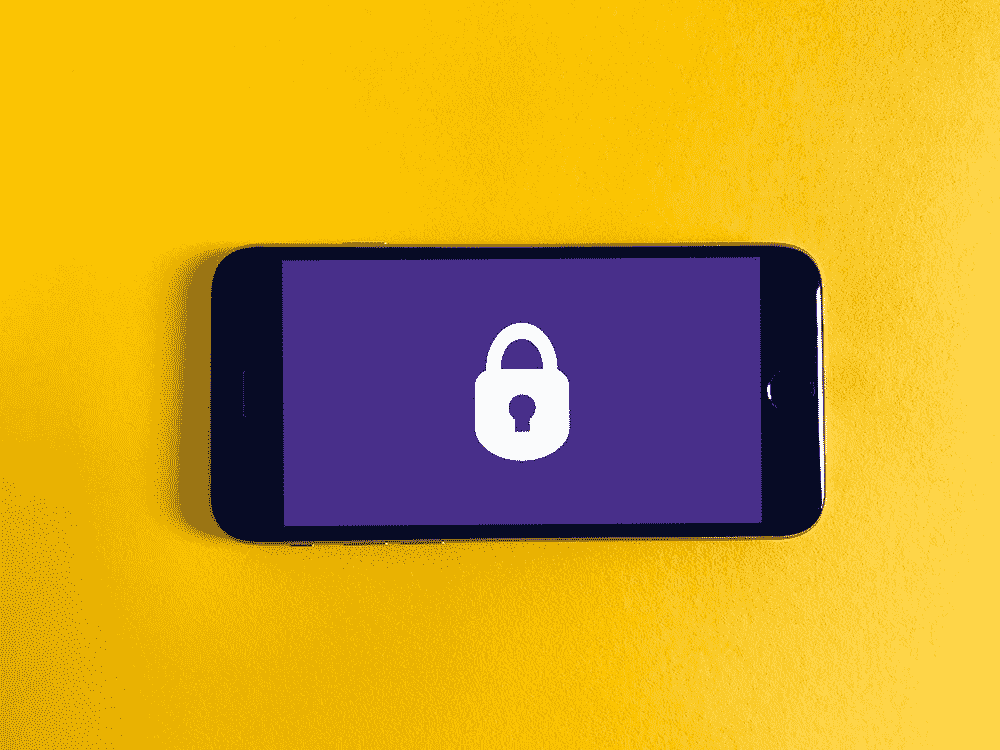
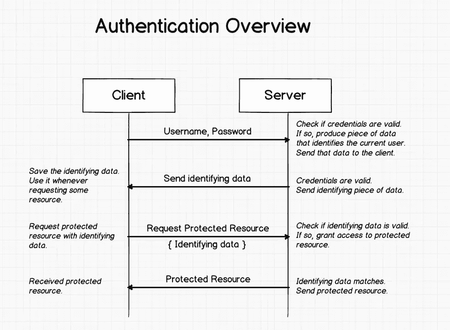
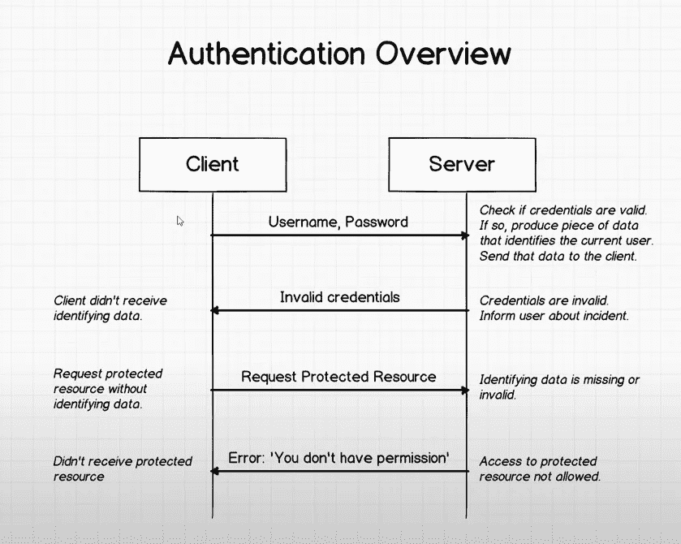
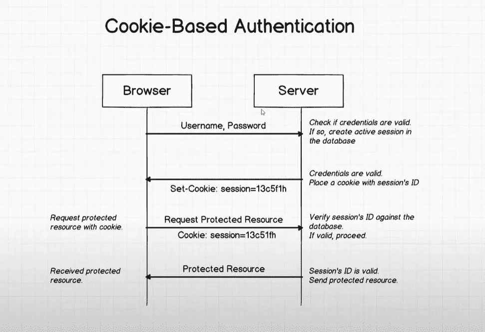
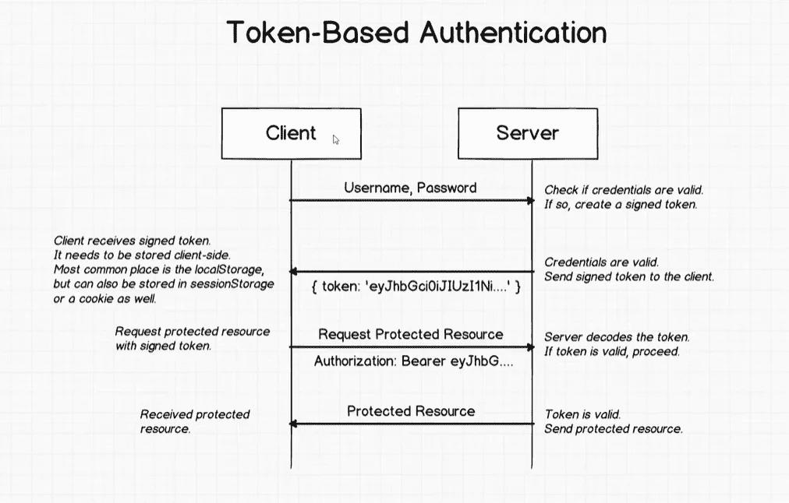
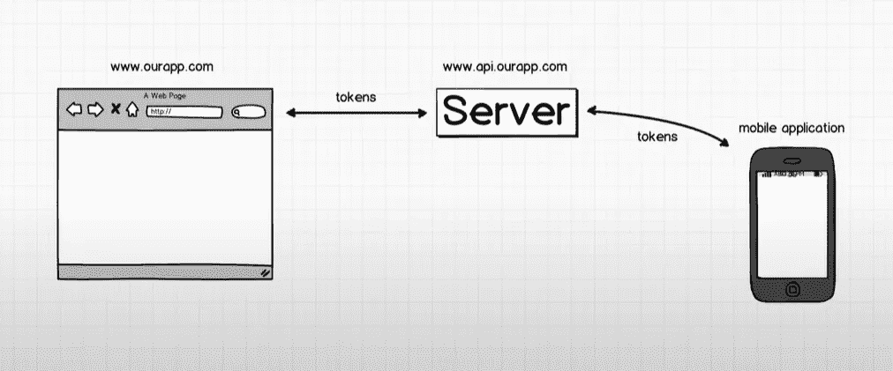

# 认证基础入门指南

> 原文：<https://levelup.gitconnected.com/beginners-guide-to-authentication-basics-ead786af0e77>

## 学习核心概念

照片由[弗兰克](https://unsplash.com/@franckinjapan?utm_source=unsplash&utm_medium=referral&utm_content=creditCopyText)在 [Unsplash](https://unsplash.com/?utm_source=unsplash&utm_medium=referral&utm_content=creditCopyText) 上拍摄

在任何现实世界的项目中，身份验证都是一个关键特性。在我的大学时代，我花了几个月的时间努力寻找一种最佳的方法来使用 MERN 堆栈创建一个全堆栈认证和授权系统。

问题是使用现代技术实现认证系统有不同的方法。你有基于 cookie 的系统，基于令牌的系统，当选择不同的包时，有不同的包，如 passport.js，你可以使用基于微软的库。此外，还有第三方解决方案，如 OAuth。

那么我们如何选择最合适的方法呢？为此，在选择正确的技术方法时，您应该对身份验证流程有一个基本的了解。这篇文章更全面地解释了认证系统是如何工作的。

> 如果你愿意支持我成为一名作家，可以考虑加入[成为一名媒体成员](https://freelancingcult.medium.com/membership)。这样我就可以花更多的时间分享知识，创作更多的内容。每月只需 5 美元，你就可以无限制地使用 Medium。

## 开始之前

你们中的一些人可能遇到过“认证”和“授权”这两个词。在我们继续之前，最好理解这两个词之间的区别。认证和授权是登录系统的两个不同部分。

身份验证是检查用户的用户名和密码，如果用户名和密码匹配，则允许用户登录。授权是检查登录的用户是否有适当的权限做不同的事情。也许一个登录的用户只需要查看东西，而不需要删除它们。另一个用户可能有查看和删除的权限。使用授权来检查每个角色的这种权限

## 认证基础知识

身份验证可以基于 cookie，也可以基于令牌。首先，让我们看看在任何认证流程中发生的主要步骤。

## 认证概述

在上图中，客户端是我们用来访问资源(互联网)的应用程序(网络浏览器)。想象一下，上图是一个用户登录会员网站的场景。会员制网站只向注册用户提供内容。

1.  用户在登录页面上输入用户名和密码
2.  服务器验证输入的凭证。
3.  如果凭证有效，则服务器登录成功，并创建一段数据来标识登录的用户。
4.  将数据发送到客户端。
5.  客户端保存这段数据，并在向服务器端发送请求成员资格内容的请求时使用它。
6.  当从服务器请求成员资格数据时，客户机将数据附加到请求中。
7.  服务器在发送资源之前验证附加的数据。
8.  如果验证成功，服务器发送请求的数据。

下图显示了凭据无效时身份验证流程的工作方式。

当生成经过验证的信息并重用它时，有不同的方法。基于令牌或基于 cookie 的方法主要用于执行这些场景。每种方法都有利弊。

## 基于 Cookie

如前所述，在创建表明用户有效的数据时，有不同的方法。让我们看看 cookies 是如何用于身份验证的。

在基于 cookie 的认证系统中，输入有效凭证后，服务器会创建一个**活动会话 Id** 并将其存储在数据库中。并将一个 cookie 附加到浏览器，其对应的 sessionId 与数据库中创建的活动会话相匹配。

存储在数据库中的活动会话 Id 和浏览器中的会话 Id 相互匹配。

Web 浏览器自动保存从服务器端发送的 cookie。因此，开发人员不需要编写代码来处理传入的 cookie 以保存在浏览器中。

每当浏览器请求受保护的资源时，它会将会话 Id 与浏览器请求一起发送。服务器可以将发送的会话 Id 与数据库中存储的活动会话 Id 条目进行比较，并进行验证。

如果接收到的会话 Id 与数据库中的活动会话 Id 匹配，则发送受保护的资源

## 基于 cookie 的身份验证的属性

基于 Cookie 的身份验证是有状态的，因为身份验证记录应该存储在前端和后端。因此，在数据库中基于 cookie 的身份验证系统中，随时都会有一个登录用户列表。

用户注销后，浏览器/客户端的 cookie 和服务器端的会话 Id 都会被删除。

## 基于令牌的认证

基于令牌的身份认证可以在网络浏览器、移动应用、桌面应用甚至物联网设备中使用。所以客户端不像使用基于 cookie 时那样局限于 web 浏览器。

显然，在基于令牌的认证系统中，如果用户凭证正确，它会向浏览器端发送一个签名的令牌。其中一个主要区别是，除非基于 cookie 的系统基于令牌的系统将签名的 cookie 作为普通数据发送到客户端。因此客户端不能单独识别从服务器发送的令牌。

因此，我们必须在客户端编写单独的代码来处理这个传入的令牌。我们必须提取它并存储在浏览器中。我们可以将令牌存储在本地存储或会话存储中，甚至可以将传入令牌保存在 cookie 中。

当从服务器请求数据时，客户端发送请求，将令牌附加到请求中。令牌被附加到它的授权头，我们还在令牌前面添加了单词 **Bearer** 。

一旦从服务器端收到令牌，它就对令牌进行解码，并验证它是否是有效的令牌。如果令牌有效，则传递请求的数据。

## 基于令牌的身份验证的属性

基于令牌的身份验证比基于 cookie 的身份验证更快。主要原因是，每当基于 cookie 的系统想要验证用户时，它都应该对活动用户进行数据库查找，以找到匹配的会话 Id，这需要更多的时间。

基于令牌的身份验证系统适用于使用多个域和子域的应用程序。

基于令牌的认证系统可用于移动系统和基于网络的系统。因此，可以在移动和桌面设备上使用单一身份验证实现。

> 我希望你喜欢读这篇文章。如果你愿意支持我作为一个作家，并为我花在分享知识上的时间，考虑注册[成为一个媒体成员](https://freelancingcult.medium.com/membership)。每月只需 5 美元，你就可以无限制地使用 Medium。

## 参考