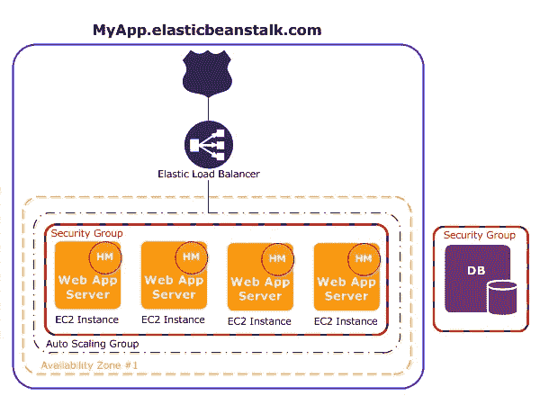

# 使用 Node.js 的 AWS 弹性豆茎初学者指南

> 原文：<https://levelup.gitconnected.com/beginners-guide-to-aws-beanstalk-using-node-js-d061bb4b8755>


# 动机

像大多数理性的热爱产品的应用程序开发人员一样，我也喜欢构建东西而不是配置东西的过程。我最不想碰的就是 DevOps。多年来，我一直是英雄神最忠实的追随者。

当我决定改用 AWS Beanstalk 时，我花了整整 3 天才成功完成部署。然后我搞砸了一些事情。当我试错的时候，事情变得一团糟，我非常生气，我删除了整个设置重新开始。

我在过去的两天里经历了爬 AWS 豆茎的地狱(有新问题！)，把我 Google 搜索上的每一个链接都成熟到紫色，跟 AWS 支持谈几个小时，从早上 8 点到晚上 11 点调试。

我写这篇文章是因为我在过去的两天里忍受了太多不必要的痛苦，但我也学到了很多，我相信我在整个过程中所做的笔记可能对其他人有用。


毕竟，不是每个人都像吉尔福伊尔一样。

# 预期

作为 DevOps 的相对初学者(我在 Fullstack Academy 期间只有很少的数字海洋方面的经验)，进入像 AWS 这样的部署环境感觉就像重新学习如何编码一样。

与编写应用程序逻辑相反，您是在**配置**设置。你将开始欣赏庞大复杂的系统，你小小的代码库就坐落在上面。你会接触到很多新事物。

# 范围


左起:数字海洋、AWS EC2、AWS Beanstalk、Heroku、Firebase

那么什么是 AWS 豆茎呢？是不是像 Heroku？不完全是。

从部署环境的范围来看，我们有两个目标。一方面，我们有真正的 API 密集型和人工服务，如 Digital Ocean 和 AWS EC2。另一方面，我们有 Firebase 和 Heroku 这样的服务，它们基本上将配置需求降低到接近于零。

AWS 豆茎坐在中间。它已经为您设置了很多东西，但是您仍然在使用 AWS EC2(和一些其他服务)，并且您仍然必须进行一些配置。

# 入门指南

我有一个带有 PostgreSQL 数据库的 Node.js 应用程序。你可能有其他筹码，但我认为我这里的高水平笔记应该仍然能够有所帮助。

对于和我有同样想法的人来说，我发现有两个教程视频非常有用:

1.  YouTube 上的
2.  上 Linkedin 课程。(您需要付费，但第一个月免费)

实际上，我鼓励你遵循这两个教程**然后**用我的笔记作为你将要做的事情的参考。即使按照那些教程，我也犯了很多错误。你可以关注他们**和**我的笔记。

# 高级概述



来源[这里](https://docs.aws.amazon.com/elasticbeanstalk/latest/dg/concepts-webserver.html)。

这是一个弹性豆茎应用程序。从上面看，你有 53 号公路的标志(很棒的名字)。这是你注册域名和配置 DNS 的地方。

当人们访问您的域时，他们会被定向到负载平衡器。这是弹性豆茎的最初设置之一。把它想象成你应用程序的*大门*。

然后您就有了 EC2 实例。这些基本上是你的服务器。Beanstalk 为您提供了一种类似 PaaS 的方式，让您可以在 web 控制台中轻松设置它们，而不是手动设置。

注意到你的 ec2 被安全组红线包围了吗？把安全组想象成你的应用程序的安全卫士。只有来自特定来源的信息才被允许通过。

另一方面，你也有你的数据库。它也被安全组包围，因为它只希望数据从您的 Beanstalk 应用程序通过！

# 入门指南

让我们从基础开始。


安装完所有必要的设置(如 Python 和 EB CLI)后，可以在应用程序路径下运行第一个命令:

```
eb init
```

这将创建应用程序。在选择了命令后面的选项之后，您现在就有了一个 AWS Beanstalk 上的应用程序。恭喜你。

*提示:如果您在应用程序中使用 WebSockets，AWS 支持人员告诉我，您需要在设置中选择* ***应用程序负载平衡器*** *。默认选项经典负载平衡器不支持 WebSockets。*

然后，你创造了所谓的环境。

```
eb create
```

这是您的应用程序将驻留的位置。出于测试和试运行的目的，您可以拥有许多这样的环境。不过现在一个就够了。

# 数据库ˌ资料库

当它为您创建环境时，明智的做法是开始设置数据库，这也需要时间。对于 PostgreSQL，我必须建立一个 RDS，它代表关系数据库服务。

设置 RDS 有两种方法。

## 1.直接通过您的 AWS Beanstalk 控制台

这非常愚蠢，因为只有一个环境与您的数据库相关联。如果您终止一个环境，它也会随之终止。我第一次就是这么做的，因为我不想配置任何东西。

## 2.独立通过 AWS RDS

这是明智的方法，因为它可以在多种环境下工作。这是 AWS 推荐的。我第二次这样做了，但是需要一些工作来将数据库连接到您的 Beanstalk 应用程序。

现在去 AWS 主页搜索一个叫 AWS RDS 的服务。然后按照步骤设置一个 RDS 实例。

*提示:拥有 RDS 后，您需要将该数据库的端点保存在某个地方，以便稍后进行配置。请记住，不要在端点中包含您的端口号！(即在您的端点中不包括“:5432”)*

# 配置

现在你的环境大概是被创造出来的。它将在 web 控制台上显示一条难看的红色消息**降级**，但不要气馁。你应该明白的。您还没有配置任何东西！我支持你。

让我们进入软件配置。这里有很多东西，但最关键的如下:

## 1.容器选项:

指定您的节点版本和节点命令，对我来说是:

```
npm run start-prod
```

如果您没有在那里放置任何东西，它将在您的应用程序中运行:

```
npm start
```

*提示:* `*npm install*` *是当你把你的应用放入 Elastic Beanstalk 时，在你的命令之前自动运行的，所以你在你的命令中不需要它。*

## 2.环境属性

这是您连接 RDS 的地方，但是既然我们在这里，让我们把其他必要的东西也放进去。

```
NODE_ENV = productionNPM_CONFIG_PRODUCTION = true
```

然后添加其他环境属性。例如，如果你有 Google OAuth，你需要输入你的`GOOGLE_CLIENT_ID`等等。

# 连接到您的 RDS

最后，让我们连接您的 RDS。在同一个页面中，添加另一个名为`RDS_CONNECTION_URL`的环境属性，其值如下:

```
RDS_CONNECTION_URL = postgres://[user]:[password]@[endpoint]/[db]
```

[用户]&[密码]是您在设置 DBS 时输入的值。根据我看过的所有教程，这些实际上是任意值。

[endpoint]是您之前从 RDS 中复制的值。

[db]是您为 RDS 指定的数据库名称。

*提示:数据库名称与您的 RDS 实例名称不同！同样，用你正在使用的任何 ORM 来改变你的应用程序中的变量。例如，我正在使用 Sequelize，所以我在我的应用程序中有这个:*

```
new Sequelize(process.env.RDS_CONNECTION_URL || [localhost]) { ...
```

现在，您已经从 AWS Beanstalk 设置了 DB 的配置。厉害！

# 安全组

还有最后一件事要做。还记得那个安全小组吗？可以说，你必须告诉你的保安谁可以进入你的大楼。

这可能是最令人困惑的部分，所以做好准备。

经过无数次痛苦的经历，以下是我建议你遵循的:

## 第 1 部分:获取 Beanstalk 安全组值

1.  转到 AWS 主页
2.  转到您的豆茎控制台
3.  进入配置
4.  进入实例
5.  将“EC2 安全组”中值复制下来(标记为 **Beanstalk** )

*提示:我选择了一个“新设计”,安全组列显示了一堆值，其中一个值被单选按钮选中。这就是你想要的价值。AWS 中的“新设计”并不意味着更好。只是新的。还是很困惑 AF。*

## 第 2 部分:获取 RDS 安全组值

1.  转到 AWS 主页
2.  进入你的 RDS 控制台
3.  进入你的实例
4.  进入你的应用程序的 RDS 实例
5.  记下“连接”框中“安全组”列中值(标记为 **RDS** )

*提示:您将在该列中看到多行，但它们都具有相同的值。它可能类似于“rds-launch-wizard”或“rds-launch-wizard-1 ”,后跟您的安全组 ID。*

## 第 3 部分:在 EC2 中配置安全组

1.  转到 AWS 主页
2.  进入你的 EC2 控制台
3.  进入安全组(向下滚动到左边找到它)
4.  用您的 **RDS** 组名找到安全组
5.  单击下面的“入站”选项卡
6.  点击“编辑”
7.  添加一个规则，类型为“PostgreSQL ”,来源使用您的 **Beanstalk** 安全组 ID。
8.  点击“保存”

*提示:您可以通过查看其他安全组来仔细检查您是否有正确的来源。应该有一个安全组，其名称和描述为“ElasticBeanstalk 的 Security Group”检查组 ID，并将其与****Beanstalk****的值进行比较。*

# 瞧

唷。哇，到底发生了什么？

好吧，让我停止咒骂来表达这有多痛苦，但是祝贺你完成了你的第一个弹性 Beanstalk 应用程序的配置！


几乎每个教程都直接跳到第 3 部分。如果您是第一次这样做，直接转到 EC2 安全组设置肯定是可行的。

但是如果你像我一样一次又一次地搞砸事情…你的 EC2 控制台就会被安全组淹没。我几乎不知所措，看着所有这些安全组并随意更改入站规则，这使事情变得更糟。

一切都是那样的。

因此，吸取教训的艰难方式，遵循所有 3 个部分！🙂

# 应用程序端

我还从应用程序的角度对正确部署做了一些说明。尽管我与 AWS 支持人员通了几个小时的电话，但我们几乎一半的时间都在讨论应用程序的问题。为此，我非常感谢他们令人难以置信的客户服务和耐心。

*提示:我在业务支持计划中，我的案例的严重性是最高的，即生产服务停止。此外，始终选择让他们回电的选项。我曾经等了 2 个小时的邮件回复。他们给我的只有 cr*p*

下面的注释对一些人来说可能是显而易见的，但对我和至少一个我交谈过的软件工程师来说肯定不是。


你的代码就是这样运行的，对吗？你有你的代码库，你有`npm install`，然后你有`webpack`或者`grunt`，不管你做什么，然后你有没人能理解的代码文件，这些代码文件实际上运行你的应用，在本地或者在 AWS 上。

现在，我们知道 AWS Beanstalk 为您运行`npm install`，所以库编译肯定发生在 AWS 上，**但是**，那么您的应用程序呢？

Webpack 和 Grunt 通常属于你的`package.json`中的`devDependencies`，所以它们不应该在 AWS 上运行。所以看起来你必须在本地编译它，然后部署到 AWS。

这真的让我很困扰，因为这应该告诉我不要`gitignore`我编译的应用程序文件(在我的例子中是`bundle.js`)，这意味着如果我要提交我的更改，我必须将我的整个编译上传到 GitHub。

被这整件事弄得不知所措，我曾经测试过把我所有的 Webpack 相关的库都转移到`dependencies`上，并且成功了，但是那是愚蠢的。

# 进入。埃比尼奥勒

我要贴一张 StackOverflow 回答救了我的截图:


那是我恍然大悟的时刻。我仍然会在本地编译我的应用程序代码，并将编译后的文件部署到 AWS，但是我仍然会使用我的编译后的文件。

在我的`.ebignore`文件中，我有两行:

```
node_modules
secrets.js
```

基本上不要部署`node_modules`文件夹(因为 AWS Beanstalk 编译 npm 库)也不要部署我拥有的环境机密。

您的`.gitignore`文件保持不变，但是 AWS Beanstalk 忽略的内容现在随着`.ebignore`的出现而有所不同。

# 开着。ebextensions

如果你在 StackOverflow 上浏览 AWS Beanstalk 的问题，总会有这些*神奇药丸*的答案告诉你放一个扩展文件。

有时候很管用。有时候不会。有时候它会让你崩溃。

我将粘贴这个 AWS 文档，这是我在删除了整个 Beanstalk 应用程序以重新开始后看到的，因为我非常沮丧。


事情是这样的，我为我的一个问题测试了一个`.ebextension`配置文件，但是它不仅不工作，还破坏了我的部署设置。我不能再部署了。

我说，“没什么大不了的，把那个配置文件删掉就行了。”

但是，即使在我删除了配置文件并提交了更改之后，部署错误仍然存在。这对我来说毫无意义。

从几个来源来看，包括你看到的 AWS 文档，似乎即使你已经删除了你的`.ebextension`配置文件，它也没有从 AWS Beanstalk 中完全**删除。**

我真的希望不是这样的，因为那是难以置信的愚蠢。

无论如何，也许有办法解决，但我已经删除了我的应用程序，所以去他妈的。

正如文档所说，只要确保您有多个环境来处理可疑的配置文件解决方案，这样您就可以删除那些已经过时的解决方案。

# 静态文件

现在我要提供一个`.ebextension`配置文件解决方案，这听起来有点讽刺，但那是因为 AWS Beanstalk 上有另一个愚蠢的 bug，AWS 支持同意我的观点。

回到我们配置 AWS Beanstalk 应用程序的那一步，实际上教程中有一步对我不起作用，那就是设置静态文件的虚拟路径。

假设您的`/public`文件夹中有您的图像文件和编译后的应用程序文件，您会想要为 Nginx 设置一个虚拟路径(即`/static`)来提供这些文件，您可以在您的应用程序中引用它们，如下所示:

```

```

*提示:本地可以使用* `*express.static*` *使参照一致。*

如果您使用 Beanstalk web 控制台来设置它，您将看到一个包含单词“python”的错误。是的，它只接受 Python 应用程序的配置，即使你我一开始就指定我们有一个 **NodeJS** 应用程序。

这是一个已知的错误。目前，您可以使用以下`.config`文件进行设置:


这是一个 YAML 文件，所以空格非常重要！

将文件放入你的`.ebextensions`文件夹，你就可以开始了。

# WebSocket

我为我的应用程序使用了一个 WebSocket 库。除了为初始 Beanstalk 应用程序设置选择应用程序负载平衡器之外，您还必须添加另一个配置文件来进行正确的代理设置:

好吧，这次我让它可以复制。

# HTTPS

在我们为 HTTPS 配置之前…首先，简单了解一下 DevOps 101 注意事项:

1.  端口 80 用于 HTTP
2.  443 端口是 HTTPS

默认情况下，只为负载平衡器设置了端口 80。你的保安只允许有“端口 80”标签的人进入大楼。

因为你在你的网站上添加了 SSL，所有的访问者现在都有标签“端口 443”，但是你的安全警卫还不知道。

所以我们需要配置一些安全组的东西。

## 现在，步骤。

1.  转到 AWS 主页
2.  转到 EC2 控制台
3.  转到安全组
4.  找到与您的环境相关联的 **2** 安全组
5.  单击其组名中包含单词“LoadBalancer”的那个
6.  点击“入站”选项卡
7.  点击“编辑”
8.  添加类型为 **HTTPS** 且端口范围为 **443** 的规则
9.  点击“保存”

太棒了。现在你完成了！

# AWS: 100 种搞砸的方法

在这里，我祝你一切顺利。根据您的技术堆栈和应用程序需求，我敢打赌有许多其他方式可以搞砸这个部署过程。

AWS 确实是一个非常强大的平台，但这是以实际使用它的痛苦为代价的。如果有 100 种方法可以破坏您的 AWS Beanstalk 部署，我希望我的笔记至少帮助您避免了一些。

最后，如果有任何错误，或者随着时间的推移内容变得无关紧要，请通过评论这篇文章让我知道。

谢谢，✌️平安

哈里森