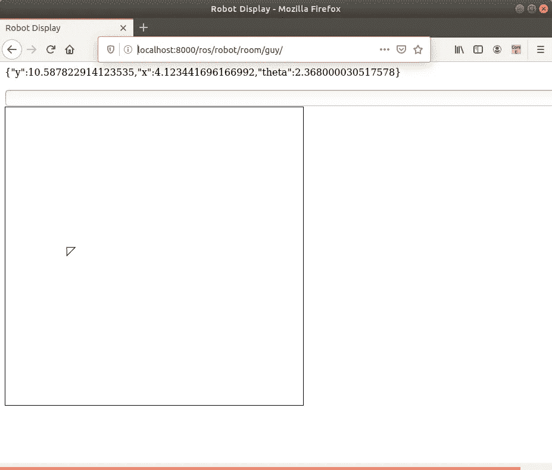

# 集成 Django 和机器人操作系统(ROS)的初学者指南

> 原文：<https://levelup.gitconnected.com/beginners-guide-to-integrating-django-and-robotic-operating-system-ros-f889f6245929>


我注意到网上缺乏将基于网络的技术与机器人技术相结合的好教程。可能是因为标准最近才开始建立。可能是机器人社区和全栈软件工程师有些细分。不管怎样，我个人对这两者的交集非常感兴趣，所以今天我将向您展示一个快速教程，介绍如何将 ROS 数据呈现给 web 应用程序。

今天的目标是在网络应用程序上实时绘制模拟机器人的位置。你应该在本教程末尾看到的演示可以在[这里](https://www.youtube.com/watch?v=AwqDSRAxaRU&t=3s)找到。

# 先决条件

首先，本教程假设你使用的是 Ubuntu 18.04，我没有在其他操作系统上测试过，也不知道 ROS 在其他操作系统上的支持程度(如果有的话)。

我选择的筹码是 django、redis 和 ROS。如果你没有做过 django 或 ROS 的入门，我建议你看看下面的教程和安装指南:

*   【https://docs.djangoproject.com/en/3.0/intro/tutorial01/ 号
*   【http://wiki.ros.org/ROS/Tutorials 

我用的是 ROS 1(旋律)。另外，我使用的是 Django 的 websocket 系统，名为 Django-Channels，我在下面链接了一些文档。

*   [https://channels.readthedocs.io/en/latest/](https://channels.readthedocs.io/en/latest/)

# 网络服务器

**安装**

通过运行以下命令下载我的 django-ros-turtlesim 存储库:

```
curl -LOk [https://github.com/samcrane8/django-ros-turtlesim-server/archive/master.zip](https://github.com/samcrane8/django-ros-turtlesim-server/archive/master.zip)
```

然后解压缩存储库并运行以下命令:

```
cd django-ros-turtlesim-server-master/
python -m venv venv
source venv/bin/activate
pip install -r requirements.txt
python manage.py runserver
```

**注意**:上面假设你想在虚拟环境中做所有的事情，如果你不想，你只需要运行最后两个命令。

在单独的选项卡中，开始运行 redis 服务器:

```
redis-server
```

**工作原理**

这个 django 服务器有两个应用程序设置:网站和 django_ros。网站应用程序是主要站点，它依赖 django_ros 来提供处理机器人的 API。

打开 django-ROS-turtle sim-server/django _ ROS/routing . py，往里面看看。您将看到以下内容:

```
# chat/routing.py
from django.urls import re_pathfrom django_ros.Robot.RobotConsumer import RobotConsumerwebsocket_urlpatterns = [
    re_path(r'ws/robot/(?P<room_name>\w+)/$', RobotConsumer),
]
```

该文件描述了一个机器人应该提交其通信的端点。您会注意到有一个描述端点应该是什么样子的字符串，然后是一个消费者。消费者特定于 django-channels，并且是 websocket 通信的结构。让我们看看这个。

继续打开 django-ROS-turtle sim-server/django _ ROS/Robot/Robot controller . py

在这里，您将看到下面的类:

```
class RobotConsumer(AsyncWebsocketConsumer):async def connect(self):
self.room_name = self.scope[‘url_route’][‘kwargs’][‘room_name’]
self.room_group_name = ‘chat_%s’ % self.room_name# Join room group
await self.channel_layer.group_add(
self.room_group_name,
self.channel_name
)await self.accept()async def disconnect(self, close_code):
    # Leave room group
    await self.channel_layer.group_discard(
    self.room_group_name,
    self.channel_name
    )# Receive message from WebSocket
async def receive(self, text_data):
    text_data_json = json.loads(text_data)
     message = text_data_json[‘message’]# Send message to room groupawait self.channel_layer.group_send(
self.room_group_name,
    {
        ‘type’: ‘topic_message’,
        ‘message’: message
    }
)# Receive message from room groupasync def topic_message(self, event):message = event[‘message’]
# Send message to WebSocketawait self.send(text_data=json.dumps({
‘message’: message
}))
```

你可以在这里了解更多关于消费者如何工作的[。](https://channels.readthedocs.io/en/latest/tutorial/part_3.html)

特别是在这个应用程序中，我们使用这个消费者来:

1.  创建一个供多个客户端通信的通道。
2.  提供名为“主题消息”的消息类型
3.  处理接收和向通道显示主题消息。

我想看的服务器端的最后一个关键文件是 django-ROS-turtle sim-server/django _ ROS/templates/turtle/room . html 文件。

```
<! — chat/templates/chat/room.html →
<!DOCTYPE html>
<html>
<head>
<meta charset=”utf-8"/>
<title>Robot Display/title>
</head>
<body>
<div id=”chat-log” cols=”100" rows=”20"></div><br>
<input id=”chat-message-input” type=”text” size=”100"><br>
<canvas id=”myCanvas” height=”500" width=”500" style=”border: 1px solid black”></canvas>
{{ room_name|json_script:”room-name” }}
<script>
const roomName = JSON.parse(document.getElementById(‘room-name’).textContent);
const canvas = document.getElementById(“myCanvas”);
const ctx = canvas.getContext(“2d”);
const chatSocket = new WebSocket(
‘ws://’
+ window.location.host
+ ‘/ws/robot/’
+ roomName
+ ‘/’
);
chatSocket.onmessage = function(e) {
const data = JSON.parse(e.data);
// Store the current transformation matrix
ctx.save();
// Use the identity matrix while clearing the canvas
ctx.setTransform(1, 0, 0, 1, 0, 0);
ctx.clearRect(0, 0, canvas.width, canvas.height);
// Restore the transform
ctx.restore();
ctx.save();
ctx.translate(data.message.x * 25,canvas.height — data.message.y * 25)
ctx.rotate(0.5*Math.PI — data.message.theta)
ctx.beginPath();
ctx.moveTo(0, 0);
ctx.lineTo(-10, 10);
ctx.lineTo(10, 10);
ctx.closePath();
ctx.stroke();
ctx.restore();
document.querySelector(‘#chat-log’).innerHTML = (JSON.stringify(data.message) + ‘\n’);};
chatSocket.onclose = function(e) {
console.error(‘Chat socket closed unexpectedly’);
};
document.querySelector(‘#chat-message-input’).focus();
document.querySelector(‘#chat-message-input’).onkeyup = function(e) {
if (e.keyCode === 13) { // enter, return
document.querySelector(‘#chat-message-submit’).click();
}
};
document.querySelector(‘#chat-message-submit’).onclick = function(e) {
const messageInputDom = document.querySelector(‘#chat-message-input’);
const message = messageInputDom.value;
chatSocket.send(JSON.stringify({
‘message’: message
}));
messageInputDom.value = ‘’;
};
</script>
</body>
</html>
```

这个文件的作用是创建一个画布，模拟海龟的一个小头像将在上面移动。看一下 websocket 代码:我们连接到我之前提到的同一个端点，只是接收数据来移动我们的虚拟角色。

既然您已经看了服务器，让我们看一下另一面:客户机。

# 客户

**安装**

首先，你应该有 ROS melodic 设置以及柳絮工作空间设置。请参考我在本文开头链接的教程。

然后，您需要安装 django-ros-turtlesim-client:

```
cd ~/catkin_ws/src/
curl -LOk [https://github.com/samcrane8/django-ros-turtlesim-client/archive/master.zip](https://github.com/samcrane8/django-ros-turtlesim-client/archive/master.zip)
```

继续解压缩存储库。

一旦你理解了 ROS 的基础知识，这里的代码就非常简单了。首先看一下`run.launch`文件:

```
<launch>
  <node pkg="turtlesim" name="sim" type="turtlesim_node"/>
  <node pkg="django_turtle" name="djang_turt" type="djangoChannelsRosClient.py"/>
</launch>
```

两个节点正在运行:首先是 turtlebot 模拟器，然后是我们的 django_turtle 包。模拟器实际上创建了主题和逻辑来移动海龟，而 django_turtle 是 turtlebot 的 pose 主题的订阅者，turtle bot 转过身来将数据推送到 websocket 连接。您可以在这里看到处理这部分代码的逻辑:

```
ws = websocket.WebSocket()
ws.connect("ws://localhost:8000/ws/robot/guy/")

def callback(data):
    global ws
    rospy.loginfo(rospy.get_caller_id() + 'x: %s', data.x)
    position = {
        'x': data.x,
        'y': data.y,
        'theta': data.theta
    }
    message = json.dumps({ 'message' : position })
    ws.send('%s' % message)

def listener():

    # In ROS, nodes are uniquely named. If two nodes with the same
    # name are launched, the previous one is kicked off. The
    # anonymous=True flag means that rospy will choose a unique
    # name for our 'listener' node so that multiple listeners can
    # run simultaneously.
    rospy.init_node('robotDispatcher', anonymous=True)
    rospy.Subscriber('turtle1/pose', Pose, callback)

    # spin() simply keeps python from exiting until this node is stopped
    rospy.spin()

if __name__ == '__main__':
    listener()
```

您可以在顶部看到正在创建的 websocket 连接，并注意到该连接指向“guy”机器人。这只是这个机器人的默认行为，在一个更复杂的例子中，你可以让机器人知道自己的 ID，并可以启动独特的“房间”来传递数据。

回调函数实际上被传递给 listener 函数中定义的 rospy 订阅者:它只是这个节点每次从`/turtle1/pose`主题接收数据时发生的函数。请注意，我们正在传递机器人的 x，y 和θ。当它到达我之前展示的模板文件时，这些数据就被用来绘制 javascript 画布。

**构建**

要构建该程序，您需要运行以下命令:

```
cd ~/catkin_ws
catkin_make
```

如果构建没有错误，那么您就可以运行这个程序了。

# 运行程序

运行本教程需要四个终端选项卡。您可以在这里观看我如何运行程序[，或者您可以执行以下操作:](https://www.youtube.com/watch?v=AwqDSRAxaRU)

1.  运行 rosnodes。运行以下脚本:

```
source ~/catkin_ws/devel/setup.bash //a setup script for catkin
cd ~/catkin_ws/src/django-ros-turtlesim-client
roslaunch django-ros-turtlesim-client run.launch
```

2.运行 redis 服务器:

```
redis-server
```

3.运行 django 服务器(从 django github 项目的根目录):

```
cd django-ros-turtlesim-server
python manage.py runserver
```

4.最后，您需要运行 turtlesim teleop 命令来控制海龟。

```
source ~/catkin_ws/devel/setup.bash
rosrun turtlesim turtle_teleop_key
```

使用箭头键在屏幕上移动机器人时，保持第四个终端(teleop 终端)高亮显示。你会在蓝屏上看到乌龟在移动。

现在，您需要打开一个网络浏览器，并转到`[http://localhost:8000](http://localhost:8000/ros/robot/room/guy/)/ros/robot/room/guy/`

这将向您展示我们从 django 服务器上看到的 html 文件的呈现。它看起来像下面这样:



# 结论

今天，我们学习了如何向 web 应用程序实时显示机器人数据。这个想法有很多不同的方向，从跟踪机器人送货到管理搜索和救援无人机。我相信，随着机器人成为我们生活中更重要的一部分，应用程序的数量只会增加。