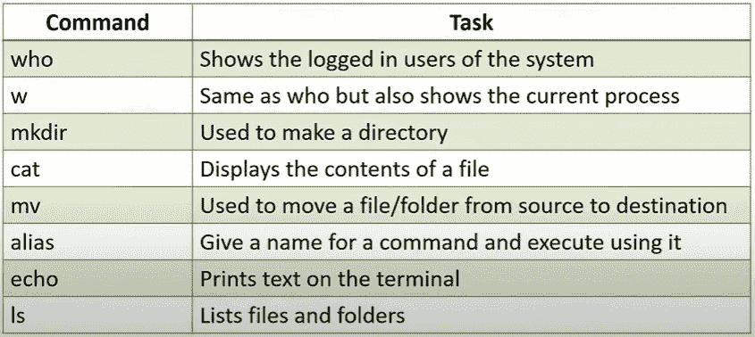

# Linux 初学者指南

> 原文：<https://levelup.gitconnected.com/beginners-guide-to-linux-f86a5782670e>

## 开始使用 Linux 所需的一切！

目前，Linux 内核有 2000 万行代码，这是有史以来最小的一次！Linux 是世界上最大的开源项目之一，大约 95%的 Linux 是用 C 编程语言编写的。

# **简介**

**Linux 是由 Linus Torvalds** 和数以千计的其他贡献者开发的基于 Unix 的操作系统(因为它是开源的)，这导致了几个发行版或我们所谓的 **Linux 发行版**。Linux 是 Unix 的克隆，虽然它的行为像 Unix，但它不包含它的代码。Unix 有一个由 AT & T 实验室开发的完全不同的代码。然而，它们都有相似的体系结构，Linux 是开源的这一事实导致 Unix 在超级计算机和其他领先技术中失去了受欢迎的程度。如果你想知道更多关于他们的区别，请点击这里。

# **为什么选择 Linux？**

在现代，我们都更熟悉 Windows 操作系统，但当你进入 IT 领域时，情况就不一样了。事实上，一些公司完全依赖于 Linux，因为它更可靠、轻量级、安全、快速，并且是开源的。

事实上，它是开源的，让你可以使用一个基本的 Linux 操作系统来创建自己的操作系统，恶意软件很难侵入 Linux 内核，这增加了它的安全性和可靠性。但是等等，不要马上改变你的操作系统，除了开发和 it 方面，你可能不会发现 Linux 像 Windows 一样有趣，所以如果你还不想改变你的 Windows 但你仍然想使用 Linux，这完全没问题——你可以随时使用 VirtualBox 模拟它。[点击这里](https://www.youtube.com/watch?v=vBSSGmZU7Bc&feature=emb_logo)，如果你想弄清楚如何使用 VirtualBox 在 Windows 内部安装 Linux。

Linux 过去有命令行界面，但在现代，我们也有一些不错的 GUI 发行版，比如 Ubuntu、centOS 等等。在这里，我们将使用 centOS，无论您使用哪个发行版，除了很少的命令之外，其他的都是相似的，我们将继续强调这一点。

还有很多发行版，这些是最流行的一些。

# **Linux 架构**

任何系统的核心**硬件**(CPU、RAM 等)都不能与用户直接通信，这就是 Linux 架构的**内核**层的用武之地。内核基本上帮助我们联系硬件，它帮助我们向硬件提供输入并接收最终的输出。哦，等等！但是我们应该如何访问内核呢？不知道内核在哪里！这就是下一级 Linux 架构的用武之地，**外壳**。因此，当**用户**的外环想要在 Linux 操作系统中执行命令或运行**应用程序**时，用户应该在 Shell 中输入他们的需求，它反过来与内核通信，内核将我们的输入传递给硬件。必要的过程完成后，结果输出从硬件发送回内核，内核将其发送回外壳，最终作为输出显示给最终用户！

# 壳

现在您已经知道了 shell 是如何工作的，您需要知道它实际上在哪里是兼容的。Shell 基本上是 CLI Linux 系统的一部分，在当今世界，GUI Linux 系统正在快速发展，但是 Shell 不能直接在 GUI 环境中工作，那么我们现在该怎么办呢？是啊！我们将不得不在我们的 GUI 环境中模拟 Shell。因此，在 GUI Linux 系统中，我们提供了一个名为**终端的软件，它可以帮助我们在 GUI Linux 系统中模拟 CLI Linux 系统外壳！**

我们有各种各样的 Linux 发行版，每个发行版都可能导致一个特定的 shell。迄今为止最流行的 shell 是 Bash，其次是 zsh、fish、tcsh 等等。这些仍然是最常用的 Linux 开源外壳。

# **内核执行的操作**

1.  **资源管理:**决定哪个进程获得资源进行操作。
2.  **内存管理:**高效地为进程分配系统内存。
3.  **设备管理:**帮助进程与外部设备如 USB 等建立连接。
4.  **系统调用:**有时候一个进程可能没有足够的权限访问一个资源，在这种情况下系统调用可以用来给进程提供必要的权限。系统调用也可以嵌入到 shell 脚本中，以避免由于拒绝权限而导致的中断。

# 基本 Linux 命令

除了这些，

**cd** 命令**帮助我们改变当前的工作目录、**

**光盘..**命令帮助我们向后移动一个目录，

**触摸**命令帮助我们在当前工作目录下创建一个文件，

**man** command 显示特定命令的手册。

**rm** 命令用于删除一个文件或一组文件或所有包含特定扩展名的文件，

**cp** 命令帮助我们将文件内容复制到另一个文件(或)将一个文件复制到另一个目录(或)将文件复制到多个目录，

**mv** 命令帮助我们将一个文件的内容移动到另一个文件(或)将一个文件移动到另一个目录(或)将多个文件移动到另一个目录，

**sudo** 的意思是 ***超级用户 do*** ，它为我们提供了根用户权限。

**mkdir** 命令创建一个目录。

**rmdir** 命令删除一个目录。

查找命令搜索一个文件并列出它，它也搜索一个目录并列出其下的所有文件。

**文件**命令打印文件的类型。

**grep** 命令在文件中搜索模式。

**echo** 命令在终端上打印文本，其中包含许多属性，[单击此处](https://www.geeksforgeeks.org/echo-command-in-linux-with-examples/)了解更多信息，[单击此处](https://citricks.net/cheatsheet-centos-commands/)查看 centOS 命令备忘单！

[点击这里](https://www.youtube.com/watch?v=_TlK0-5EJ-Y)，获取动手操作教程！

# **文本编辑器**

有几个文本编辑器，但是，Vim 和 Emacs 是最流行的。Vim 是 Vi 编辑器的改进版本，它超级轻量级，易于打开和编辑，并且很可能安装在大多数发行版中。说到 Emacs，您可能需要安装它，它不是一个 CLI 编辑器，而是一个应用程序。Nano 是我个人最喜欢的，因为它有一个小工具栏，可以通过快捷键来指导我们，然而，Vim 和 Nano 非常相似，但事实上 Vim 在大多数发行版中都可用，并且鉴于其优点，它比 Nano 更受欢迎。Gedit 是另一个为我们提供 GUI 环境的编辑器。

Vim 编辑教程:[https://www.youtube.com/watch?v=g-XsXEsd6xA](https://www.youtube.com/watch?v=g-XsXEsd6xA)

Emacs 编辑教程:[https://www.youtube.com/watch?v=Iagbv974GlQ](https://www.youtube.com/watch?v=Iagbv974GlQ)

纳米编辑教程:[https://www.youtube.com/watch?v=gyKiDczLIZ4](https://www.youtube.com/watch?v=gyKiDczLIZ4)

# **文件权限**

Linux 基本上为我们提供了三种类型的所有权:

1.  用户
2.  组
3.  其他/流程

添加用户的命令 **: sudo 用户添加** *用户名*

添加组的命令**:sudo group add***group name*

并且每个所有者可以有三种类型的许可，

1.  也读(表示为数字 4)
2.  写(也表示为数字 2)
3.  执行(也表示为数字 1)

**chmod** 命令用于修改权限，而 **chown** 命令用于修改所有权。

[点击此处](https://www.youtube.com/watch?v=D-VqgvBMV7g)，了解更多关于 Linux 中文件权限的信息。

# **过程控制命令**

当我们在 Linux 终端/shell 中键入一个命令时，它会启动一个新的进程，调用一个五位数的惟一 ID，称为进程 ID 或 **PID** 。进程 ID 帮助我们跟踪操作系统中运行的进程。

在 Linux 中，可以用两种方式初始化进程，

1.  **前台进程**:默认情况下，每个进程都作为前台进程运行。例如: **pwd** 、 **ls** 等等
2.  **后台进程**:这些进程在后台运行，允许其他进程并行运行。可以通过在命令后添加一个&符号来激活它们。示例:**pwd&**

可以使用 **ps** 命令跟踪这些过程。 **ps aux** 命令显示每一个进程。ps -f 命令向我们展示了一个更详细的过程。 **ps -u *用户名*** 向我们展示了用户内部发生的进程。

按下 **Ctrl+C** 可以停止前台进程，使用 **kill** 命令可以停止后台进程。[点击此处](https://www.youtube.com/watch?v=swiHsaD8BGI)，了解更多过程控制命令。

好了，我们已经介绍了你需要的所有基础知识，开始你的 Linux 之旅吧。在一篇文章中涵盖所有内容肯定是不可能的，但是，如果你对 Linux 很认真，并且有兴趣了解更多，我在下面添加了几个链接，我发现它们很有用。快乐学习！

[**GitHub**](https://github.com/ritchiepulikottil)

[领英 ](https://www.linkedin.com/in/ritchie-pulikottil-6876341aa/)

[**推特**](https://twitter.com/itsritchie1005)

# **资源:**