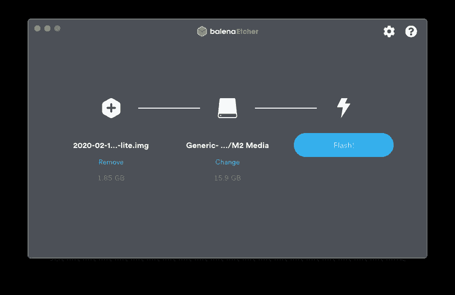
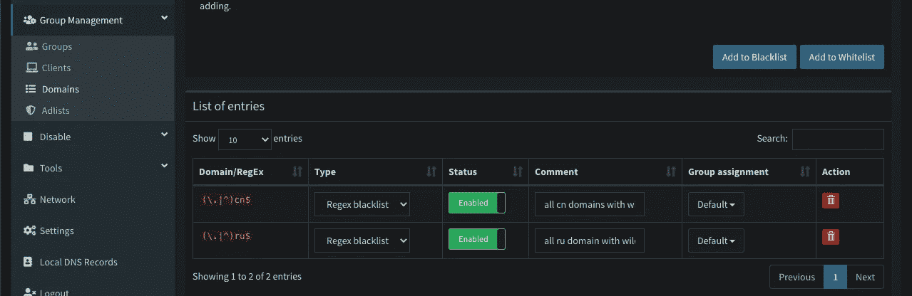

# 设置网络级广告拦截器的初学者指南

> 原文：<https://levelup.gitconnected.com/beginners-guide-to-setting-up-a-network-level-ad-blocker-fbac66dbac0>


最近的事件刺激了我的家庭改善项目，作为其中的一部分，我最终决定使用 [Pi-hole](https://pi-hole.net/) 实现一个网络级广告和互联网跟踪器块。虽然这篇文章将重点介绍如何使用 Mac 来设置 Pi-hole，但是您也可以使用 Windows 或 Linux 机器来做同样的事情。

在这个过程中，我意识到虽然有很多 Pio-hole 教程，但几乎没有一个完成了所有重要的步骤，比如安全性。
我希望这篇文章能成为一个一站式指南，从下载你的第一个 Raspbian 操作系统到保护一个由它驱动的网络设备。如果一切顺利，你将能够在一个小时内享受更加愉快的浏览体验。

## 在这篇文章中，你将

*   执行无头安装并设置 Pi-hole，一个网络级广告和互联网跟踪拦截器
*   使用入侵防御软件框架 [Fail2Ban](https://www.fail2ban.org/) 来保护你刚刚设置的漏洞

## 你需要什么

*   Raspberry Pi(任何型号都可以，最好带以太网端口)
*   微型 SD 卡
*   一台电脑
*   以太网电缆

## 你可能需要什么

*   微型 USB 到 RJ45 以太网适配器，如果你的 Pi 没有任何以太网端口(例如:树莓 Pi 零)
*   微型 SD 读卡器(如果您的电脑没有)

**如果你都准备好了，我们就开始吧**

## 步骤 1:下载并刻录 Raspbian 操作系统

Raspberry Pi 基金会在他们的网站上提供了几个 Raspbian 操作系统的变体。因为我们想保持操作系统的足迹最小化，我们将安装 Raspbian 巴斯特精简版的操作系统。为了刻录所说的操作系统，我们将使用 [balenaEtcher](https://www.balena.io/etcher/) 。所以继续下载/安装这个。

一旦你下载了 Raspbian 操作系统，并且在你的电脑上安装了 balenaEtcher，继续把微型 SD 卡连接到你的电脑上。
电脑识别出 micro SD 卡后，启动 balenaEtcher，选择 Raspbian 镜像，您的 micro SD 卡，然后点击*“Flash”*。



闪存完成后，从计算机上拔下 micro SD。现在，您已经成功地将 Raspbian 操作系统刻录到 SD 卡中。

## 步骤 2:准备无头安装

正如开始时提到的，我们将执行一个无头安装。这是您不使用显示器或键盘来运行 Pi 的时候。

那我们怎么和圆周率互动呢？我们将使用一个叫做 [ssh](https://www.ssh.com/ssh/protocol/) 的东西来获得远程访问。

首先，将微型 SD 卡重新插入电脑。您应该会看到一个标记为*“boot”*的驱动器弹出。一旦你看到驱动器，打开你的终端，并导航到它的目录。在 Mac 上，这可以通过右键单击引导文件夹，并选择*“服务- >在文件夹中新建终端”来轻松完成。*


在终端中，输入`touch ssh`创建一个无扩展名的 ssh 文件。
之后，只要关闭终端，就大功告成了。

## 第三步:设置你的树莓派

将您的 micro SD 卡插入 Pi，然后连接以太网，然后通电。确保你的以太网电缆连接到路由器的以太网端口，而不是调制解调器。

既然 Pi 已经连接好了，我们需要知道它的 IP 地址，这样我们就可以通过 SSH 访问它。要做到这一点，你可以登录你的路由器的管理页面或使用软件，如[愤怒的 IP 扫描仪](https://angryip.org/download/#mac)。

你可能会尝试使用第三方软件，但是知道如何绕过你的路由器的管理页面将会派上用场。
你永远不知道什么时候你会需要更新固件，或者不得不为那个亲戚的坏孩子建立一个访客网络！

我们将只使用路由器的管理页面。每台路由器都有不同的软件，因此接下来的几个步骤可能与您所拥有的不完全匹配，但总体思路是相同的。就像生活中的其他事情一样，你最好的选择是做一些谷歌搜索。

我们在连接的设备列表中寻找主机名*“raspberrypi”*。一旦你找到它，注意它的 IP 和 MAC 地址。

我只需登录，然后转到“连接的设备”选项卡。


点击它将会看到更详细的视图。


现在我们需要为 Pi 配置一个静态 IP，以防止它随着时间的推移而改变。为此，我们需要给它分配一个静态 IP 地址[。这个过程也会因路由器和服务提供商的不同而不同，所以你可能需要再一次进行谷歌搜索。](https://www.lifewire.com/what-is-a-static-ip-address-2626012)

因为我有一个 Netgear 路由器，所以这个过程非常简单。我只需导航到*“高级>设置>局域网设置”，*然后在局域网设置页面的地址保留部分，点击*“添加”*按钮。

在 IP 地址字段中，输入您想要分配的 IP 地址(**确认它没有被网络上的其他设备使用**)。在 MAC 地址字段中，键入您之前找到的 Pi 的 MAC 地址。


最后，重启(插入和拔出电源线)您的 Pi，让它获取新分配的 IP。

## 步骤 4:远程连接到 Raspberry Pi

为了通过 ssh 连接，我们需要一个 ssh 客户端。对于 Mac，我们可以只使用内置终端。对于 windows 用户，我们可以使用类似 [PuTTY](https://www.chiark.greenend.org.uk/~sgtatham/putty/latest.html) 的东西。

打开终端，输入`ssh pi@<static IP address of your Raspberry Pi>`并按回车键。一旦提示输入密码，输入缺省值`raspberry`并按回车键。


如果您看到类似上面的内容，您已经成功连接到您的 Pi！

## 步骤 5:更新和保护树莓 Pi

保护新连接的设备是最重要的步骤之一。树莓派基金会表示

> 你的覆盆子酱的安全性很重要。安全漏洞使得你的 Raspberry Pi 对黑客开放，他们可以在没有你的允许下使用它。
> …
> 如果你想让你的 Raspberry Pi 直接暴露在互联网上，要么直接连接(不太可能)，要么**让某些协议通过你的路由器防火墙(如 SSH)** ，那么你需要做一些基本的安全更改。

你也可以看看[官方树莓 Pi 基金会网站](https://www.raspberrypi.org/documentation/configuration/security.md)了解更多。

让我们从更新设备开始。在终端中键入并输入`sudo apt-get update && apt-get upgrade -y`来更新任何过期的软件包。

现在，让我们更改默认密码。我推荐使用一个[强大的随机密码生成器](https://passwordsgenerator.net/)，它可以像`oE1M6FmcD!33t2wb*r7y`一样生成密码，并将其存储在安全的地方，这样它就不会丢失。在终端上输入`passwd`，然后输入你的新密码。当您键入新密码时，您将看不到任何提示，但不要担心，密码输入正确。

最后，我们将安装和配置 [Fail2Ban](https://www.fail2ban.org/wiki/index.php/Main_Page) ，这个服务

> 扫描日志文件…并禁止显示恶意迹象的 IP，如多次密码失败、寻找漏洞等。一般来说，Fail2ban 随后用于更新 [**防火墙**](https://wiki.archlinux.org/index.php/Firewall) 规则，以在指定时间内拒绝 IP 地址，尽管也可以配置任何其他任意操作(例如发送电子邮件)。

保护我们的 Pi 免受暴力攻击。

进入`sudo apt-get install fail2ban`，等待下载安装完成。然后，输入`sudo nano /etc/fail2ban/jail.local`来配置它的安全规则。

下面是我如何设置它，以及每个参数的含义。你可以随意编辑，也可以原样复制(不带注释)。

```
[ssh] # Services where this rule will apply.# Enables this rule.
enabled = true# Port to block out. We can just enter ssh sicne that is how the pi will be accessed.
port = ssh# Fail2Ban default filter library.
filter = sshd# Path for the log file.
logpath = /var/log/auth.log# Time in seconds where ban will be effective.
bantime = 6000# Action that will be used when the below threshold is reached.
banaction = iptables-allports# Window of time in seconds where the re-tries will stack.
# Here, 3 failed tries within 900 seconds will result in a ban.
findtime = 900# Number of re-tries allowed for a client connection.
maxretry = 3
```

一旦你完成配置，继续按下 *ctrl + x* ，然后 *y* ，然后*回车*。这将保存您的配置。要应用它，我们将通过在终端输入`sudo service fail2ban restart`来重启服务。

就是这样！

## 步骤 6:安装和设置 Pi-hole

从他们的网站上复制 Pi-hole [安装命令](https://github.com/pi-hole/pi-hole/#curl--ssl-httpsinstallpi-holenet--bash)。写到这里的时候，是`curl -sSL [https://install.pi-hole.net](https://install.pi-hole.net) | bash`。将它复制并输入到终端，您将看到如下配置屏幕:


如果您一直遵循本教程，您可以继续接受所有默认设置。**您可能会看到一个关于 IP 冲突的屏幕，但您可以忽略它并继续。**在最后一步，Pi-hole 将需要几分钟来完成安装。完成后，你会看到一个*“安装完成！”*带有 Pi-hole web 仪表板的 IP 和密码的页面。一定要把它写下来，这样你就不会忘记了。


(透视终端…忽略令人毛骨悚然的背景 lol)

打开浏览器，转到提供的 IP 地址，并使用提供的密码登录。这将带您进入 Pi-hole 仪表板，在那里您可以看到有趣的统计数据和修补设置。


## 最后一步:在网络范围内启用它！

要在您的所有设备上自动启用 Pi-hole，我们需要配置您路由器的默认 DNS 设置。重新登录到路由器的管理面板，将其 DNS 服务器设置为您的 Pi 的静态 IP 地址。同样，这将因路由器而异(我的是在*“互联网> DNS 地址】)*。


一旦你设置好了，点击应用(或保存或任何你的管理页面)。就这样，我们现在有了一个全网络的广告和跟踪拦截器！

## 樱桃在上面

Pi-hole 自动附带一些阻止列表，Pi-hole 将使用这些列表来识别常见广告和跟踪源。但是，没有什么可以阻止你创建自己的黑名单或使用其他黑名单来扩大覆盖范围。这可能会导致一些误报(然后会被列入白名单)，所以要小心行事。

我个人使用一个额外的阻止列表，比如来自 [firebog](https://v.firebog.net/hosts/lists.php?type=tick) 的列表。

要设置这些，请转到 Pi-hole 仪表板，然后转到*“组管理”*选项卡下的*“广告列表”*。您可以在这里添加列表的 URL，以及帮助您记住其目的的个性化注释。


您还可以在同一选项卡下的*“Domains”*页面中阻止某些域。我设置它来阻止任何以`.cn`和`.ru`结尾的域名。



在这篇文章中，我们仅仅触及了树莓派的皮毛。我鼓励任何感兴趣的人超越这一点，看看其他很酷的项目，如[建立一个 Raspberry Pi Plex 服务器](https://thepi.io/how-to-set-up-a-raspberry-pi-plex-server/)为您的家庭创建一个媒体中心！