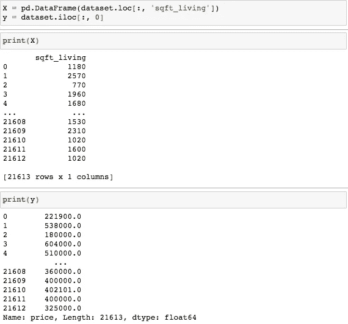

# 简单和多元线性回归模型初学者指南

> 原文：<https://levelup.gitconnected.com/beginners-guide-to-simple-and-multiple-linear-regression-models-d2d5dbe9e704>

回归是一种常见的机器学习技术，用于预测真实值，例如基于一组特征的房屋价格。在这篇文章中，我将指导你通过简单线性回归和多元线性回归，同时实际操作一个原始数据集。

# 简单与多元线性回归

线性回归是一种捕捉两个(*简单*)或更多(*多重*)变量之间线性关系的模型，其中一个被标记为*因变量*，另一个被标记为*自变量*。当自变量的增加或减少导致因变量的相应增加或减少时，存在线性关系。

*简单线性回归*

在**简单线性回归(SLR)** 中，我们的目标是根据自变量 *x* 预测因变量 *y* 的值。我们只研究这两个变量之间的关系。例如，我们将利用 SLR 来预测仅基于居住面积的房价。

虽然 *x* 和 *y* 之间的关系不一定是线性的，但是 SLR 模型包括数据中的误差，或者称为**残差**。一个残差是 *y* (蓝点)的真实值和 *y* (红线)的预测值之差。我们可以通过找到“最佳拟合线”来最小化误差，或者称为**普通最小二乘法**。要得到这条线，必须取 *y* 的真值和 *y* 的预测值之差的和，求平方，取最小值。我们取最小值是因为我们试图最小化真实值和预测值之间的距离，在下面的可视化中用黑线测量。

红线是“最佳拟合线”

创建回归模型时，您很可能会处理多个独立变量。在这些情况下，我们将使用**多元线性回归**。例如，我们可以利用这个模型根据居住面积和卧室数量来预测房价。

多元线性回归

# 让我们熟悉一下数据

我从 [Kaggle](https://www.kaggle.com/harlfoxem/housesalesprediction) 中提取了一个关于**美国金县**房屋销售的数据集。Kaggle 是有抱负的数据科学家常用的平台，在这里你可以参加比赛，参加迷你课程，并获取原始数据集。在本教程中，我利用 Jupyter 笔记本来操作数据集。

为了熟悉我们的数据集，让我们列出[列](https://storage.googleapis.com/kaggle-forum-message-attachments/479761/11440/Screenshot%202019-02-27%20at%205.26.24%20PM.png)并了解我们将使用哪些特性。在进行任何数据分析之前，这是一个非常重要的步骤。

# 让我们开始编码吧！

> **步骤 1:导入库和数据集**

*   ***Numpy*** 是一个包含 Python 库的包，支持数组和矩阵的创建和操作，以及对这些数组进行操作的数学函数。
*   ***Matplotlib*** 是用于创建可视化的 Python 的绘图库。
*   ***Pandas*** 是一个软件库，包含用于数据操作和分析的 Python 编程语言。

我们的数据集有 21，613 行和 21 列。

我们的目标是**根据提供的数据预测房价**。当处理一个原始数据集时，我们必须处理空值并删除任何对实现目标似乎无关紧要的列。我们的数据集不包含空值，并且删除了列 *id、date、lat、*和 *long* 。

> **第二步:确定因变量和自变量(SLR)**

虽然因变量是*价格*，但我们必须选择一个我们认为最能影响房价的特征。我选择了*sqft _ living；*然而，对于选择特征的更精确的方法，我们可以执行[特征选择](https://towardsdatascience.com/feature-selection-techniques-in-regression-model-26878fe0e24e)，这种方法允许我们选择以高精度预测因变量的最佳特征。

> **第三步:将数据集分为训练集和测试集(SLR)**

训练和测试分割的重要性在于，训练集包含模型从中学习的已知输出。然后，测试集根据从训练集中获得的信息来测试模型的预测。让我们看看这是怎么回事！

***第四步:在训练集上训练简单线性回归模型***

从包含线性模型的 sklearn 包中，我们导入类 **LinearRegression** ，创建它的一个实例，并将其赋给一个变量。的。 *fit()* 函数允许我们训练模型，根据数据值调整权重以达到更好的精度。经过训练后，我们的模型就可以进行预测了，这是由*调用的。*方法预测()。

> **步骤 5:评估模型性能(SLR)**

既然我们已经成功地创建了单反模型，我们必须评估它的性能。**残差图**是纵轴显示残差，横轴显示预测值的图表。

如果一个模型在预测方面做得很好，它应该具有以下特征:

*   剩余点对称分布，聚集在图的中间。
*   它们倾向于聚集在 y 轴的较低的一位数周围，例如 0.5 到 1.5 范围内的任何整数。
*   它们没有清晰的模式。如果检测到模式，则可以改进模型。

在上面的残差图中，我们可以清楚地看到一个模式正在形成:这些点紧密聚集，并在预测的房价达到 150 万美元后开始进一步远离。

我们可以评估我们的模型表现如何的另一种方法是调用[T5。score()](https://scikit-learn.org/stable/modules/generated/sklearn.dummy.DummyRegressor.html#sklearn.dummy.DummyRegressor.score) 函数返回预测的系数 R。可能的最高分是 1.0。

我们的训练集获得了 48.9%的准确率，而我们的测试集获得了 50.3%的准确率。

# **提升空间！**

虽然 SLR 是描述两个变量之间关系的一种简单快捷的方法，但它不是最常用的，因为因变量通常由多个特征决定。让我们看看是否可以通过创建一个**多元线性回归**模型**来提高我们的准确度。**

我们将遵循上面相同的步骤，除了将我们的独立变量 *X* 分配给多个特征的数据集，而不是一个。我将 *X* 分配给数据集中的所有列，不包括*价格*，因为那是我们的因变量。*(注意—在 MLR 中，没有必要将所有列都包含在数据集中。这可能会导致我们的模型* ***过拟合*** *，这发生在我们的模型对训练集调得太好，以至于它在新数据集上表现不佳的时候。为了避免这种情况，我们应该执行* ***特征选择*** *(尽管那已经超出了本文的范围)。*

为了了解 MLR 模型的性能，让我们创建一个残差图，并获得训练集和测试集的准确度分数。

请注意，通过向我们的模型中添加更多的特征，我们能够将训练集和测试集的准确度分数提高到大约 65%，并且残差图没有展示出清晰的模式。

# 结论

在本指南中，我们回顾了简单和多元线性回归模型的基础知识。我们了解到以下情况:

*   SLR 考察的是因变量和单个自变量之间的关系。
*   MLR 考察因变量和多个自变量之间的关系。
*   训练/测试分割对于确保我们的模型不会过度拟合非常重要。
*   残差图是评估线性回归模型性能的一种方法。
*   。score()是通过确定模型的 R 系数来评估模型性能的另一种方法。

当我们使用单一特征来预测房价时，我们得到的准确率为 50%，而当我们整合多个特征时，我们得到的准确率为 65%。这个分数可以通过特征选择或通过结合不同的回归模型来提高，例如*随机森林*或*决策树*。这些都是重要的技巧，我将在我即将发布的帖子中讨论。

感谢您的阅读。非常感谢您的反馈！