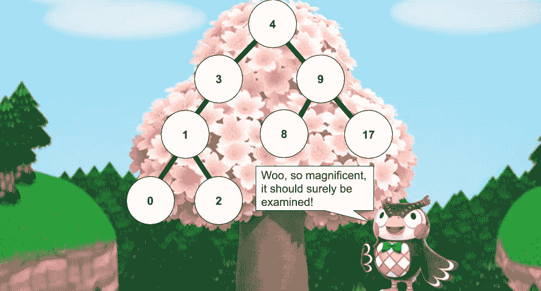
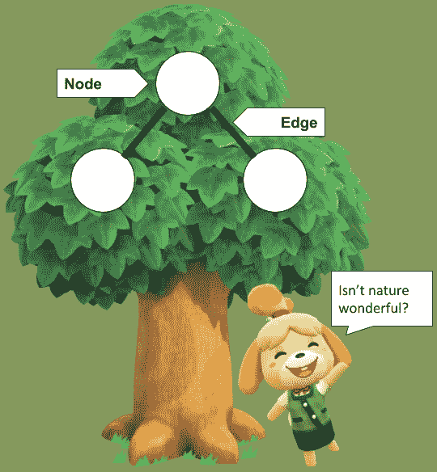
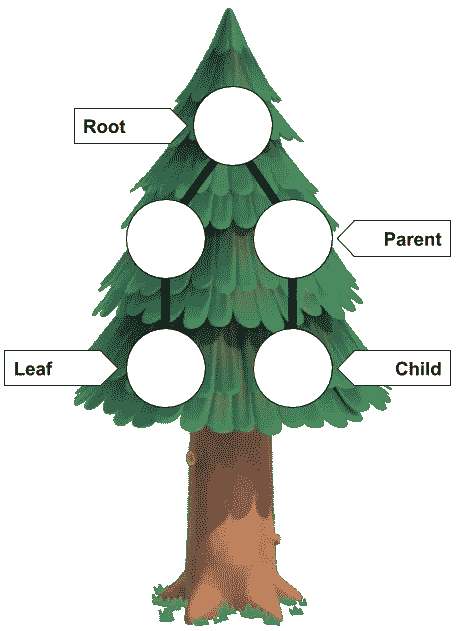
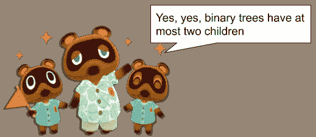
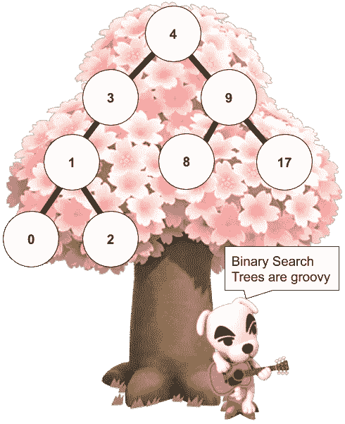
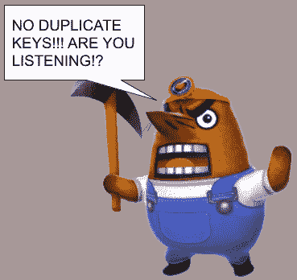
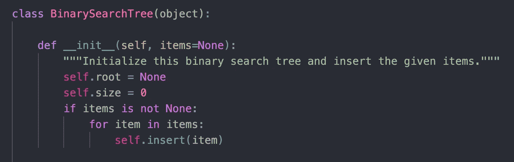
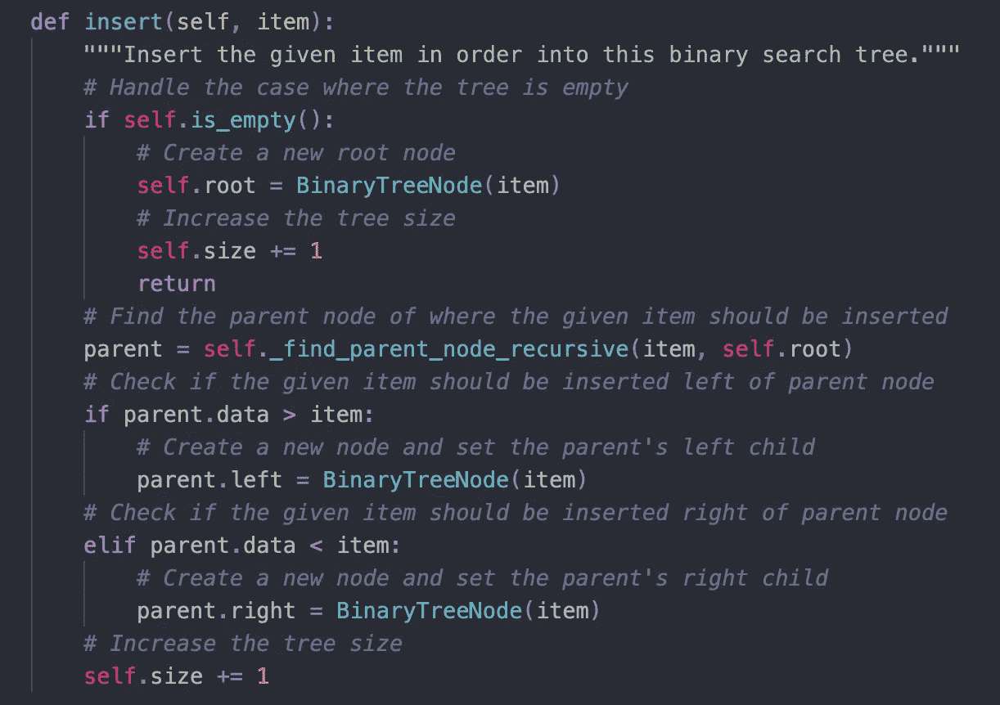
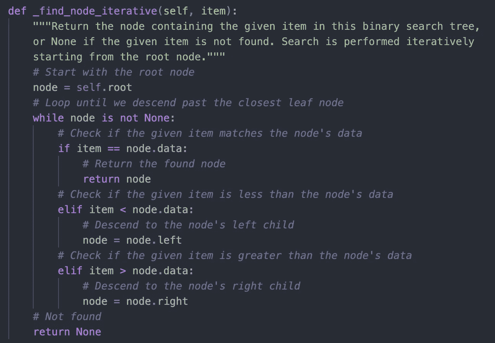
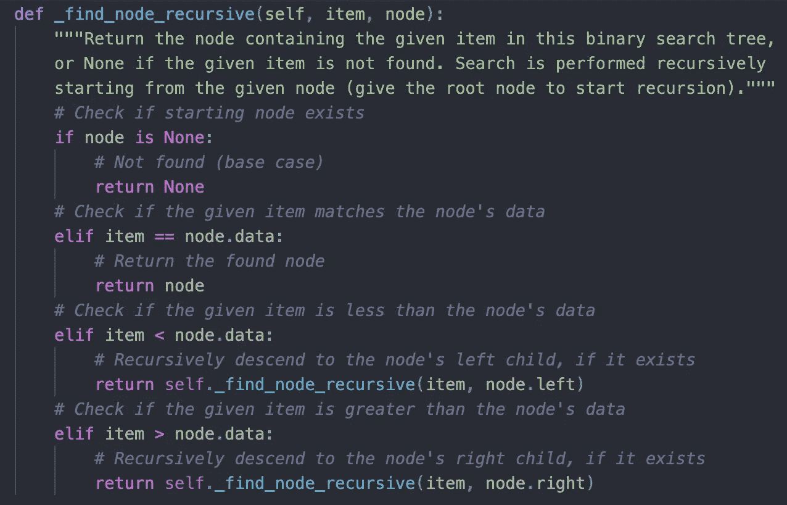

# 理解二分搜索法树的初学者指南

> 原文：<https://levelup.gitconnected.com/beginners-guide-to-understanding-binary-search-trees-fd2be2b086a>

本文的目的是介绍二分搜索法树的使用，澄清你以前可能有的任何误解，分析它在开发中的功能，并研究它们在现实世界应用中的作用。

无论您目前处于技术之旅的哪个阶段，对二分搜索法树的深刻理解，以及对二分搜索法和其他计算机科学基础的扎实理解，有助于您理解开发中可能更经常使用的更复杂的树。

一些真实世界的例子包括著名的脸书如何能够如此快速地搜索数十亿用户的数据，或者谷歌搜索引擎如何能够在你开始输入时就填充建议。其中最著名的例子是约翰·卡玛克斯的《毁灭战士》，它利用二叉树和关联搜索来增强游戏的渲染。在他的应用中，空间被分成一个树状结构，一个二分搜索法被用来根据 3D 位置和摄像机检索要显示的细分。这可能一开始听起来令人困惑，但是，这仅仅是个开始！

[双重震撼](https://medium.com/u/880e818b4c1b?source=post_page-----fd2be2b086a--------------------------------)穿越[动物穿越与毁灭](https://www.dualshockers.com/doom-eternal-animal-crossing-fan-video-animated/)共庆游戏发布日期

虽然，到目前为止，我一直在强调它们在游戏中的用途，但二分搜索法树对各种其他操作都很有用，包括但不限于:对大型数据集的可伸缩操作、搜索应用、路由、语法解析和数据库，等等。

希望关于二分搜索法树在现实世界中的应用的讨论已经成为深入理解它的开胃菜。为了确保我们都在同一页上，让我们回顾一些基础知识。

# **树木基础知识介绍**

树本身是一种抽象数据类型；与具体数据类型相反，抽象数据类型传达它所提供的数据的逻辑和流程。而具体的数据类型通常是指可以通过算法实现的东西。作为一种抽象的数据类型，树可以在具体的数据类型中实现，但是它们本身并不被认为是具体的。

> 例如，假设一本书本身是抽象的——有人可以告诉你想象一本书，你可以想象任何种类的书，任何形状，任何颜色，任何流派，等等。在这个例子中，书是一个思想，一个想法，一个虚构的物体。那么让我们假设有一本电话簿放在你面前。那个电话簿将是一本书的实现的例子。在这种情况下，电话簿将是具体的数据类型，因为作为电话簿，它具有物理和具体的存在。

在计算机科学中，树作为一种数据结构的目的是按照层次顺序存储数据，而不是像[数组](https://en.wikipedia.org/wiki/Array_data_structure)和[链表](https://en.wikipedia.org/wiki/Linked_list)那样以线性方式存储数据。

将数据结构限定为树的唯一条件是:有根值和子树，其中每个节点可以有许多子节点或节点。

注意我们前进的条件，因为这些是树，二叉树，和二分搜索法树之间的区别。

## 树的一部分

编程中提到的任何树基本上都是由通过边链接在一起的节点集合组成的。

每个节点包含一个可以被访问、插入、删除等的值或数据。

边创建节点之间的关系，然后确定节点的类型，它可能被赋予各种上下文。

## **节点关系:节点类型**

**根**一般是最顶层的节点。

*我说一般是因为前缀树(***)有一个例外，它的根不是一个节点，只是引用了所有第一级子节点。**

***父节点**是位于另一个节点(子节点)之前的节点。*

***子节点**是另一个节点(父节点)之后的节点。*

***叶**是一个没有孩子的节点。*

*这就是由边创建的关系发挥作用的地方。*

> *例如，一个父节点可以有一个子节点，也可以是另一个父节点的子节点。类似于母亲既是父母也是别人的孩子。作为母亲的母亲将是其婴儿的父节点(叶节点)，在这种情况下，母亲将是祖母的子节点。*

# *二分搜索法和二叉树介绍:*

*二分搜索法是一种算法，最适合及时地从排序的项目列表中找到项目。它的工作原理是找到列表的中间，(类似于在字母表的中间打开一本字典)，然后比较你要找的东西是在中间项之前(小于)还是之后(大于)。从那里，您的搜索池继续分成两半，直到您找到您正在寻找的单个项目。*

> *示例:您正在标准美国词典中搜索单词“木琴”。你首先打开字典到“M”部分，知道“X”部分(木琴所在的位置)在字典的大部分，你继续忽略小部分，“A 到 M”。从大部分，你再次将字典分成两半，最后到“T”部分。知道“X”还在“T”的更大的那一段，你就忽略了小半段，“M 到 T”。您将继续这个过程，直到您能够找到“X”部分，然后继续这个过程，直到您找到单词“木琴”*

**

*二叉树形成的条件，与树的结构本身有关。基于树的条件，二叉树的条件是每个节点最多有两个子节点(称为左子节点和右子节点)。*

*随着我们继续深入，你也应该知道二叉树和二分搜索法树是具体的数据类型，因为它们是树的实现。*

# ***最后，介绍二分搜索法树***

**

*二分搜索法树是二分搜索法树和树的进一步迭代。使二分搜索法树不同于二叉树的条件是二分搜索法树是有序的——左边的子节点总是小于父节点，右边的子节点总是大于父节点。最后一个条件是树中没有重复的键。*

> *快速提醒:键是唯一的标识符，用于帮助在编程中查找值。*

**

*在这一点上，你可能会认为树、二叉树和二分搜索法树之间有很多相似之处。你建立这种联系并没有错，每一个都建立在另一个的基础上，有更具体的条件，并且适用于不同的功能。我们将继续深入了解二叉查找树的功能。*

# *为什么使用二分搜索法树？*

*在快速查找和实现动态项目集或查找表时，二分搜索法树特别有效。如果您需要一个数据结构来存储一个可修改的集合，并且希望能够在其中自由地执行操作(搜索、插入、删除等)，那么您可以使用二分搜索法树。使用二叉查找树进行搜索非常快，运行时间为 O(log(n))，无论它保存的数据大小如何，也就是说，假设树是合理平衡的。*

*不平衡树是指左右子树的高度(从节点到叶子的最长向下路径上的边数)不匹配。由于它是偏斜和不平衡的，搜索时间可能从 O(log(n))增加到 O(n)的最坏情况。*

> *运行时间是指[大 O 符号](https://rob-bell.net/2009/06/a-beginners-guide-to-big-o-notation/)的运行时间，在计算机科学中用于描述算法的性能或复杂度。更具体地说，它通常指最坏的情况，用于描述算法所需的执行时间或使用的内存空间。*

# ***如何在代码中实现二分搜索法树***

*我们将研究一些关于二分搜索法树的更重要的算法，以及使用 Python3 对它们的编程实现。*

## *阶级结构*

**

*Python3 调用了一个 __init__ 方法，在这个方法中，我们用根、大小和我们想要的树中的给定项目来初始化二叉查找树。项目可以是数字、名称等。*

## *插入方法*

**

*和往常一样，您希望从处理树可能为空的实例中的基本案例开始。在 insert 方法中，我们首先找到应该插入给定项的父节点，并检查该项应该插入到父节点的左侧还是右侧。从那里，我们想创建一个新的节点，并将子节点设置为父节点。由于向树中添加了一个额外的项目，我们还通过新插入的数量来增加树的大小。*

## *搜索方法*

*对于搜索方法，我包含了两种不同的方法来实现搜索算法。有些人认为迭代方法更容易，有些人更喜欢递归方法。人们通常只在编写迭代代码非常复杂时才使用递归。尽管如此，如何实现代码取决于个人偏好。*

***迭代:**循环或重复部分代码的函数*

**

*在这个实例中，我们实现了一个名为 _find_node_iterative 的搜索方法，在这个方法中，我们以与二分搜索法部分中的字典单词示例相似的方式遍历节点。首先，我们从根节点开始，将项目与节点的数据进行比较，然后从那里开始相应地移动。如果项目大于当前节点，那么我们转到右边的子节点，如果项目小于当前节点，那么我们转到左边的子节点。这种比较使我们可以一次忽略一半的数据(类似于我们的字典示例)。*

***递归:再次调用自身的**函数重复代码*

**

*在这个实例中，我们实现了一个名为 _find_node_recursive 的搜索方法。迭代或递归运行搜索方法的结果是相同的。如果我们继续参考我们的字典示例，您仍然可以使用相同的减半技术找到您要查找的单词。这种递归方法与迭代法的区别在于递归调用自身来重复函数。*

# *最终注释:*

*这篇文章涉及了很多内容，从一般的计算机科学基础理论到数据结构二分搜索法树的更深入的细节。即使有所有这些细节，二分搜索法树也不是最重要的，它们只是你在技术之旅中冒险时在工具集中配备的另一种数据结构。*

**

# *大叫*

*特别感谢[任天堂](https://www.nintendo.com/)、[动物穿越](https://animal-crossing.com/)和[末日](https://bethesda.net/en/game/doom)在本文中亮相。*

# *资源*

*Dahmen，j .和 Davis，a .，2020。*制作学校课程/CS-1.3 核心数据结构*。[在线] GitHub。可从以下网址获取:<https://github . com/Make-School-Courses/CS-1.3-Core-Data-Structures/blob/master/Lessons/treetraversals . MD>【2020 年 5 月 8 日获取】。*

*德库托博士和那不勒斯法官，2020 年。*二元空间分区*。[在线]Groups.csail.mit.edu。可查阅:<http://groups . csail . MIT . edu/graphics/classes/6.838/S98/meetings/M13/bsp . html>【2020 年 5 月 8 日获取】。*

*freeCodeCamp。"二分搜索法树:用例子解释 BST . " *FreeCodeCamp* ，2019 年 11 月 16 日[www . FreeCodeCamp . org/news/binary-search-trees-BST-explained-with-examples](http://www.freecodecamp.org/news/binary-search-trees-bst-explained-with-examples.)。*

*2020 年出生于英国奈洛尔。*二叉空间划分树教程*。[电子书]Spatial Labs Inc .:<https://pdfs . semantic scholar . org/c496/61 c65c 1780053 DCC 1 CCD 71 abec 5 f 244 af2c 9 . pdf>[2020 年 5 月 8 日查阅]。*

*符文斯通.学院. 2020。 *7.13。搜索树实现-使用算法和数据结构解决问题*。【在线】可查阅:<https://ruen stone . academy/ruen stone/books/published/py onds/Trees/search tree implementation . html>[2020 年 5 月 8 日访问]。*