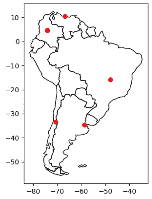
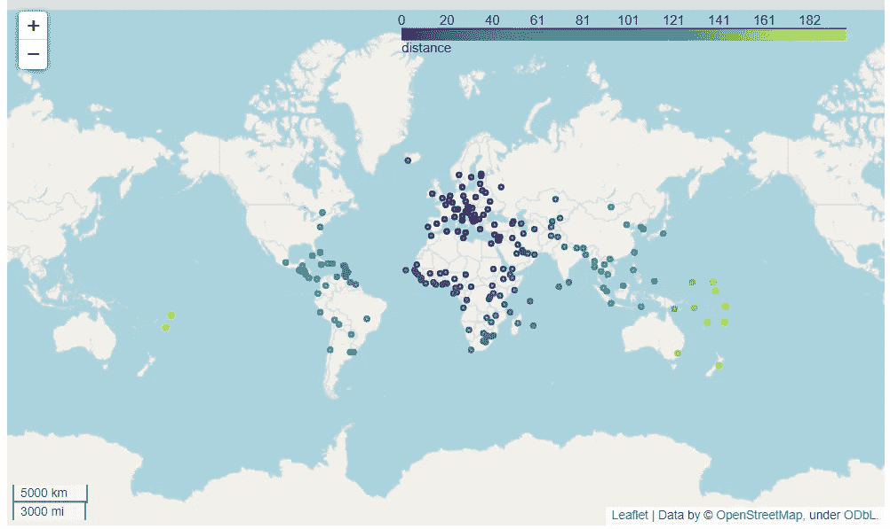

# 关于如何使用 Python 的 GeoPandas 地图库的初学者教程

> 原文：<https://levelup.gitconnected.com/beginners-tutorial-on-how-to-use-python-s-geopandas-map-library-e6fb0db8132>



该示例提供了如何使用 [GeoPandas](https://geopandas.org/en/stable/docs/user_guide.html) 创建`GeoDataFrame`的快速概述，以及如何将数据可视化为叶子图和 Matplotlib 图。

首先，进入[mecsimcalc.com/create](https://mecsimcalc.com/create)，点击地图，然后选择测绘地理空间数据。

# 第一步:输入[和](https://docs.mecsimcalc.com/maps/example-1#step-1-inputs)

对于输入，创建具有以下属性的单个选择:

*   名称:数据集
*   标签:要可视化的数据集
*   选项:
*   自然地球 _ 城市
*   自然地球 _ 洛雷斯
*   nybb

# 步骤 2.1:代码版本 1[](https://docs.mecsimcalc.com/maps/example-1#step-21-code-version-1)

该代码将从 GeoPanda 的数据集中获取数据，对数据执行距离计算，然后在交互式 follow 地图上将其可视化。



# [获取数据](https://docs.mecsimcalc.com/maps/example-1#get-the-data)

首先，获取要可视化的地理空间数据。你可以读入一个文件，创建一个熊猫的`DataFrame`，或者创建一个`GeoDataFrame`。在本例中，我们将使用用户输入`inputs['dataset']`选择一个 GeoPanda，然后将其作为文件读入。

```
path_to_data = geopandas.datasets.get_path(inputs['dataset'])
gdf = geopandas.read_file(path_to_data)
```

# 操纵数据[](https://docs.mecsimcalc.com/maps/example-1#manipulate-the-data)

一旦数据加载完毕，我们就可以使用`[GeoDataFrame](https://geopandas.org/en/stable/docs/reference/api/geopandas.GeoDataFrame.html)`来操作数据。通过将数据作为输入传递给`geopandas.GeoDataFrame(...)`，您可以将数据转换为地理数据框架。

在本例中，我们将创建一个名为`distance`的新列，它将计算数据集中第一个点到所有其他点的距离。

为了获得点的列表，使用 GeoPandas `[.centroid](https://geopandas.org/en/stable/docs/reference/api/geopandas.GeoSeries.centroid.html)`属性设置一个名为`centroid`的新列，使其等于所有几何图形的质心。

```
gdf['centroid'] = gdf.centroid
```

接下来，使用`.iloc[0]`从第 0 行的质心列获得第一个点。请注意，`iloc`是一个熊猫函数，因为`GeoDataFrame`是熊猫函数`DataFrame`的扩展，因此任何熊猫函数也可以在`GeoDataFrame`上使用。

```
first_point = gdf['centroid'].iloc[0]
```

现在我们有了一列质心点和第一个点，我们可以执行计算。GeoPandas 为[地理空间计算](https://geopandas.org/en/stable/docs/reference/geoseries.html)提供了许多功能。我们将使用`[distance()](https://geopandas.org/en/stable/docs/reference/api/geopandas.GeoSeries.distance.html)`函数来计算每个点到`first_point`的距离。

```
gdf['distance'] = geopandas.GeoSeries(gdf['centroid']).distance(first_point)
```

# 导出地图[](https://docs.mecsimcalc.com/maps/example-1#exporting-the-map)

最后，要将`GeoDataFrame`数据导出为交互式的叶子地图，使用`[.explore()](https://geopandas.org/en/stable/docs/reference/api/geopandas.GeoDataFrame.explore.html)`函数并传入`"distance"`作为输入，其中`"distance"`是您想要在地图上“探索”的列的名称。然后使用`._repr_html_()`将叶子地图对象转换成可以在网页上显示的 HTML 字符串。

```
m = gdf.explore("distance", legend=True)
interactive_map = m._repr_html_()
```

# 步骤 2.2:代码版本 2[](https://docs.mecsimcalc.com/maps/example-1#step-22-code-version-2)

这段代码将数据创建为 Panda 的`DataFrame`，将其转换为`GeoDataFrame`，然后将其导出为 Matplotlib 绘图图像。


# [获取数据](https://docs.mecsimcalc.com/maps/example-1#get-the-data-1)

首先，用要在地图上可视化的数据创建一个熊猫的`DataFrame`。

```
df = pd.DataFrame(
    {'City': ['Buenos Aires', 'Brasilia', 'Santiago', 'Bogota', 'Caracas'],
        'Country': ['Argentina', 'Brazil', 'Chile', 'Colombia', 'Venezuela'],
        'Latitude': [-34.58, -15.78, -33.45, 4.60, 10.48],
        'Longitude': [-58.66, -47.91, -70.66, -74.08, -66.86]})
```

通过将`df`转换为`geopandas.GeoDataFrame()`，将`DataFrame`转换为`GeoDataFrame`。然后使用`[geopandas.points_from_xy()](https://geopandas.org/en/stable/docs/reference/api/geopandas.points_from_xy.html)`将纬度和经度列转换成点，并将这些点设置为`geometry`列。

```
gdf = geopandas.GeoDataFrame(
    df, geometry=geopandas.points_from_xy(df.Longitude, df.Latitude)
)
```

或者，您可以为绘图设置背景。在本例中，我们将使用 geopandas 数据集中的南美洲地图作为绘图背景。

```
path_to_data = geopandas.datasets.get_path("naturalearth_lowres")
world = geopandas.read_file(path_to_data)
ax = world[world.continent == 'South America'].plot(color='white', edgecolor='black')
```

# 导出地图[](https://docs.mecsimcalc.com/maps/example-1#exporting-the-map-1)

最后，要将`GeoDataFrame`导出为 Matplotlib 图，使用`[.plot()](https://geopandas.org/en/stable/docs/reference/api/geopandas.GeoDataFrame.plot.html)`函数，然后调用`plt_show()`将 Matplotlib 图转换为可以在网页上显示的图像。

```
m = gdf.plot(ax=ax, color="red")
static_map = plt_show(m.figure)
```

# 第 2.3 步:完整代码[](https://docs.mecsimcalc.com/maps/example-1#step-23-full-code)

```
import geopandas
import pandas as pd
import base64
import io def plt_show(plt, width=500, dpi=100):
    *# Converts matplotlib plt to image data string*
    *#   plt is the matplotlib pyplot or figure*
    *#   width is the width of the graph image in pixels*
    *#   dpi (dots per inch) is the resolution of the image*
    bytes = io.BytesIO()
    plt.savefig(bytes, format='png', dpi=dpi)  *# Save as png image*
    if hasattr(plt, "close"):
        plt.close()
    bytes.seek(0)
    base64_string = "data:image/png;base64," + \
        base64.b64encode(bytes.getvalue()).decode("utf-8")
    return "" def main(inputs):
    *# (i) Use a geopandas dataset*
    path_to_data = geopandas.datasets.get_path(inputs['dataset'])
    gdf = geopandas.read_file(path_to_data)
    *# Manipulate geospatial data*
    gdf['centroid'] = gdf.centroid
    first_point = gdf['centroid'].iloc[0]
    *# Calculate distance to first_point*
    gdf['distance'] = geopandas.GeoSeries(
        gdf['centroid']).distance(first_point)
    mean_of_distance = gdf['distance'].mean()
    *# (a) Export distance column as an interactive map*
    m = gdf.explore("distance", legend=True)
    interactive_map = m._repr_html_() *# (ii) Use a custom pandas dataset*
    df = pd.DataFrame(
        {'City': ['Buenos Aires', 'Brasilia', 'Santiago', 'Bogota', 'Caracas'],
         'Country': ['Argentina', 'Brazil', 'Chile', 'Colombia', 'Venezuela'],
         'Latitude': [-34.58, -15.78, -33.45, 4.60, 10.48],
         'Longitude': [-58.66, -47.91, -70.66, -74.08, -66.86]})
    *# Convert Pandas dataframe to GeoDataFrame*
    gdf = geopandas.GeoDataFrame(
        *# Use points_from_xy to convert to shapely.Point objects*
        df, geometry=geopandas.points_from_xy(df.Longitude, df.Latitude)
    )
    *# Use a map of South America*
    path_to_data = geopandas.datasets.get_path("naturalearth_lowres")
    world = geopandas.read_file(path_to_data)
    ax = world[world.continent == 'South America'].plot(color='white', edgecolor='black')
    *# (b) Export as a static image*
    m = gdf.plot(ax=ax, color="red")
    static_map = plt_show(m.figure) return {"interactive_map": interactive_map, "static_map": static_map, "mean_of_distance": mean_of_distance}
```

# 第三步:输出[](https://docs.mecsimcalc.com/maps/example-1#step-3-output)

对于输出，显示两个地图:`outputs.static_map`和`outputs.interactive_map`:

```
{{ outputs.static_map }}{{ outputs.interactive_map }}
```

*更多教程，请访问* [*这里*](https://docs.mecsimcalc.com/) *。*