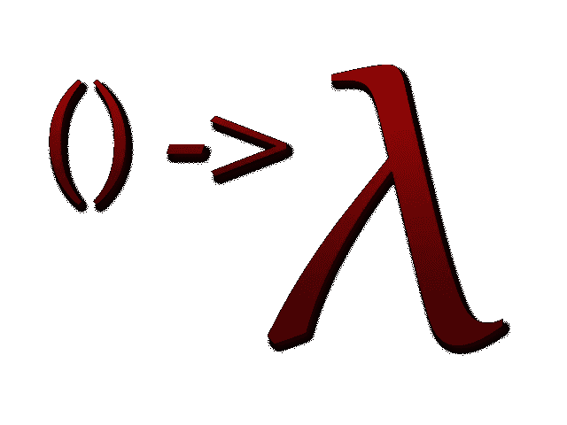
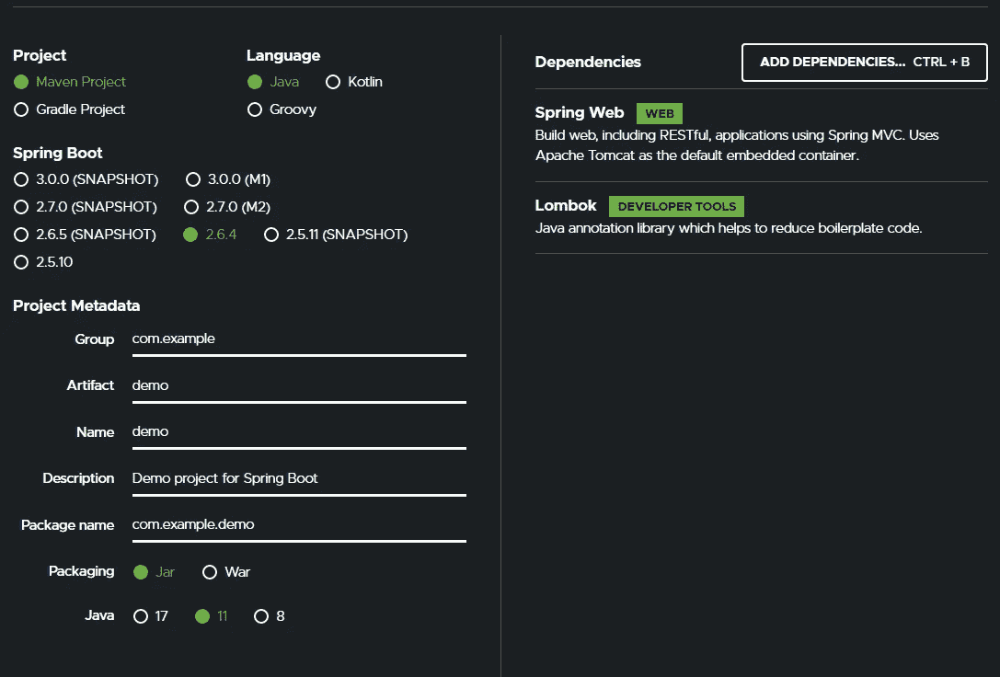

# 用 lambdas、streams 和函数接口实现 Java 和 Spring 中的行为参数化

> 原文：<https://levelup.gitconnected.com/behavior-parameterization-pattern-in-java-with-lambdas-streams-and-functional-interfaces-99ff6eafaba6>

利用 Java 和 Spring 中的函数式编程实现灵活性。

> 代码可以在[这里](https://github.com/pedroluiznogueira/medium-behavior-parameterization)找到
> 
> 我们的目标

在这篇文章中，我们将讨论如何基于一些业务规则，使用 Java 中的函数式编程，通过 lambdas、streams 和函数接口，实现 ***行为参数化*** ，来实现编码的灵活性。

> 定义

***行为参数化*** 是一种让你处理频繁需求变更的模式，这是一个非常常见的问题，项目的需求发生了变化。

基本上，我们将把一段代码作为一个参数传递给一个方法，如果你用不同的实现来传递它，这可以提供灵活性。

> 实施

这里的想法是发展一个特定的已实现的业务逻辑，以便它可以更灵活地适应不断变化的需求。我们将从“最差”的方法开始，并尝试改进它。

> 商业规则

想象一下，我们有一个糖果厂，生产各种各样的糖果。在我们的领域，我们将只与蛋糕和巧克力合作。

我们的客户要求的功能之一是**过滤某种类型的巧克力。**

好吧，如果一周后他决定我们需要**也根据重量过滤巧克力**呢？然后下周他要求我们用完全不同的逻辑过滤任何种类的糖果。你明白了。

有几种方法可以处理这个问题，但是我们要看看如何使用 ***行为参数化来处理它。***

> 该项目

我们将使用最简单的 spring api，因此我们可以运行一些单元测试来证明一切都按预期运行。

1.  在 [start.spring.io](https://start.spring.io/) 上生成

> 领域

**糖果**

**巧克力**

**蛋糕**

> 要求

“从给定的巧克力列表中过滤所有的苦巧克力”。

# 第一种方法:为每个需求创建一个方法

**巧克力服务**

让我们创建一个单元测试来检查它是否有效。

因此，正如预期的那样，我们能够将 **mockedChocos** 列表过滤为只包含苦巧克力的列表。

问题很明显，如果现在我们需要过滤所有的黑巧克力呢？一个解决方案是为它创建另一个方法，并且你知道它在哪里结束…

# 第二种方法:参数化类型

**巧克力服务**

它工作了。现在我们可以灵活地传递不同类型的巧克力，它们将被动态地用来过滤列表。

但是，如果现在客户希望我们也根据重量来过滤巧克力呢？

# 第三种方法:按任意属性过滤

我们可以创建另一个参数化的方法，现在根据巧克力的重量进行过滤。

我们甚至可以创建一个方法来处理这两者。

它工作得很好，完成了工作，但是现在我们必须创建另一个方法来处理更改，并且我们通过使用**filterChocolatesByAnyAttribute()**方法造成了整个混乱。

每当我们编写类似的代码时，都是思考抽象的好时机。

# 第四种方法:抽象过滤

来自 Stream API 的 filter 方法接收一个谓词<t>作为参数，这意味着无论传递给它什么 lambda 表达式，都必须遵循谓词<t>函数接口拥有的单一抽象方法。</t></t>

*函数接口是具有单一抽象方法的接口。*

我们可以创建一个实现谓词<t>并使用单一抽象方法的类。</t>

这种方法提供了什么灵活性？现在我们可以传递不同的谓词实现类，例如，WhiteChocolateFilter <t>，但是我们仍然会在每次需求改变时创建类。</t>

# 第五种方法:使用匿名类过滤

我们也可以使用匿名类

但是这是一个非常冗长的方法。

# 第六种方法:用 lambdas 直接过滤传递函数接口实现

这样，定义我们将要使用的过滤类型的将是 lambda 表达式本身，仅在调用方法时传递。

它提供了巨大的灵活性，所以如果需求改变，我们不需要创建类，创建其他方法。

# 第七种方法:实现行为参数化提供的灵活性

我们将创建一个 **CandyService** ，它将处理任何类型的蜡烛过滤，而不需要知道它是什么类型的蜡烛。

**CandyService**

当我们调用时， **filter()** 方法将只知道它必须使用哪种类型的糖果。

这里，使用 lambdas 我们可以指定不同的过滤逻辑，而不必编写锅炉板代码，并重用每个糖果都可以使用的过滤方法。

这篇文章到此为止，如果它在某些方面帮助了你，请为它鼓掌。

你可以在这里找到该项目的 github repo [。如果你喜欢，可以考虑在 github 上主演。](https://github.com/pedroluiznogueira/medium-behavior-parameterization)

也可以在 github 上随意投稿或提出建议。