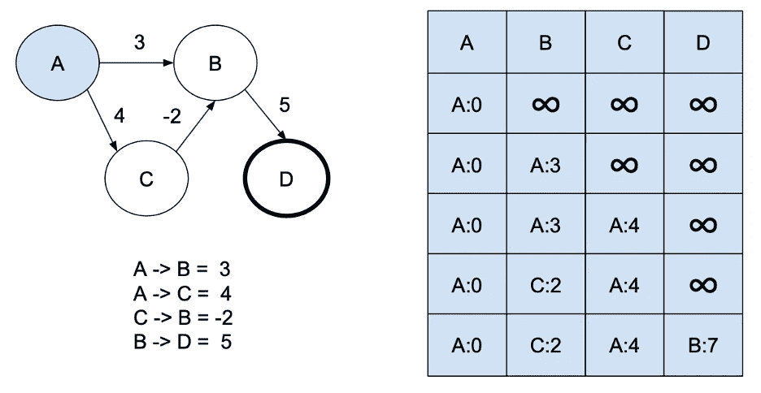

# 行李员–福特

> 原文：<https://levelup.gitconnected.com/bellman-ford-6bd907c6c4c0>

## 贝尔曼-福特算法类似于 Dijkstra 它有助于找到连接到源节点的所有顶点的最短路径。

**它的工作原理是跟踪最短路径**中从原点到前一个节点的权重距离，在边/连接上循环 n 次(n 是节点/顶点的数量)，并更新到目的地的最快路径。与 Dijkstra 相反，它可以处理负权重，甚至检测负圆圈，但速度较慢(效率较低)。

为了使它更简单，让我们定义两个简单的数据结构，首先描述一个加权连接和前面的路径。

加权连接包含源索引、目标索引和权重。

加权前一路径跟踪前一顶点/节点索引和从源到当前节点的总权重。

**我们来深究一下算法**；代码如下:

这个函数需要接收:源节点的索引、图中的节点数和所有连接。

首先，我们创建包含结果的数组；默认情况下，我们将总权重初始化为 Int.maximum(从纯数学的角度来说，我们应该使用 Infinity，但是没有 Int。swift 中的无穷大)没有先前的。我们将源节点本身设置为 previous，总权重为 0(从源节点到源节点的开销为 0)。

现在，我们将对所有连接进行 n 次迭代(其中 n 是节点数)。

然后对于每个连接，如果连接源总权重加上这个连接权重小于实际目的地总权重，我们就替换它。

我们使用 hasUpdatedWeights 标志进行一些优化；如果在所有连接的一次迭代中没有权重变化，这意味着不会再有了，那么我们可以停止外部循环。

对于最后一次运行循环(当索引等于 nodesCount — 1 时)，应该不会再有变化；如果有，这意味着我们正处于一个消极的循环中。

**Bellman-Ford 算法比 Dijkstra 算法更直接，对负数也有效，但这是有代价的，因为我们对 n(节点数)迭代所有连接 c，时间复杂度为 O(c*n)**

以下是如何使用它的示例:

[< < Dijkstra](https://medium.com/@jbstevenard/dijkstra-62356e584680) | [本书](https://medium.com/@jbstevenard/learn-data-structures-and-algorithms-with-swift-5-6-d9f36a4027dd) | [钻头操纵> >](https://medium.com/@jbstevenard/bit-manipulation-2bb98208832e)

 [## 通过我的推荐链接加入 Medium—JB stevenard

### 阅读 jb stevenard 的每一个故事(以及媒体上成千上万的其他作家)。你的会员费直接支持 jb…

medium.com](https://medium.com/@jbstevenard/membership)