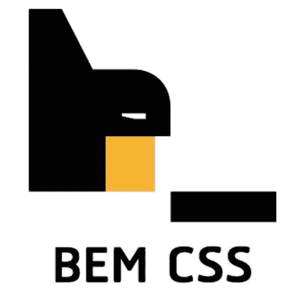

# 反应中的边界元 CSS

> 原文：<https://levelup.gitconnected.com/bem-css-in-react-e0d4a4721872>

在这篇文章中，我打算回答两个问题:

1.  BEM 是什么？
2.  BEM 应该如何应用于 React 组件的设计？

BEM 是 Block Element Modifier 的缩写。它不是一个框架或库。这只是一个更大的 CSS 架构难题的一小部分。具体来说，BEM 是一个严格的 CSS 选择器命名约定，为组件组合提供了一个有价值的心智模型。请允许我解释…

> *BEM 中的术语*元素*不应与* HTML 元素*混淆。HTML 元素是 HTML 标签在 HTML 文档中的实际应用。比如一个表示为 HTML 元素的* `*input*` *标签就是* `*<input />*` *。HTML 元素支持属性，例如* `*class*` *属性(例如* `*<input class="fancy-input" />*` *)，我们将在 BEM 的研究中大量使用这些属性。*

今天构建用户界面时，我们经常使用基于组件的 JavaScript 库，如 React、Vue、Svelte 等。不同的库和框架对样式有不同的看法。无论好坏，React 基本上没有意见。在我知道 React 是什么之前，我用 BEM 创建了组件库。几年过去了，我已经深入 React 世界，仍然发现 BEM 是我构建可伸缩、可预测 CSS 的首选。

# 边界元块

b 代表街区。块是独立的组件，可能会也可能不会在整个场地中重复使用。在 React 上下文中，BEM *块*通常映射到单个 React 表示组件。它们可以是很大的实体组件，比如充满醒目图片、标题、行动号召和导航菜单的页面英雄。块也采用简单组件的形式，如按钮、链接或标题元素。边界元块可以并且通常*应该*包含其他边界元块。如果我们已经定义了块组件`Button`、`Navigation`和`Heading`，那么我们的`Hero`块很可能包含这样的组件。

设置块样式时，块应该包含该组件所需的所有基本样式。一个块的变体，称为修饰符，将拥有修改基本块样式的 CSS 规则(我们将在后面更多地讨论)。

我们的`Button`组件可能看起来像这样:

我更喜欢将块选择器命名为与组件相同的名称。在这种情况下，`Button`映射到`.button`类名。有些人喜欢大写这个街区的名字(`.Button`)。就我个人而言，我使用 kebab case 作为我的 CSS 类名，但是你可以随意使用😁。

# 边界元修改器

暂时跳过 BEM 元素，我想解释一下 BEM 修改器。修饰符正是那个——*修饰符*。它们旨在修改基类(通常是块)。修饰符应该只包含修改基类所必需的样式。修饰符使用双破折号`--`来分隔修饰符名称和它们所修改的基类名称:

带修改器的 BEM 按钮

在上面的代码片段中，我们引入了 3 个新的修饰符:outline、primary 和 outline-primary。这些修饰符是为了说明的目的，但是它们强调了我想提出的关于修饰符的两个要点:

1.  修饰符应该在它们所修饰的东西之后声明。这是必要的，因为`.button`及其所有修饰符的 CSS 特异性是相同的。但是，因为修饰符出现在基类之后，所以修饰符的规则优先于基类中定义的冲突规则。
2.  修改者必须只包括他们需要修改的特定规则。例如，大纲修改器只有 3 条规则:`background-color`、`border-color`和`color`。不包括任何关于`font-size`、`font-weight`等的内容。这些留给基类`.button`来定义。这意味着当对 HTML 元素应用修饰符时，也必须包括基类。

如何以及如何不应用边界元修改器

# 另一种不明智的方法

看了上面的例子，你可能会发现多余的 BEM 块命名空间很笨拙，并想知道为什么你不这样做:

当应用于 HTML 时，它将更改为以下内容:

从好的方面来说，这种方法意味着编写更少的代码，并且我们通过耦合选择器有效地命名了基类的修饰符(例如`.button.outline`)。我不推荐这种方法的原因在于我对 CSS 架构的一个更大但相关的信念: **CSS 选择器应该尽可能不具体。**

`.button.outline {...}`例子的问题是我们将选择器的特异性加倍了。如果我后来想进一步修改特定用例的`color`、`background-color`或`border-color`，这会产生问题。为了让我的新风格发挥作用，我的新选择器必须至少和`.button.outline`一样具体。

在这种情况下，`.flashy-button`边框颜色将立即被更具体的`.button.outline`选择器取代。为了解决这个问题，我们需要引入任意数量的技巧，比如将类名(`.flashy-button.flashy-button {...}`)对折，或者在类名上添加一个`!important`。我们可以通过对修饰符使用单个类名来保持 CSS 特异性图相对平坦，从而避免这个问题。

# 应用修改器进行反应

我是`classnames`图书馆的忠实粉丝。这是一种有条件地将类名应用于 React 元素的有用方法。让我们为我们的`Button`组件添加对 3 个修饰符的支持:

`classnames`库可以接受任意数量的字符串或对象作为参数。字符串参数连接到`classNames`函数返回的结果字符串。对象用于有条件地应用类名。对象的键代表你可能想要添加的类名。对应的值是计算结果为 true 或 false 的表达式。如果表达式评估为真，存储在对象的键中的类名将应用于`classNames`返回的结果字符串。如果我们要用以下道具来呈现我们的`Button`组件:

`classNames`函数将返回`'button button--outline-primary'`。

# 边界元

根据我的经验，边界元是边界元方程中最容易被误解的部分。BEM 元素用一个`__`(双下划线)表示。结构如下。`.<block-name>__<child-name>`。BEM 元素由其父块命名。边界元块和边界元单元之间的紧密关系是很重要的。然而，只有在包装 BEM 块的上下文中样式化 HTML 元素*才有意义时，才应该使用 BEM 元素。为了说明这一点，我将使用一个更复杂的 BEM 块示例:一个英雄。我们的 React 组件可能如下所示:*

在这种情况下，BEM 块是 *hero* 并且恰当命名的`hero`类名被正确地应用于顶层元素:T1。但是我应该如何设计子元素的样式呢:`h1`、`p`和`Button`？我是否应该立即创建一个`.hero__title`、`.hero__message`和`.hero__button`？也许吧。但不一定。

让我们从`h1`和`p`开始。不管这些 BEM 讨论，明智的做法是为标题、段落等常见元素提供一些基线元素样式。作为一个例子，我会把这个*放在我的任何组件样式的*之前。

在 hero 块的上下文中，如果应用于这些元素的基线样式是好的，那么您可以让它们保持原样。对于我们的定制`Button`组件也是如此。如果它看起来像你想要的那样，那么它将被赋予自己的 BEM 块类名`.button`，我们就可以收工了。

然而，我经常看到开发人员做的是立即跳转到将所有块祖先元素样式化为 BEM 元素。所以他们会这样做:

在最坏的情况下，开发人员可能会完全忽略我们可重用的`Button`并为`.hero__button`创建一组全新的样式，这些样式复制了块`.button`中的许多样式。这挫败了可重用组件的意义，所以*不要这样做。*

因此，如果一切看起来都很好，不需要进一步的样式，我们可以不创建任何 BEM 元素样式，让我们的英雄块保持原样。然而，如果我们需要调整一些特定于我们的 hero 用例的东西，那么是时候引入 BEM 元素了:

有趣的是，`Button`同时作为边界元*模块* ( `.button`)和边界元*元素* ( `.hero__cta`)。那完全没问题！就我而言，这是 CSS 的最佳组合🤓

我们的`Button`组件有一个小问题。组件`Hero`正试图将一个定制的`className`道具传递给我们的`Button`。如果我们使用`Button`的现有实现，`Button`将忽略这个道具。让我们来解决这个问题:

我们必须从`props`对象中析构`className`属性，然后将它添加到`classNames()`的参数中。如果一个值被传递给`className`属性，它将被适当地应用到产生的`classes`变量。如果省略，`classNames`函数将从结果中省略`undefined`值。

# 关于 CSS 特异性的一个注记

如果你回头看看我们引入了一些 BEM 元素样式的 hero 示例，你会注意到 BEM 元素`hero__cta`被应用到了`Button`元素。我们知道，在幕后，`Button`会将`button`和`hero__cta`类名应用于呈现的`<button />`。`.button`和`.hero__cta`具有相同水平的特异性。我们的意图是应用于`Button`的边框颜色是`.hero__cta`中指定的颜色，而不是`.button`中定义的基线值。我们如何确保这一切发生？

这就是你的捆扎机发挥作用的地方。请注意我们在 Hero.js 模块中加载`./Button`和`./Hero.css`依赖项的顺序:

`./Hero.css`是继之后进口*的 T21。这很重要。当您的 bundler(例如 Webpack)构建最终的包(JavaScript 和 CSS)时，它会密切关注依赖项的创作顺序。因为`./Button`是在`./Hero.css`之前导入的，所以 Webpack(大概还有其他捆绑器)会先进入 Button.js *再进入*，甚至不会对`./Hero.css`有任何影响。由于 Button.js 导入了`./Button.css`，Button.css 将包含在生成的 css 包*中，在*hero . CSS 的内容之前。这就是为什么我总是建议你**在你的模块**中加载你的组件的 CSS 依赖作为最终的依赖。*

# 最后

现在有很多方法来创作 CSS。有许多 CSS-in-JS 选项、CSS 模块，还有更多“传统的”选项，就像我在本文中提到的。在我看来，CSS-in-JS 在基于数据(道具)的样式高度动态的情况下大放异彩。但是在你需要一些简单的变化和一个合理的方法来建模和扩展你的站点/应用的 CSS 的情况下，BEM 已经被证明是一个极好的可扩展模型。

最后说明:我也是 CSS 模块的忠实粉丝。在以后的文章中，我将讨论如何将 BEM 方法应用于 CSS 模块。