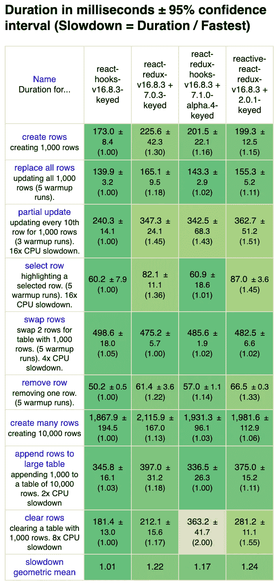
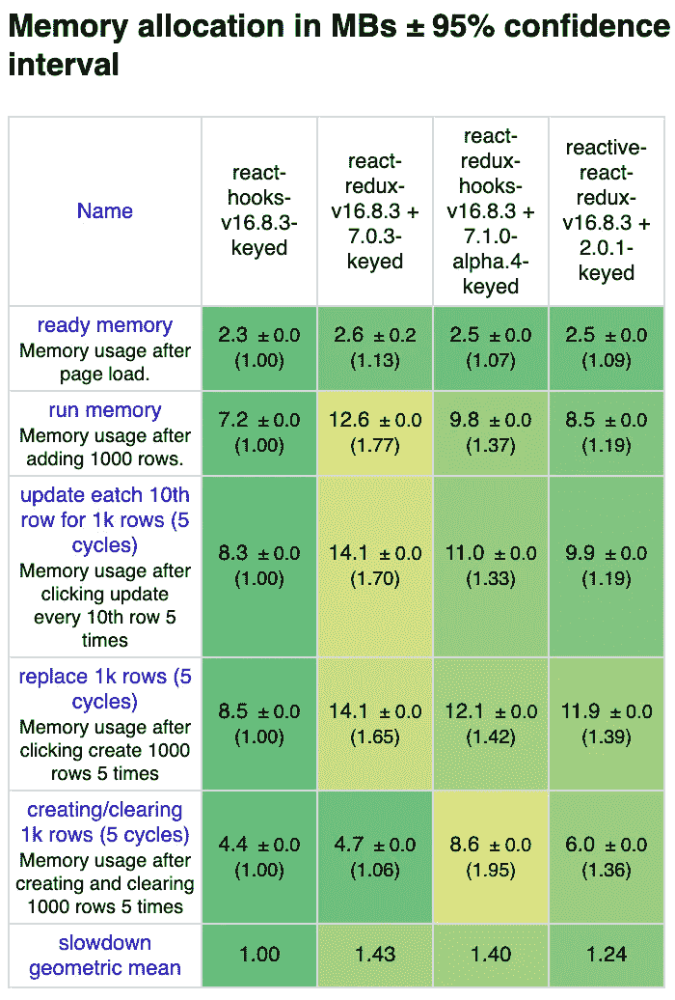

# 用备选方案对 React Redux 中 alpha 发布的 hooks API 进行基准测试

> 原文：<https://levelup.gitconnected.com/benchmark-alpha-released-hooks-api-in-react-redux-with-alternatives-25bef8b840ae>

## 与反应-反应-还原进行比较

## 介绍

最近 React Redux 发布了 hooks API。截至本文撰写时，它是 v 7 . 1 . 0-α4。

[](https://github.com/reduxjs/react-redux/releases/tag/v7.1.0-alpha.4) [## reduxjs/react-redux

### Redux 的官方反应绑定。通过在 GitHub 上创建一个帐户，为 reduxjs/react-redux 开发做贡献。

github.com](https://github.com/reduxjs/react-redux/releases/tag/v7.1.0-alpha.4) 

另一方面，我一直在开发一个新的 React Redux 绑定库，带有钩子和代理。

[](https://github.com/dai-shi/reactive-react-redux) [## 代时/反应-反应-还原

### 用 React 钩子和代理绑定 React Redux。通过创造一个新的环境，为 dai-shi/reactive-react-redux 的发展做出贡献

github.com](https://github.com/dai-shi/reactive-react-redux) 

是时候对它们进行基准测试，以便更好地了解性能。reactive-react-redux 库利用代理来自动检测状态使用情况，因此它在技术上具有会影响性能的开销。我们想知道在一个现实的例子中它会受到多大的影响。

作为基准测试工具，使用了 [js-framework-benchmark](https://github.com/krausest/js-framework-benchmark) 。为了进行比较，还包括了裸`react-hooks`实现和基于连接的`react-redux`实现。

## 基准测试结果

以下是四个实现的结果。详细信息请参考[工具文档](https://github.com/krausest/js-framework-benchmark#readme)。



`react-hooks`的结果基本上是最好的(有一些例外)，因为它的实现是基本的，没有 Redux。`react-redux-hooks`的结果相当不错，有时甚至比`react-redux`的结果还要好。`reactive-react-redux`的结果基本上还可以，值得注意的是它在内存分配方面相对较好。

## 代码一览

让我们快速地看一下代码。以下来自`react-redux-hooks`基准代码。

```
const Row = React.memo(({ i }) => {
  const selector = useCallback((state) => {
    const item = state.data[i];
    return state.selected === item.id ? { id: item.id, label: item.label, selected: true } : item;
  }, [i]);
  const { selected, id, label } = useSelector(selector);
  const dispatch = useDispatch();
  const onSelect = useCallback(() => {
    dispatch(select(id));
  }, [dispatch, id]);
  const onRemove = useCallback(() => {
    dispatch(remove(id));
  }, [dispatch, id]);
  return (
    <tr className={selected ? "danger" : ""}>
      <td className="col-md-1">{id}</td>
      <td className="col-md-4"><a onClick={onSelect}>{label}</a></td>
      <td className="col-md-1"><a onClick={onRemove}>{GlyphIcon}</a></td>
      <td className="col-md-6"></td>
    </tr>
  );
});

const InnerRowList = React.memo(({ data }) => {
  return data.map((item, i) => <Row key={item.id} i={i} />);
});

const RowList = () => {
  const data = useSelector(state => state.data);
  return <InnerRowList data={data} />;
};
```

你可能会发现它用了几次`React.memo`，就是不用`connect`优化。

下面的基准代码是针对`reactive-react-redux`的。

```
const Row = React.memo(({ item, selected }) => {
  const { id, label } = item;
  const dispatch = useReduxDispatch();
  const onSelect = useCallback(() => {
    dispatch(select(id));
  }, [dispatch, id]);
  const onRemove = useCallback(() => {
    dispatch(remove(id));
  }, [dispatch, id]);
  return (
    <tr className={selected ? "danger" : ""}>
      <td className="col-md-1">{id}</td>
      <td className="col-md-4"><a onClick={onSelect}>{label}</a></td>
      <td className="col-md-1"><a onClick={onRemove}>{GlyphIcon}</a></td>
      <td className="col-md-6"></td>
    </tr>
  );
});

const InnerRowList = React.memo(({ data, selectedId }) => {
  return data.map((item, i) => <Row key={item.id} item={item} selected={selectedId === item.id} />);
});

const RowList = () => {
  const state = useReduxState();
  const data = state.data;
  const selectedId = state.selected;
  return <InnerRowList data={data} selectedId={selectedId} />;
};
```

由于 reactive-react-redux 中的`useReduxState`不采用选择器的性质，代码结构略有不同。它向`Row`组件传递一个`item`对象和一个`selected`标志，而不是一个`i`索引。该代码风格类似于`react-hooks`基准代码。

具体基准代码参见[回购](https://github.com/dai-shi/js-framework-benchmark/tree/9627d3ca6f0637727c31ea6cf04c82e3115bb88b)。

## 到目前为止的结论

对于这个基准测试，React Redux 中的 alpha hooks API 已经是高性能的了。对于从`connect`开始的转换，`useSelector`挂钩是直接的。

`reactive-react-redux`的结果显示了类似的表现。对于非密集型用例，代理的开销应该是可以容忍的。编码风格和`react-redux`不同，所以应该看不出是 react-redux 的替代，而是一种新的编码风格，有 react 钩子和 redux。因为它类似于 bare `react-hooks`基准代码，所以它可能更直观，也更适合刚刚学习 Redux 的人。