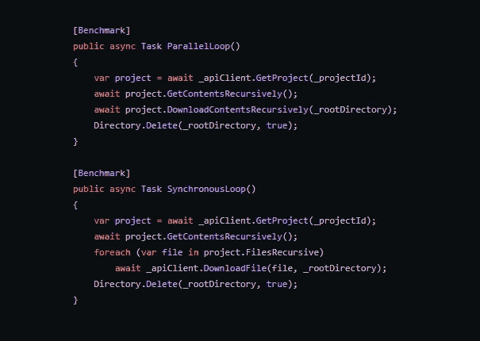

# 基准:如何使用 C#并行？ForEachAsync 将批量文件下载速度提高了 3 倍

> 原文：<https://levelup.gitconnected.com/benchmark-how-to-use-c-parallel-foreachasync-for-3x-faster-bulk-file-downloading-time-5c847297688f>



最近我在做一个[项目，通过](https://github.com/stewartcelani/autodesk-construction-cloud-backup)[Autodesk BIM 360/建筑云 API](https://forge.autodesk.com/developer/documentation) 备份文件。

我最初的原型花了 12 个小时备份了大约 100 GB(11，737 个文件夹中的 40，230 个文件)，这并不好。由于向客户添加数据的速度很快，在 1 到 2 年内，备份将需要 24 小时以上。

在程序重写(包括将文件下载逻辑从同步 foreach 循环移到并行循环)之后。对于 ForEachAsync 循环，我能够将夜间备份时间缩短到 3 小时。

我想量化一下 4 倍的性能提升有多少是由于重写与并行。ForEachAsync loop 在令人敬畏的 Benchmark.NET[进行了两次基准测试。](https://benchmarkdotnet.org/)

第一个是包含 300 MB(30 个文件夹中的 136 个文件)的小项目:

```
BenchmarkDotNet=v0.13.1, OS=Windows 10.0.19044.1645 (21H2)
Intel Core i7-5820K CPU 3.30GHz (Broadwell), 1 CPU, 12 logical and 6 physical cores
.NET SDK=6.0.202
[Host]     : .NET 6.0.4 (6.0.422.16404), X64 RyuJIT
Job-KSORIT : .NET 6.0.4 (6.0.422.16404), X64 RyuJIT

IterationCount=3 LaunchCount=1 WarmupCount=1

|          Method |    Mean |   Error | StdDev |
|---------------- |--------:|--------:|-------:|
|    ParallelLoop | 123.2 s | 61.06 s | 3.35 s |
| SynchronousLoop | 299.8 s | 74.74 s | 4.10 s |
```

第二个是一个包含 26gb(973 个文件夹中的 10，653 个文件)的大型项目:

```
BenchmarkDotNet=v0.13.1, OS=Windows 10.0.19044.1706 (21H2)
Intel Core i7-5820K CPU 3.30GHz (Broadwell), 1 CPU, 12 logical and 6 physical cores
.NET SDK=6.0.202
[Host]     : .NET 6.0.4 (6.0.422.16404), X64 RyuJIT
Job-QIVIZX : .NET 6.0.4 (6.0.422.16404), X64 RyuJIT

IterationCount=3  LaunchCount=1  RunStrategy=Monitoring  
WarmupCount=0

|          Method |     Mean |    Error |   StdDev |
|---------------- |---------:|---------:|---------:|
|    ParallelLoop |  98.83 m |  12.97 m |  0.711 m |
| SynchronousLoop | 300.62 m | 368.38 m | 20.192 m |
```

所以平行的改进。ForEachAsync 大概是 3 倍。

我很想运行更多的 benchmark 2 迭代来减少错误和 stddev，但是运行了一天，结果与 benchmark 1 和 100 GB 备份的每夜真实性能相匹配。

请注意，在上面的基准测试中，26 GB 备份需要 100 分钟，这比每天晚上备份的速度要慢得多。

实际基准跑步者:

第 49 行的 SynchronousLoop 任务完成了您所期望的任务，foreach 循环遍历 IEnumerable 文件，并将每个文件传递给 DownloadFile 方法:

第 20–22 行包含实际的文件下载

文件下载逻辑封装在一个 [Polly](https://github.com/App-vNext/Polly) AsyncRetryPolicy 中，基本上只有 3 行(20–22)。

SynchronousLoop 和 ParallelLoop 都使用上述方法下载文件。

基准测试的第 44 行上的 ParallelLoop 的“DownloadContentsRecursively”调用使用了下面结合了 Parallel 的方法。ForEachAsync:

配置。默认情况下，MaxDegreeOfParallelism = 8

正如您在第 14 行看到的，与同步循环调用的是同一个 DownloadFile 方法。

当情况需要时，C#开发团队真的使得将并行性结合到我们的应用程序中变得非常简单。

希望你觉得有用！