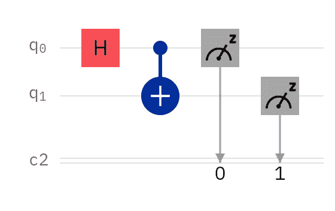
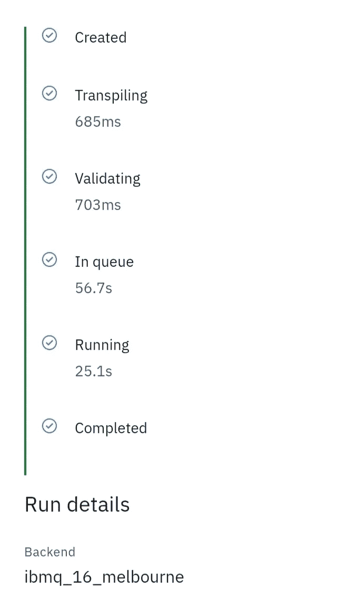
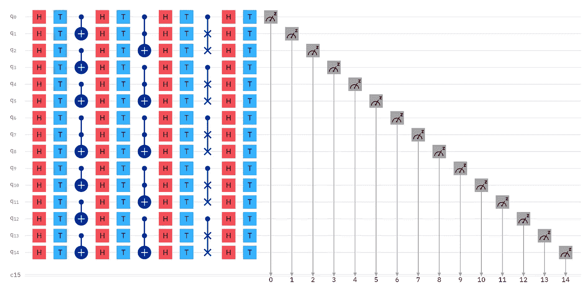
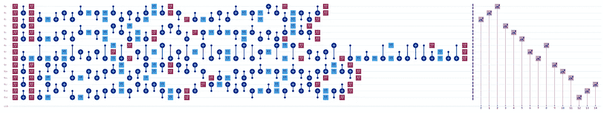
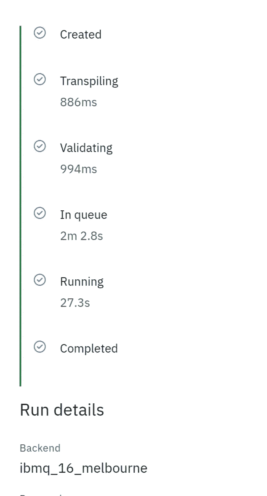
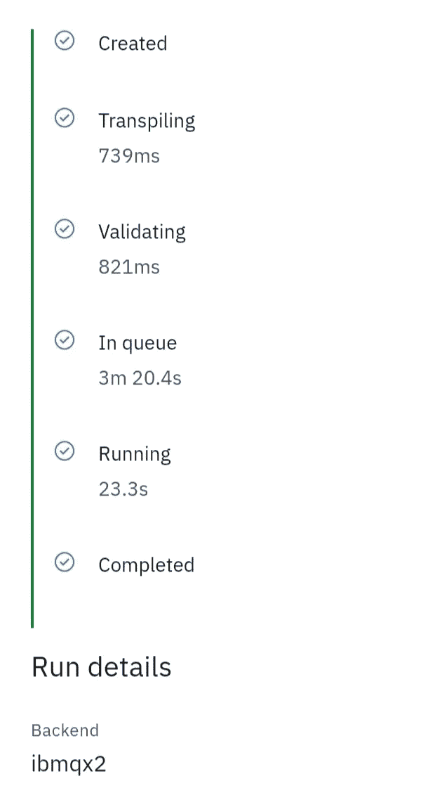
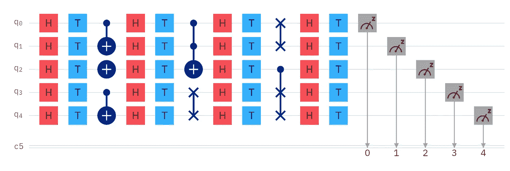
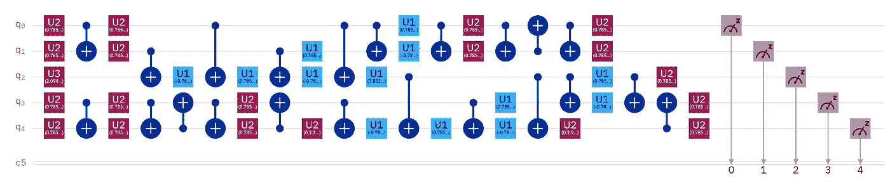
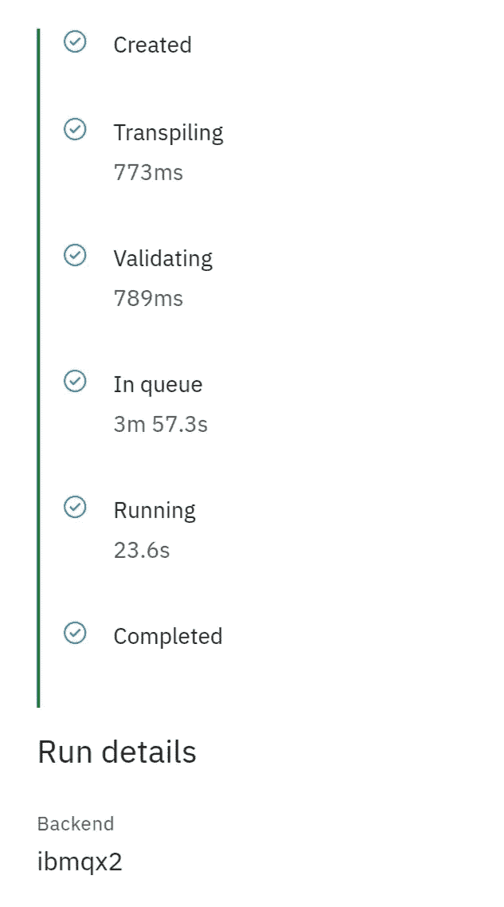

# 基准量子优势

> 原文：<https://levelup.gitconnected.com/benchmarking-quantum-advantage-90e02fb75612>

作者在 [IBM Q 体验](https://quantum-computing.ibm.com/)中生成的图像。

# 不用数学就能知道什么时候使用量子处理器是值得的。

这一发现是在一些关于我的“ [130，780 点量子分类](https://link.medium.com/6NlSXhLFI9)、“[经典数据的超密集编码](https://link.medium.com/qhSSSX2iA9)、“[量子 MNIST](https://link.medium.com/NMcL8tmjT9) ”文章以及是否可以使用[交换测试](https://link.medium.com/gB2LMWVjT9)实现量子优势的活跃 Twitter 帖子之后出现的。对话引用了一些理论和一些数学证明，所以我决定运行一些实际的电路，目的是估计量子处理单元(QPU)在有问题的电路中的运行时间。

## 介绍

使用 qpu 的主要原因，除了执行超级计算机范围之外的计算，就是比经典设备和算法更快地执行计算。

> 量子优势是证明量子设备可以解决问题…比经典计算机更快

来源:[维基百科](https://en.m.wikipedia.org/wiki/Quantum_supremacy)

我已经阅读了为这一定义增加规定的论点，例如算法需要某些组件才能被称为“量子”，但在本文中，我将采用维基百科对“量子优势”的简单定义。

## 你好，量子世界！

其中最简单的量子实验是“你好，量子世界！”实验。这个领域的大多数新手都把它作为他们的第一个量子电路。

作者在 [IBM Q 体验](https://quantum-computing.ibm.com/)中生成的图像。

出于运行时间估算的目的，我打算让这个电路为我提供运行任何电路的最小运行时间。

作者在 [IBM Q Experience](https://quantum-computing.ibm.com/) 中生成的图像。

上面的重要数字是 25.1 秒。对于这样一条浅的线路来说，这似乎太慢了。

不知道什么影响运行时间，我添加了一些东西:量子位、单量子位门、多量子位门和电路深度。我打算修改电路，然后重新运行它，直到我可以确定任何缓慢的来源。

作者在 [IBM Q Experience](https://quantum-computing.ibm.com/) 中生成的图像。

声明:这不是一个实际的算法。我只是在电路中添加了量子位和门，看看运行时间会减慢多少。

作者在 [IBM Q 体验](https://quantum-computing.ibm.com/)中生成的图像。

这是传输后的相同电路。重要的是，这个电路远比“你好，量子世界！”电路。

作者在 [IBM Q 体验](https://quantum-computing.ibm.com/)中生成的图像。

令人惊讶的是，运行时间仅从 25.1 秒减慢到 27.3 秒。这里没有显示，我运行了相当多的 15 量子位电路，运行时间都在这个范围内。

因此，下一个逻辑测试是尝试不同的设备。我只有 5 量子比特的设备。

作者在 [IBM Q 体验](https://quantum-computing.ibm.com/)中生成的图像。

我以同样的“你好，量子世界！”电路。

作者在 [IBM Q Experience](https://quantum-computing.ibm.com/) 中生成的图像。

尽管运行相同的电路，5 量子位设备的运行时间仅 23.3 秒，略快于 15 量子位设备的 25.1 秒。

作者在 [IBM Q Experience](https://quantum-computing.ibm.com/) 中生成的图像。

接下来，我添加了随机复杂度。

作者在 [IBM Q Experience](https://quantum-computing.ibm.com/) 中生成的图像。

这是传输后的电路。同样，关键的一点是，这条线路明显比“你好，量子世界”更宽更深电路。

作者在 [IBM Q 体验](https://quantum-computing.ibm.com/)中生成的图像。

这一次，运行时间只从 23.3 秒慢到了 23.6 秒。同样，如果你创建多个随机电路，你会发现所有的运行时间都在同一范围内。

## 结论

至少在 IBM Q 的经验中，在 QPU 上运行任何随机电路都会给出您想要在其上运行的任何电路的近似运行时间。这意味着你可以很容易地确定量子算法是否会比经典算法更快:只需运行经典算法！

尽管今天的量子位不具备容错能力，但只要你的经典算法比 QPUs 基准运行时慢，你就能获得量子优势。做这个决定不需要数学。

## 量子优势

这个结论让我想到了谷歌的“量子至上”实验。我不知道答案，但我想知道 Sycamore 的 53 个量子位的运行时间是否总是在 200 秒的范围内。如果是这样的话，看看我运行的 ibmq_16_melbourne 和 ibmqx2 实验，超导 QPU 运行时间似乎完全由可用量子位的数量和正在使用的量子位的数量决定，或者至少是压倒性的。这也表明，电路深度——目前由于退相干而成为量子计算的祸根——可能有一天会成为福音，因为它允许额外的计算和复杂性，而不会明显影响运行时间。

## 未来的工作

研究的下一个逻辑过程是确定经典算法，用这种简单的技术证明量子优势是可能的。幸运的是，我已经有了一些想法。

## 致谢。

一如既往地感谢 [IBM Q Experience](https://quantum-computing.ibm.com/) 对真实量子处理器的免费云访问。也要感谢[量子直觉](https://www.youtube.com/channel/UC-2knDbf4kzT3uzWo7iTJyw) ( [@explore_quantum](https://twitter.com/explore_quantum?s=09) )带来这一发现的辩论。