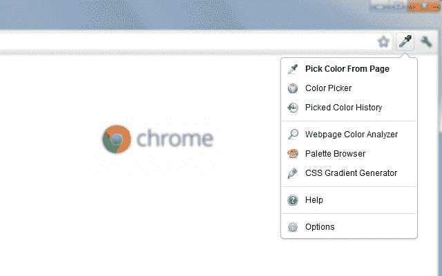
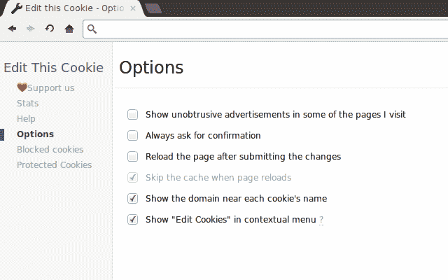
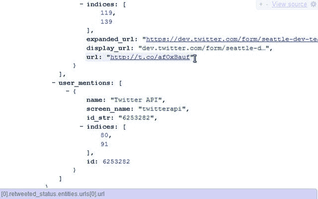
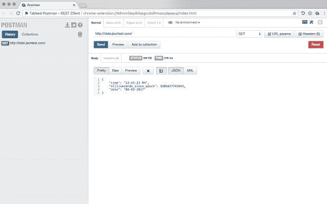
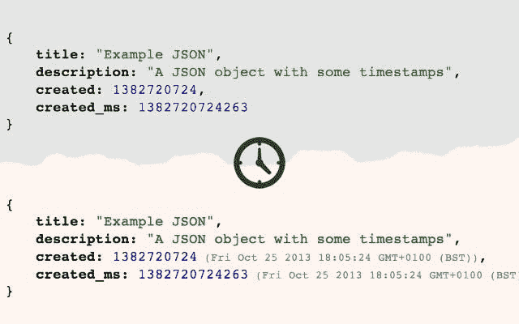
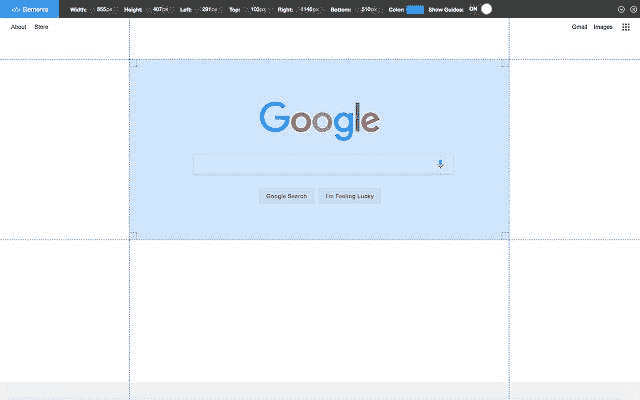
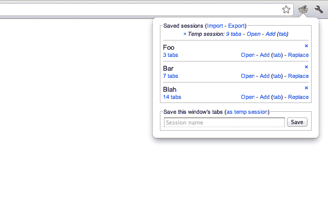
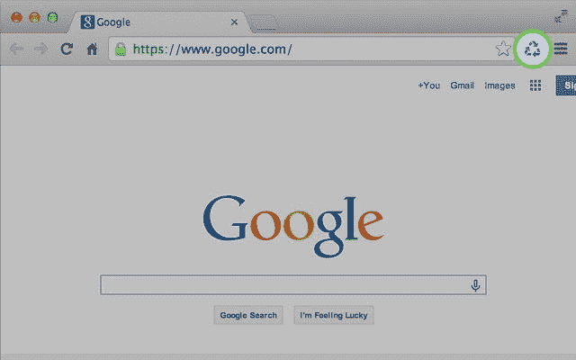

# 从这份 Chrome 扩展列表中获益

> 原文：<https://levelup.gitconnected.com/benefit-from-this-list-of-chrome-extensions-4a541257ac75>

谢尔盖·佐尔金在 [Unsplash](https://unsplash.com?utm_source=medium&utm_medium=referral) 上拍摄的照片

## 通过简单地安装正确的扩展，提高您作为 web 开发人员的工作效率

作为一名开发人员，您希望尽可能轻松地生活。合适的工具有助于实现这一目标。这就是为什么仔细挑选这些工具非常重要。

由于大多数网络开发者都将 Chrome 作为他们的首选浏览器，你有能力让它符合你的喜好。一种方法是安装正确的扩展。为了让您的生活尽可能轻松，您可以添加任意多的内容。

您正在使用的扩展会对您的生产力和工作方式产生很大的影响。这就是为什么我们要查看 Chrome 扩展列表的原因。

> 即使是最简单的工具也能让人们做大事——商业力量

*注意，所有这些扩展都可以在* [*Chrome 网上商店*](https://chrome.google.com/webstore/category/extensions) *上免费获得。*

# 1.色彩奇拉

[来源](https://chrome.google.com/webstore/detail/colorzilla/bhlhnicpbhignbdhedgjhgdocnmhomnp)

拥有超过两百万用户的 ColorZilla 无疑是一个非常受欢迎的扩展。这个扩展有一些非常丰富多彩的特性。它有一个先进的和易于使用的滴管。这个简单的滴管可以让你立刻从任何网页上选择任何颜色。

最重要的是，这个扩展还带有一个颜色选择器和一个渐变生成器，在现代 web 开发中非常方便。

# 2.编辑此 Cookie

[来源](https://chrome.google.com/webstore/detail/editthiscookie/fngmhnnpilhplaeedifhccceomclgfbg)

这个扩展是一个 cookie 管理器，允许您添加、编辑、删除、搜索、保护和阻止 cookie。有超过两百万的用户编辑这个 Cookie，如果你想管理你的 Cookie，这是一个不错的选择。

这个扩展让您可以完全控制 cookies 的管理。在任何网站上识别和读取 cookies 都非常容易。它有一个很棒的编辑器，非常简洁明了。绝对是您希望包含在工具集中的一个扩展。

# 3.JSONView

[来源](https://chrome.google.com/webstore/detail/jsonview/chklaanhfefbnpoihckbnefhakgolnmc)

如果没有 JSONView 这样的扩展，web 开发人员会怎么样呢？这个扩展允许您在浏览器中理解 JSON。这个扩展消除了将一些 JSON 文件或字符串复制粘贴到 IDE 中的必要。相反，这个扩展允许您直接在浏览器中查看 JSON。

JSON 通过颜色突出显示，可读性很强。此外，您还可以折叠和展开特定的对象。

# 4.邮递员

[来源](https://chrome.google.com/webstore/detail/tabbed-postman-rest-clien/coohjcphdfgbiolnekdpbcijmhambjff)

谁没听说过邮递员？Postman 是使发送 HTTP 请求变得非常容易的扩展。这个扩展经常与测试 API 结合使用。它能够发送各种不同的请求，从简单的 GET 请求到 DELETE 请求。它还可以发送通常受 Chrome 限制但对测试 API 至关重要的头。

你知道还有一种选项卡式邮递员分机吗？

这是一个传统的 Postman 扩展，可以在 Chrome 标签中运行。这个扩展可以让你在浏览器中利用 Postman 的所有优点。

# 5.及时的

[来源](https://chrome.google.com/webstore/detail/timely/phpkahchjodmhmckibejeafoflafljma)

timedia 是一个扩展，它将 Unix epoch 时间戳转换为人类可读的时间。这在很多不同的情况下都会有帮助。就个人而言，我发现当您使用 phpMyAdmin 或 Adminer 时，这个扩展非常有用。如果您已经在数据库中存储了一些 Unix 时间戳，那么这个扩展是一种解脱。它使所有的时间戳在一次点击中可读。现在你的数据更有意义了！

# 6.站点蜘蛛

你是否厌倦了那些扼杀你 SEO 的死链接？你在寻找死链接方面有困难吗？没有网站蜘蛛。这个扩展能够抓取一个网站并生成一个链接列表。只是一只普通的蜘蛛，有时候可能对你有用。

只有 6000 多一点的用户，它不是最受欢迎的扩展，但这并没有降低它的实用性。

# 7.页面标尺

[来源](https://chrome.google.com/webstore/detail/page-ruler/emliamioobfffbgcfdchabfibonehkme)

页面标尺扩展使其能够绘制标尺来获取像素尺寸和位置，并测量任何网页上的元素。此外，它还显示正在测量的元素的宽度、高度和位置。

这个扩展被将近 400，000 人使用，在设计用户界面时非常方便。

# 8.会话管理器

[来源](https://chrome.google.com/webstore/detail/session-manager/mghenlmbmjcpehccoangkdpagbcbkdpc)

会话管理器是一个简单而强大的扩展，它可以快速方便地保存、更新、删除和恢复标签集。

当测试需要多个用户登录的应用程序时，这个扩展非常方便。对于您需要登录的每个用户，您需要启动一个全新的会话。这样你就不用利用隐姓埋名的模式了。

## 9.清除缓存

[来源](https://chrome.google.com/webstore/detail/clear-cache/cppjkneekbjaeellbfkmgnhonkkjfpdn)

清除缓存扩展允许您从工具栏中清除缓存。它的工作没有任何弹出窗口或确认对话框，这使得它没有摩擦。它可以根据您想要清除的数据量进行定制。您可以通过该扩展清除的数据包括应用缓存、下载、文件系统、表单数据、历史记录、本地存储、密码等等。

拥有近 800，000 名用户，这个扩展是您必须拥有的工具。它使清除缓存时间变得高效而轻松。