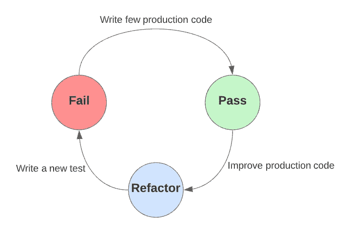
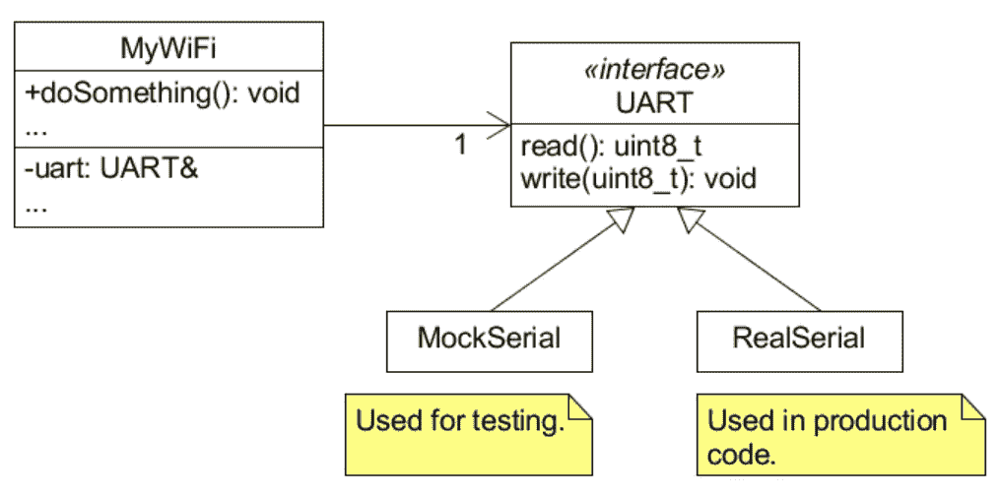
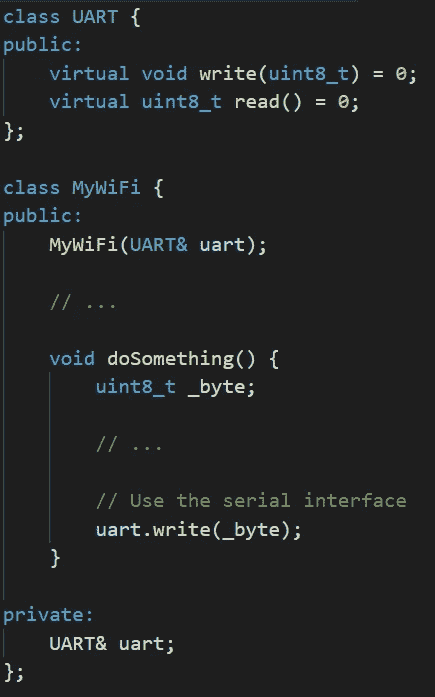
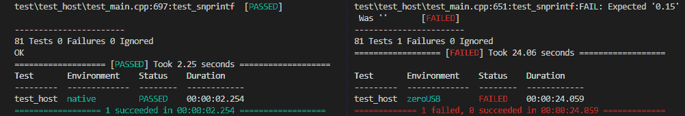

# 嵌入式 TDD 的优势

> 原文：<https://levelup.gitconnected.com/benefits-of-embedded-tdd-74c345c75a46>

## 作为微控制器程序员睡得更香。

在过去的几年里，我看到人们对软件测试和验证越来越感兴趣:运行良好的代码不仅仅是获得报酬和不被解雇的问题。对我来说，随着软件复杂性的增加，这也意味着感觉不那么焦虑，平静地跟上步伐。

*然而，另一方面，大量的微控制器开发人员要么相信先进的测试技术，如测试驱动开发，并不十分适合裸机代码，要么相信收益并不超过努力。嗯，我认为他们可能错过了一个提高代码质量的好机会，也错过了压力较小的工作时间。*

## 今天我将讲述在您的日常嵌入式项目中采用测试驱动开发(TDD)的四个基本原因！

***免责声明:*** *以下讨论是我在生产、学术和业余爱好背景下的学习和经历的结果。尽管随着时间的推移，我肯定已经被我读过的书以某种方式(积极地)“污染”了，但我在这里谈论的是基于我的实验，以及我通常如何在微控制器环境中接近 TDD。我希望它对你也有用🙂*

好了，我们继续吧！

# 1.硬件独立性

L et 说我们想为嵌入式系统实现一个 WiFi 通信库，并希望从 TDD 中受益。我们如何测试一个类的网络通信？

为了清楚起见，还假设通过串行端口向调制解调器发送命令来收发数据(是的，我说的是 Hayes/AT 命令😉).因此，在更抽象的层次上，我们的网络软件类主要是关于向/从串行端口发送/接收字符。

嗯，我们当然可以编写硬件相关的单元测试，以便通过*实际的*串行端口向*实际的*调制解调器发送命令，但是我能想到至少一个不这么做的好理由。例如，*物理*串口由于某种原因停止工作怎么办？毕竟，我们是在测试网络类，而负责串行通信的模块应该可以正常工作。

## 单元测试是关于软件的。是的，我们当然可以试驾一个硬件驱动程序，但绝对不是像硬件一样的东西。TDD 允许开发人员提前考虑代码的依赖性，并以这样一种方式设计它们，即软件模块可以以一种隔离的方式进行验证。

我们现在有机会回顾我们的例子。我们可以让它依赖于一个*接口，而不是将真实世界的串行对象传递给我们的 WiFi 类。*让我们看看下面的类图来了解一下。

可测试 MyWiFi 类的 UML 图

在这里，我们的 WiFi 类只依赖于 UART *“契约”。* MockSerial 是一个纯软件类，仅用于*模拟*真实串行驱动程序的行为，而 real serial 将在你的应用程序代码中使用(即与单元测试无关的一切)。

理解提到的 UART 方法根本不包含*代码是很重要的:*它们将由子类*实现。对于那些熟悉 C++的人来说，这里是 UML 图的翻译。*

# 2.更快的反馈循环

T DD 基本上包括*非常快速的*三个连续步骤的迭代，每个步骤都用一种颜色来表示:红色、绿色、蓝色。在红色阶段，针对*尚不存在的*产品代码编写了一个新的单元测试，它代表了我们希望在系统中出现的一个特性。为了走向绿色，我们必须实现所需的功能/模块，以便测试套件编译和运行时没有任何错误。最后，在蓝色阶段，重构产品代码以删除重复和不必要的耦合。

将此过程应用于“本地”应用程序(即在足够强大的机器上运行的任何东西)导致*快速*红色/绿色/蓝色循环。然而，在嵌入式系统上这样做从逻辑上讲会减少迭代次数，因为嵌入式目标的编译和上传过程通常比桌面环境慢。

## 因此，应该通过引入一个中间步骤，即在开发机器上运行测试，来调整 TDD 周期以尽可能快地工作。

由于 TDD 迫使我们尽可能独立于目标硬件编写代码，测试套件实际上可以由您的笔记本电脑/PC 执行，从而更快地朝着修复错误和实现功能的方向前进。

## 请注意，我们也将在我们的目标硬件上运行测试，只是频率要低一些。

此外，这种混合方法提供了发现不同编译器和架构之间实现差异的好处。更清楚地说，有时我们会写一段在我们的 PC 上运行良好但在目标上失败的代码，反之亦然。举个例子，我曾经面对一个编译器，它没有在 *snprintf()* C 函数内部实现十进制格式。对于那些好奇的人，这里有一个有趣的截图代表这种情况。

运行相同的测试套件:在我的电脑上(左)，在 Arduino Zero 上(右)

# 3.连贯性和边界表达

在传统编程中，我们首先编写我们软件的内部，然后通过它的接口来使用它。然而，有时我们后来意识到使用它的方式是不一致的，不正确的，或者有点麻烦。

另一方面，TDD 专注于在拥有产品代码之前编写测试，因此迫使我们充当自己代码的用户。虽然这可以被看作是一种不自然的开发程序的方式，但它实际上对编写更干净的架构有很大帮助。

此外，单元测试通常是针对单个类进行的。因此，它让您有机会更好地考虑模块的职责:它应该封装多少功能，以及多少方法、参数、返回值等等。

对于嵌入式开发来说更是如此，因为我们通常必须实现与硬件相关的东西，并且要考虑硬件和软件的责任。

## TDD 无疑有助于定义提供给你的东西和你必须实现的东西之间的界限。

# 4.补充调试器

U 唱 TDD，我们小步前进，测试帮助我们不迷路。调试器在确保代码质量方面起着非常重要的作用，尤其是对于嵌入式系统。但是一旦我们关闭了一个调试会话，我们就很不幸地失去了关于我们的代码能做什么的任何可能的知识。

考虑在现有代码中添加新功能:我们不太可能找到证明我们没有破坏任何东西的方法。另一方面，拥有一个测试套件可以确保没有引入任何回归(或者，如果没有，就“建议”做些什么来解决这个问题)。

根据我的经验，我已经成功地在一个类似 Arduino Zero 的板上开发了几个月，甚至没有使用调试器:更不用说这有点痛苦，但如果没有 TDD，这是不可能的。

在任何情况下，通常没有人强迫我们在使用 TDD 或购买调试器之间做出选择:它们应该明确地放在我们的嵌入式开发工具集中！

# 包扎

总而言之，嵌入式 TDD 允许我们:

1.  尽可能独立于底层硬件编写代码
2.  利用 PC 运行测试的速度更快，还可以将其用作兼容性检查
3.  通过允许我们在编写产品代码之前充当用户，开发更干净的架构
4.  减少和补充硬件调试器的使用

好了，今天就到这里吧！
感谢你读到这里。有任何问题，请联系我🍻。
下次见！