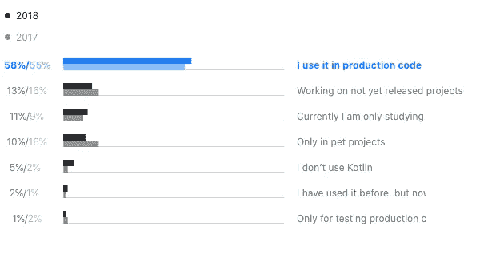
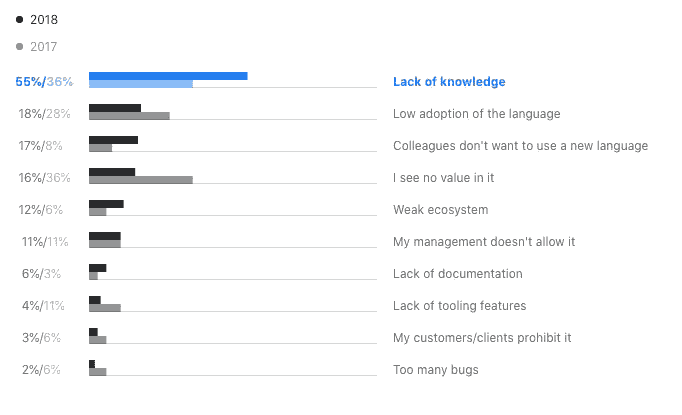

# Kotlin 优于 Java 的优势:后端和 Android

> 原文：<https://levelup.gitconnected.com/benefits-of-kotlin-over-java-backend-and-android-1aa61eaad337>

## 自从我转移到科特林，我从来没有回头！


标识是从[这里](https://www.iconfinder.com/icons/4373217)和[这里](https://uxwing.com/kotlin-programming-language-icon/)

# 在开始之前

我使用 Kotlin 已经有一段时间了，我相信它有适合开发者的特性。我将分享在 Spring Boot 后台和安卓系统上运行良好的功能。但在深入讨论之前，让我们先从基础开始。

## 科特林是什么？

Kotlin 是一种通用、开源、静态类型的编程语言，适用于 JVM、浏览器、本机和 Android，结合了面向对象和函数式编程特性。

## 有趣的事实

这个名字来自圣彼得堡附近的科特林岛。安德烈·布雷斯拉夫(Andrey Breslav)提到，团队决定以一个岛屿命名，就像爪哇是以印度尼西亚的爪哇岛命名一样。

## 更多的事实

*   Kotlin 的增长每年都在翻倍，直到 2015 年其使用量首次出现大幅增长。
*   谷歌宣布 Kotlin 正式支持 Android，大量 Android 开发者开始使用 Kotlin。
*   它受到了 [Gradle](https://gradle.org/kotlin/) 构建工具的重视
*   像 Spring 这样的老牌玩家正在[支持 Kotlin](https://spring.io/blog/2017/01/04/introducing-kotlin-support-in-spring-framework-5-0)
*   在 JetBrains 进行的官方研究中，提出了两个问题，以下是研究结果。

## 1.你通常如何使用 Kotlin？



来源:[https://www.jetbrains.com/research/kotlin-census-2018/](https://www.jetbrains.com/research/kotlin-census-2018/#kotlin-usage)

## 2.是什么阻止你在生产中使用 Kotlin？



资料来源:资料来源:[https://www.jetbrains.com/research/kotlin-census-2018/](https://www.jetbrains.com/research/kotlin-census-2018/#kotlin-usage)

显而易见，很多人已经开始在*制作*中使用它。人们不使用它的主要原因是缺乏知识。我希望这篇博文可以帮助降低“*缺乏知识”*的百分比，让人们在生产中更舒适地使用 Kotlin。

# 零安全是一种福气

这是 Kotlin 最好的特点之一。它为开发人员减少了大量开销，并让您编写出安全的代码。Kotlin 的类型系统旨在消除代码中的空引用的危险，也称为[十亿美元错误](https://en.wikipedia.org/wiki/Tony_Hoare#Apologies_and_retractions)。

我们仍然可以有可以是`null`的字段，但是我们必须显式地声明它，如果你没有正确处理它，编译器就会一直抱怨。

NPE(空指针异常)的问题是它在代码库中爬行的能力。当用户实际使用应用程序时，你的应用程序通常会在运行时抛出。

使用安全操作符`?.`，您可以轻松地显式处理这个问题。

```
**Java** 
 if (text != null) { 
   int length = text.length(); 
 } 

**Kotlin** 
 text?.let { 
     val length = text.length 
 } 
 // or simply 
 val length = text?.length
```

为了处理空的情况，你可以使用 Elvis 操作符`?:`

```
val result = nullableVariable**?.**someMethodCall()
                       **?:** fallbackIfNullMethodCall()
```

# 受限层次结构的密封类

当一个值可以拥有有限集合中的一种类型时，密封类是 Kotlin 提供的限制类类型的方法。

```
sealed **class** Operation {
 **class** Add(val value: Int) : Operation()
 **class** Substract(val value: Int) : Operation()
}
```

然后简单地使用 when 表达式来计算每种类型的条件。如果你错过了任何类型，编译器会抱怨。这减少了您编写的代码量

```
fun **execute**(x: Int, op: Operation) = **when** (op) {
    **is** Operation.Add -> x + op.value
    **is** Operation.Substract -> x - op.value
}
```

大多数后端代码库都会有某种 ***分析跟踪*来跟踪你的用户或系统的行为**。使用密封类来创建一组您将触发的*事件*是确保所有事件具有一致格式的好方法。然后，`when`表达式将确保您在编译期间没有错过任何**事件**。

Android 中密封类的另一个好用途是处理 UI 状态。假设您的活动有三种状态— *Loading、Data、NoData* 。您可以创建一个密封的类`UIState`并在活动中处理它们。你可以在这里了解更多关于使用 Android [的密封类。](https://engineering.udacity.com/simplifying-ui-states-with-kotlin-sealed-classes-and-databinding-2128112d0631)

# 不变性是默认设置

在 Kotlin 中，我们应该总是使用`val`来声明一个变量。这创建了一个不可变的变量。在 Java 中，我们必须添加额外的关键字`final`(再次，语法噪音！).如果你的变量必须是可变的，你可以使用`var`。但是用`var`之前要三思。

```
**val** immutableName = "Name"
immutableName = "New name" *// compile error!* **var** mutableName= "Name"
mutableName = "New Name"
```

作为一名开发人员，当你知道你的变量不会被操纵时，除非你这样声明它们，否则你在编写代码时会获得很大的信心。

就像变量引用一样，默认情况下集合是不可变的，数据类也是不可变的。

```
val list = *listOf*(1,2,3,4) 
list.add(1) *//compile error.*
```

你还有可变集合，可以在集合前面声明前缀*可变*。

```
val list = *mutableListOf*(1,2,3,4)
list.add(1)
```

# 属性的后期初始化

修饰符`**lateinit**`允许我们延迟变量的初始化。当依赖项由 *DI(依赖项注入)框架*初始化时非常有用，这发生在运行时。

它对于测试**非常方便，因为大多数类都是被模仿的。就像在 Spring Boot 的情况下，你的依赖是由 Spring 提供的。**

```
@Mock
lateinit var myRepository: MyRepository
```

如果您使用 Dagger，您可能会习惯于编写类似下面这样的代码片段:

```
@Inject
lateinit var myVar: MyObject
```

变量实际上并没有初始化，而是在之后注入的。通过使用`**lateinit**`,我们允许稍后进行初始化。这减少了不必要的空检查的数量。

# 更少的样板文件绝对是一个优势

这是第一个非常支持科特林的论点之一。Kotlin 减少了许多你写的从来不看的代码。它为主要的使用案例设计得非常好。例如，数据类很容易提供 equals、hashCode、toString 和 copy 函数。

```
// Javapublic class Price {
    String amount;
    String currency;

    public Price(String amount, String currency) {
        this.amount = amount;
        this.currency = currency;
    }

    public String getAmount() {
        return amount;
    }

    public void setAmount(String amount) {
        this.amount = amount;
    }

    public String getCurrency() {
        return currency;
    }

    public void setCurrency(String currency) {
        this.currency = currency;
    }
}// Kotlindata class Price(val amount: String, val currency: String)
```

# 需要注意的事情很少

*   我在 Kotlin 中使用 Hibernate 时遇到了一些问题，因为默认情况下所有的类都是`final`。为了避免这种情况，你需要添加一些依赖项和插件。这里是有详细信息的[链接](https://kotlinexpertise.com/hibernate-with-kotlin-spring-boot/)。
*   名字隐藏有时真的会变成一场噩梦，这些只是来自编译器的警告。当你的代码嵌套过多时，它会变得难以阅读。
*   Kotlin 在减少样板代码和使一切简洁方面做得很好，但这有时会导致非常高的信息密度。

# 最后的想法

我用 Kotlin 写的应用程序越多，我对它就越感到舒服。它让我能够用富有表现力的、简短的、可读的代码更有效地编写应用程序，使用它是一种真正的乐趣。

就像任何其他语言一样，当你第一次使用它时，会感到困惑和陌生。但是科特林看起来是最不混乱的，大多数结构都很容易理解和记忆。我做过***Java******围棋*** ，还有一点点 ***Python*** ，但这一款一直是我至今最喜欢的。

我绝对推荐学习它，使用它。

其他有趣的博文！

[](https://towardsdatascience.com/graphql-best-practices-3fda586538c4) [## GraphQL 最佳实践

### 在使用 GraphQL 6 个月之后，我分享了我对创建 graph QL 服务器的良好实践的想法

towardsdatascience.com](https://towardsdatascience.com/graphql-best-practices-3fda586538c4) [](/5-mindsets-of-unsuccessful-developers-5d9bd5e4f700) [## 不成功开发者的 5 种心态

### #3 学习只发生在工作中

levelup.gitconnected.com](/5-mindsets-of-unsuccessful-developers-5d9bd5e4f700) [](/3-habits-that-will-help-you-become-a-top-developer-7f310fa2c3b0) [## 3 个有助于你成为顶级开发者的习惯

### 这将有助于大大减少返工，并增强您的整体理解

levelup.gitconnected.com](/3-habits-that-will-help-you-become-a-top-developer-7f310fa2c3b0) 

链接到流行的 Kotlin 概念。

1.  [科特林标准功能](https://medium.com/@elye.project/mastering-kotlin-standard-functions-run-with-let-also-and-apply-9cd334b0ef84)
2.  `[var](https://medium.com/@0xalihn/kotlin-var-val-lateinit-lazy-get-when-to-use-what-bd50200b0a38)` [，](https://medium.com/@0xalihn/kotlin-var-val-lateinit-lazy-get-when-to-use-what-bd50200b0a38) `[val](https://medium.com/@0xalihn/kotlin-var-val-lateinit-lazy-get-when-to-use-what-bd50200b0a38)` [，](https://medium.com/@0xalihn/kotlin-var-val-lateinit-lazy-get-when-to-use-what-bd50200b0a38) `[lateinit](https://medium.com/@0xalihn/kotlin-var-val-lateinit-lazy-get-when-to-use-what-bd50200b0a38)` [，](https://medium.com/@0xalihn/kotlin-var-val-lateinit-lazy-get-when-to-use-what-bd50200b0a38) `[lazy](https://medium.com/@0xalihn/kotlin-var-val-lateinit-lazy-get-when-to-use-what-bd50200b0a38)`
3.  [安卓密封分类](https://engineering.udacity.com/simplifying-ui-states-with-kotlin-sealed-classes-and-databinding-2128112d0631)
4.  [通过 Hibernate 使用最终类](https://kotlinexpertise.com/hibernate-with-kotlin-spring-boot/)