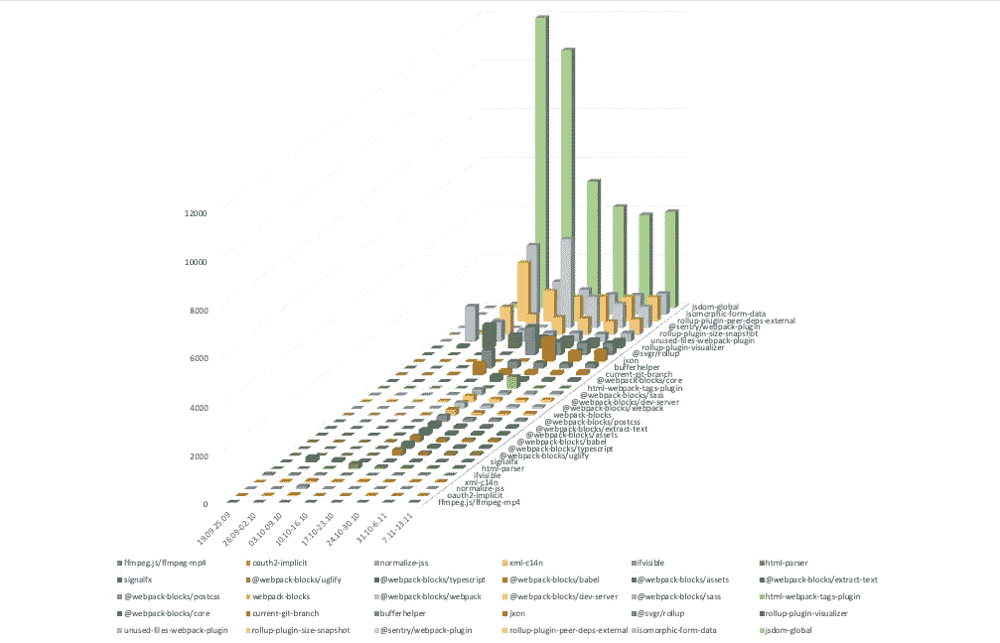
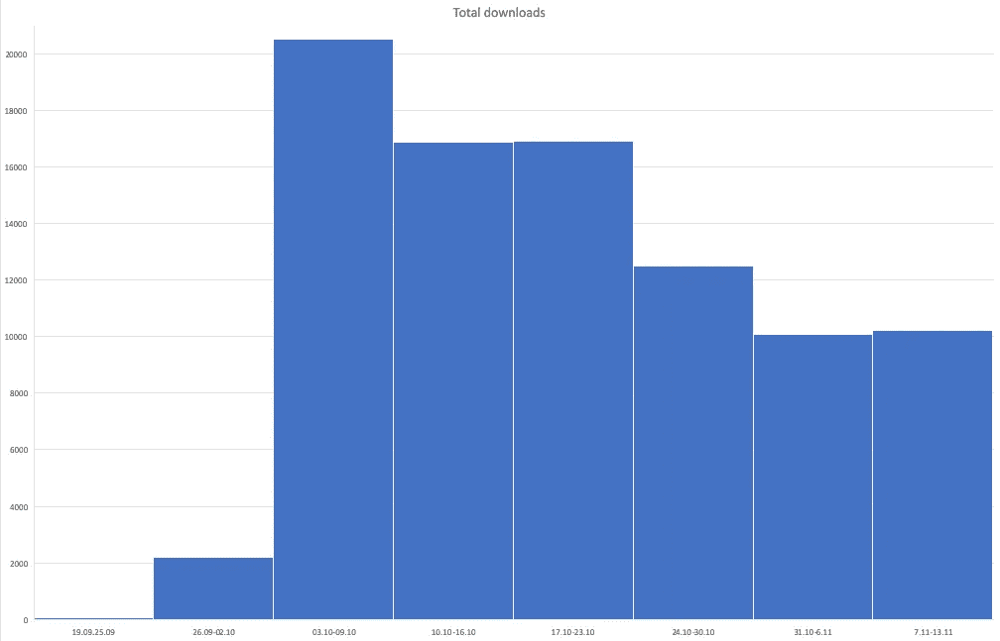

# 将 TypeScript 类型转换为 DefinitelyTyped 的好处

> 原文：<https://levelup.gitconnected.com/benefits-of-transferring-types-to-definitelytyped-20b45141554>

我们的库中有 32 个 JavaScript 库的自定义类型。起初，它是作为对 Webpack 插件包的一个小的拉请求开始的。在意识到这一过程可以在未来节省我们的时间后，我建议我们把打字从我们的存储库中移出来，在 NPM 使用它们。

## 计划的流程如下:

1.  分叉确定类型的 repo，并为每个包创建一个分支。
2.  复制我们的定义，并检查所有东西是否都正常工作。
3.  推送并创建拉取请求。

起初，似乎我们可以在一周内完成这项工作。

## 但是我面临几个困难:

1.  在我们的回购协议中，并不是每一个定义都符合明确的准则。所以我必须首先根据指导方针调整我们的定义。有时我不得不完全重写整个定义。但是最后我得到了 32 个完整描述的定义。
2.  我们没有对我们的定义进行测试。这是对创建到存储库中的每个拉请求的严格要求。所以我必须为他们创建测试。首先，我开始创建测试定义，没有将用例复制到测试中，也没有将用例应用到现有的定义中。这个延长的传输过程:有时，我的定义不符合它的用例。在这之后，我开始复制用例作为测试。结果，它大大缩短了打字的传输时间。
3.  提议的工具(`dts-gen`)并没有在所有场景下都像预期的那样工作。例如，如果您试图为其中一个子包(即 webpack-blocks 库)创建一个定义，它就会崩溃。我发现您仍然可以为整个包创建一个定义，然后将它们分成单独的子包。
4.  DefinitelyTyped 中的默认分步指导提供了一些帮助，但许多主题起初并不清楚。我不得不做一些研究。在这场斗争中，我意识到我的努力不应该白费。所以我决定写下我的指导，并发表在[另一篇文章](/publishing-typings-to-definitelytyped-d4e0777e40f5?source=friends_link&sk=da081c9b7e83a1d380e88c09e6595af9)中。

# 结果

花了 1.5 个月的时间将它们转移到明确类型的回购。在这个过程中，我创建了大约 40 个拉取请求。一些评论者在两周内没有回答，所以我不得不重新创建 pull-request 并再次经历相同的过程。

为了充分了解这个项目的价值，我决定收集下载数据。我记下了我贡献的每个包的下载次数。

该图显示了一段时间内每个包的下载量分布情况。

这个图表显示了每周的下载总量。

一些贡献的定义为社区提供了重要的价值。如果您查看上面的图表，您会看到 jsdom-global 和同构表单数据包生成了一半的下载。当然，像 React 或 Webpack 这样的软件包每周产生 900 万次下载。尽管如此，我认为我的工作帮助一些人更快地完成他们的工作。

## 对公司的价值

我们从评论者和其他贡献者那里得到了重要的反馈。我们提供的一些软件包最近被其他用户更新了。
我们深化和扩展了图书馆的定义。从一开始，我们就没有充分描述我们的定义。但由于严格的规则，我不得不扩大他们。

我们为定义创建了测试用例。它保护我们未来的用例。
它还简化了定义的版本控制。如果我们使用 NPM 包的精确版本，比链接到本地存储库中的文件夹更容易保持事情的清晰。

## 个人价值

在这个项目中，我加深了对类型脚本和包类型的高级主题的了解。

我还想提到自我价值感的上升，你写的代码不仅被你和你的同事使用，而是你参与 Typescript 普及的满足感。