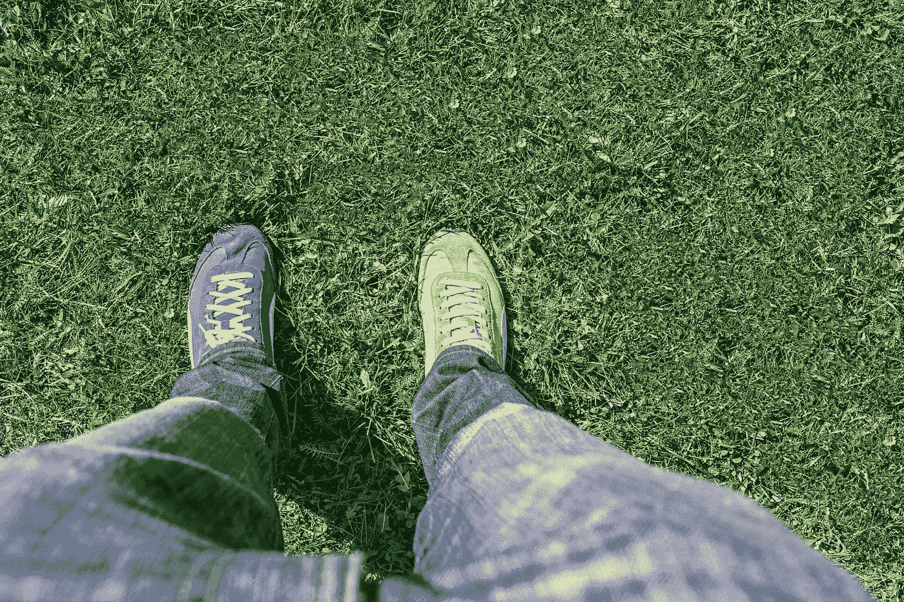

# 谷歌专利与 DeepPatent 和 Patent 简化版

> 原文：<https://levelup.gitconnected.com/bert-for-patents-by-google-vs-deeppatent-and-patentbert-simplified-2ccea99201bd>

除了描述它的方法和用例，我还阐明了它与 PatentBERT 和 DeepPatent 的区别

来自 Pexels 的马克西姆·冈查伦诺克

如果你想在市场上为他人识别竞争专利，你不应该有一个大概的数字。我正在研究一项专利，需要验证它，以便提交我的专利进行审查。在浏览多个网站、资料来源和法律服务时，我遇到了 Google[2]开发的一项功能来帮助完成这些任务。另一个伯特模型。此外，我偶然发现了另外两种方法，DeepPatent 和 PatentBERT。一旦我明白了什么是什么，并为我的任务激活了一个，我就承担起了澄清它们的责任。

# **这都是关于专利的**

专利是知识产权的一种形式，它赋予其所有者在规定的公开期限内禁止他人制造、使用、销售或进口发明的合法权利。因此，存在时间限制——这是一个复杂的领域，涉及时间在实践中与原则上的应用；这里就不赘述了。)进一步说，发明者基本上是带着法律文件离开的，这些文件授予他们制造、使用和销售发明的专有法律权利。作为一种保护形式，专利保护发明不被他人在未经发明人许可的情况下制造、使用或出售。

全球活跃专利和申请超过 2000 万件；每个专利包含大约 10，000 个。

由来自 Pexels 的[卡罗琳娜·格拉博斯卡](https://www.pexels.com/@karolina-grabowska/)

# **模型的基本原理**

首先需要明确两个区别:(1)这是一个由谷歌创建的模型，使用 1 亿多份专利出版物进行训练，这些不仅仅是覆盖美国的专利；(2)这是一个伯特模型。

当谷歌在 2018 年发布 BERT 模型[2]时，研究人员蜂拥至实证结果，以验证其性能指标。意识到它在自然语言处理(NLP)基准测试中的表现优于许多其他领先的先进模型[5](如 GLUE、MultiNLI 和 SQuAD [2])，我们中的许多人首先在无数的 NLP 实现管道中应用了 BERT。

但是，请注意，与 BERT 相比，它的最大输入长度为 512 个令牌。此外，它还增加了 8000 个单词(相对于标准的 BERT 词汇)[3]。

在结果中看到澄清的一种方式是通过查看“上下文”标记指示符，该指示符使用以下标签来分解:(1)摘要；(二)债权；(3)总结；和(4)发明[3]。这种分类表示会使文本与专利信息交叉。

通过像素的[地形图](https://www.pexels.com/@gratisography/)

# **其方法**

在识别关于专利的信息的上下文中的布尔搜索是一种需要使用特定术语的搜索。然后，布尔搜索的挑战变成了如何识别进行搜索所需的内容。搜索专利时会出现困难，因为专利中使用的术语在设计上是显而易见的。

美国专利和贸易办公室(USPTO)提供了大约 9，000 个示例来帮助进行布尔搜索(此处[6]作为示例)，以应用于跨合作专利分类(CPC)代码搜索。

为了告知专利中使用的特定术语，谷歌创建了一个定制的标记器，它就像一本字典，专门用于专利术语，以帮助提高预测任务的准确性。他们确实注意到所看到的改进是. 5% [9]，最终是希望允许更好的解释，尤其是当涉及到“同义词生成”时[9]。

来自 Pexels 的娜塔莉亚·瓦特凯维奇

# **还有 patent Bert——有什么区别？**

这里概述[7]，不要混淆这两者。在 Jieh Hisang 等人的领导下，他们阐述了如何使用不同的训练数据集(与谷歌的专利 BERT 模型无关)应用 BERT-Base 预训练模型(无案例和 1.1 亿个参数[7])的具体研究。

# **现在，还有 DeepPatent？**

另一个用例:DeepPatent 展示了从设计专利中分析和检索技术图纸的任务。有趣的是，PatentBERT 利用 DeepPatent 的 F1 分数作为基准进行基准测试[7]。此外，PatentBERT 通过其 F1 分数证明了他们优于[7] DeepPatent。

来自 Pexels 的 Nataliya Vaitkevich

# **离别的思念**

除了阐述这种新方法的方法论和基本原理，我还简单地阐明了它与 PatentBERT 和 DeepPatent 的区别。如果你对这篇文章的编辑有任何建议，或者对进一步扩展这个主题领域有什么建议，请和我分享你的想法。

这是我的时事通讯；我希望你能考虑订阅:

 [## 产品。风险时事通讯

### 产品和人工智能交汇处的想法。点击阅读产品。投资时事通讯，作者安尼尔…

pventures.substack.com](https://pventures.substack.com) 

**我写了以下帖子(作为 BERT 家族的一员)，你可能会感兴趣:**

 [## SciBERT 胜出:比 BERT 提高了 5 点，简单解释

### SciBERT 与 BERT，及其应用程序、最佳实践，以及它如何超越 BERT。

levelup.gitconnected.com](/scibert-wins-5-improvements-over-bert-simply-explained-a965b71d9a96) 

**和，**

 [## MatSciBERT 如何优于 SciBERT 和 BERT

### 我描述 MatSciBERT，将其与 SciBERT 进行比较，并显示与原始 BERT 模型相比的总体结果

levelup.gitconnected.com](/how-matscibert-is-an-improvement-over-scibert-and-bert-5d39e8c1571b) 

*参考文献:*

*1。安费里科/伯特专利拥抱脸。(未注明)。检索到 2022 年 8 月 11 日，来自*[*https://huggingface.co/anferico/bert-for-patents*](https://huggingface.co/anferico/bert-for-patents)

*2。人工智能如何改善专利分析？(未注明)。谷歌云博客。2022 年 8 月 11 日检索，来自*[*https://cloud . Google . com/blog/products/ai-machine-learning/how-ai-improves-patent-analysis*](https://cloud.google.com/blog/products/ai-machine-learning/how-ai-improves-patent-analysis)

*3。谷歌。(未注明)。专利-公共数据/BERT for patents . MD at master Google/patents-public-data。GitHub。检索于 2022 年 8 月 11 日，来自*[*https://github . com/Google/patents-public-data/blob/master/models/BERT % 20 for % 20 patents . MD*](https://github.com/google/patents-public-data/blob/master/models/BERT%20for%20Patents.md)

*4。谷歌，谷歌在 BigQuery 上的公共数据集专利，(未注明)。*

**=专利-公开-数据。**

**5。Devlin，j .，Chang，m-w，Lee，k .，&# 38；k . toutanova(2018 年 10 月 11 日)。BERT:用于语言理解的深度双向转换器的预训练。ArXiv.Org。*[*https://arxiv.org/abs/1810.04805*](https://arxiv.org/abs/1810.04805)*

**6。CPC 定义。(未注明)。G06F 电气数字数据处理(基于特定 Compu 的计算机系统…2022 年 8 月 11 日检索，来自*[*https://www . USPTO . gov/web/patents/classification/CPC/html/defg 06 f . html*](https://www.uspto.gov/web/patents/classification/cpc/html/defG06F.html)*

**7。李，j-s，&# 38；Hsiang，J. (2019 年 5 月 14 日)。PatentBERT:通过微调预先训练的 BERT 模型进行专利分类。ArXiv.Org。*[*https://arxiv.org/abs/1906.02124*](https://arxiv.org/abs/1906.02124)*

**8。DeepPatent:大规模专利图识别和检索。(未注明)。IEEE Xplore。检索到 2022 年 8 月 11 日，来自*[*【https://ieeexplore.ieee.org/document/9707064】*](https://ieeexplore.ieee.org/document/9707064)*

**9。Yonamine 等人利用专利的 BERT 算法与 TensorFlow 和 BigQuery。*[*https://services . Google . com/FH/files/blogs/Bert _ for _ patents _ white _ paper . pdf*](https://services.google.com/fh/files/blogs/bert_for_patents_white_paper.pdf)*