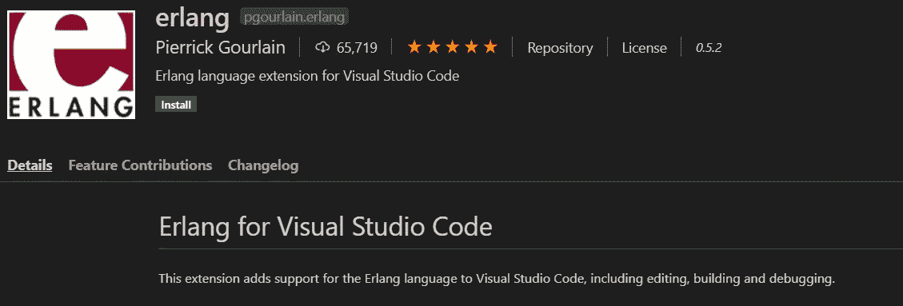

# Erlang 初学者指南

> 原文：<https://levelup.gitconnected.com/best-beginners-guide-to-erlang-3a0e17492e28>

## 设计用来构建永不停机的系统的编程语言！


在 [Unsplash](https://unsplash.com?utm_source=medium&utm_medium=referral) 上由 [Hitesh Choudhary](https://unsplash.com/@hiteshchoudhary?utm_source=medium&utm_medium=referral) 拍摄的照片

你知道为什么 WhatsApp 几乎从不宕机吗？这是因为他们使用 Erlang 作为他们的后端架构。Erlang 是一种编程语言，用于构建要求高可用性的大规模可伸缩实时系统。这对于开发大量用户使用的聊天和电信服务非常有用。它也是一种通用、并发和函数式编程语言，具有垃圾收集运行时系统。除了 WhatsApp，亚马逊网络服务、脸书、T-Mobile 和爱立信都使用 Erlang 提供各种服务。Erlang 的主要优势是并发和分布式编程。但是，Erlang 仍然是开发人员社区中不太流行和不太知名的语言之一。

由于这种不受欢迎的情况，关于学习 Erlang 的合适指南的文章并不多。因此，在本文中，我将指导您理解 Erlang 的基础知识，并使用 Erlang 编写和执行 hello world 程序。让我们开始吧。

Erlang 是一种开源语言。你可以从[这里](https://www.erlang.org/downloads)下载 Erlang/OTP。OTP 是 Open Telecom Platform 的首字母缩写，它包含一组有用的 Erlang 中间件、库和工具。安装后，您可以打开 Erlang shell 并开始编码。现在，让我们回顾一下 Erlang 的基础知识。

# 变量

在 Erlang 中，变量是一个表达式。Erlang 中没有语句，一切都是表达式，它返回值。我们可以声明以**大写字母**或**下划线**开头的变量。如果一个变量被绑定到一个值，返回值就是值本身。Erlang 中的变量是不可变的。因此，一个变量只能赋值一次。让我们看看下面的代码，

```
1> A = 5.
5
2> A = A+10\. % Can't do this!
** exception error: no match of right hand side value 15
```

Erlang 中的每个表达式都必须以点(.).我们可以在 Erlang 中使用百分号(%)添加单行注释。但是二郎没有多行评论。正如您在示例中看到的，由于不变性，第二行将产生一个错误。现在，让我们看看 Erlang 中的一些数据类型。

# 数据类型

## 数字

整数和浮点数是 Erlang 中两种主要的数字数据类型。此外，还有两种特定于 Erlang 的符号`$char`和`base#value`。`$char` 将返回字符`char`的 ASCII 值。`base#value`用来表示基数不是 10 的整数。让我们看下面的例子来理解这一点。

```
1> $A.
65
2> 2#1010.
10
```

## 原子

在 Erlang 中，文字由一种称为 atom 的数据类型表示。如果原子不是以小写字母开头，或者包含字母数字字符、下划线或@以外的字符，则必须用单引号(“”)括起来。下面是 Erlang 中原子的几个例子。

```
'Hello World'
hello
r2d2
```

## 元组

元组是一种复合数据类型，具有固定数量的元素。复合数据类型意味着可以存储任何数据类型的数据值。让我们看看如何在下面的例子中使用元组。

```
1> T = {1,2,abc}. % Tuple T
{1,2,abc}
2> element(3,T).  % returns the 3rd element of the Tuple T
abc
3> tuple_size(T). % returns the size of Tuple T
3
```

元组中元素的编号从 1 开始。像许多其他编程语言一样，Erlang 也有内置函数。这里的`element()`和`tuple_size()`是 Erlang 的内置函数。还可以将元组存储为元组元素。`T = {1,{2,3,4}}`

## 目录

列表是一种复合数据类型，具有可变数量的元素。任何列表都可以表示为`[Head|Tail]`。头是列表中的第一个元素，尾是其余的元素。让我们看一个列表如何工作的例子。

```
1> L1 = [1,{2,3,4},sky]. 
[1,{2,3,4},sky]2> L2 = [head|L1].
[head,1,{2,3,4},sky]3> length(L2).
4
```

Erlang 中还有其他数据类型，如`map`、`boolean`、`Pid`等。但是，我不会在本文中讨论这些数据类型，因为本文关注的是 Erlang 的基础知识。

# 在 IDE 中设置 Erlang

Erlang 也可以作为 Visual Studio 代码中的扩展和流行 ide(如 Eclipse 和 IntelliJ)中的插件安装。所以，在开始用 Erlang 编写函数之前，最好在首选 IDE 中安装 Erlang，并从 shell 切换到 IDE。点击[此处](https://www.jetbrains.com/help/idea/getting-started-with-erlang.html)了解如何在 IntelliJ IDEA 上为 Windows、Linux 或 macOS 设置 Erlang。



作者截图

现在让我们看看如何用 Erlang 编写函数。

# 功能

首先，让我们看看下面这个 Erlang 中的函数的例子。

```
add(X,Y) -> 
   Sum = X+Y.
```

这里可以看到一个函数以函数名(`add`)开头，是一个原子。然后是圆括号内的函数参数`X`和`Y`。在 Erlang 中它们被称为模式。然后是函数体。主体可以有一系列由逗号(，)分隔的表达式，在最后一个表达式的末尾，函数必须以点结束。

# 模块

模块是组合在单个文件中的一系列函数。函数必须总是在模块内部定义。声明模块的语法是`-module(modulename)`。保存 Erlang 文件时，文件名必须与模块名相同，否则代码将不会执行。现在，让我们看看如何用 Erlang 编写 Hello World 程序。

# 二郎的 Hello World

```
-module(helloworld). 
-export([start/0]).start() -> 
   io:fwrite('Hello World!').
```

这里你可以看到一个导出函数。这叫做模块属性。模块属性定义了模块的某个属性，必须放在任何函数声明之前。我们需要声明导出模块属性，以便能够使用模块中的函数。“/0”表示该函数接受 0 个参数。启动功能将在我们运行代码时执行，并将输出“Hello World！”到控制台。这里，`io`是一个模块，它拥有 Erlang 中所有需要的输入和输出函数，`fwrite`是该模块中的一个输出函数。`io`模块中的`format`功能也可用于向控制台输出。Erlang 文件必须使用模块名作为文件名保存，以便成功执行。

要执行这段代码，首先需要编译它。在 IDE 中运行代码后，在 IDE 控制台中键入`c(helloworld).`来编译 Erlang 代码。然后在控制台中输入`helloworld:start().`就可以执行`start()`功能了。

让我们看看 Erlang 中的另一个示例代码。

```
-module(addition). 
-export([add/2,start/0]).add(X,Y) -> 
   Sum = X+Y, 
   io:fwrite("~w~n",[Sum]). 

start() -> 
   add(2,2).
```

这里，我们从 start 函数调用 add 函数。我们需要使用,`~w`(一个 Erlang 控制序列)将整数输出到控制台。`~n`用于打印新的一行。

那么，您已经成功地学会了用 Erlang 编写和执行完整的代码。我希望您已经了解了什么是 Erlang 以及 Erlang 语言的一些基础知识。本文到此为止。

感谢您的阅读和快乐编码！

# 参考

*   [Erlang 用户指南入门](https://erlang.org/doc/getting_started/users_guide.html)