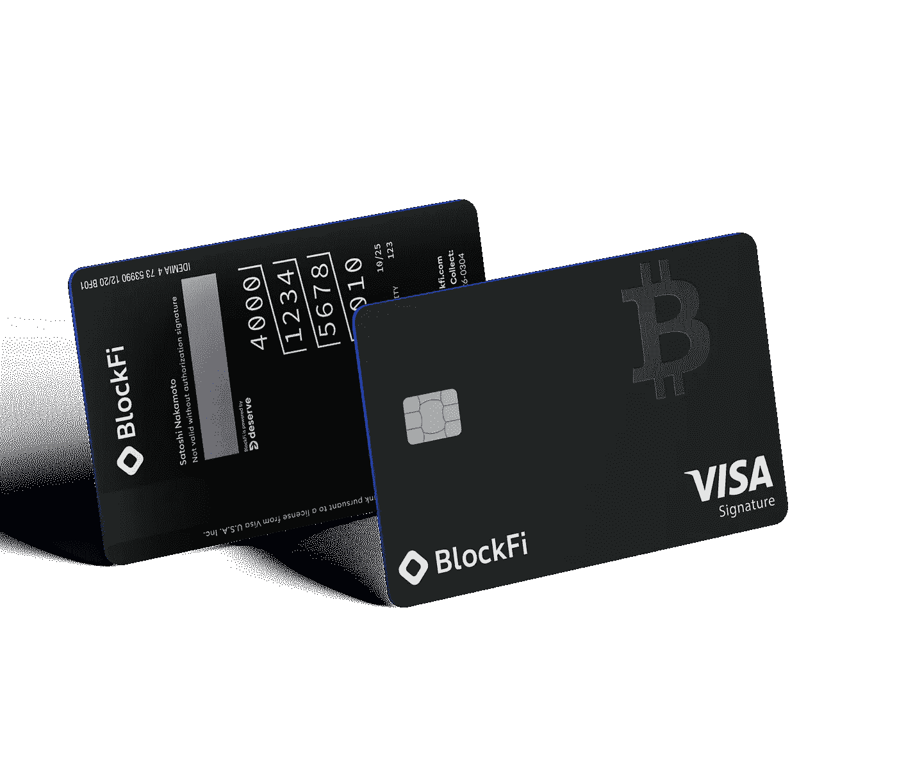
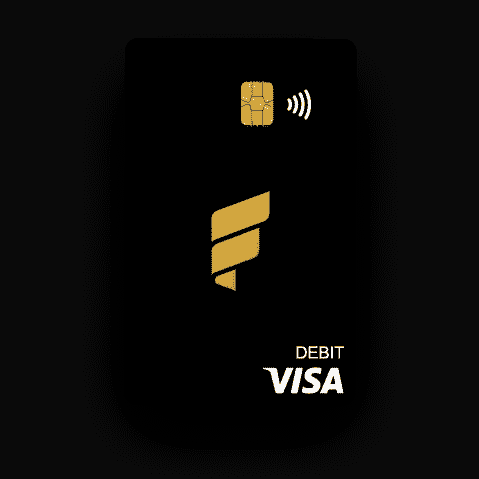
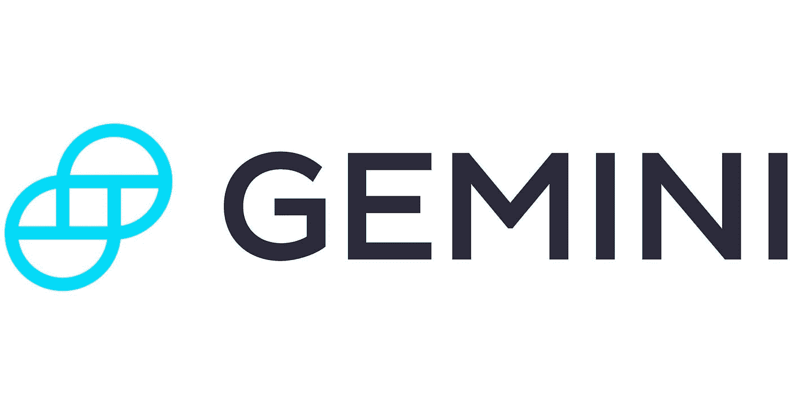
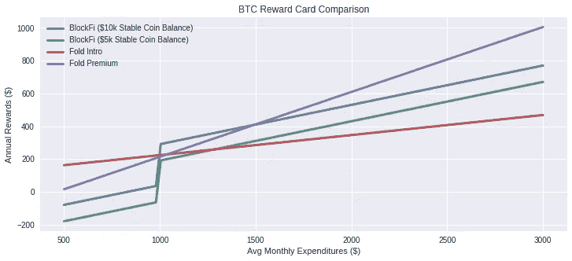

# 最佳比特币奖励卡

> 原文：<https://levelup.gitconnected.com/best-bitcoin-reward-cards-15fe3c610a79>

## BlockFi、Fold 和 Gemini——如何最大化您的 sat 堆栈？

随着世界各国政府限制签证、关闭机场和彻底禁止旅行，你一直在信用卡上节省的航空里程在 2020 年并没有那么好。与其继续刷卡领取[可能永远无法兑现的奖励，](https://www.valuepenguin.com/travel/points-and-miles-strategy-coronavirus)或许是时候看看市场上一些最新的信用卡产品了:比特币奖励卡。

目前市场上有三种主要的卡——或者即将上市——由 [BlockFi](https://blockfi.com/?ref=4f964c88) 、 [Fold](https://use.foldapp.com/r/NKN93KRM) 和 [Gemini](https://www.gemini.com/) 提供。每个人都承诺比特币奖励，以及他们平台提供的各种其他服务。

# BlockFi

BlockFi Visa 卡

[BlockFi 提供加密贷款](https://blockfi.com/?ref=4f964c88)，因此，如果你需要一些现金，但不想出售你的加密，你可以用你账户中的加密获得贷款。此外，他们为在他们的平台上存储你的密码提供一些严肃的利息支付(BTC 为 6%)。他们的比特币奖励信用卡旨在补充他们的产品，帮助你每次购买都获得 BTC。

该卡将于今年春天发行，并承诺在 BTC 每购买一次就有 1.5%的回报直接存入你的有息加密账户。他们希望您尽早消费，因此如果您在前三个月消费超过 3000 美元，您将获得 250 美元的奖励，在第 4-6 个月将获得 3.5%的奖励(最多 100 美元的奖励)。如果你持有稳定的硬币(GUSD、帕克斯或 USDC)，你将在这些余额上获得额外的 2%的 APY，最高 200 美元，在 BTC 支付。他们为在其平台上进行的交易提供 0.25%的交易奖金，每月最高 500 美元。最后，你每推荐一个朋友为持卡人，你就能得到 30 美元。

所有这些都需要每年缴纳 200 美元的会员费。如果你打算在前三个月在你的卡上存入超过 3000 美元，那么你已经用签约奖励支付了。此外，你可以通过计息账户支付这笔费用，只需在当前 6%的利率下保持大于 3，333 美元的 BTC 余额即可。

# 折叠

折叠高级比特币奖励借记卡

Fold 目前提供 BTC 奖励借记卡以及 BTC 奖励计划，该计划基于旋转每日奖励轮盘和通过参与零售商如 Lowe's、亚马逊和 Doordash 购买礼品卡。这提供了一些累积奖励(和 sat)的好方法，通过用其他高奖励信用卡购买礼品卡来获得你的正常奖励和 BTC。您不必拥有奖励卡即可参与礼品卡或转轮系统。

Fold rewards 卡系统分为两层，介绍卡和高级卡。两者都是 Visa 借记卡——它们可以在 BlockFi 卡的任何地方使用——但需要在购物前向卡中充值。

这两张卡都提供额外的好处，如每次购买后可以使用旋转轮，获得你用 Fold 保留的奖励，以及额外的礼品卡奖励。两者之间的主要区别在于奖励率和年费，高级卡每年 150 美元，而介绍卡是免费的。

这额外的每年 150 美元让你可以在每次购买后获得高级纺车——平均 3%的支付而不是 1%——亚马逊礼品卡上每月高达 500 美元的奖励，而不是每月 250 美元，50 美元的比特币存款奖金，以及 10%的奖励年收益率而不是 2%。要获得大量的这些，阅读小字以理解这些限制是如何发挥作用并得到回报是很重要的。例如，奖励收益将为您 12 个月内留在卡上的所有奖励支付 10%，并在续订您的会员资格后 30 天内支付。因此，如果你在第一年设法积累了 0.02 BTC，并将所有这些奖励留在 Fold，你将在 Premium 级别获得 0.002 BTC，在 Intro 级别获得 0.0004 BTC。

# 双子星座

Winkelvoss 支持的 [Gemini](https://gemini.com/share/qna6r4kce) 是最近一家提供奖励卡的公司，该公司在 2021 年 1 月发布了[公告。Gemini 为用户提供了一个密码交换平台，并且像 BlockFi 一样，为在他们的平台上持有密码支付利息(总的来说，他们的利率较低，但是有更多的选择)。双子座还生产和支持美元稳定硬币 GUSD，以提供菲亚特和加密之间的轻松过渡。](https://www.gemini.com/blog/gemini-to-offer-credit-card-with-crypto-rewards)

奖励卡是在 Gemini 收购了一家金融科技初创公司后不久宣布的，该公司一直在开发自己的比特币奖励卡 Blockrize。目前还没有太多关于奖励结构的数据，但 Gemini 承诺将在 2021 年发布该数据，并给用其卡购买的*高达* 3%的比特币奖励。此外，他们承诺提取奖励不收取兑换费。除此之外，到目前为止，他们一直保持低调，但预计这种情况将在未来几个月发生变化，特别是随着他们的竞争对手开始推出他们的产品。

# 他们如何比较？

在这一点上，主要的比较将是 Fold 和 BlockFi 的产品。当双子座提供更多的信息，我们可以返回和更新这包括他们的卡。

首先，注意 BlockFi 提供信用卡，Fold 提供借记卡。在 BlockFi 的情况下，你会得到一份必须还清的月结单，否则会产生利息和罚款，而 Fold 则要求你在付款前将现金存入他们的卡中。这也意味着 BlockFi 的卡可能会因信用限制而仅限于合格的申请人，这可能会影响您的信用评分。我们将总结两者的额外津贴:

## BlockFi

*   200 美元年费
*   1.5%的奖励
*   如果您在前 3 个月消费超过 3000 美元，将获得 250 美元的奖励
*   第 4-6 个月购买 3.5%的奖励
*   2%的稳定硬币奖励(最高 200 美元)
*   0.25%的交易奖金(最高 500 美元)
*   每个朋友推荐 30 美元

## 折叠

有两个等级，因此将在括号中列出保费和介绍费率。

*   150 美元年费(0 美元)
*   10%的回报与折让(2%)保持一致
*   每次购买后，每次旋转的平均奖励为 3%(1%)
*   每月购买 500 美元以下的亚马逊礼品卡可享受 5%的折扣(每月 250 美元)
*   每月存款 500 美元或以上可获得 50 美元存款奖励(0 美元)
*   0 美元激活费(21 美元)

但是，如果我们假设你两个都符合条件，你会选择哪一个？

## 奖励模型

我把一个简单的支出模型放在一起，根据平均月支出来形象化地展示这些卡是如何堆积起来的。

BlockFi 的卡还有几个变量，取决于你何时购买(前三个月有奖金，第 4-6 个月奖励更高)、你在他们平台上稳定的硬币余额、每月交易量和推荐次数。Fold 的模式更多地基于每月支出，并为亚马逊提供一些额外奖励。

为了对此建模，我假设一年中每个月的平均月支出是相同的，没有推荐或交易。对于 BlockFi 卡，我们有两个稳定的硬币余额，分别为$10k 和$5k，我只在卡的当前利率基础上增加了 2%的红利。此外，对于这两种折叠卡，我假设你在其他地方花钱之前，已经用完了你的亚马逊信用，这种信用的累积率更高。两张卡都要缴纳两次年费，因为需要续订才能获得 Fold 奖励的利息以及 BlockFi 卡的稳定硬币奖金。

结果绘制如下。

降低每月支出(

BlockFi does well from $1k onward because of that $250 expenditure bonus, but you really have to be at or above that level each month to break even due to the high annual fees. However, even the higher interest on your stable coin balance (which maxes out at $200 annually) from BlockFi can’t keep up with the 3% average rewards and 10% annual bonus on your Bitcoin rewards garnered by Fold Premium’s offering beyond the $1,500 level.

Which is right for you?

If you have a lot of friends you can get to sign up for BlockFi, or do a lot of trading, then their card can close the gap on Fold’s Premium product. Additionally, I prefer a credit card vs a debit card because I never have to worry about my balance or reloading it, so there are some extra mechanics involved with Fold. However, if you’re a big spender, it could definitely be worth the additional steps.

If you’re interested in any of these, you can sign up below and join the wait-list for these products! Additionally, each of the links are referral links which get you some Bitcoin rewards for holding $500 in your BlockFi account for 30 days, making $100 worth of trades on Gemini, or just signing up for Fold’s app!

## [BlockFi](https://blockfi.com/?ref=4f964c88)

## [折叠](https://use.foldapp.com/r/NKN93KRM)

## [双子座](https://www.gemini.com/share/qna6r4kce)