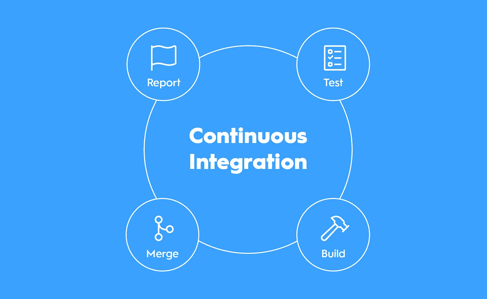
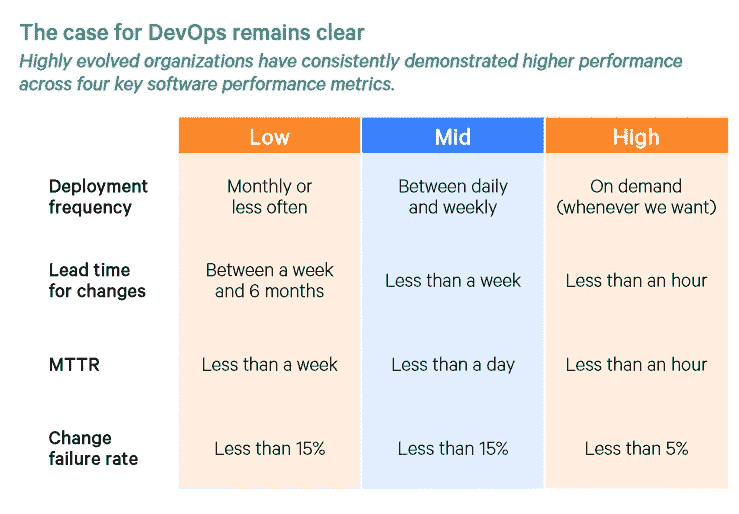
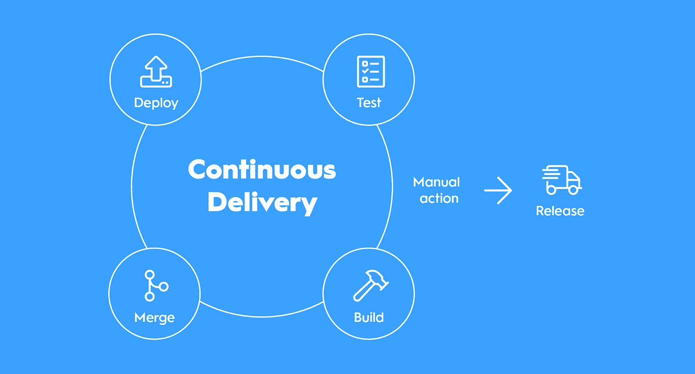
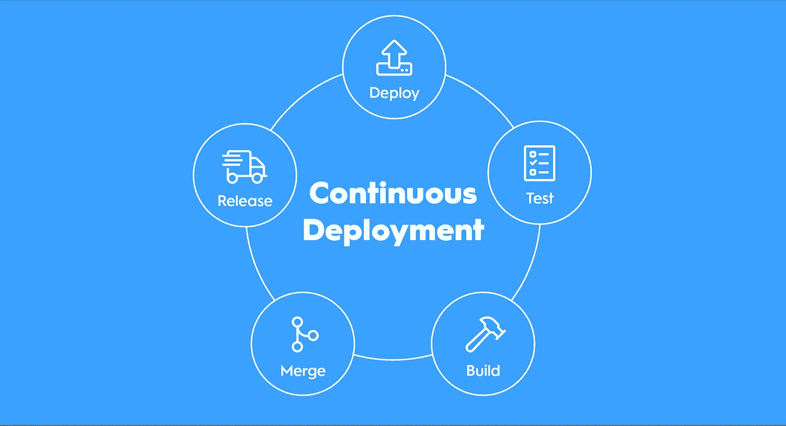
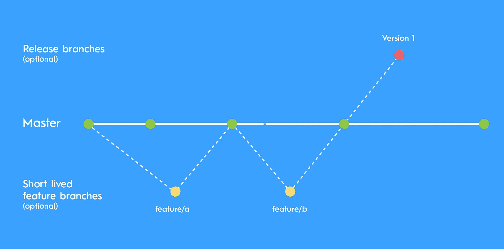

# 最佳开发实践是关于速度和信任的

> 原文：<https://levelup.gitconnected.com/best-development-practices-are-all-about-speed-and-trust-cee8efabac8b>

## 对你来说，做 CI\CD 最重要的方面是什么，以及如何通过正确的分支策略提高你的绩效。

开发者痴迷于速度。交货速度。整合速度。更快的创新。更快为客户创造价值。

在过去几年中，我一直在为各种项目和服务设置和配置几十种不同的管道，同时在这些项目中担任开发人员、技术主管和/或架构师。在这一切进行的同时，我慢慢地开始思考持续集成(CI)、持续交付(CD)和持续部署(还有 CD)的需求和效果。对我来说，完全适应这些实践似乎是一个信任的问题。在许多组织中，开发团队似乎无法完全适应这些实践来提高他们的性能输出，要么是因为他们不信任自己去做，要么是业务人员不信任开发人员让他们去做。

我将在下面分解这些来解释我的思考过程。我还将这些实践与两种最常见的分支策略进行比较，以及它们对性能的意义。

# 持续集成

小的每日提交是持续集成的基石

持续集成的实践，或者 CI，仅仅意味着将你的变更合并回你的“主线”，无论是`develop`还是`master`分支，**每天一次**。当您提交您的更改(最好)或者打开一个 pull 请求时，您的代码被构建，并且针对您的更改运行自动化测试，以验证您没有破坏代码库中的任何东西。

CI 没有说明您应该将您的更改合并回哪个分支。这是你的团队通常工作的分支。如果你使用 Git Flow，这可能意味着`develop`分支。基于主干的开发？`main`或`master`分公司。

通过我刚才所说的，我们已经可以看到在我们的开发过程中提高我们性能的**方法**。

第一个很明显，是 CI 的要求。您需要每天合并一次您的更改。你不应该有长期居住的功能分支，即。一个分支，在那里你用几天甚至几周的时间开发一个特性，然后再回到主线。

当主线已经在你处理分支的时候向前移动了，长时间的特性分支会让你有处理代码冲突的风险。缓解冲突的一个简单方法是每天重新调整/合并。每天开始时，您将主线合并到您的功能分支，并尽可能解决任何冲突。这会让你慢下来吗？是的。这是一项枯燥的手工任务，你不能自动完成吗？也是的。

简而言之，**你没有通过拥有长期的特性分支来进行持续集成**。这违背了每天合并你的变更的定义。拥有短命的分支是我们获得更好性能的一种方式。

提高开发速度的第二个方法是**不做拉请求**。在典型的开发环境中，通常有一个分层的雇员结构，拉请求作为一种控制机制存在。一种验证业务需求的机制，一种验证其他开发人员工作的机制，或者有时作为一些开发人员维护对什么合并什么不合并的控制的机制。权力游戏。

通常，审查代码是由您的队友、同事和/或上级完成的。在开源项目中，pull 请求几乎总是必要的，这样您就可以让社区中的任何人进行代码更改，这些更改可以被验证为无害的，或者包含任何错误。

如果你决定跳过拉请求，你需要**信任**。相信其他开发人员会做好他们的工作，而不需要每次都有人验证他们的工作。相信他们会根据需要开发特性，而不会对产品造成潜在的伤害。获得这种性能提升需要信任。

将拉请求作为一个强制性的控制点没有错，但是您需要让人们每天审查这些请求。否则你将会减慢开发过程。对于开源项目，你不可能相信每个人都会对你的代码库做出正确的修改。不是所有的人都是仁慈的。这就是为什么拉请求几乎总是在开源项目中使用。

在 Puppet 的 [2021 年 DevOps 状态](https://puppet.com/resources/report/2021-state-of-devops-report)中，表明采用 CI(或一般 DevOps 实践)的团队不仅有更高的性能，而且失败率更低。持续集成是这一速度不可或缺的一部分。根据这份报告，声称具有多个控制点的较慢的开发过程导致较低的失败率，似乎是无效的。

2021 年开发运维状况—调整开发运维实践可带来更高的性能和更低的故障率。

# 连续交货

连续交付需要手动升级到生产

我喜欢这样描述持续交付:

> 连续交付是一种实践，在这种实践中，您的代码总是保持在可发布的状态。代码变更会自动为发布做好准备(打包/构建)，然后部署到测试/试运行环境中。).执行生产发布需要手动操作。

这里的关键词是**自动化**。连续交付使您能够通过点击一个按钮将构建发布到生产环境中。在发布之前，您的管道必须测试并构建您将要发布的软件。

将您的构建自动部署到测试环境中与连续交付的定义无关。不过，这种部署非常普遍。尤其是在发布之前在实际环境中进行某种形式的 QA 测试的组织中。

这种审批过程通常意味着你新开发的功能不能以最快的速度提供给你的用户。这些类型的检查会降低你的速度。一些商业人士，甚至开发者，声称这是绝对必要的。

当你听到有人宣称这一点时，很明显，要么自动化测试没有足够的覆盖率，要么你就是对它们不够信任。同样，这种人工批准过程归结为信任。要么是业务人员对开发人员不够信任，需要进行质量保证测试来验证他们的工作，要么是开发人员对他们的自动化测试不够信任，不能简单地直接部署到生产中。

这就是我们跳到持续部署的地方。

# 持续部署

发布包含在持续部署的自动化中

连续部署通过部署自动化将交付向前推进了一步。连续交付和部署之间的区别在于，将构建部署到生产环境中不需要人工批准。该管道还可能包括对暂存环境的自动部署。

*如果你在你的管道中有一个人工批准过程，你正在做* ***连续交付*** *。如果您在每次成功构建时都自动发布到生产环境，那么您正在进行* ***连续部署*** *。*

这种实践需要所有三者中最大的信任。它需要业务人员和开发人员之间的信任。开发人员现在能够在他们的测试和构建一通过就对产品进行修改。他们不会干等着别人给他们开绿灯。绿灯现在是自动化构建和测试通过。

就性能而言，这是开发过程的最佳实践之一。如果您进行持续集成和持续部署，跳过手工批准，从提交到生产，您的开发过程在性能方面几乎达到极限。您正在以最快的方式向您的客户提供价值。

您将需要像特性标志这样的东西来将不完整的特性部署到产品中，而不会破坏任何东西，但这是一个单独的主题。

# 不同的分支策略呢？

基于主干的工作流的简单图示

两种最常见的分支策略被命名为 **Git Flow** (或特性分支工作流)和**基于主干的工作流**。这两者在速度上有很大的不同，基于主干的工作流现在被认为是现代软件和 DevOps 实践中的最佳实践。

我不会在这篇文章中解构这些工作流程。有许多文章概述了它们之间的区别。如果你想看的话，我会在这篇文章下面链接一个。然而，我将在 CI\CD 的背景下对它们进行比较。虽然 CI\CD 和分支策略是两个完全不同的东西，但它们在 DevOps 实践的保护伞下携手工作。

# 可以把 Git Flow 和 CI\CD 一起用吗？

让我们把这个解决掉。答案是**是的**。Git 流和基于主干的开发都可以和 CI\CD 一起使用。使用 Git 流更具挑战性，但这是可以做到的。诀窍？

**短命特征分支。**

为了正确地进行持续集成，您的特性分支必须在一天之内合并到您的开发分支中。如果您在合并之前还使用 pull 请求来检查任何更改，使您的分支跨越多天，增加了冲突的风险，那么很可能不会发生这种情况。这是一个非常小的差距，你可以声称与 Git Flow 进行持续集成。您的代码评审列车需要不停地前进。您的分支需要包含非常少量的变更。否则，如果出现问题，它们可能会变得长寿，或者有爆炸半径增加的风险。

我见过 Git 流与自动化管道一起使用，但是那些特性分支经常要开发好几天，它们往往会变得很大，而拉请求会被放在队列中等待审查好几天。在那些日子里，随着主线向前推进，冲突经常出现，当然它们需要被解决。有时不止一次。

还有一个 Git 流程的方面，不经常提到，它最终也会降低您的速度。

在一个特性已经被部署到产品中之后，最终不可避免地会出现一些问题。现在您必须部署一个补丁。一旦修复就绪，您必须将您主线一路合并回您的开发分支，且所有开发人员都需要同步他们的特性分支。否则，您可能会在开发过程的后期处理冲突，因为主线向前移动了。

在 Git 流中，将补丁应用到产品中，并将它们合并回开发分支是一个非常可能的场景。

另一方面，基于主干的工作流给予开发人员完全的自主权。他们可以自由地将变更直接提交到主线(主/主)中，并进行自动化发布。

这个工作流程需要高度的信任。使用它的开发人员之间的信任，以及业务人员和开发人员之间的信任。

**这是您可以获得最高性能提升的地方！这里没有微观管理，也没有办公室官僚主义的可能性。通常，您需要经验丰富的开发人员来完成这项工作，但是强烈建议也向初级开发人员介绍这个工作流。**

2016 年的 DevOps 报告包括以下关于基于主干的开发的概念:

> 我们发现，在被合并到主干之前具有非常短的生命周期(少于一天)的分支或分叉，以及总共少于三个活动分支，是连续交付的重要方面，并且都有助于更高的性能。每天将代码合并到主干或主数据库中也是如此。没有代码冻结期(当人们不能合并代码或拉
> 请求时)的团队也能获得更高的性能。

在接下来的几年中，他们继续探索这一点，并找到了更多证明其性能优势的证据。加速开发运营状况 2021 报告(谷歌)包括以下内容:

> 我们的研究一直表明，高绩效的组织更有可能已经实现了基于主干的开发，在这种开发中，开发人员进行小批量的工作，并且频繁地将他们的工作合并到一个共享的主干中。事实上，达到可靠性目标的精英们使用基于主干的开发的可能性是其他人的 2.3 倍。低绩效者更有可能使用长寿分支并延迟合并。

简而言之，回到产品中有一个损坏的特性的问题:基于主干的工作流开发人员总是在主线上工作，所以对主线的修复通常意味着向前推进。打碎了什么东西？好吧，提交一个修复并释放它。最有可能的修复是在一个小时内生产。

# 最后的话

在你告诉每个人你正在做 CI\CD 之前，请认识到你是否真的每天都在将你的变更集成到主线中，并且你的代码是否一直处于可发布的状态(有一个自动化的测试和构建管道)。您要么进行持续交付，要么进行持续部署，而不是两者兼而有之。或许都不是。

如果您将您的变更部署到一个非生产环境中进行手工测试，然后按一个按钮将它提升到生产环境中，这就是连续交付。如果您的更改自动进入生产环境，无需人工批准，这就是持续部署。最多你是在做 CI\CD，但也有可能你不是在做 CI 就是在做 CD。或者都不是！

最快的生产方式是通过持续集成和持续部署进行基于主干的开发。启用这些实践将导致更高质量的软件和更短的交付时间。通过做小的增量更改，降低了任何潜在错误的影响范围。

然而，一些开发人员、团队或组织似乎并不相信这一点。我见过不止一个项目，开发人员不信任自己(或其他开发人员)以这种高速的方式工作，并出于不同的原因在开发过程中创建手动控制点。对于他们来说，这可能是一种避免承担任何错误的方法，仅仅因为其他人也审查了他们的代码并且没有发现问题。这可能是他们保持对其他人的人为控制感的一种方式，充当您的更改到达存储库的网关。可能是你的组织的业务部门在执行这些检查，仅仅是因为他们想管理你的工作，或者对你不够信任，不能正确地完成工作。

我见过的最慢也是最典型的开发过程是利用 Git 流和 pull 请求，手动部署到测试环境进行 QA 测试，然后手动发布到生产环境，同时等待特定的特性在发布之前完成。您还可以混合使用各种配置、环境或数据进行手动测试。

那至少有三种不同的环境需要你去处理，更不用说多个控制点，所有这些都会减慢你的开发过程。通常这样做的理由是“确保安全和稳定的发布”，但是正如我前面提到的，利用全部 DevOps 实践的团队似乎具有更低的失败率。

我的推荐？收养他们。直接进入基于主干的开发，短期分支和拉请求。然后打开主线让所有开发者去承诺。当你这样做的时候，用自动化测试构建一个连续的交付管道，并进行手动发布，从主线中分支出来。然后，一旦你建立了足够的信心，放下发布分支，直接进入生产。

你想要速度吗？你需要信任和理解！

—

**资源&延伸阅读:**

 [## 持续集成、持续交付和持续部署

### CI 和 CD 是现代开发实践和 DevOps 中经常使用的两个缩写词。CI 代表连续…

www.atlassian.com](https://www.atlassian.com/continuous-delivery/principles/continuous-integration-vs-delivery-vs-deployment)  [## 什么是持续交付？-亚马逊网络服务

### 连续交付是一种软件开发实践，在这种实践中，代码变更自动为发布做好准备…

aws.amazon.com](https://aws.amazon.com/devops/continuous-delivery/)  [## 宣布 DORA 2021 加速开发状态报告|谷歌云博客

### 在过去的七年中，全球有超过 32，000 名专业人员参与了 DevOps 的 Accelerate State

cloud.google.com](https://cloud.google.com/blog/products/devops-sre/announcing-dora-2021-accelerate-state-of-devops-report)  [## 基于主干的开发与 Git 流

### 为了开发高质量的软件，我们需要能够跟踪所有的变更，并在必要时撤销它们。版本…

www.toptal.com](https://www.toptal.com/software/trunk-based-development-git-flow)  [## 持续交付:通过构建、测试和部署自动化实现可靠的软件发布

### 2011 年 Jolt 优秀奖得主！将软件发布给用户通常是一件痛苦的、有风险的和…

www.oreilly.com](https://www.oreilly.com/library/view/continuous-delivery-reliable/9780321670250/)  [## 加速

### “技术真的重要吗？我们如何应用技术来推动商业价值？多年来，我们被告知…

www.oreilly.com](https://www.oreilly.com/library/view/accelerate/9781457191435/)