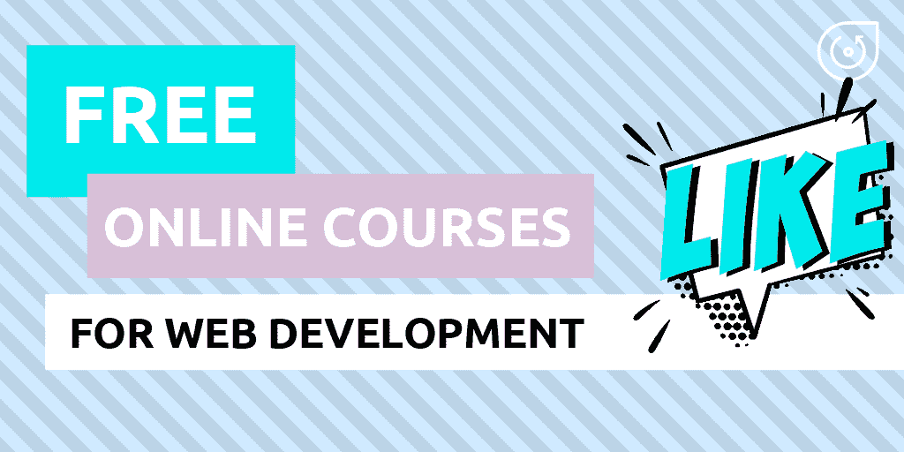

# 学习 Web 开发的最佳免费在线课程

> 原文：<https://levelup.gitconnected.com/best-free-online-courses-for-web-development-16f7746c57c3>

生活在信息过载的时代，很难不被网上无数的前端和后端开发课程淹没。

我们精心挑选了最好的课程，只提供相关和适用的知识来免费学习 web 开发。每门课程都是行业专家和世界知名大学紧密合作的成果。

如果你正在考虑开始一条职业道路，无论是作为前端还是后端开发人员，这个列表是为你准备的。

# 📚前端开发课程

## ✔️ [网络开发入门](https://www.coursera.org/learn/web-development)

*由加州大学戴维斯分校在 Coursera 上*

这门课程通常被推荐为完全的**初学者**的最佳选择，但它也有助于有经验的开发人员更新基础知识。这门课程为那些渴望成为一名 web 开发人员但不知道从哪里开始的人提供了一个很好的开端。

通过本课程，您将深入了解网站的工作原理、构建方式以及浏览器和设备与网络的交互方式。至于实践技能，您将学习如何创建动态网页，熟悉编程语言概念，以及部署您的第一个网站。

先决条件:你可以在没有任何编程或 web 开发经验的情况下注册这门课程。

完成这门课程大约需要 16 个小时。我们确信它会让你为更高级的网络开发的未来挑战做好准备。试试看！

## ️✔️ [响应式网页设计认证](https://learn.freecodecamp.org/)

*由 freeCodeCamp*

说到开发，很难找到比 freeCodeCamp 上更好的课程了。在这里，您可以获得各个领域的知识，并在[论坛](https://www.freecodecamp.org/forum/)上与开发人员社区联系。

此外，所有课程对每个人都是完全免费的。

我们想提请您注意**响应式网页设计认证**。完成整个认证大约需要 300 个小时。是的，这很费事，但很值得。这是我们能找到的最全面的网络开发课程。在这里，您将获得在**前端开发**领域开启职业生涯的一切。

课程涵盖了基本 HTML 和 HTML5、CSS、应用视觉设计、应用辅助功能、响应式网页设计原则、CSS Flexbox、CSS Grid 的所有概念。因此，你可以通过创建一个特定主题的教育项目来将你的知识付诸实践。

## ✔️ [前端 Web 开发基础](https://bit.ly/32mlhJa)

*由 Udemy*

本课程也将帮助你为网络开发打下基础。您将了解 **HTML** 、 **CSS** 、 **JavaScript** 和 **jQuery** 的主要概念。你甚至会有机会掌握 [Backbone.js](https://www.webdatarocks.com/blog/best-frontend-frameworks-2019/#backbone) 。

**先决条件**:不需要事先对主题有所了解。

完成后，你将获得足够的知识成为一名初级前端开发人员。这将使你更容易接触到任何关于网络开发的资源。

## ✔️ [前端 Web 开发与 React](https://www.coursera.org/learn/front-end-react)

*由香港科技大学在 Coursera 上*

本课程是 React 专业化的**全栈 Web 开发的一部分。顾名思义，它致力于借助 React 构建前端应用程序。随着课程的进行，您将学习如何使用 Reactstrap 创建响应式 UI 设计，掌握基本的 React 概念，了解 Flux 架构、Redux、客户端-服务器通信、REST APIs，以及如何在 SPAs(单页应用程序)中使用 React 路由器。**

**先决条件:**建议了解 Bootstrap 4、JavaScript 和 ES5。

完成这门课程大约需要 32 个小时。

因此，您将能够轻松创建**响应式 React-Redux 应用**并设计其架构。

## ✔️ [使用 React Native 开发多平台移动应用](https://www.coursera.org/learn/react-native)

*由香港科技大学在 Coursera 上*

你对开发**移动应用**更感兴趣吗？那么你应该密切注意这门自然课。这是同一专业的另一门课程，但主要侧重于使用 [React Native](https://facebook.github.io/react-native/) 、Redux 和 [Expo SDK](https://docs.expo.io/versions/latest/) 开发**跨平台 iOS** 和 **Android 应用**。

**先决条件:**编程概念、HTML、CSS、JavaScript 的基础知识。不需要以前的 React 能力。

完成课程需要 27 个小时。

因此，您将学习如何构建多平台应用程序，使用 React Native、Expo SDK 和 Redux。

尝试本课程来获得和掌握您的 React 和 JavaScript 技能！

## ✔️ [带 AngularJS 的单页面 Web 应用](https://www.coursera.org/learn/single-page-web-apps-with-angularjs)

*由约翰·霍普金斯大学在 Coursera 上*

如果你喜欢 AngularJS 反应，我们有东西给你。在本课程中，您将加深对以下概念的了解:重用现有服务的依赖注入、编写自己的服务、使用 AngularJS 数据绑定创建可重用的 HTML 组件以及使用指令扩展 HTML 语法。此外，您将学习多视图路由和执行单元测试。作为最后一个项目，您将构建一个结构良好且经过测试的 web 应用程序，并将其部署到云中。

**先决条件:**只需要对 HTML、CSS 和 JavaScript 有很好的理解。

完成课程需要 37 个小时。

# 📚服务器端开发课程

现在让我们继续进行**服务器端开发**。

## ✔️ [使用 NodeJS、Express 和 MongoDB 进行服务器端开发](https://www.coursera.org/learn/server-side-nodejs)

*由香港科技大学在 Coursera 上*

这门优秀的课程着重于 web 开发的服务器端方面。您将了解 web 协议(HTTP 和 HTTPS)、NodeJS 模块、CRUD 操作、NoSQL 数据库(即 MongoDB 和 Mongoose)、REST 概念和后端即服务的方法。

先决条件:你需要知道的只是基本的 HTML、CSS 和 JavaScript。

完成这门课程总共需要大约 4 周的强化学习。

因此，您将能够熟练地使用 NodeJS 配置后端服务器，从中构建 RESTful API，并处理身份验证和安全性。

## ✔️ [用 PHP 构建 Web 应用](https://www.coursera.org/learn/web-applications-php)

*由密歇根大学在 Coursera 上*

你喜欢 PHP 吗？那你会喜欢这门课的。您将了解 web 应用程序的基本结构、请求和响应周期、HTML、CSS、PHP 的语法和数据结构。本课程还涵盖了错误处理和超全局变量的概念。

**先决条件:**要求你对编程有大体的了解(任何语言)。还建议在开始之前参加[人人专精](https://www.coursera.org/specializations/web-design)的网页设计。

完成本课程大约需要 19 个小时。

课程结束时，您将掌握安装 PHP 和 MySQL 环境(如 MAMP 或 XAMPP)的实用技能，并创建一个非常适合添加到您的作品集的应用程序。

## ✔️ [用 JavaScript 和 MongoDB 开发 Web 应用](https://www.coursera.org/learn/web-application-development)

*伦敦大学戈德史密斯的 Coursera*

本课程是[响应式网站开发专业](https://www.coursera.org/specializations/website-development)的一部分，旨在培养**高级 web 应用程序编程的技能:**自下而上地构建、测试和部署移动就绪的 web 应用程序。

它通常由企业家、软件工程师、数据工程师和技术支持助理来完成。在本课程中，您将学习如何控制数据读写访问、访问数据库以及使用 [**SimpleSchema**](http://srault95.github.io/meteor-app-base/simple-schema/) 系统。此外，您将熟悉**text circle**——一个协作代码编辑环境。

为了巩固所学内容，你将深入各种编程作业、理论和实践测验。在最后一个模块中，您将使用 **Meteor** 文件夹开发一个应用程序。

先决条件:作为背景知识，假设你有基本的编程技能和 ICT 概念的基本想法。

完成本课程大约需要 19 个小时。但是这并不是一个严格的要求——你可以按照自己的节奏自由工作。

# 📚关于 web 开发的更多信息

如果您无法为您的应用确定一个框架，请深入了解 2019 年[最佳前端框架的概述](https://www.webdatarocks.com/blog/best-frontend-frameworks-2019/)。

☝️如果你正在寻找更多的网页开发教程和课程，试试**。这个资源的主要优点是在一个地方收集了大量的文章和课程。你可以按类别筛选它们，选择你的最佳搭配。**

***原载于***