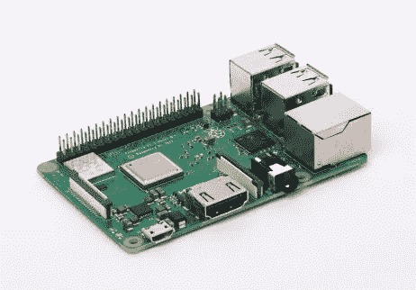
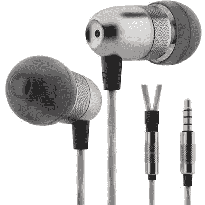
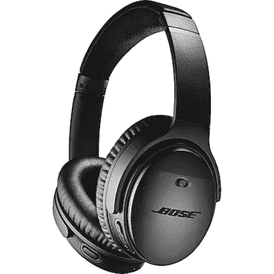
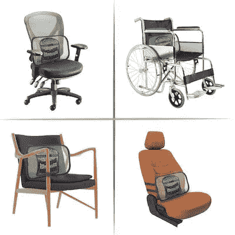
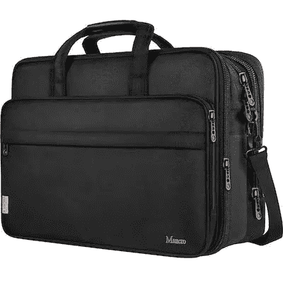
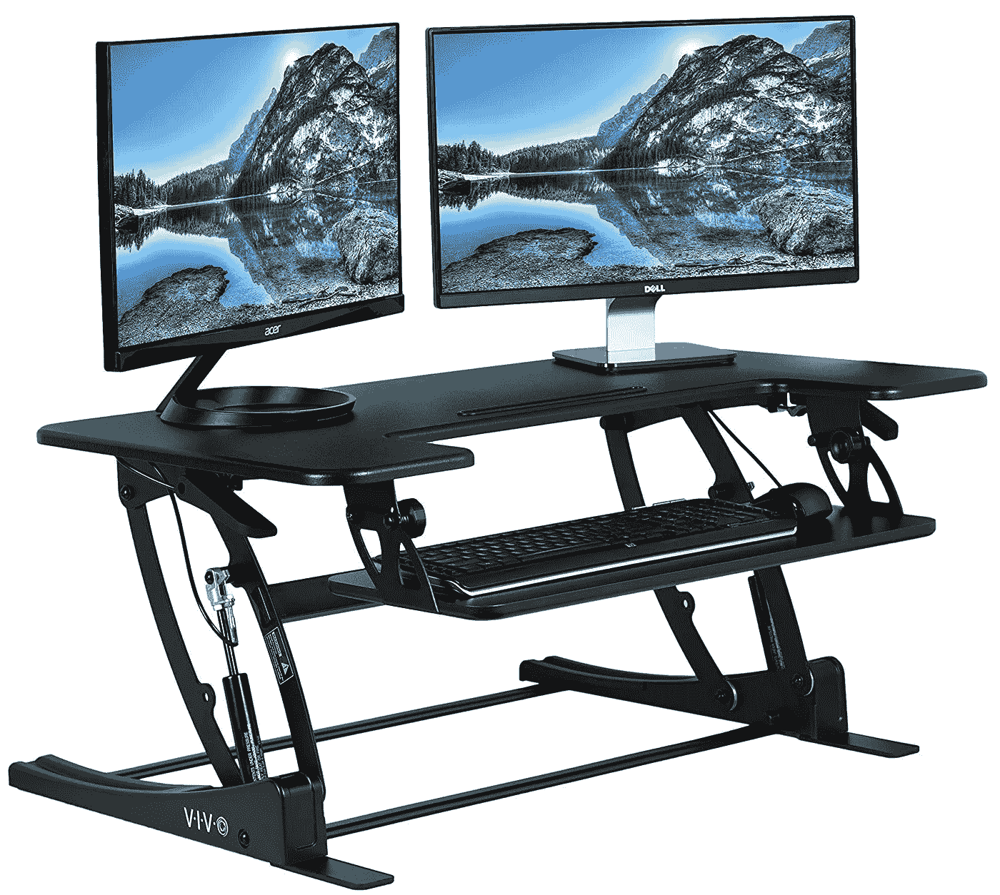
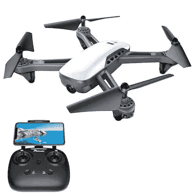
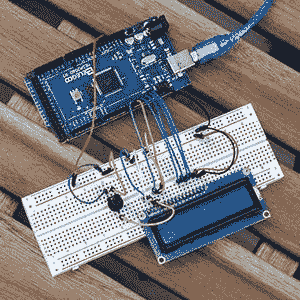

# 给程序员和开发人员的最好礼物——善待自己

> 原文：<https://levelup.gitconnected.com/best-gifts-for-programmers-developers-and-coders-treat-yo-self-2018-103c017f8f10>

无论你有一个软件工程师的朋友或重要的人，或者你只是想犒劳自己，这篇文章为程序员和热爱编码的人列出了最好的礼物。送礼季就要到了，这里有一些送给开发者的好礼物。

## 类别:

1.  编码视频/教程
2.  小玩意儿
3.  玩具
4.  赃物

*披露:这些都是我用过的，个人推荐的产品。对于他们中的一些人，如果你使用文章中的链接，我会得到报酬。如果你确实找到了你喜欢的东西，你的支持会受到感激。*

# 编码教程&视频课程——给总是想了解更多的编码者的礼物选择

这一节包含给痴迷于学习新的编码语言和框架的开发人员的礼物。如果你在找书，我已经为开发者创建了一个[必读书目。](https://amzn.to/2SdZtxI)

## 1.[订阅 Pluralsight 编码视频课程](https://pluralsight.pxf.io/c/1304575/424552/7490?u=https%3A%2F%2Fwww.pluralsight.com%2Fbrowse%2Fsoftware-development)(35 美元至 299 美元)

Pluralsight 是最全面的视频编码平台之一，内容由各自领域的专家教授。这是给那些对编码教程不感兴趣的人的完美礼物，如果订阅的话，你将不再需要搜索网页来学习新的东西。价格标签可能令人望而生畏，但它会很快让那些狂热的学习者获得数倍的回报。

## 2.Udemy 课程(10 美元假日优惠)

对于个人课程，Udemy 是最好的选择。他们为最流行的编码语言提供了一些最好的视频，但你也可以找到高质量的内容，即使是更晦涩的主题——我对区块链/Hyperledger/以太坊编程非常深入，并通过 Udemy 找到了我的所有视频。

**如果要找个人推荐:** [Web 开发](https://click.linksynergy.com/deeplink?id=q15T/SfRF14&mid=39197&murl=https%3A%2F%2Fwww.udemy.com%2Fthe-web-developer-bootcamp%2F)， [Python](https://click.linksynergy.com/deeplink?id=q15T/SfRF14&mid=39197&murl=https%3A%2F%2Fwww.udemy.com%2Fcomplete-python-bootcamp%2F) ， [JavaScript](https://click.linksynergy.com/deeplink?id=q15T/SfRF14&mid=39197&murl=https%3A%2F%2Fwww.udemy.com%2Fthe-complete-javascript-course%2F) ， [Node.js](https://click.linksynergy.com/deeplink?id=q15T/SfRF14&mid=39197&murl=https%3A%2F%2Fwww.udemy.com%2Fnodejs-the-complete-guide%2F) ， [Java](https://click.linksynergy.com/deeplink?id=q15T/SfRF14&mid=39197&murl=https%3A%2F%2Fwww.udemy.com%2Fjava-the-complete-java-developer-course%2F) ， [React](https://click.linksynergy.com/deeplink?id=q15T/SfRF14&mid=39197&murl=https%3A%2F%2Fwww.udemy.com%2Freact-the-complete-guide-incl-redux%2F) ， [Vue](https://click.linksynergy.com/deeplink?id=q15T/SfRF14&mid=39197&murl=https%3A%2F%2Fwww.udemy.com%2Fvuejs-2-the-complete-guide%2F) ， [Angular](https://click.linksynergy.com/deeplink?id=q15T/SfRF14&mid=39197&murl=https%3A%2F%2Fwww.udemy.com%2Fthe-complete-guide-to-angular-2%2F) ， [iOS/Swift](https://click.linksynergy.com/deeplink?id=q15T/SfRF14&mid=39197&murl=https%3A%2F%2Fwww.udemy.com%2Fios11-app-development-bootcamp%2F) ， [Android](https://click.linksynergy.com/deeplink?id=q15T/SfRF14&mid=39197&murl=https%3A%2F%2Fwww.udemy.com%2Fmaster-android-7-nougat-java-app-development-step-by-step%2F)

课程通常也在假期前后打折，所以你可以花 10 美元买这些礼物。

你可以把课程直接送给某人，你只需要他们的名字和电子邮件地址。

## 3.韦斯·博斯的课程(免费或 97 美元)

在自由职业教师中，韦斯·博斯绝对是数一数二的。他是 [JavaScript](https://ES6.io/friend/GITCONNECTED) 、 [React](https://ReactForBeginners.com/friend/GITCONNECTED) 、[节点](https://LearnNode.com/friend/GITCONNECTED)的专家。尽管他的课程价格不菲，但内容物有所值。如果你想加快你的学习，这是一条路要走。如果你有兴趣先试用他，他还有两个免费选项( [1](https://JavaScript30.com/friend/GITCONNECTED) 、 [2](https://CSSGrid.io/friend/GITCONNECTED) )。

*   React ( [初级](https://ReactForBeginners.com/friend/GITCONNECTED) | [高级](https://AdvancedReact.com/friend/GITCONNECTED) | [Redux](https://LearnRedux.com/friend/GITCONNECTED) )
*   [节点](https://LearnNode.com/friend/GITCONNECTED)
*   JavaScript ( [初学者](https://JavaScript30.com/friend/GITCONNECTED) | [ES6](https://ES6.io/friend/GITCONNECTED) )
*   CSS ( [伸缩](https://Flexbox.io/friend/GITCONNECTED) | [网格](https://CSSGrid.io/friend/GITCONNECTED))
*   [命令行](https://CommandLinePowerUser.com/friend/GITCONNECTED)
*   [降价](https://MasteringMarkdown.com/friend/GITCONNECTED)

## 4.书籍(价格不同)

下面是程序员书架上应该有的几本经典。

*   罗伯特·C·马丁的《干净的代码》
*   [你不知道的 JavaScrip](https://amzn.to/2S9A1G3) t 作者凯尔·辛普森**(简直是最好的 JS 系列)**
*   安德鲁·亨特著的实用主义程序员戴维·托马斯著
*   [卓有成效的工程师](https://amzn.to/2QgHXbf)刘爱德蒙
*   Gayle Laakmann McDowell 的《破解编码访谈》

## 5.[订阅 Egghead](https://egghead.io)(40 到 250 美元)

Egghead 优秀的视频平台，主要专注于 JavaScript 和 web 开发。它们的内容非常好，但是相对于其他选项来说，稍微有些局限。如果你知道有人一直在谈论 React、Vue 或 JavaScript，那么这个选项会很合他们的胃口。

过去，在节日期间，他们会提供打折的礼品订阅。如果他们今年提供同样的服务，我会用链接更新这篇文章。

## 6.[前端大师](https://frontendmasters.com/)(39 到 390 美元)

Frontend Masters 类似于 Egghead，它提供的课程主要是 JavaScript 和 web 开发。主要的区别是，它的主题稍微狭窄一些，但根据他们的技能水平和兴趣提供了指导路径。

# 小玩意儿

## 1.[树莓酱](https://amzn.to/2DxIzSN)(全套套装起价为 [$35](https://amzn.to/2S2b5Qz) 至 [$79](https://amzn.to/2TvmcCX) )

这些东西太酷了。几年前我给自己买了一个树莓派，它仍然是我最喜欢的玩具之一。这是一台运行 Linux 的信用卡大小的电脑。可能性是无穷的，从一般的编程到诸如构建一个[智能镜子](https://www.makeuseof.com/tag/6-best-raspberry-pi-smart-mirror-projects-weve-seen-far/)、一个[游戏模拟器](https://retropie.org.uk/)以及[更多更多的](https://pimylifeup.com/category/projects/)之类的事情。

## 2.[耳塞耳机](https://amzn.to/2r4jtDT)(14 美元)

音乐对于编码是必不可少的。不到 15 美元，你就找不到比这更划算的了。这些我放在电脑包里好几年了，用了无数次。

## 3.[降噪耳机](https://amzn.to/2KjPel4)(199 美元至 350 美元)

如果你在家里或办公室，你可能想要比耳塞更好的东西，让你真正进入状态。你可以选择[最佳耳机选项](https://amzn.to/2KjPel4)或[稍微便宜一点的选项](https://amzn.to/2r4ldNr)。

## 4.符合人体工程学的[键盘](https://amzn.to/2TuMCFg)和[鼠标](https://amzn.to/2qXAsHO)(价格各不相同)

程序员对此非常固执己见，所以我不会给出任何强烈的建议，除非他们会喜欢你送给他们的礼物。

## 5.[他们办公椅的靠背](https://amzn.to/2KjTBfY)(15 美元)

我们每天都坐在同一把椅子上编码。我们应该让这把椅子尽可能的舒适。

## 6.新电脑包(价格不一)

我们的电脑实际上是我们人类的延伸。我们去哪里都带着它们，我们需要一个好的袋子来装我们的笔记本电脑。

## 7.一个可调节的立式办公桌(159 美元)

立式办公桌非常棒，许多人在使用后无法再坐下来。一张可调节的桌子让你可以选择站着或坐着，同时享受两者带来的健康益处。

# 玩具

## [1。无人机](https://amzn.to/2DwxxgO)(价格不一)

拿到我的无人机让我感觉又像是一个过圣诞节的孩子。任何热爱科技的人都会喜欢开车。

## [2。arduino](https://amzn.to/2FH5pua)(35 美元)

Arduino 就像成年人的乐高积木——你把所有的电路连接起来，然后给设备编程。

## 3.一瓶上好的威士忌

因为威士忌。

# 赃物

选择的范围太广了，无法在这里涵盖，但我将讲述一个 2 年前有人送给我的礼物的故事，它仍然是我最喜欢的东西之一。

**事实:**程序员爱喝咖啡。

咖啡是我们用来编码的燃料。如果你搜索编码杯，有很多选项，大多是关于它们的过度使用的笑话。取而代之的是，从这个人最喜欢的编程语言或库中取出徽标，为他们制作一个杯子。这是一个感性和实用的礼物，展示了他们对编码的热爱。我是 React 库的超级粉丝，我收到了一个印有 [React logo](https://www.google.com/search?q=react+logo&source=lnms&tbm=isch&sa=X&ved=0ahUKEwiYrInDvuDeAhWMjVkKHZjYDfcQ_AUIDigB&biw=1276&bih=648#imgrc=VOLBmeaYSMk6KM:) 的马克杯。我很喜欢它，并且几乎每天都在使用它。

# 结论

得到礼物可能很难，尤其是如果你不是程序员，而要为编程人员得到礼物。如果你遵循这个列表，你应该会找到他们会喜欢的东西。

如果我错过了什么好主意，请在评论中告诉我。