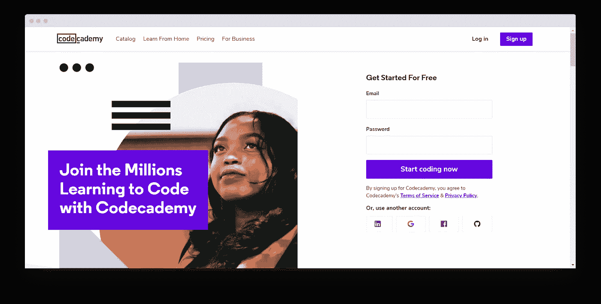
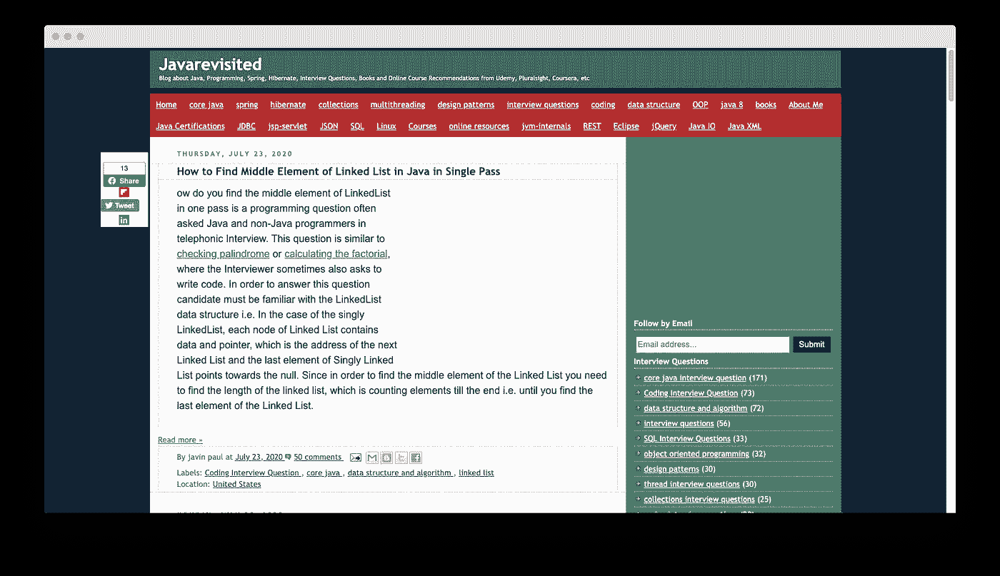
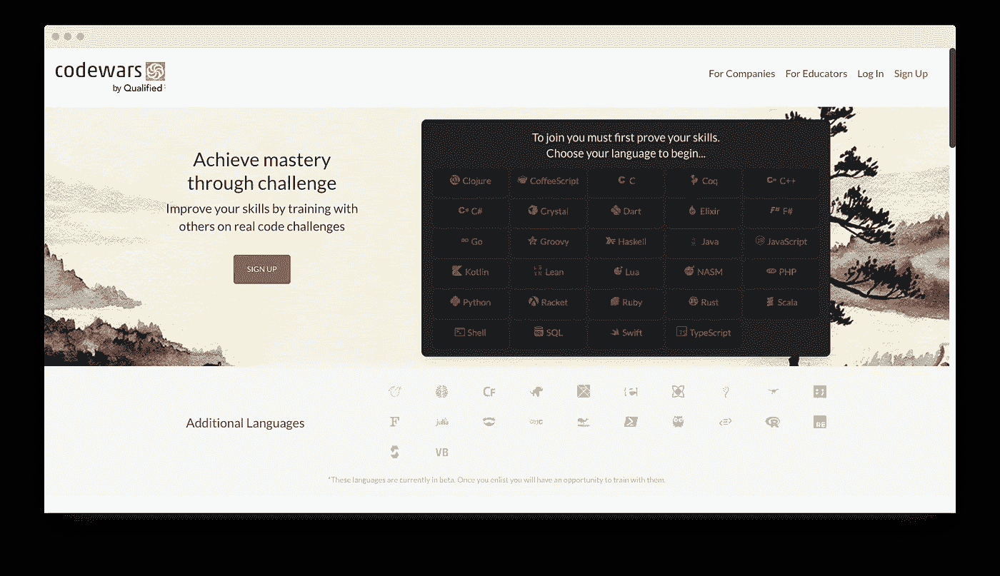

# 初学者最佳 Java 教程，带示例和练习

> 原文：<https://levelup.gitconnected.com/best-java-tutorials-for-beginners-with-examples-and-practice-74c903854266>

马库斯·斯皮斯克在 [Unsplash](https://unsplash.com?utm_source=medium&utm_medium=referral) 上的照片

# 为什么是 Java？

根据现有数据， [90%的财富 500 强公司](https://www.fullstackacademy.com/blog/nine-best-programming-languages-to-learn-2018)使用 Java 创建应用程序和内部系统。

学习 Java 不仅仅是扩大你的知识基础；它能给你的职业生涯带来急需的推动力。

Java 是新手专业人士的绝佳选择，因为这是一项需求量很大的技能([30 亿台设备运行 Java！](https://www.zdnet.com/article/three-billion-devices-run-java-yeah-but-do-they-like-it/))，意思是更多的工作机会或实习机会。当 Java 开发人员的平均年薪达到 102，514 美元时，这是一个经济上可行的职业选择。

# 学习 Java 时最常见的错误

即使是像 Java 这种对学习能力要求不高的编程语言，对于初学者来说也有很多隐藏的方面。

一个人应该避免哪些错误？

让我们来看几个你在学习过程中可以避免的问题。

# 1.理论太多，实践太少

理论有利于打基础，但避免过多的理论而牺牲锻炼。阅读大量的 Java 书籍并不会对你实际编写程序和 Android 应用有所帮助。

对于初学者来说，解决一系列小而简单的问题，以及一些更具挑战性的问题要好得多。我会说，一个好的比例是一个困难的任务对 10-20 个简单的任务。

# 2.不会问问题

有的同学什么都不想问，但是没有问题就是蠢。

出了问题，我们该怎么办？问个问题！

问问你的导师你是否在论坛上，比如 [Javaranch](https://javaranch.com/) 或者 [StackOverflow](https://stackoverflow.com/) 。

# 3.不调试代码

在今天的 IDE 中调试非常简单。

学会一次怎么做，你会为你的训练和以后的工作收获一颗技能明珠！最迟在培训第一个月结束前开始调试。

# 4.在考虑解决方案之前开始写代码

如果你正面临一个问题并且没有立即找到答案，在继续写代码之前，想想你要做什么。

您的程序不仅在编写代码时如此，在开发解决方案时也是如此。在纸上写下一个近似算法。

p.s .直到你根据写的代码行数得到报酬。

# 5.因困难而失去动力

这对于自学的学生或者在小组中学习并且落后的学生来说是非常典型的。

这种情况下该怎么办？

你需要明白编程不是火箭科学。几乎每个人都可以做到这一点，如果他或她有足够的练习和足够的耐心。

# 如何开始—主要步骤

开始学习 Java 最合理的方法是从基础概念开始，然后立即投入实践。

# 第一步。基础

学习 Java 编程是一个循序渐进的过程。首先，你应该清楚基础知识。为了简化您的工作，我按以下顺序列出了 Java 编程的基本概念:

*   [Java 概述](https://www.edureka.co/blog/what-is-java/)
*   [Java 基础](https://www.edureka.co/blog/java-tutorial/)
*   [哎呀概念](https://www.edureka.co/blog/object-oriented-programming/)
*   [Java 字符串](https://www.edureka.co/blog/java-string/)
*   [Java 数组](https://www.edureka.co/blog/java-array/)
*   [Java 线程](https://www.edureka.co/blog/java-thread/)
*   [Java 集合](https://www.edureka.co/blog/java-collections/)

# 第二步。安装 Java 和 IDE

Java SDK 与 IDE 相结合，提供了一个集成的开发环境，可以满足您的所有需求，帮助您更快、更有效地学习。

在各种 ide 中，IntelliJ IDEA 和 Eclipse 无疑是最好的。

# 第三步:阅读一些专家的好书

开始阅读有经验的 Java 程序员和专业人士写的书。这将帮助你进入编码过程，就像有经验的程序员所做的那样。

我选择的免费在线书籍是《用 Java 思考》。

# 第 4 步:从使用您的知识创建一个简单的应用程序开始

把你学到的理论付诸实践。因此，使用你已经获得的知识，开始创建简单的应用程序(又名宠物项目)。

# 为什么实践很重要？

编程就像任何技能一样，只有通过大量的练习才能学会。

没有人会在没有真正尝试的情况下学会游泳。你需要一个解释，但最重要的是，你需要直接进入行动。

只有大量的实践，才会教会你应对程序员的日常问题。例如，你会自然而然地养成定期检查代码的习惯，不要让相关的问题越积越多。

你也将从最简单的解决方案开始。然后转向更复杂的，不断改进你的代码。

最重要的是，你将习惯于日复一日的编码。

# 最好的资源

# Gitconnected

[Gitconnected](https://gitconnected.com/learn/java) 是软件工程师和开发人员为未来和当前的软件工程师和开发人员创建的。这是一个拥有最好的在线教程资源的社区。此外，成员们分享关于编程的新闻，这样你就能掌握最新的技术和编码提示。

它最棒的部分是有可能和其他开发者成为朋友并得到一份工作。

# CodeGym

[CodeGym](https://codegym.cc) 是一个游戏化的在线课程，即使对于没有任何 Java 经验的初学者和优秀的中级程序员来说都是很好的。CodeGym 的工作原理就像一个视频游戏；当你正确地解决了一个问题，你就得到“暗物质”(你需要打开下一个教程或关卡的眼镜)。它分为 40 个级别，每个级别包括大约 15-30 个编码任务，10-20 个 Java 教程，以及有助于保持积极性的帮助文档。

# 代码集

[Codecademy](https://www.codecademy.com/) 为初学者和有经验的程序员提供免费的 Java 编程语言课程。它通过提供各种项目，如创建计算器和其他应用程序，提供工作和实施知识的机会。

# 乌德米

Udemy 提供从初学者到专家级别的 Java 教程。

如今，它已经成为提供许多在线课程的最大平台之一，包括一些编程语言，如 Java、C++和 C。

它提供了关于如何开始用 Java 编程的免费视频教程。这些教程帮助学生学习更多的 Java 概念，这比其他教程要容易得多。

# 重温 Java

该平台提供了一种略有不同的学习 Java 的方法。有大量的[实用教程](https://javarevisited.blogspot.com/2018/07/java-8-tutorials-resources-and-examples-lambda-expression-stream-api-functional-interfaces.html)可供你访问和编写代码。

他们还教授并指导您使用 Java 代码。所以更多的是理论和实践的混合。你阅读理论，然后应用它。

# 代码战争

Codewars 是另一个在线平台，它提供了大量的练习。

虽然它更适合至少有一些编程经验的学生，但 [Codewars](https://www.codewars.com/) 允许你通过教授 kata 来磨练你的语言技能。

可以在浏览器中编写代码，并将您的解决方案与其他解决方案进行比较。每个形都有一个等级，每个形对其他程序员都是一个挑战。当你解决更复杂的任务时，你会接到更复杂的任务来提高你的编码技能。

这个平台不同于其他平台，因为它允许你在一个小组中学习和练习。

# 总结一下

你现在已经武装好了，具备了帮助你正确学习 Java 的策略和方法。一般来说，学习 Java 的关键是练习和坚持。

我强烈建议你通过注册一门在线课程来开始你的旅程，这样你就可以在进行下一步课程之前尝试一下。