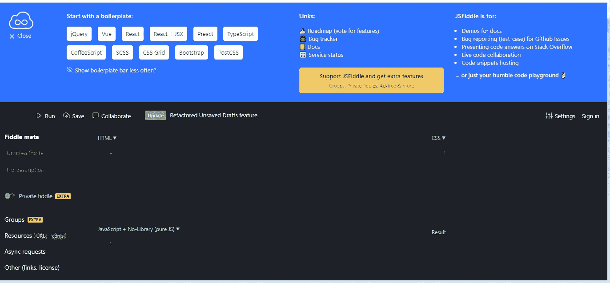
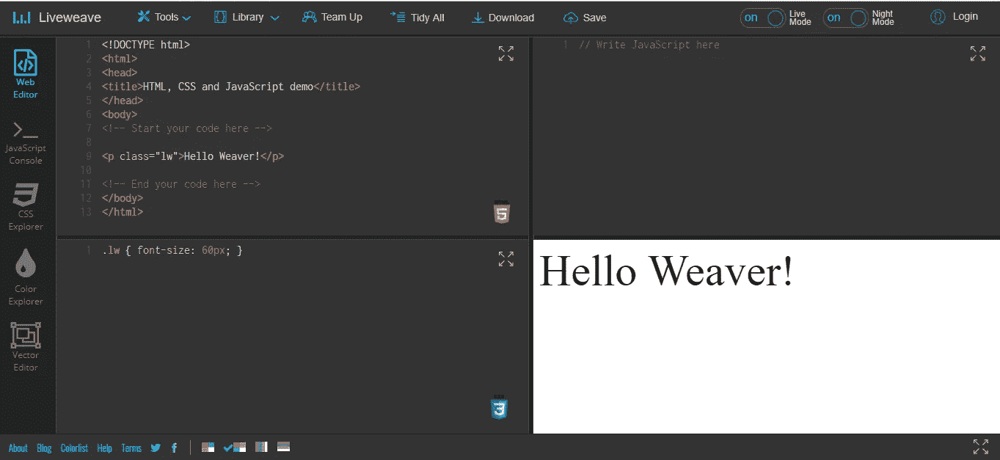
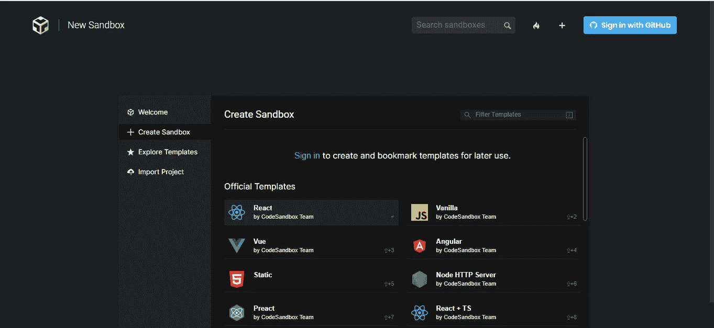

# 最佳 JavaScript 代码编辑器

> 原文：<https://levelup.gitconnected.com/best-javascript-code-editors-642c3957da4c>

在 [Unsplash](https://unsplash.com?utm_source=medium&utm_medium=referral) 上由 [Austin Distel](https://unsplash.com/@austindistel?utm_source=medium&utm_medium=referral) 拍摄的照片

在本文中，我们将看看最好的在线 JavaScript 编辑器。我们可以在不下载和安装任何东西的情况下使用它们。

# **密码笔**

Codepen 是一个很棒的代码编辑器，让我们可以在浏览器中构建和修改前端应用程序。

它有一些设置让我们改变编辑器的外观。此外，它有多个文本编辑器，让我们可以在浏览器中修改 HTML、CSS 和 JavaScript 代码。

当我们更改代码时，我们可以在预览窗口中预览它们。

许多人使用它来创建示例代码，并将其嵌入到博客文章和其他地方。

# JSFiddle

像 Codepn 一样， [JSFiddle](https://jsfiddle.net/) 为我们提供了多个处理 HTML、CSS 和 JavaScript 的窗口。此外，我们可以在 JSFiddle 中协作编辑代码。

此外，我们可以通过在 JavaScript 编辑器顶部的下拉菜单中设置各种库和框架来添加到 JavaScript 代码中。

我们也可以点击一个按钮来整理我们的代码，这样可以节省我们自己格式化代码的时间。

不是每个代码编辑器都有这个特性。它帮助我们编写 JavaScript 代码，因为我们经常需要添加库来制作重要的 JavaScript 程序。

我们也可以通过链接与他人分享用 JSFidden 编写的代码，或者通过创建一个帐户来保存它们。

# JS Bin

JS Bin 是一个简单的 JavaScript 代码编辑器，可以让我们摆弄 JavaScript、CSS 和 HTML。

它比 Codepen 和 JSFidden 更简单，因为我们可以更改的选项更少。

然而，我们可以添加一些简单的库，就像我们使用 JSFiddle 一样。

它还允许我们创建一个帐户来保存我们帐户中的 JS Bin 代码。

# 柯丁

Koding 编辑器在浏览器中为我们提供了一个成熟的开发环境。

然而，它只能作为自我管理的安装来使用，所以我们最好在自己的计算机上设置自己的本地开发环境，而不是使用它。

# Rendera

Rendera 是另一个简单的代码编辑器，允许我们在浏览器中编辑 HTML、CSS 和 JavaScript。

它的功能比其他的少，看起来也不吸引人，但是我们可以在代码中添加一些库，这很好。

# 活织

Liveweave 是另一个代码编辑器，可以让我们编写简单的前端代码。它还支持添加库。

当我们修改代码时，它也有语法高亮和预览，这很方便。

我们也可以点击一个按钮来整理我们的代码，这样可以节省我们自己格式化代码的时间。

它有一个控制台日志预览，需要我们打开一个新的标签来预览它。

另一个伟大的特点是，它有一个窗口预览 CSS 和摆弄它的权利在标签。

我们也可以摆弄颜色，这不是很多编辑都有的。它有一个颜色选择器，我们可以用它来调整颜色。

# CodeAnywhere

[CodeAnywhere](https://codeanywhere.com/) 是一个成熟的在线 IDE。这是一项付费服务，但包括免费试用。

它为我们提供了编辑器、运行命令的终端、协作工具和版本控制功能。

没有多少在线提供版本控制功能，所以这是一个如果我们想恢复代码。

此外，大多数在线编辑器也不提供终端访问，所以这是另一个伟大的功能。

# CodeSandbox

[CodeSandbox](https://codesandbox.io/) 是一个很棒的在线 JavaScript 编辑器。我们从 Visual Studio 代码及其编辑器中获得了许多功能。

它研究我们的代码，并即时检查语法错误。此外，它允许我们将包安装到我们的项目中，这也是很多 ide 没有的特性。

它包括我们可以开始使用的项目模板，包括普通 HTML、CSS 和 JavaScript、React、Angular、Vue、Next.js 等。

此外，它对用 Jest 运行测试的支持有限。然而，我们应该指望使用它，因为许多测试运行特性不被支持。

我们在一些项目中得到终端输出，但在大多数内置模板中不能输入命令。

然而，对于编写快速演示和原型代码来说，它仍然很棒，而不需要将东西下载到我们自己的计算机上。

# 结论

有许多在线 JavaScript 代码编辑器。大部分都很基础。然而，有一些像 CodeSandbox 更先进。

其他编辑器，如 JSFiddle 和 Codepen，也很适合编写快速代码片段。