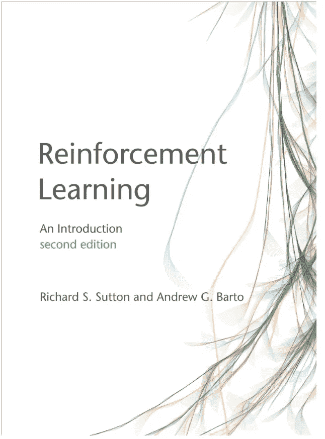
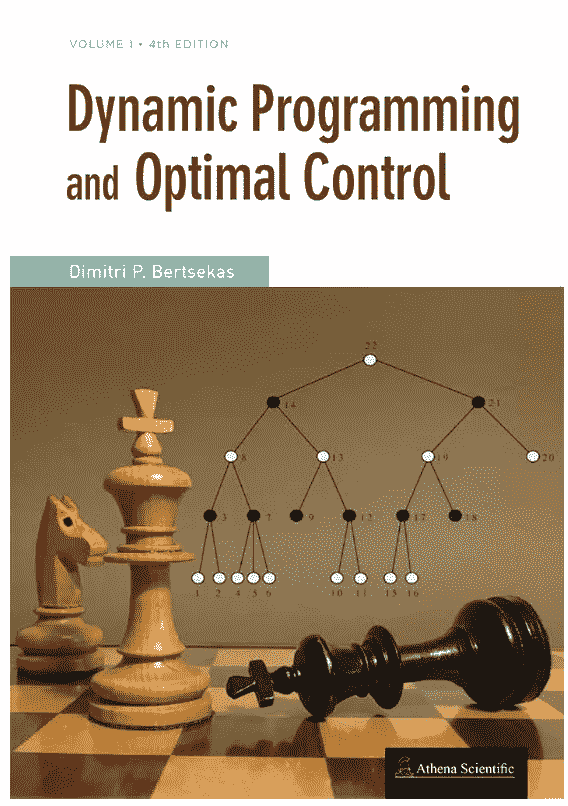
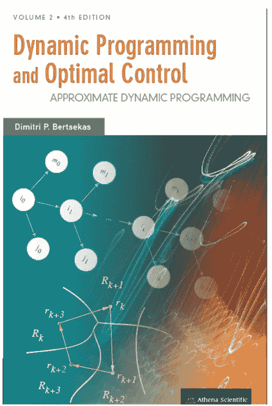
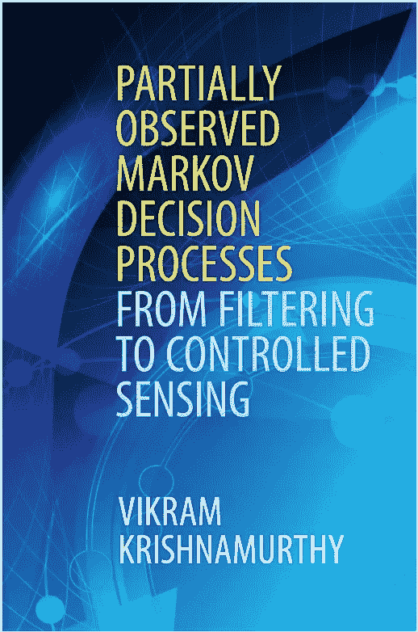
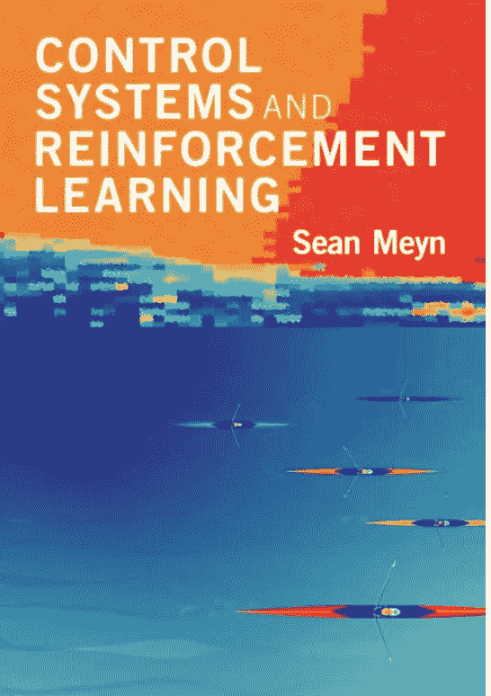

# 加速你的研究的最佳数学强化学习(RL)教科书

> 原文：<https://levelup.gitconnected.com/best-mathematical-reinforcement-learning-rl-textbooks-to-accelerate-your-research-e0b5a33c2f03>

塔玛拉·加克在 [Unsplash](https://unsplash.com/s/photos/textbooks?utm_source=unsplash&utm_medium=referral&utm_content=creditCopyText) 上的照片

在这篇文章中，我将我最喜欢的 RL 教科书分为面向数学的，在接下来的文章中，我将展示最好的面向示例/代码的 RL 教科书。第一套教科书似乎令人生畏，但如果你是一名对研究感兴趣的研究生或本科生，那么没有比这更好的起点了。我还按照从最容易到最难的顺序展示了第一套教科书。请注意，数学的增长通常伴随着新的功能或可能性，例如在现实世界中使用 RL 可以实现的商业应用，这是一件好事，尽管这可能需要您将思维扩展到舒适区之外！

请注意，侧重于代码或实现的应用或 RL 教科书永远不会先于面向数学的教科书。一旦一些研究小组很好地理解了数学，并且符号具体化了，那么通常更多的以例子为中心的教科书就会进入市场。在我看来，最好先把数学和模型学得很好，这样可以让一个人欣赏、理解和有效地实现代码。

***但是不要误会！*** 我并不是说没有注重实用或应用的教科书。相反，如果只有数学而没有基于例子的教科书，人工智能和更广泛的人工智能的世界将会非常枯燥。

考虑下面的例子，有人可能更关心代码优先的 RL 教科书。也许你是一个行业专家，你没有时间深入学习马尔可夫链理论或随机过程。在这种情况下，找到一个与你想要完成的问题密切相关或相似的模型就是你搜索的主要目标。因此，如果你是这样的行业专家，我将推荐一些学习资源或书籍，它们更侧重于示例和编码，以帮助你在后续的故事中解决你自己在公司面临的问题。现在，让我们展示最好的数学课本:

# 强化学习:导论

## 萨顿和巴尔托

 [## 强化学习，第二版:导论(自适应计算和机器学习…

### 强化学习，第二版:导论(自适应计算和机器学习系列)

www.amazon.com](https://www.amazon.com/Reinforcement-Learning-Introduction-Adaptive-Computation/dp/0262039249/ref=asc_df_0262039249/?tag=hyprod-20&linkCode=df0&hvadid=312280575053&hvpos=&hvnetw=g&hvrand=12144680524570495914&hvpone=&hvptwo=&hvqmt=&hvdev=c&hvdvcmdl=&hvlocint=&hvlocphy=9011703&hvtargid=pla-458692329113&psc=1) 

这本教科书是一个伟大的地方开始，因为它是“介绍性”顾名思义！在整本书中，你可以看到许多自 20 世纪 80 年代以来为单智能体 RL(即单智能体决策)开发的著名算法(例如，状态值函数的 TD-learning、Q-learning 和 SARSA)。整本书使用的主要模型是马尔可夫决策过程(MDP)，我也在这里解释一下:

 [## 用于强化学习的马尔可夫决策过程

### 马尔可夫决策过程(MDP)是所有强化学习中最重要的模型之一。它允许…

medium.com](https://medium.com/@CalebMBowyer/markov-decision-processes-mdps-for-reinforcement-learning-rl-47d4a56d76f) 

萨顿教科书的数学比我介绍的第一套教科书中的其他书要简单得多。现在，让我们更数学化地关注有限或无限范围的动态编程。

# 动态规划和最佳控制(两卷)

## 作者:Bertsekas

 [## 动态规划和最佳控制，第一卷，第四版

### 这第 4 版是由 Bertsekas 的领先的两卷动态编程教科书的第一卷的主要修订，和…

www.amazon.com](https://www.amazon.com/Dynamic-Programming-Optimal-Control-Vol/dp/1886529434/ref=sr_1_1?crid=2Z7TNB9557P0&keywords=optimal+control+bertsekas&qid=1661006449&s=books&sprefix=optimal+control+bertsekas%2Cstripbooks%2C88&sr=1-1)  [## 动态规划和最佳控制，第二卷，第四版:近似动态规划

### 这第四版是由 Bertsekas 编写的领先的两卷动态编程教科书第二卷的主要修订版…

www.amazon.com](https://www.amazon.com/Dynamic-Programming-Optimal-Control-Vol/dp/1886529442/ref=pd_bxgy_img_sccl_1/135-6289428-1725706?pd_rd_w=clAUC&content-id=amzn1.sym.7757a8b5-874e-4a67-9d85-54ed32f01737&pf_rd_p=7757a8b5-874e-4a67-9d85-54ed32f01737&pf_rd_r=B099YSM586JYZN1CVA18&pd_rd_wg=TtZ0G&pd_rd_r=3a532090-1cc1-4411-9849-2f87765301ca&pd_rd_i=1886529442&psc=1) 

这本关于最优控制和动态规划的教科书的两个部分为理解几乎任何可以想到的单代理 RL 算法或方法奠定了良好的数学背景。从 MDPs 到部分可观测 MDPs (POMDPs ),考虑了许多有趣的模型，但焦点是确定性和随机状态转移动态中的最优控制。然而，在这些书中介绍的大多数方法中，POMDPs 不是重点，因为在所示的问题中，通常假设状态是直接可观察的或完全为代理所知。

在接近真实世界效用的问题中，人们需要开始学习 POMDPs。要了解更多关于 POMDPs 和处理此类建模案例的常用方法，请阅读:

# 从滤波到控制感知的部分观测马尔可夫决策过程

## 作者:维克拉姆·克里希那穆提

 [## 部分观测的马尔可夫决策过程:从滤波到受控传感

### 涵盖公式，算法和结构的结果，并联系理论到现实世界的应用在控制…

www.amazon.com](https://www.amazon.com/Partially-Observed-Markov-Decision-Processes/dp/1107134609/ref=sr_1_1?crid=3MF1R27PF1AXM&keywords=Vikram+Krishnamurthy&qid=1661006913&s=books&sprefix=vikram+krishnamurthy%2Cstripbooks%2C66&sr=1-1&ufe=app_do%3Aamzn1.fos.006c50ae-5d4c-4777-9bc0-4513d670b6bc) 

我推荐的最后一本教科书是更注重数学的书籍，它展示了在连续状态空间和连续控制空间中执行 RL 的强大模型。几乎所有以前书籍的内容都集中在有限状态和有限控制空间。这里介绍的最后一本教材侧重于准随机梯度下降(qSGD)型优化方法，这种方法使用正弦曲线进行探索，并在智能电网和建筑能源监控等许多应用中取得了巨大成功。此外，教科书允许建立 Q 函数的线性和非线性函数近似:

 [## 控制系统和强化学习

### 一个高中生可以创建深度 Q 学习代码来控制她的机器人，而不需要理解…

www.amazon.com](https://www.amazon.com/Control-Systems-Reinforcement-Learning-Sean/dp/1316511960/ref=sr_1_1?crid=MOG7JCDOEZTK&keywords=Sean+Meyn&qid=1661007125&s=books&sprefix=sean+meyn%2Cstripbooks%2C89&sr=1-1&ufe=app_do%3Aamzn1.fos.006c50ae-5d4c-4777-9bc0-4513d670b6bc#customerReviews) 

*首先关注本博客，从今天开始了解 RL、Python 和其他高价值主题；如果你想留在圈子里，永远不会错过我的故事，然后订阅我的电子邮件列表。* ***考虑成为媒介会员，以获得无限制访问我的作品和其他作者的作品:***

 [## 用我的推荐链接加入灵媒——凯莱布·鲍耶，理学硕士

### 阅读凯莱布·m·鲍耶和(媒体上许多其他天才作家)的每一个故事。您的会员费直接…

medium.com](https://medium.com/@CalebMBowyer/membership) 

*下次见，*

*迦*