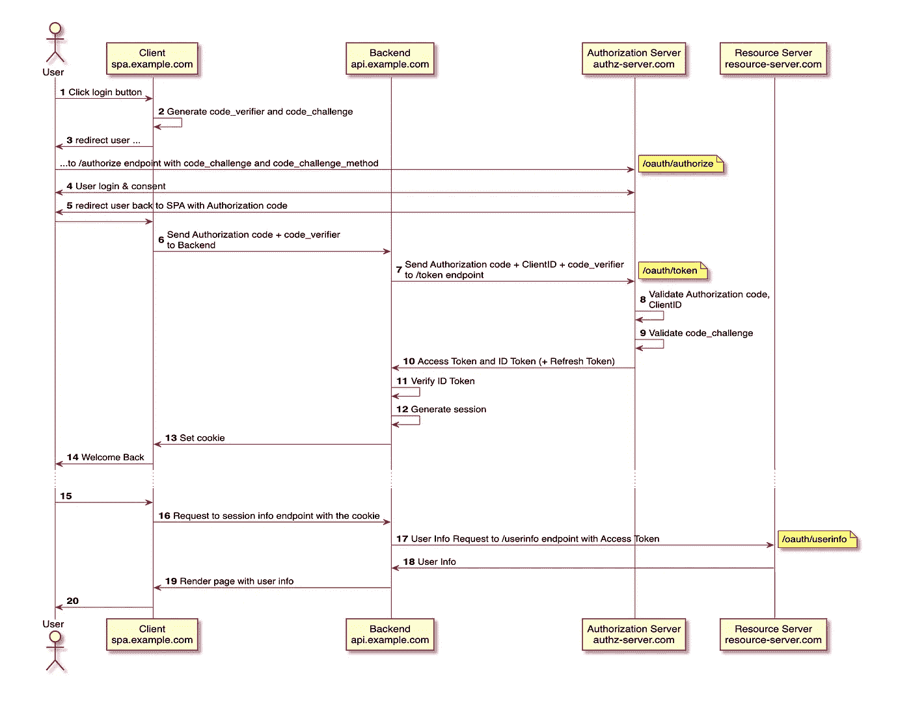
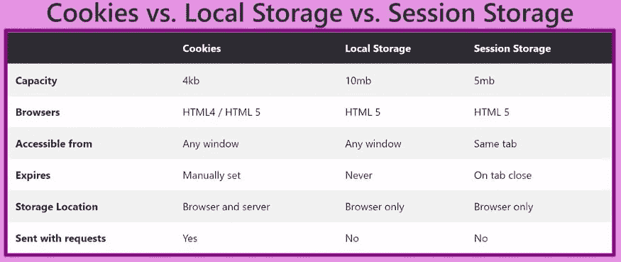
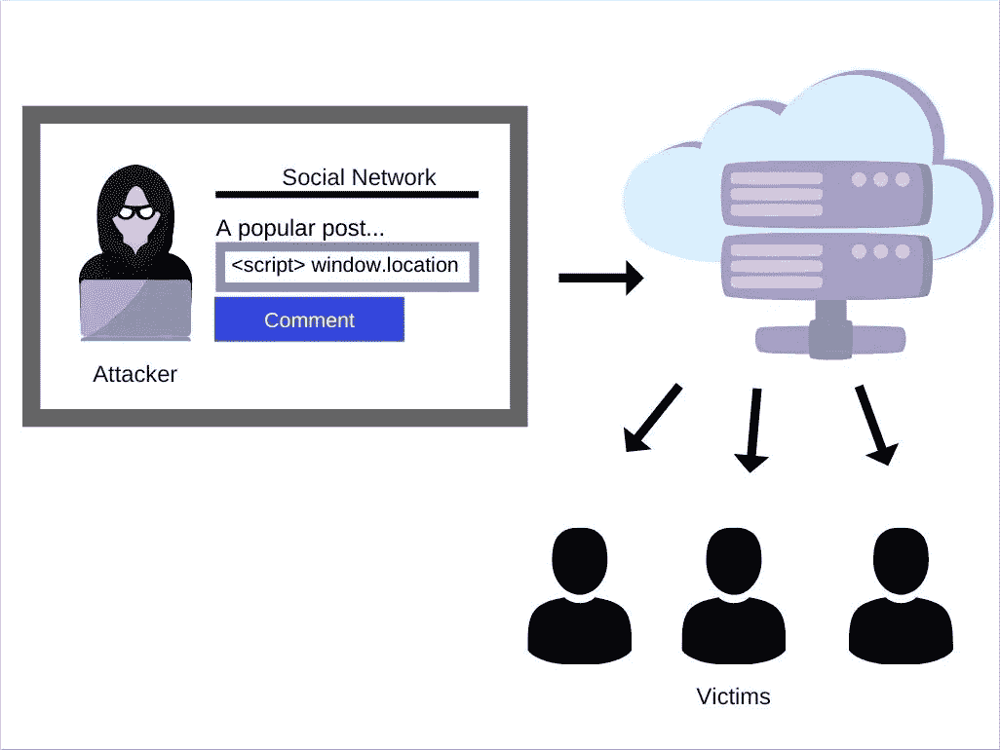

# 单页应用程序的最佳 OAuth 安全实践

> 原文：<https://levelup.gitconnected.com/best-oauth-security-practices-for-single-page-applications-2bb6b44d2890>

我们如何在单页面应用程序(SPA)中保证 OAuth 流的安全？在本文中，让我们了解在开发单页面应用程序(SPA)时可能存在的潜在威胁，以及在 SPA 中实现 OAuth 2.0 的最佳安全实践。


由[法扎德·纳兹菲](https://unsplash.com/@euwars?utm_source=medium&utm_medium=referral)在 [Unsplash](https://unsplash.com?utm_source=medium&utm_medium=referral) 上拍摄的照片

# spa 的共同特征 OAuth 视角下的 spa

首先，让我们看看在水疗中心做 OAuth 时的共同特征。

*   公共客户端
    SPA 在浏览器中运行，而浏览器并不是存储证书信息(如客户端机密)的好地方。如果你把你的客户端密码或 API 密匙放入 Javascript 应用程序，任何人都可以点击查看源代码并看到你的密匙。因此，OAuth 将 SPA 视为公共客户。
*   存储 API 不安全/不灵活
    即使 SPA 可以接收凭据信息，SPA 也没有合适的方法来存储它。当存储访问令牌或刷新令牌时，这也是 SPA 的一个问题。Javascript 代码可以访问的任何地方都存在潜在的跨站点脚本(XSS)漏洞。SPA 只能访问几个存储 API，即 Cookie、LocalStorage 和 SessionStorage。如果您的 Javascript 代码可以访问这些，那么攻击者也有可能访问这些。
*   令牌生命周期通常较短
    由于浏览器环境的上述风险，OAuth 服务器通常对 SPA 有更严格的策略，如更短的令牌生命周期，刷新令牌可能被禁用或只能使用一次。因此，用户必须不时地再次进行身份验证，有几种方法可以减少这种情况，比如使用隐藏的 iframe，向授权服务器发送请求`prompt=none`来检查用户的会话。然而，随着浏览器最近的变化，这些变通办法不再有效。我们将在本文的后面对此进行研究。

# SPA 的授权代码流

由于上述问题，最好的方法是将令牌管理完全置于 Javascript 之外，通过使用带有后端组件的 PKCE 的**授权代码流。看看我之前的一篇文章，为什么我们不应该使用隐式流，为什么推荐 PKCE:[从隐式流到 PKCE — OAuth 2.0 用于 SPA 和移动应用](https://truongnmt.medium.com/from-the-implicit-flow-to-pkce-oauth-2-0-for-spa-and-mobile-apps-df4343938053)**

以下是该解决方案的概述:



在步骤 2 中，SPA 生成 code_verifier 和 code_challenge，创建它的方法是选择一种单向散列方法，例如 SHA256，散列一个纯文本，并得到一个散列字符串。

```
code_challenge_method(code_verifier) = code_challenge# which equivalent tohash_method(plain_text) = hash
```

然后我们准备构建授权码请求，请求看起来像这样:

```
GET https://authz-server.com/oauth/authorize?
  response_type=code&
  client_id=CLIENT_ID&
  redirect_uri=REDIRECT_URI&
  scope="openid public_profile email user_friends"
  state=XXXXXXXX&
  code_challenge=XXXXXXXXXX&
  code_challenge_method=S256
```

接下来，用户被重定向到授权服务器，登录并批准(同意)请求。然后，OAuth 服务器生成授权代码，并在回调中将它发送给 SPA。

```
GET https://spa.example.com/redirect?
  code=AUTHZ_CODE&
  state=XXXXXXXX
```

SPA 验证与步骤 3 中发送的状态相匹配的状态。然后 SPA 将授权码和 code_verifier 转发到后端。从那里，它将发出一个反向信道请求来交换令牌。

```
POST https://authz-server.com/oauth/token?
  grant_type=authorization_code&
  code=AUTHZ_CODE&
  redirect_uri=REDIRECT_URI&
  code_verifier=CODE_VERIFIER&
  client_id=CLIENT_ID
```

然后，授权服务器将验证授权码、客户端 ID，重定向 URI，并使用步骤 3 中接收的 code_challenge 和 code_challenge_method 重新计算 code_verifier。

```
code_challenge_method(code_verifier) == code_challenge?
```

接下来，假设一切都有效，授权服务器将返回访问令牌和 id 令牌(因为我们包含了作用域 openid)。根据授权服务器的策略，它可能会也可能不会返回刷新令牌。

```
HTTP/1.1 200 OK
{
  "access_token": ACCESS_TOKEN,
  "token_type": "Bearer",
  "expires_in": 7200,
  "id_token": "eyJ.xxxxxxxxxx"
}
```

然后后端安全地保存这些信息，可能保存在数据库中。然后，在步骤 13 中，用加密的仅 HTTP 的、安全的、相同站点的 cookies 来设置会话，并且不向前端传递任何令牌。

稍后，当 SPA 想要访问资源服务器或任何内部 API 中的信息时，它用 cookies 调用后端，并让后端发送带有访问令牌的请求(从步骤 16 到步骤 19)。

# iFrame / Popup /重定向？

OpenID Connect 协议支持授权请求上的`prompt=none`参数，该参数允许应用程序指示授权服务器不得显示任何用户交互(如身份验证、同意或 MFA)。这意味着如果用户已经在授权服务器中进行了身份验证，并且已经同意了应用程序，那么返回的结果将没有任何用户界面页面。

通过将`prompt=none`与一个隐藏的 iframe 相结合，SPA 可以尝试在不重定向的情况下登录。这种模式意味着应用程序不需要整个页面重定向来让用户登录，从而提高了性能和用户体验——用户访问网页并已经登录。然而，当第三方 cookies 被阻止时，iframe 中的`prompt=none`不再是一个选项，应用程序必须访问顶级框架中的登录页面才能获得授权代码。此外，我们都知道，在 SPA 中，我们希望尽可能避免全页面刷新。那么，我们应该如何在步骤 3 中进行设计，以便不丢失任何应用程序的状态和上下文呢？有两种方法可以完成登录:

1.  整页重定向
2.  弹出窗口

对于全页面重定向方法，在首次加载 SPA 时，将用户重定向到授权服务器。用户的浏览器将访问登录页面，显示包含用户会话的 cookies，然后使用授权代码重定向回应用程序。重定向确实会导致 SPA 被加载两次。遵循缓存 spa 的最佳实践，这样应用程序就不会被完整下载两次。考虑在应用程序中有一个预加载序列，在应用程序完全解包并执行 JavaScript 有效负载之前，检查登录会话并重定向到登录页面。

如果整个页面重定向的用户体验(UX)对应用程序不起作用，可以考虑使用弹出窗口来处理身份验证。当弹出窗口在认证之后完成重定向到应用程序时，在步骤 5 中接收授权码，并且流程继续。此外，浏览器正在减少对弹出窗口的支持，因此它们可能不是最可靠的选择。在创建弹出窗口之前，用户可能需要与 SPA 进行交互，以满足浏览器要求。

> 苹果[描述了一个弹出方法](https://webkit.org/blog/8311/intelligent-tracking-prevention-2-0/)作为一个临时的兼容性修复，让原始窗口访问第三方 cookies。虽然苹果可能会在未来取消这种权限转让，但这不会影响这里的指导。这里，弹出窗口被用作登录页面的第一方导航，以便找到会话并提供授权码。这应该会持续到未来。

# 利益

首先，推荐解决方案中的后端可能已经存在于您的系统中，它可能是:

*   作为后端对前端范例中的后端组件
*   API 网关或反向代理

通过在后端实现安全敏感的功能，我们可以允许一个更安全的 OAuth 流，它是机密客户端中的 OAuth。这对于刷新令牌有很大的好处，因为主流浏览器正在逐渐阻止第三方 cookies。我们将在另一篇文章中对此进行更深入的探讨。

另一个好处是 SPA 开发人员(通常是前端开发人员)不必关心 OAuth/OIDC 的实现。假设我们有 10 个 SPA 应用程序，如果我们在 SPA 中实现 OAuth/OIDC，我们必须实现 10 次，这并不是说每个应用程序可能有不同的技术堆栈，我们必须考虑选择一个库，研究如何实现它，等等。如果我们把实现留给后端，最好的情况是我们只需要做一次。实现可以由后端开发人员来处理，他们应该对 OAuth 有很深的理解，并负责实现和维护。通过这样做，我们可以分离关注点，前端/后端团队可以专注于他们的工作。

# 为什么不向 SPA 返还代币

当我们在步骤 10 中获得令牌时，为什么我们不将令牌返回给 SPA？好了，现在来谈谈选择是否将代币返还给 SPA 以及如何存储代币的利弊。

正如我们在开头所说，浏览器中没有安全存储 API，浏览器中最大的风险之一是跨站脚本攻击(XSS)。无论您将令牌存储在哪里，您自己的 Javascript 代码也可以被攻击者访问。

Javascript 应用程序存储数据有三种主要方式:

*   本地存储
*   会话存储
*   饼干

LocalStorage 是纯 Javascript，很方便。它允许您存储跨会话持续的数据，即使浏览器关闭，它也将持续存在。SessionStorage 是一个非常类似的 API，只是存储在那里的数据只有在窗口打开时才会持久，因此命名为 Session。Cookies，技术上我们可以用 Javascript 想存多久就存多久。但是最初 cookies 是用来让浏览器在每次请求时自动将它发送到后端的。它不是为应用程序存储而设计的。

所有 3 种存储 API 都有相同的缺点，容易受到 XSS 攻击。这意味着攻击者可以在您的应用程序中运行看起来像合法代码的代码。如果我们在 SPA 中存储令牌，他们可以利用这一点来窃取用户的访问令牌。



Cookies vs 本地存储 vs 会话存储由 FreeCodeCamp 提供

防范 XSS 病毒的最佳方法之一是制定强有力的内容安全策略。这告诉浏览器允许从哪些域加载 Javascript。但是，在当今许多应用程序开发人员依赖如此多的第三方 Javascript 代码的情况下，创建足够强大的内容安全策略可能是一项挑战。也许甚至 CSS 库也需要从某处加载 JS 代码来制作精美的动画。此外，您可以使用弹出其他库的分析、广告或错误报告服务。这意味着您可能并不总是确定 Javascript 代码加载的源代码。其中一个库有 XSS 漏洞，你的应用也有 XSS 漏洞。最后，即使您是最强的 CSP，并且没有在您的应用程序中加载任何外部 Javascript，用户也可能会自己加载。也许他们被骗粘贴一个 JS 代码到开发者控制台(像脸书 unfriend 探测器脚本…)，或者安装了一个恶意的浏览器扩展插件…最终用户的数据也会被窃取。



社交网络上持续的 XSS 攻击——亚历山大·兹拉特科夫

另一种选择是将令牌存储在服务工作者中。Service Worker 是您的浏览器在后台运行的脚本，与主网页完全分离。因此跨站点脚本漏洞无法访问存储在服务工作器中的令牌。一个例子是 [Firebase](https://firebase.google.com/docs/auth/web/service-worker-sessions) 或 [Auth0](https://auth0.com/blog/secure-browser-storage-the-facts/) ，它们使用这种方法进行会话管理并刷新访问令牌。然而，这种方法的缺点是构建起来有点复杂，而且在 IE11 中不工作😱！此外，您的 Javascript 代码实际上不能再自己制作 API，它必须调用服务人员来发送请求并获得响应，然后将它交给您的 Javascript 代码。所以你可能需要稍微修改一下你的代码。

记住这些，考虑一下利弊(方便)和缺点(安全 XSS 漏洞，浏览器兼容)。另一个选择是不存储令牌，将它们保存在内存中，如上图中的步骤 15。通过将 cookie 设置为加密的 HTTP-only，安全的，相同的站点，Javascript 代码不能接触这些 cookie，所以 XSS 不用担心。然而，在每个页面完全重新加载时，用户必须重定向到后端(步骤 16)，提供 cookies 并获取令牌或会话信息，并将其保存在内存中。因此，作为安全性的折衷，当页面加载时，我们首先有一个额外的请求。

# 安全问题

通过使用授权代码流和后端组件的 PKCE 仍然不能使你的 SPA 完全安全。当 SPA 向后端发出请求以获取令牌/会话信息时，如果您有一个 CSRF 漏洞，所有希望都将落空。

所以 SPA 仍然需要防范 XSS 和 CSRF。好消息是水疗中心无论如何都需要这么做。至少 SPA 开发人员不必太关心 OAuth 2.0 的复杂性和棘手性。

# 对于不带后端的 SPA

如果我们有一个部署在静态 web 主机/CDN 中的纯 SPA，这意味着没有后端，我们必须在会话存储或本地存储中存储令牌。请确保您了解在前通道中存储令牌的所有潜在威胁，并遵循以下建议:

*   对 PKCE 使用授权代码流
*   授权服务器支持刷新令牌轮换或
    发送方限制的刷新令牌
*   考虑使用服务人员

# 结论

浏览器仍然不是存储敏感信息的好地方，所以 SPA 的 OAuth 很难。了解潜在威胁以及安全性和用户体验之间的平衡非常重要。本文总结了在为 SPA 执行 OAuth 2.0 时推荐的方法。

然而，由于浏览器最近的变化，各大浏览器都在阻止第三方 cookies，以保护用户的隐私。有几点需要考虑。我们将在下一篇文章中对此进行更深入的探讨。敬请关注:D

# 参考

*   用于基于浏览器的应用的 OAuth 2.0(ietf.org)
*   【aaronparecki.com】单页应用
*   [最佳实践—单页应用 OAuth](https://curity.io/resources/learn/spa-best-practices)(curity . io)
*   [30 分でOpenID Connect 完全に理解したと言えるようになる勉強会](https://speakerdeck.com/d_endo/30fen-deopenid-connectwan-quan-nili-jie-sitatoyan-eruyouninarumian-qiang-hui?slide=115) (
*   用于 spa 的安全 OAuth 2.0/OpenID 连接后端 (Hans Zandbelt)
*   [OAuth 2.0 的螺母和螺栓](https://www.udemy.com/course/oauth-2-simplified/)(aaronparecki.com)
*   [在 Safari 和其他浏览器中处理第三方 cookies 被屏蔽的 ITP](https://docs.microsoft.com/en-us/azure/active-directory/develop/reference-third-party-cookies-spas)(docs.microsoft.com)

*感谢您阅读本文！如果你有任何问题，请留言。如果你觉得这篇文章有帮助，请按住鼓掌按钮，让其他人也能发现。请务必在下面注册我的时事通讯，或者在 Medium 上关注我，以获得更多类似的文章。* ☝️👏 😄