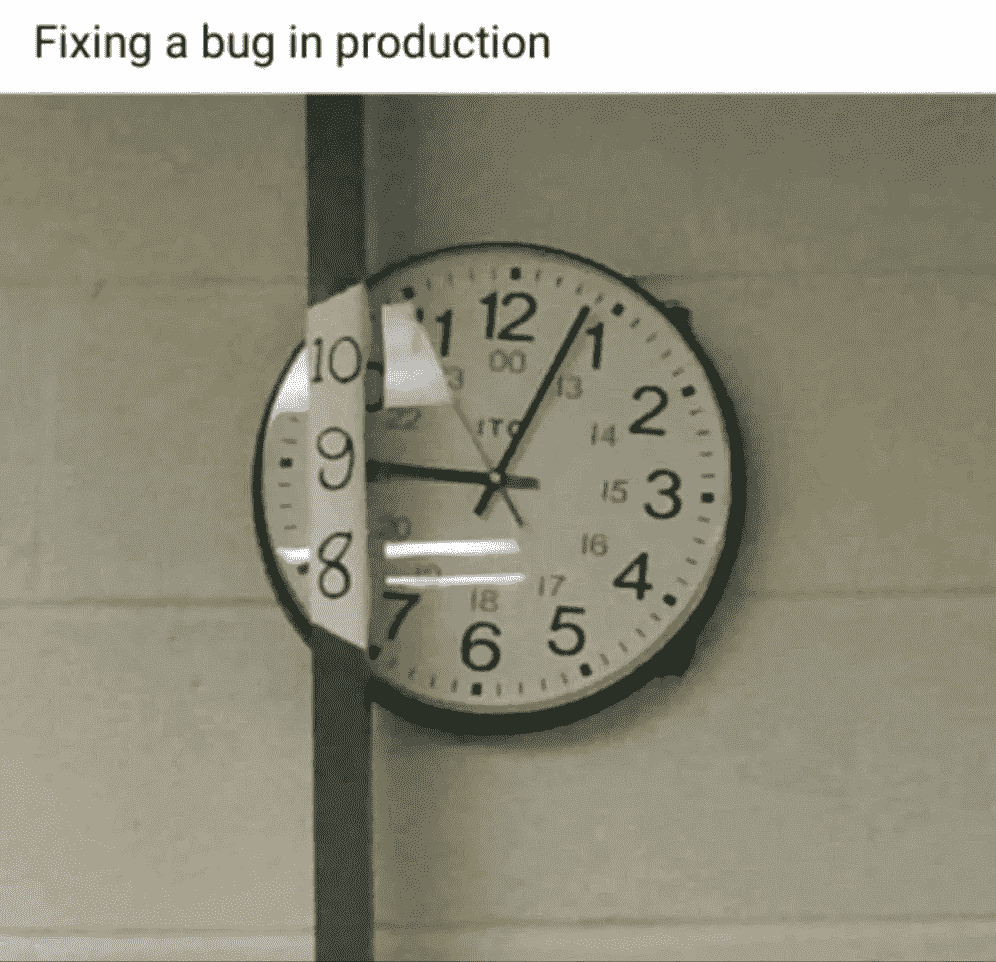

# 最佳升级编码(2022 年 4 月)

> 原文：<https://levelup.gitconnected.com/best-of-level-up-coding-april-2022-7ba46a951fa5>

退出亚马逊，开源工具，设计模式，写好的打字稿，用 Go 构建应用程序，作为一名开发者过上你最好的生活——过去一个月的故事是我们有史以来最好的！

但首先是一个激动人心的更新，关于升级社区最需要的改进之一…

## **🔥大新闻🔥**

升级解决了开发者和公司的招聘问题。

招聘中断:

*   新程序员找不到工作
*   有经验的程序员被无休止地骚扰
*   寻找人才是发展一家伟大软件公司最痛苦的部分

升级可以解决这一切。✨

**找到自己的完美角色:**[**【https://jobs.levelup.dev/talent】**](https://jobs.levelup.dev/talent)

如果有一个平台专注于为像你这样的软件工程师匹配完美的角色，而不是高流动率和痛苦的面试过程，会怎么样？

*   开发者会更高兴
*   开发人员会更有效率
*   开发人员将不再频繁地转移工作

每个人都赢了🏆

> *这是我们的愿景，一切从今天开始。*

如果你是一直在使用 [https://levelup.dev](https://levelup.dev) 工具的 300 多万名月度程序员之一，你会知道我们非常热衷于帮助开发人员发展他们的职业生涯并找到实现目标的机会。这是因为我们自己就是软件工程师，完全理解您所经历的一切。

今天是一个激动人心的旅程的第一步，这个旅程将改变开发人员寻找工作的方式，同时也使伟大的软件公司能够扩大规模。

如果你是开发人员，我们强烈建议你[加入我们的人才集体](https://jobs.levelup.dev/talent)。你可以直接接触到我和我们出色的团队，我们非常高兴能认识你并帮助你找到你梦想中的角色。

**报名不到 5 分钟:**[**https://jobs.levelup.dev/talent**](https://jobs.levelup.dev/talent)

## 🏆🏆🏆热门文章

[**介绍 Nexus—next . js 的组件树可视化工具**](/introducing-nexus-a-component-tree-visualizer-for-next-js-1109f31e118e) | [艾哈迈德·塔里克](https://medium.com/u/1787948b9414# </strong> </a> | <a class=)

[**将 Async/Await 更改为 Promises.all 以加快节点中的 API 调用。JS**](/changing-async-await-to-promises-all-to-speed-up-api-calls-in-node-js-348ea70592fd) | [孙文蝶](https://medium.com/u/51f5316d8db6?source=post_page-----7ba46a951fa5--------------------------------)

[**一份好的编程工作就像退休，只是更好而已**](/a-good-programming-job-is-like-retirement-just-better-f0b4b9de7102?sk=41435b0da5c292b99a69899aef1411a5) | [按键按键](https://medium.com/u/179527732133?source=post_page-----7ba46a951fa5--------------------------------)

[**如何成为一名高度专注的开发人员并更快地实现目标**](/how-to-become-a-hyper-focused-developer-and-achieve-your-goals-faster-c7d788d97492?sk=2241c9aad18d3342c144c13071168a1c)|[Amrit Pal Singh](https://medium.com/u/30594823f191?source=post_page-----7ba46a951fa5--------------------------------)

[**在复杂领域设计软件:领域驱动设计**](/designing-software-in-a-complex-domain-domain-driven-design-10604ad08d12?sk=844332d172585af48b48e14d7254c924) | [比贝克·沙阿](https://medium.com/u/e10d35ca44f2?source=post_page-----7ba46a951fa5--------------------------------)

[**每一个好的自述应该包含什么**](/what-every-good-readme-should-contain-d6a07d1b39f?sk=f83e7bc6e80e1a867d145f81f4fc881d) | [泰勒·霍金斯](https://medium.com/u/5a27f1e0e31b?source=post_page-----7ba46a951fa5--------------------------------)

[**我是一名程序员——不，我不想成为团队成员**](/i-am-a-programmer-no-i-dont-want-to-be-a-team-player-2179560099f5?sk=5a0bf2b54dd7fff289cc4fb670ba61f7) | [笔筒磁铁](https://medium.com/u/739ee1624074?source=post_page-----7ba46a951fa5--------------------------------)

[**防止节点中的暴力攻击。JS**](/prevent-brute-force-attacks-in-node-js-419367ae35e6)|[Poorshad Shaddel](https://medium.com/u/8f1fd23dbcf6?source=post_page-----7ba46a951fa5--------------------------------)

[**欺骗文件扩展名—道德黑客**](/spoofing-file-extensions-ethical-hacking-bd128189738b) | [Gourav Dhar](https://medium.com/u/9d33adb84c2a?source=post_page-----7ba46a951fa5--------------------------------)

[**为什么我们从 Gitbook 转移到 Readme**](/why-weve-moved-from-gitbook-to-readme-a9e5520d382e?sk=170d1785222be5c495f36acda49c6b14)|[Rene Pot](https://medium.com/u/1c0c4af59252?source=post_page-----7ba46a951fa5--------------------------------)

[**适配器设计模式**](/adapter-design-pattern-2ca673e72839) | [Rikam Palkar](https://medium.com/u/ba28c974f718?source=post_page-----7ba46a951fa5--------------------------------)

[**让我们用材质 UI 设置一个 React 类型脚本项目& React 路由器**](/lets-setup-a-react-typescript-project-with-material-ui-react-router-3d7ea8cb5596?sk=a0afb24c16a57285505e4dced4b26bb5) | [沙汗阿玛莎](https://medium.com/u/2ac250657f25?source=post_page-----7ba46a951fa5--------------------------------)

[**Golang 中的选项模式**](/options-pattern-in-golang-9a0384a9d8db)|[himan Shu pandey](https://medium.com/u/dbd4173b1a76?source=post_page-----7ba46a951fa5--------------------------------)

[**graph lock:轻松保护您的 GraphQL 应用程序**](/graphqlock-secure-your-graphql-application-with-ease-e7bc3b85baaa)|[Drake Williams](https://medium.com/u/6aa82da2826d?source=post_page-----7ba46a951fa5--------------------------------)

## 😂本月的迷因

—特雷([@特雷胡芬](https://twitter.com/treyhuffine))