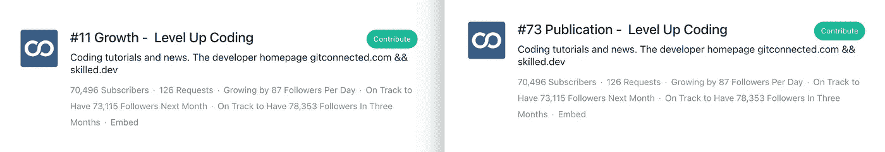

# 最佳升级编码(2021 年 8 月)

> 原文：<https://levelup.gitconnected.com/best-of-level-up-coding-august-2021-842c506d2b65>


杰森·登特在 [Unsplash](https://unsplash.com?utm_source=medium&utm_medium=referral) 上拍摄的照片

休息了一段时间后，[升级编码](https://levelup.gitconnected.com/)简讯回来了，而且比以前更好！在 Level Up 中分享他们的故事的作者都是网络上最好的编程作者，每个月我们都会分享出版物中的热门故事。我们也有最好的编码社区之一(感谢你！)，我们将分享有趣的数据和统计资料，庆祝我们的作者和读者的成长和贡献。

```
I launched a technical interview platform, check it out!👉 [**Coding Interview Course - Skilled.dev**](https://skilled.dev/) 👈For being a member of the Level Up Coding community, get an exclusive 20% discount by using code **LEVELUP** at checkout!
```

由于我们已经有一段时间没有发送时事通讯了，所以这个月我们将提供一个关于这个社区已经变得有多大以及增长速度有多快的更新。



*资料来源:Smedian.com*[*成长*](https://toppubs.smedian.com/growth) *和* [*出版排名*](https://toppubs.smedian.com/)

最近，Level Up Coding 拥有 70，000 名追随者，是整个媒体平台上第 73 大出版物。更令人兴奋的是，我们是增长最快的出版物中排名第 11 位的，并且我们很快就会有 10 万名追随者！看到通过社区学习编码和与其他开发人员联系的热情和兴奋，既令人谦卑又令人难以置信地有趣。

## 热门文章

[**如何设计一个可以扩展到你的第一个 1 亿用户的系统**](/how-to-design-a-system-to-scale-to-your-first-100-million-users-4450a2f9703d?source=friends_link&sk=b102a48a006261b97cb3dbd747a1ee75) | [Anh Dang](https://medium.com/u/7bea6a19463b?source=post_page-----842c506d2b65--------------------------------)

为什么你还在创建 CRUD APIs？ | [尼克拉斯·米勒德](https://medium.com/u/7c7a43b3d9de?source=post_page-----842c506d2b65--------------------------------)

[**如何提高软件架构技巧每日一**](/how-to-improve-software-architecture-skills-daily-6f362d4e6493?source=friends_link&sk=2f4571b0b07c37fae13288831dd1274c) | [Ella sheer](https://medium.com/u/3f4ff048c2b7?source=post_page-----842c506d2b65--------------------------------)

[**我用来在以太坊区块链上创作和出售自己的 NFT 艺术品的确切流程**](/the-exact-process-i-used-to-create-and-sell-my-own-nft-art-on-the-ethereum-blockchain-698d9c59a2fe?source=friends_link&sk=28fc51bdd3ead8730202093a5ab50240) | [托比·黑兹伍德](https://medium.com/u/a4047ff95dbc?source=post_page-----842c506d2b65--------------------------------)

[**CSS 很神奇，是时候试试 3D 了**](/css-is-magic-its-time-you-try-3d-91a2dd49c781?source=friends_link&sk=f2a8e7c4c3484c4d4fddedde2e67d9e3)|[Ankita Chakraborty](https://medium.com/u/94adfd5c0332?source=post_page-----842c506d2b65--------------------------------)

[**代码为**](/10-interesting-python-programs-with-code-b676181a2d1a?source=friends_link&sk=79151166f808f93a9ed30d2b9a10a224) | [Swathi Arun](https://medium.com/u/d98483189776?source=post_page-----842c506d2b65--------------------------------) 的 10 个有趣的 Python 程序

[**学会这 9 条规则，立即开始编写干净的代码**](/learn-these-9-rules-to-start-writing-clean-code-immediately-a7ee40fe1e1b?source=friends_link&sk=245e3a3fa11ec6ad02e61609ba9d768f) | [乔治·斯图德科](https://medium.com/u/5c8795610167?source=post_page-----842c506d2b65--------------------------------)

[**我不想再共事的程序员类型**](/the-types-of-programmers-i-dont-want-to-work-with-again-9e1ea0e92ff6?source=friends_link&sk=75a0e98ee1a81948dc7a6e1e857e7927) | [按键按键](https://medium.com/u/179527732133?source=post_page-----842c506d2b65--------------------------------)

[**现代全栈开发者 Tech Stack 2021**](/modern-full-stack-developer-tech-stack-2021-69feb9af13f3?source=friends_link&sk=0592a467fb396cc97e9cb3053179f326) | [安德鲁·拜斯登](https://medium.com/u/735e285cc92e?source=post_page-----842c506d2b65--------------------------------)

[**作为一名软件工程师，以下是你应该长期呆在一家公司的原因**](/as-a-software-engineer-here-is-why-you-should-stay-in-a-company-for-a-long-time-c643e0f31fe8?source=friends_link&sk=6ca23a3beefdb0b482b9f317214e6dbe) | [Cinto](https://medium.com/u/80f4993f79be?source=post_page-----842c506d2b65--------------------------------)

[**苹果面试题库**](/apples-interview-questions-database-784d72f8d061?source=friends_link&sk=b4554147ad213fd943c319ea6cbdbe5e)|[Anjali Viramgama](https://medium.com/u/b9e3e12f9963?source=post_page-----842c506d2b65--------------------------------)

[**从初级开发人员过渡到高级开发人员的 6 步法**](/6-step-approach-to-transition-from-junior-developer-to-senior-developer-59550129179f?source=friends_link&sk=e8e9e3ccfba36efc36c3eafdc78c6d22)|[Amrit Pal Singh](https://medium.com/u/30594823f191?source=post_page-----842c506d2b65--------------------------------)

[**不同类型的软件工程和技术专业人员的工资**](/salaries-of-different-types-of-software-engineering-and-tech-professionals-7802bc7457e6?source=friends_link&sk=b98a36ecc5f6e5fb95392f06bd348ee5) | [企业程序员](https://medium.com/u/67a9c31b5a5f?source=post_page-----842c506d2b65--------------------------------)

[**25 Github 库每个 Python 开发者都应该知道的**](/25-github-repositories-every-python-developer-should-know-ac848f6aa1fe?source=friends_link&sk=1f4ba29498dbd9187c70db4ce8036dad)|[ab hay Parashar](https://medium.com/u/76f234261155?source=post_page-----842c506d2b65--------------------------------)

[**你应该知道的 5 个强大的 Python 俏皮话**](/5-powerful-python-one-liners-you-should-know-469b9c4737c7?source=friends_link&sk=0893a367b6c85030001083af82d39b0e) | [高尔基姆·阿尔斯兰](https://medium.com/u/b6a34318e0e?source=post_page-----842c506d2b65--------------------------------)

[**我在亚马逊工作时用过的最好的工具**](/the-best-tool-i-learned-about-working-at-amazon-f6153af77d62?source=friends_link&sk=d20b7805fd4e8ea2a1d9bbe6767fdc35) | [安东尼·奥莱尼克](https://medium.com/u/252482b05eb?source=post_page-----842c506d2b65--------------------------------)

[**开采氦气如何能每月创收 1000 美元**](/how-mining-helium-can-generate-over-1-000-per-month-d9007da6cb56?source=friends_link&sk=883db8c72e51c94f60fd489a2ce8c37e) | [威尔·诺里斯](https://medium.com/u/cdc90d83711?source=post_page-----842c506d2b65--------------------------------)

[**让你 LOL 的终极编程笑话**](/ultimate-programming-jokes-that-will-make-you-lol-ef791b59d207?source=friends_link&sk=1b72ee1f5a4bd482879805c9d3f008b7)|[Pralabh Saxena](https://medium.com/u/d06730236db8?source=post_page-----842c506d2b65--------------------------------)

对交易、投资、加密货币、Python/AI/ML 感兴趣？关注全新的[inside finance 出版物👉](https://wire.insiderfinance.io/)

你们已经使 Level Up 编码成为最好的编码社区之一，我很高兴能够继续拥有一个令人敬畏的 2021 年。注意安全！

— Trey ( [@treyhuffine](https://twitter.com/treyhuffine) )