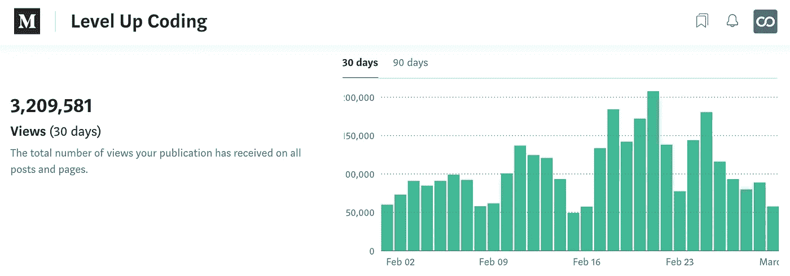

# 最佳升级编码(2020 年 2 月)

> 原文：<https://levelup.gitconnected.com/best-of-level-up-coding-feb-2020-b579adac6c35>

从《向上编码》看 2020 年 2 月的最佳文章。我们还想突出我们的社区，我将分享每个月的观点和增长统计数据。如果您对更多数据感兴趣，请查看底部的完整概述。

另外，我们推出了 [**开发者简历生成器→**](https://gitconnected.com/resume-builder)

它是🔥🔥🔥

从 1 月到 2 月，我们的文章浏览量从 230 万增加到了 320 万。你们都太不可思议了，拥有这样一个充满激情的社区真是太棒了。

[**你不再需要特性分支**](/why-are-so-many-people-against-trunk-based-development-a785d9322584?source=friends_link&sk=45c5c7c78107e4f8acc9415e3aacd287) 和 [**8 年以上的经验不是高级软件工程师的定义**](/8-years-of-experience-isnt-the-definition-of-a-senior-software-engineer-f3ed904e3bc9?source=friends_link&sk=e258f48e7af205ff738afd280c944bac)|[Tylor Borgeson](https://medium.com/u/e0f90028fcdb?source=post_page-----b579adac6c35--------------------------------)

[**我作为初级软件工程师最大的错误**](/my-biggest-mistakes-as-a-junior-software-engineer-b1e8fc842be6?source=friends_link&sk=7d31f81463693896916568db7364fbe2) | [丹·高斯伦](https://medium.com/u/f7d3d387ffc7?source=post_page-----b579adac6c35--------------------------------)

[**优秀和伟大程序员之间的巨大差异**](/the-powerful-differences-between-good-and-great-programmers-276f6d5bed52?source=friends_link&sk=3ae31921532d03a5c1f10aafc957355c) | [拉威·香卡·拉詹](https://medium.com/u/e373e0ecf6a3?source=post_page-----b579adac6c35--------------------------------)

[**好的程序员是懒惰的程序员**](/a-good-programmer-is-a-lazy-programmer-8982b2d971bb?source=friends_link&sk=b298735d36ad70e59c71e97dbd63dc7c) | [丹尼尔邦](https://medium.com/u/a42b884d3c40?source=post_page-----b579adac6c35--------------------------------)

[**停止使用‘var’在 JavaScript 中声明变量**](/stop-using-var-to-declare-variables-in-javascript-6c0caec16f43?source=friends_link&sk=4f7e69513fd5af2e939484ddfa834c70) | [乔纳森·许](https://medium.com/u/d2ef7f5ede53?source=post_page-----b579adac6c35--------------------------------)

[**JavaScript 最佳实践—性能**](/javascript-best-practices-performance-a549bc87ed20?source=friends_link&sk=b81bf8fe2f1718662fbc32323bb9a5a6) | [John Au-Yeung](https://medium.com/u/5253c50d76c1?source=post_page-----b579adac6c35--------------------------------)

[**你应该知道的技巧、诀窍和 JavaScript 特性的终极指南**](/ultimate-guide-to-tips-tricks-and-javascript-features-you-should-know-27e0a4a6ffdf?source=friends_link&sk=28a7518ad4e3aeb49a8c696a9da3f183) | [丹尼尔·莫夫谢恩](https://medium.com/u/796335cf7809?source=post_page-----b579adac6c35--------------------------------)

[**影响你的代码库的 10 种编程代码气味**](/10-programming-code-smells-that-affect-your-codebase-e66104e0341d?source=friends_link&sk=5e6c85deb2e1c1cae13a3c63d7c9266e) | [马可·安东尼奥·吉亚尼](https://medium.com/u/adc3842a46ab?source=post_page-----b579adac6c35--------------------------------)

[**使用 Lambda 处理 35 万个 3 美元的请求**](/handling-350k-requests-for-3-using-lambda-c258ace3da58?source=friends_link&sk=2e3ce7eeb3e83ccad61b9dc2547aec1e)|[Burak Karakan](https://medium.com/u/85166a1a0415?source=post_page-----b579adac6c35--------------------------------)

[**用 Javascript 求解赎金笔记算法**](/solving-the-ransom-note-algorithm-in-javascript-72ebe8acb268?source=friends_link&sk=fc42f5015b42315b56238a60430fe895) | [诺姆·绍尔-乌特利](https://medium.com/u/4a3c4c41313c?source=post_page-----b579adac6c35--------------------------------)

[**我是如何从一名会计学生过渡到前端开发人员的**](/how-i-transitioned-from-an-accounting-student-to-a-front-end-developer-1ab3ab1cf9e8?source=friends_link&sk=de292432a2f641b8a7a6f0d1784e8fd9) | [Amaechi Amarachi](https://medium.com/u/28d15bdf5b84?source=post_page-----b579adac6c35--------------------------------)

[**node . js 和 WebSockets 入门**](/getting-started-with-node-js-and-websockets-f22dd0452105?source=friends_link&sk=54ecdb097c6b9fda7e1b1ce5989529fe) | [迈克·克罗宁](https://medium.com/u/fabe5f8ed616?source=post_page-----b579adac6c35--------------------------------)

[**JavaScript 中的安全容器**](/safe-containers-in-javascript-functional-programming-for-javascript-developers-67a32838e9d9?source=friends_link&sk=3ff98016da451df071f034f08a6611b7) | [简-维达尔·坦伯格·巴克](https://medium.com/u/e16d58e6a37c?source=post_page-----b579adac6c35--------------------------------)

[**EcmaScript vs TypeScript—私有字段**](/ecmascript-vs-typescript-private-fields-640ae37aa162?source=friends_link&sk=8359d97c4610bfde190f0f61018ad04d) | [耶鲁安欧文手](https://medium.com/u/dc695ec3c2c2?source=post_page-----b579adac6c35--------------------------------)

[**6 分钟学会 hip lot——脸书用于机器学习可视化的 Python 库**](/learn-hiplot-in-6-mins-facebooks-python-library-for-machine-learning-visualizations-330129d558ac?source=friends_link&sk=cf98530636cf955c38c747082f6390f6)|[(EJ)Vivek Pandey](https://medium.com/u/92b2e957e86b?source=post_page-----b579adac6c35--------------------------------)

[**Git Rerere 命令—自动解决合并冲突**](/the-git-rerere-command-automate-solutions-to-fix-merge-conflicts-d501a9ab9007?source=friends_link&sk=34a8aef4c83cacb9d883462443246d90) | [Minh Pham](https://medium.com/u/1368e74ccc42?source=post_page-----b579adac6c35--------------------------------)

[**为什么 Golang 而不是 Python？哪种语言最适合 AI？**](/why-golang-and-not-python-which-language-is-perfect-for-ai-687d2e8accb5?source=friends_link&sk=1f55d368a3982722badeff35d7dc0e97) | [迈克尔·利亚姆](https://medium.com/u/c8f0cc250057?source=post_page-----b579adac6c35--------------------------------)

[**最佳编程迷因**](/the-best-programming-memes-b435d1bf918d?source=friends_link&sk=e64ae40de4abc09c893918476155d12f) | [金奎大](https://medium.com/u/9a5b40458190?source=post_page-----b579adac6c35--------------------------------)

# 统计数据

每个月我都想庆祝我们的社区，并分享有趣的统计数据。

[**gitconnected.com**](https://gitconnected.com/)**统计:**

*   467 名新开发者注册
*   1700+[简历](https://gitconnected.com/resume-builder)查看
*   1，300 多项技能添加到个人资料中
*   18，700+ [组合 API](https://gitconnected.com/portfolio-api) 请求

[**升一级编码**](https://levelup.gitconnected.com/) **出版统计:**

*   320 万次文章浏览
*   27 794 名追随者(+3 537 人)
*   单日最大读取量，首次超过 20 万次(207，692 次)

—[Trey](https://medium.com/@treyhuffine)|[@ git connected](https://twitter.com/gitconnected)