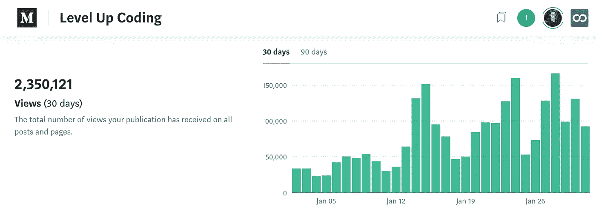

# 最佳升级编码(2020 年 1 月)

> 原文：<https://levelup.gitconnected.com/best-of-level-up-coding-jan-2020-50ec4cc056f8>

从《向上编码》看 2020 年 1 月的最佳文章。我们还想突出我们的社区，我将分享每个月的观点和增长统计数据。如果您对更多数据感兴趣，请查看底部的完整概述。

[**你应该采用的编程习惯**](/programming-habits-you-should-adopt-8ab75419fb09?source=friends_link&sk=18c4b610d71ddd52267e9ac846ea99e8) | [【金奎大】](https://medium.com/u/9a5b40458190?source=post_page-----50ec4cc056f8--------------------------------)

[**“测试驱动开发被高估了”**](/test-driven-development-is-overrated-ad9f0491c11d?source=friends_link&sk=dfae478ab43c85197de05ece9b3da162) | [Tylor Borgeson](https://medium.com/u/e0f90028fcdb?source=post_page-----50ec4cc056f8--------------------------------)

[**好的开发者都是务实不感性的**](/good-developers-are-practical-not-emotional-a57d04376bd2?source=friends_link&sk=6d46c99896ed8e6995adab442329b928) 和 [**如何写好代码文档**](/how-to-write-good-code-documentation-23d4d4297a?source=friends_link&sk=1676466b90f22367af8290e1e6b1e3a0) | [拉威·香卡·拉詹](https://medium.com/u/e373e0ecf6a3?source=post_page-----50ec4cc056f8--------------------------------)

[**我正在 Macbook 上编程，这里有一些工具让我的生活变得更简单**](/im-programming-on-a-macbook-and-here-are-the-tools-that-make-my-life-easier-905b74b48c6d?source=friends_link&sk=d7c2f02810633bb5f55c0cbba4bd1bc5) | [塞巴斯蒂安·维托夫斯基](https://medium.com/u/ef2592fc3d59?source=post_page-----50ec4cc056f8--------------------------------)

[**更快在 Python 中列出**](/faster-lists-in-python-4c4287502f0a?source=friends_link&sk=e36f9784779efb6f423bc4df995f05b6) | [大卫·蒂皮特](https://medium.com/u/29b5fd918fd3?source=post_page-----50ec4cc056f8--------------------------------)

[**亲爱的回环迷们:让我们和平地使用阵列方法**](/dear-for-loop-fans-let-us-use-array-methods-in-peace-af851ca9e85f?source=friends_link&sk=1db7410bcd2d870663be865ce9946e34) | [迈克·克罗宁](https://medium.com/u/fabe5f8ed616?source=post_page-----50ec4cc056f8--------------------------------)

[**为什么要抛弃 JavaScript 中的 for…in 循环——在 JS 中迭代对象的最佳方式**](/why-its-time-to-ditch-the-for-in-loop-in-javascript-75327f74004d?source=friends_link&sk=81b74ae6285720ac212b8be78152bb5a)**|[John Au-Yeung](https://medium.com/u/5253c50d76c1?source=post_page-----50ec4cc056f8--------------------------------)**

**[**2020 年网络开发者路线图**](/the-2020-web-developer-roadmap-76503ddfb327?source=friends_link&sk=ac41a0451e8f5267744e2694968a6df8) | [特雷·赫芬](https://medium.com/u/47e700e59e44?source=post_page-----50ec4cc056f8--------------------------------)**

**[**理解 Javascript 中的函数式编程—完全指南**](/understanding-functional-programming-in-javascript-a-complete-guide-e85ed13b42c8?source=friends_link&sk=7c7fbdda6fe72827d0f5dac49417a47e) | [安德鲁·戴维斯·埃斯卡洛纳](https://medium.com/u/5979728c4259?source=post_page-----50ec4cc056f8--------------------------------)**

**[**在 AWS 上部署微服务的实用指南**](/a-practical-guide-to-deploying-microservices-on-aws-6a8ddd298f7e?source=friends_link&sk=381e68850d3d9659aad26bb4b7b1aa80)**|[Idan Lupinsky](https://medium.com/u/2b05f59e629e?source=post_page-----50ec4cc056f8--------------------------------)****

****[**被谷歌拒绝了！**](/i-got-rejected-by-google-1ab8f7a4908e?source=friends_link&sk=e355b2b7ed4141d994372efb262d19f7)**|[hrishekesh Suslade](https://medium.com/u/9d3b1a745e28?source=post_page-----50ec4cc056f8--------------------------------)******

******[**你需要一份代码审查清单**](/you-need-a-code-review-checklist-1524e6a2d2cd?source=friends_link&sk=8af716bebedef8c1d5aeddd7d0dba488) | [丹·高斯伦](https://medium.com/u/f7d3d387ffc7?source=post_page-----50ec4cc056f8--------------------------------)******

****[**用编码标准写出更好的代码**](/write-better-code-with-coding-standards-546faf3fd4d1?source=friends_link&sk=48eb712c5a9d52f3747bbcfa1983071e) | [Mahdhi Rezvi](https://medium.com/u/19c90c54b753?source=post_page-----50ec4cc056f8--------------------------------)****

****[**飘飘镖系列**](https://levelup.gitconnected.com/fluttering-dart/home) | [康斯坦丁斯坦](https://medium.com/u/639e347813a2?source=post_page-----50ec4cc056f8--------------------------------)****

****[**匿名网刮有 Node.js、Tor、木偶师和 cheerio**](/anonymous-web-scrapping-with-node-js-tor-apify-and-cheerio-3b36ec6a45dc?source=friends_link&sk=eb8290c8f31a63ac9623f76df739f99e)**|[George Gkasdrogkas](https://medium.com/u/57c1ad83400?source=post_page-----50ec4cc056f8--------------------------------)******

******[**3 干净代码的 JavaScript 重构技术**](/3-javascript-refactoring-techniques-for-clean-code-c356be1abbcb?source=friends_link&sk=0e405a4f8760ad508fad52eff6d8896b)**|[Marco Antonio GHI ani](https://medium.com/u/adc3842a46ab?source=post_page-----50ec4cc056f8--------------------------------)********

******[**如何在 JavaScript Arrow 函数中接受任意数量的参数**](/how-to-accept-any-number-of-arguments-in-a-javascript-arrow-function-ed9ba66ed53f?source=friends_link&sk=fc9dce98881941dbbb95d94383571dbe) | [阿曼达·特勒](https://medium.com/u/62a7f3c62753?source=post_page-----50ec4cc056f8--------------------------------)******

****[**2020 年开发者需要的 5 项技术技能**](/5-technical-skills-developers-need-in-2020-95960f6c10fb?source=friends_link&sk=362a5c7b14d2d14e7cf6db029d428b7a)**|[SeattleDataGuy](https://medium.com/u/41cd8f154e82?source=post_page-----50ec4cc056f8--------------------------------)******

******[**今天写更好的 Python 代码**](/write-better-python-code-today-3c7566a695e2?source=friends_link&sk=39adcf745921e5b3087f33facffb06f9) | [朱莉紫苏加西亚](https://medium.com/u/ca65158881a5?source=post_page-----50ec4cc056f8--------------------------------)******

****[**你可能还不知道的 3 个 Python 列表理解技巧**](/3-python-list-comprehension-tricks-you-might-not-know-yet-5891d904ee76?source=friends_link&sk=825570f35e5a87aec014f41ac9f6cde1) | [汤姆·沃特曼](https://medium.com/u/26a3909adc91?source=post_page-----50ec4cc056f8--------------------------------)****

## ****统计数据****

****每个月我都想庆祝我们的社区，并分享有趣的统计数据。过去的一个月是该出版物最大的一个月，这是令人难以置信的兴奋。****

****[**gitconnected.com**](https://gitconnected.com/)**统计:******

*   ****414 名新开发人员注册****
*   ****Beta 发布了一个开发者简历生成器(还没有登陆页面，但是这里有一个例子是关于我的****
*   ****1，000 多项技能添加到个人资料中****
*   ****12，000 个以上[投资组合 API](https://gitconnected.com/portfolio-api) 请求****

****[**升一级编码**](https://levelup.gitconnected.com/) **出版统计:******

*   ****235 万次文章浏览****
*   ****24 257 名追随者(+3 422 名)****
*   ****最大单日浏览量为 166，319 篇****

****我很乐意分享其他数据。如果您有任何要求，请随时联系我们。****

****感谢 2020 年有这么好的开始，我为又一个令人惊叹的一年感到兴奋！****

****— [特雷](https://medium.com/u/47e700e59e44?source=post_page-----50ec4cc056f8--------------------------------) | [@gitconnected](https://twitter.com/gitconnected)****