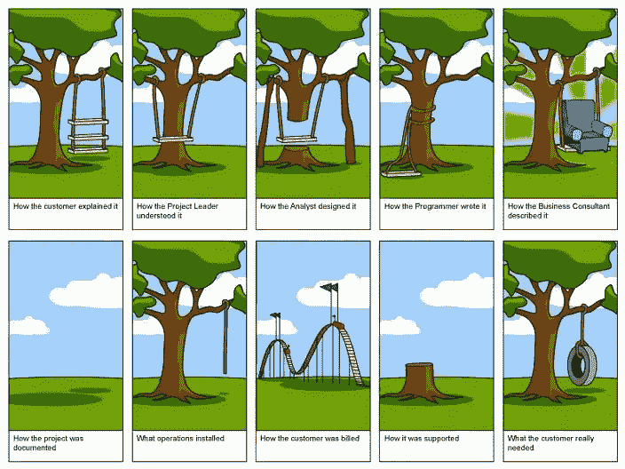

# 最佳升级编码(2022 年 7 月)

> 原文：<https://levelup.gitconnected.com/best-of-level-up-coding-july-2022-dc4311f12ff1>

Elon Musk 永远不会无聊，原生 web 组件在过去的一个月里受到了一些喜爱，开始你的职业生涯时没有 CS 学位，知道何时转移到下一份工作，以及成为不可思议的开发人员的工具——我们再次回来分享上个月的最佳故事🔝。

> [***第一天未来理工大招兵***](https://levelup.pallet.com/talent/welcome?referral=true) *➡️*

# 📣社区更新📣

我们推出了一个 [**采访系列**](https://levelup.gitconnected.com/interviews/home) ，在这里我们向最有趣和最具创新性的科技初创公司的创始人和软件架构师学习([要求让贵公司采访➡️](https://forms.gle/RF785TACYuVYaTiD7) )。请务必查看我们的前三次采访:

*   [我们如何构建 daily.dev，这个超过 15 万人的开发者社区](/how-we-built-daily-dev-the-150k-developer-community-27877e468bad)
*   [我们如何使用 Rust 和低级编程来构建 MetalBear](/how-we-use-rust-and-low-level-programming-to-build-metalbear-df567c399bcc)
*   [我们如何构建一个人工智能代码完成工具，将开发者的生产力提高一倍以上](/how-we-built-an-ai-code-completion-tool-that-will-more-than-double-developer-productivity-d1a5aa7bfb25)

```
🔥 **Meet the best startups and tech companies** Level Up is on a mission to disrupt tech recruiting. Have the best startups request to hire you.

👉 [**Join the Level Up talent collective**](https://jobs.levelup.dev/talent/welcome?referral=true) [**➡️**](https://jobs.levelup.dev/talent/welcome?referral=true)
```

# **🏆热门文章🏆**

[**为什么我在 10 年后退出 Android 开发，我现在打算做什么**](/why-i-left-android-development-after-10-years-and-became-a-backend-developer-86ebf3595d43) | [艾哈迈德·塔里克](https://medium.com/u/addf31fcea4d# </strong> </a> | <a class=)

[**VMware 面试经历**](/vmware-interview-experience-f0655f5b4692) | [里提内玛](https://medium.com/u/231e290d5aca?source=post_page-----dc4311f12ff1--------------------------------)

[**如何在 Angular 中使用 Web 组件**](/how-to-use-web-components-in-angular-c5d1d7825ca0?sk=5d74cb70a5bd9d08e24fad2d6646e8eb)|[Marius Bongarts](https://medium.com/u/f6e6b5239e7f?source=post_page-----dc4311f12ff1--------------------------------)

[**在你的设计系统中使用 web 组件的 5 个理由**](/5-reasons-to-use-web-components-in-your-design-system-bff59d066cbf) | [背光](https://medium.com/u/314fe9cc699d?source=post_page-----dc4311f12ff1--------------------------------)

[**面向 C++库的调试**](/c-library-oriented-debugging-c97390165818) | [Aviv Avitan](https://medium.com/u/b1ef8b7c4ba?source=post_page-----dc4311f12ff1--------------------------------)

你觉得自己像个二流软件工程师吗？ | [阿提拉·瓦格](https://medium.com/u/2053aaf853f5?source=post_page-----dc4311f12ff1--------------------------------)

[**让你的 Android 工作室看起来棒极了**](/make-your-android-studio-look-awesome-ec982d1e0dfe)|[Prachi Jamdade](https://medium.com/u/49a7478e4e39?source=post_page-----dc4311f12ff1--------------------------------)

[**es 2022 发布后的 JavaScript 新特性**](/whats-new-in-javascript-after-the-es2022-release-de13dd091a61?sk=d3e3bfce353789d759599ae3a38ef544)|[Sean Amarasinghe](https://medium.com/u/6bf721df9465?source=post_page-----dc4311f12ff1--------------------------------)

[**如何编写性能更好的 React 函数组件**](/how-to-write-better-performing-react-function-components-8e3216a788ff?sk=13e07f5590c8e790fa3fe82bef91fcea) | [Zachary Lee](https://medium.com/u/8a4a4f5642d?source=post_page-----dc4311f12ff1--------------------------------)

[**TypeScript—‘任何’和‘未知’类型的区别**](/typescript-difference-between-any-and-unknown-types-1fff4bf232a) | [乔尔·池](https://medium.com/u/5ec393008085?source=post_page-----dc4311f12ff1--------------------------------)

[**每个开发者都希望早点知道的 7 个现象级网站**](/7-phenomenal-websites-that-every-developer-wish-they-knew-earlier-7cc35669859a?sk=747e28dc01d532825ffd9c5004810742) | [Vivek Naskar](https://medium.com/u/873738f2db55?source=post_page-----dc4311f12ff1--------------------------------)

[**提高角初始负荷时间**](/improving-angular-initial-load-time-fba8b1289c48) | [克里斯蒂安-弗罗林卡利纳](https://medium.com/u/5f9609165a80?source=post_page-----dc4311f12ff1--------------------------------)

# **😂本月的迷因😂**



[**第一节未来理工大招聘**](https://levelup.pallet.com/talent/welcome?referral=true) ➡️

— Trey ( [@treyhuffine](https://twitter.com/treyhuffine) )