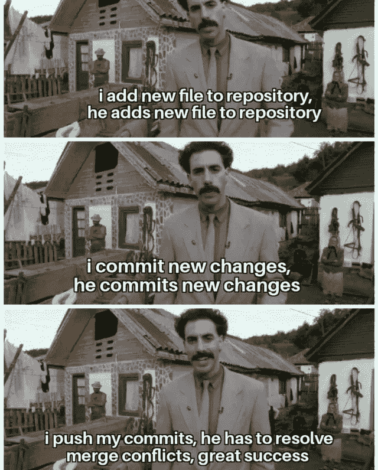

# 最佳升级编码(2022 年 6 月)

> 原文：<https://levelup.gitconnected.com/best-of-level-up-coding-june-2022-efd147b11793>

浏览器中的 Python，给愤怒的工程师的建议，Elon Musk 对管理的看法，JavaScript/TypeScript，Python，Go，以及大量帮助你成为更好的程序员的技巧—🏎️扣住了过去一个月在《升级编码》中分享的顶级文章。

## 🔥大新闻🔥

升级解决了开发者和公司的招聘问题。

招聘中断:

*   新程序员找不到工作
*   有经验的程序员不断收到消息
*   寻找人才是发展一家伟大软件公司最痛苦的部分

升级可以解决这一切。✨

[**→通过升级**](https://levelup.pallet.com/talent/welcome?referral=true)**↓**️找到令人惊叹的软件工程工作


```
Join the Level Up talent collective, and be connected to top software companies.

[**Join the Level Up Talent Collective**](https://levelup.pallet.com/talent/welcome?referral=true)➡️
```

## 🏆热门文章🏆

[**你对抗愚蠢的世界——给愤怒的工程师的建议**](/you-versus-a-world-of-stupidity-advice-for-angry-engineers-819550142477) | [埃里克·赫尔曼森](https://medium.com/u/6316ffcf917d?source=post_page-----efd147b11793--------------------------------)

[**让你成为更好的开发者的 5 个高级 JavaScript 概念**](/5-advanced-javascript-concepts-that-will-make-you-a-better-developer-5d04292107a1?sk=2ba38f3cd85fdc7b4a28bff0b1a70279) | [亨里克·拉森·托夫特](https://medium.com/u/917364f47e35?source=post_page-----efd147b11793--------------------------------)

[**埃隆·马斯克刚刚在软件领域重新定义了管理**](/elon-musk-just-redefined-management-in-sofware-164287fdd3a1?sk=0ff5b85a57ab487ed9cebc869b545725) | [默罕默德·阿亚尔](https://medium.com/u/f2f097ed2ac0?source=post_page-----efd147b11793--------------------------------)

[**CQRS 的微服务和 NestJS 的 TypeScript 中的事件外包**](/microservices-with-cqrs-in-typescript-and-nestjs-5a8af0a56c3a?sk=b1cffb1cf564ef22a536d03c66b779ad) | [凯文·沃格尔](https://medium.com/u/a96fa42a46dd?source=post_page-----efd147b11793--------------------------------)

[**AWS 正在追工程师**](/aws-is-chasing-engineers-afedbe05a0de?sk=5e7b0a15ed8e2722e97641c8dfa2ef75) | [笔磁铁](https://medium.com/u/739ee1624074?source=post_page-----efd147b11793--------------------------------)

[**停止从头开始创建 UI 组件**](/stop-creating-ui-components-from-scratch-927764ff6e03?sk=622534dbba5347486a38f52451879047) | [弗朗西斯科·赛恩斯](https://medium.com/u/f5d1e3fae5de?source=post_page-----efd147b11793--------------------------------)

[**我们需要谈谈软件工程师的研培**](/we-need-to-talk-about-the-software-engineer-grind-culture-801f3c3613aa?sk=268bda82f4c25db9af6db1c182ce2f3d) | [康丝坦许](https://medium.com/u/da22a575b82a?source=post_page-----efd147b11793--------------------------------)

[**如果你只学了几个框架，那就学这个**](/if-you-only-learn-a-few-frameworks-learn-this-472bb4d7bae8?sk=a94aa41472edf64d7d4b3b59275ccdcb)|[Clement Brian](https://medium.com/u/3cf9436aa33b?source=post_page-----efd147b11793--------------------------------)

[**7 个鲜为人知的 Git 命令和窍门**](/7-lesser-known-git-commands-and-tricks-9915e9caeb70?sk=6928fa43edeec5860f91b5c2ed6fd597) | [沙莉萨·苏朗加](https://medium.com/u/ce00b3e87ebf?source=post_page-----efd147b11793--------------------------------)

[**你的第一个角微前端**](/your-first-angular-microfrontend-58950768a465) | [斯特凡·哈斯](https://medium.com/u/63bb7f62ed7a?source=post_page-----efd147b11793--------------------------------)

[**进程与线程的区别**](/difference-between-process-and-thread-479986d15bb6?sk=b79c0658d7789bd94a68baa1e6788e64) | [张阮](https://medium.com/u/bd97a06e7d6c?source=post_page-----efd147b11793--------------------------------)

[**我最喜欢的编码和生产力工具物有所值**](/my-favorite-coding-and-productivity-tools-well-worth-their-sticker-price-ec34dd79f6bf?sk=f25f3631c5d189bc21a219ed573f65aa) | [按键按键](https://medium.com/u/179527732133?source=post_page-----efd147b11793--------------------------------)

[**“可怕的”If…Else 语句在我所知道的每一种语言中**](/the-dreaded-if-else-statement-in-every-language-i-know-7136dffa4e96?sk=8a1a349581e10731e7fc0fe0b2f246dd) | [Attila Vágó](https://medium.com/u/2053aaf853f5?source=post_page-----efd147b11793--------------------------------)

[**PyScript——又一次“废黜”JavaScript 的徒劳尝试？**](/pyscript-another-futile-attempt-to-dethrone-javascript-9c70bdcc1dfd?sk=8dfd4ea6605a4f2dad5b6abefbb1942f) | [阿提拉·瓦格](https://medium.com/u/2053aaf853f5?source=post_page-----efd147b11793--------------------------------)

[**趣味与自圆其说——内容**](/fun-with-justify-content-ef1399f9c68f?sk=1bacf829dd6432c42cacff209d6ce247) | [阿尔瓦罗·蒙托罗](https://medium.com/u/7be7589ec275?source=post_page-----efd147b11793--------------------------------)

[**每个软件开发人员都应该知道的 5 个重要教训&学习**](/5-important-lessons-that-every-software-developer-should-know-learn-7e63b71a7984?sk=2111173d0566d45b59a7f948cf780b36) | [Vivek Naskar](https://medium.com/u/873738f2db55?source=post_page-----efd147b11793--------------------------------)

[**如何在 Jupyter 笔记本中存储变量**](/how-to-store-variables-in-jupyter-notebook-fea8aa60a9b?sk=a291d05999aa6019309a703b6ee56611) | [乔治皮皮](https://medium.com/u/e57dfcb92bb0?source=post_page-----efd147b11793--------------------------------)

[**如何走出教程地狱开始建造**](/how-to-get-out-of-tutorial-hell-and-start-building-46eccc687cd3?sk=52a70f5214f1d31dbfba9b265dd44634) | [安东尼·吉布森二世](https://medium.com/u/63e41803f72a?source=post_page-----efd147b11793--------------------------------)

作为一名软件工程师，我反复出现的生存危机 | [泰勒·霍金斯](https://medium.com/u/5a27f1e0e31b?source=post_page-----efd147b11793--------------------------------)

[**这 7 条建议会让你在更短的时间内变得高效**](/these-7-tips-will-make-you-highly-productive-in-less-time-a28e1c1e840c?sk=4c9440dea7eacdee6bd53cbadefb37a9)|[Lokajit Tikayatray](https://medium.com/u/b2092d476f15?source=post_page-----efd147b11793--------------------------------)

[**Web3 是我们实现更好、更安全的互联网的机会 Web 的演变**](/web3-is-our-opportunity-for-a-better-and-safer-internet-evolution-of-web-f9b4643552df) | [Gourav Dhar](https://medium.com/u/9d33adb84c2a?source=post_page-----efd147b11793--------------------------------)

[**对你下一个编码项目的 9 个简单想法**](/9-simple-ideas-for-your-next-coding-project-9fb081e6dff9?sk=9538422279041aee5b572a50f3669b35) | [xeladu](https://medium.com/u/ae1e6291afc3?source=post_page-----efd147b11793--------------------------------)

[**反应 18——使用效果**](/react-18-the-trickiness-of-useeffect-fadfa65fa4b4) | [简·莱万多斯基](https://medium.com/u/ceb317e2790e?source=post_page-----efd147b11793--------------------------------)

[**带 JavaScript 的建筑面积图**](/building-area-charts-with-javascript-580891398e0)|[Awan Shrestha](https://medium.com/u/bea24584243b?source=post_page-----efd147b11793--------------------------------)

[**生产率提升者:我最看重的五个开发工具**](/productivity-boosters-my-top-five-developer-tools-worth-the-money-86e21c42a9d2) | [托马斯·斯科特](https://medium.com/u/74cd5cae645a?source=post_page-----efd147b11793--------------------------------)

[**使用 Node.js 实现文件拆分器**](/implementation-of-a-file-splitter-using-node-js-c9373c5dd9af?sk=9505d4f8d7192c638a4502515d2bb2dd) | [米歇尔·威金顿](https://medium.com/u/ceca43d94dca?source=post_page-----efd147b11793--------------------------------)

[**如何用谷歌合作实验室**](/how-to-code-and-graph-101-in-google-colaboratory-with-pictures-cdfb724a5f8b?sk=f153082c3ab83b82e54fa9e4d97ed42f) | [埃米利奥·赛恩斯·威廉姆斯](https://medium.com/u/798e6d281b9d?source=post_page-----efd147b11793--------------------------------)

## **📣社区大喊📣**

祝贺 [Shalitha Suranga](https://medium.com/u/ce00b3e87ebf?source=post_page-----efd147b11793--------------------------------) 让[他关于 Git 技巧的文章](/7-lesser-known-git-commands-and-tricks-9915e9caeb70?sk=6928fa43edeec5860f91b5c2ed6fd597)被 GitHub 认可！


## 😂本月的迷因😂



[**找一份软件工程的工作**](https://levelup.pallet.com/talent/welcome?referral=true) ➡️

— Trey ( [@treyhuffine](https://twitter.com/treyhuffine) )