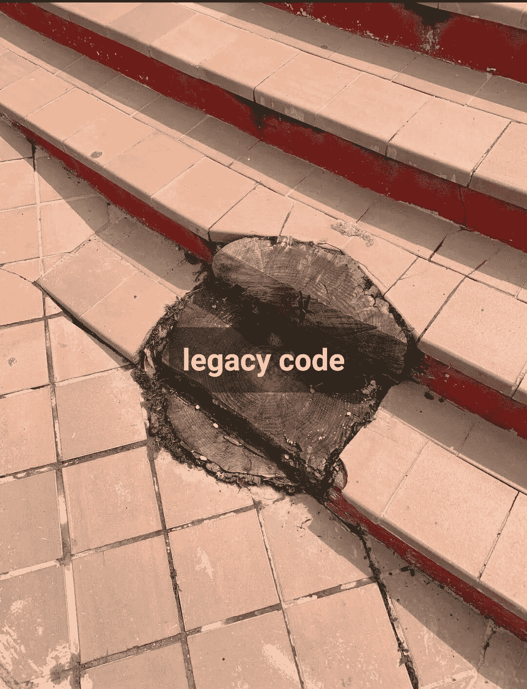

# 最佳升级编码(2022 年 5 月)

> 原文：<https://levelup.gitconnected.com/best-of-level-up-coding-may-2022-70931a26579d>

Rick 用代码滚动了一个类，列出了最好的开发人员工具，用 Tailwind CSS 在 3 分钟内克隆了 YouTube，成为了一个不可思议的程序员，TypeScript 继续接管世界，还有一些编程 lolz——从 Level Up Coding 汇编了过去一个月的顶级文章。

```
**🇺🇦 Hire Ukrainian Software Engineers
Remote.
Full-time.** 
I'm excited to announce that Level Up Coding has partnered with an incredible company in Europe who dedicates their time to connecting Ukrainian developers, designers, and PMs to companies around the world as full-time, remote employees.

✅ Bring on the highest-caliber developers who are eager to work on cutting edge projects
✅ Receive ongoing operational support to ensure successful employee integration
✅ Build an incredible team that allows you to scale your company

The agency recruiting fee is entirely waived when hiring engineers from Ukraine.

You’re going to get badass talent at a competitive rate.

[**Visit site to learn more 🔥➡️**](https://ukraine.levelup.dev/)
**Or email jobs@levelup.dev** and we can connect with you directly

------
*Are you looking for a job yourself or want access to our larger talent community?* [***Visit the Level Up hiring platform 🔥➡️***](https://jobs.levelup.dev/talent/welcome?referral=true)
------
```

对 Level Up 改变工程招聘的更广泛使命感兴趣吗？ [**了解我们将如何扰乱理工学院招募➡️**](/how-to-find-an-incredible-job-using-level-up-d4f8f5f66f3d)

## 🏆🏆🏆热门文章

[**每个开发者都应该收藏的 9 个不可思议的网站**](/9-incredible-websites-that-every-developer-should-bookmark-1534d52f3f7d?sk=501826e0d817d2271b1965c296b01c20) | [Vivek Naskar](https://medium.com/u/873738f2db55?source=post_page-----70931a26579d--------------------------------)

[**我为什么从 TypeScript 转到 Go**](/why-did-i-move-from-typescript-to-go-1d9f92ef882a?sk=6dc4e277645fe39aee7b2315ac684c7e) | [凯文·沃格尔](https://medium.com/u/a96fa42a46dd?source=post_page-----70931a26579d--------------------------------)

[**为什么每个程序员都应该在职业生涯中学习 c++**](/why-every-programmer-should-learn-c-during-their-careers-959e1bc2ea68?sk=ac065d5d85dffe4f0b60d263c3ffc72b)|[Shalitha Suranga](https://medium.com/u/ce00b3e87ebf?source=post_page-----70931a26579d--------------------------------)

[**我用 Tailwind CSS 克隆了 Youtube，3 分钟你就学会了！**](/i-cloned-youtube-with-tailwind-css-in-3-days-and-you-will-learn-it-in-3-minutes-a612334f21ff?sk=7a719cb7a045860e45cab59c24e6af9b) | [莱昂](https://medium.com/u/7c0baccf0ebd?source=post_page-----70931a26579d--------------------------------)

[**节省我工作时间的编码技巧**](/the-coding-tricks-that-save-me-hours-of-time-at-work-ce2a6c63c622?sk=0396ea27a91336b4b5d1411252d75223) | [按键按键](https://medium.com/u/179527732133?source=post_page-----70931a26579d--------------------------------)

[**是什么让一个杰出的程序员区别于一个普通的程序员**](/what-sets-an-exceptional-programmer-apart-from-an-ordinary-programmer-73d3fce24e21?sk=c9966348d59c0d2d6511af89017de475) | [笔磁铁](https://medium.com/u/739ee1624074?source=post_page-----70931a26579d--------------------------------)

[**我如何力克我的整个班级**](/how-i-rick-rolled-my-entire-class-d9f8b4b58cd5?sk=76bcf04be0b8db8b73a9bcc1ceac89ab) | [桑吉·查特吉](https://medium.com/u/6230e50878c7?source=post_page-----70931a26579d--------------------------------)

[**我如何使用 pure Go 构建了一个版本控制系统(VCS)🚀**](/how-was-i-build-a-version-control-system-vcs-using-pure-go-83ec8ec5d4f4) | [阿卜杜勒·i̇leri̇](https://medium.com/u/77397c9e27?source=post_page-----70931a26579d--------------------------------)

[**那些会让你对人性失去信心的代码例子**](/code-examples-that-will-make-you-lose-faith-in-humanity-a2a36ea9d331?sk=896334e884469606a3e0acd1c1d7f308) | [xeladu](https://medium.com/u/ae1e6291afc3?source=post_page-----70931a26579d--------------------------------)

[**我们如何将 Firestore 成本降低 70%以上**](/how-we-reduced-our-firestore-cost-by-more-than-70-193fd3d6f8ca?sk=e29fcf53765648b9239663dcc9f6ae2b)|[entre programmer](https://medium.com/u/67a9c31b5a5f?source=post_page-----70931a26579d--------------------------------)

[**深入 CQRS——一个伟大的微服务模式**](/what-is-cqrs-8ddd74ca05bb?sk=bf8d642dbd0ba5e2115ee10d3d5d912e) | [凯文·沃格尔](https://medium.com/u/a96fa42a46dd?source=post_page-----70931a26579d--------------------------------)

[**Python 多处理实用指南**](/a-practical-guide-to-multiprocessing-in-python-3e10195eec23?sk=9c42e9758cff6e46efa32bc31c204da8) | [萨梅尔·萨拉姆](https://medium.com/u/fce1159c0748?source=post_page-----70931a26579d--------------------------------)

[**数据拯救:数据收集在俄乌冲突中的作用**](/data-collection-in-conflict-58be290dc6bc?sk=f9be2b04f729d19d7e6c9657a5c521f4) | [拉基亚本萨希](https://medium.com/u/a5a3141be597?source=post_page-----70931a26579d--------------------------------)

[**你是否为你的网络合约付出过多？**](/do-you-pay-too-much-for-your-network-contract-e768e489b0bb) | [埃里克·克拉泽](https://medium.com/u/3426c72ebeca?source=post_page-----70931a26579d--------------------------------)

[**开发一个 App 不需要三屏！**](/you-dont-need-three-screens-to-develop-an-app-e42c9ebf0ac6?sk=aef8b476993b29b1f44a8958ddfe40f2) | [阿提拉·瓦格](https://medium.com/u/2053aaf853f5?source=post_page-----70931a26579d--------------------------------)

[**起反应的成分成分:如何弄对**](/react-components-composition-how-to-get-it-right-fb52ea06632a) | [娜迪亚·马卡列维奇](https://medium.com/u/bcdf0570e41c?source=post_page-----70931a26579d--------------------------------)

[**这就是为什么安静的程序员是最好的**](/this-is-why-quiet-programmers-are-the-best-291b425d5258?sk=488082a572b9d3317015c5a40321a859)|[Lokajit Tikayatray](https://medium.com/u/b2092d476f15?source=post_page-----70931a26579d--------------------------------)

[**我将生产 Docker 容器的尺寸缩小了 96%😎**](/optimize-your-docker-go-web-app-for-production-2c55db4d96ce?sk=e5409ac8b62e67a01dba4545c42b0af2) | [藩赛恩斯](https://medium.com/u/f5d1e3fae5de?source=post_page-----70931a26579d--------------------------------)

[**ASP.NET 核心项目**](/typescript-with-webpack-in-asp-net-core-projects-2e0b601d052b) | [Sergiy Korzh](https://medium.com/u/90d47743416?source=post_page-----70931a26579d--------------------------------) 用 WebPack 打字稿

[**如何为你的创业公司建立忠实粉丝群**](/how-to-build-a-loyal-fanbase-for-your-startup-2614207c7002?sk=abc7f632289698afaecee7df97b6f487) | [安托内洛萨尼尼](https://medium.com/u/282c7dc3a341?source=post_page-----70931a26579d--------------------------------)

[**每个开发者都应该收藏的 8 个免费备忘单**](/8-free-cheat-sheets-that-every-developer-should-bookmark-1c5c1bf0c75a?sk=8aaa693ae624275f365bdf2e5fd59a93) | [Vivek Naskar](https://medium.com/u/873738f2db55?source=post_page-----70931a26579d--------------------------------)

[**围棋中的特色你会喜欢**](/features-in-go-you-will-like-77b3a3a64417) | [莫森·肖耶伊](https://medium.com/u/199fdea7e02c?source=post_page-----70931a26579d--------------------------------)

[**无服务器架构层🚀**](/serverless-architecture-layers-a9dc50e9b342) | [李·詹姆斯·吉尔莫](https://medium.com/u/2906c6def240?source=post_page-----70931a26579d--------------------------------)

[**TypeScript 值得吗？**](/is-typescript-worth-it-5bccc280f99f?sk=73649ab70b04d8e1f7d166823a00cbaf) | [马特呱呱](https://medium.com/u/4180c044f281?source=post_page-----70931a26579d--------------------------------)

[**最强大的被低估的编程语言我看没人用**](/one-of-the-most-underrated-programming-languages-i-see-no-one-using-db82f67664c8?sk=b1f19aaf4d67573a2adca434e6087bb4)|[Clement Brian](https://medium.com/u/3cf9436aa33b?source=post_page-----70931a26579d--------------------------------)

[**为您的 Streamlit 应用程序建立 Firestore 数据库的 4 个简单步骤**](/4-easy-steps-to-set-up-a-firestore-database-for-your-streamlit-apps-825c5de5b5bc?sk=8c96de087a35db68a5579aa81d6e50d6) | [艾伯斯·乌兹拉](https://medium.com/u/159e5ce51250?source=post_page-----70931a26579d--------------------------------)

[**使用 Python 创建交互式可视化指南**](/guide-to-creating-interactive-visualizations-in-python-78f79ffc7d61) | [宝拉·马尔多纳多](https://medium.com/u/23e38bdb70ce?source=post_page-----70931a26579d--------------------------------)

[**面向程序员的 9 大 YouTube 频道**](/top-9-youtube-channels-for-programmers-b9c50cfcdffe?sk=573195acee5145560a2823432f253a55) | [Cinto](https://medium.com/u/80f4993f79be?source=post_page-----70931a26579d--------------------------------)

[**了解区块链和智能合约**](/understanding-blockchain-and-smart-contracts-9f039078aade?sk=9a33afa53439c1a32420257f8d1ff2b5) | [Ravi Tandon](https://medium.com/u/babb1c7c2dd1?source=post_page-----70931a26579d--------------------------------)

## 😂本月的迷因

你从未接触过的代码…



— Trey ( [@treyhuffine](https://twitter.com/treyhuffine) )