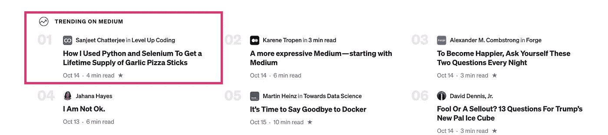

# 最佳升级编码(2020 年 11 月)

> 原文：<https://levelup.gitconnected.com/best-of-level-up-coding-november-2020-9781f798d080>

每个月我们都会分享上个月的顶级编码故事，以及关于出版物和我们社区的有趣数据。

```
**The** [**Skilled.dev coding interview course**](https://skilled.dev/) **has launched!** 🚀 I teach you how to ace your technical interviews. There is a huge launch sale that ends today and then a smaller Black Friday sale that will last through next week.
```

[Medium 最近推出了一些重大变革](https://blog.medium.com/a-more-expressive-medium-starting-with-medium-63b562206d8f)，所以这个月我想就这些变革对出版物的影响提供一些见解。

1.  我们已经看到来自中型领域的流量显著增加:中型领域的入站流量增加了 18.9%
2.  读者花更多的时间阅读:从每月 280 万分钟增加到 310 万分钟
3.  故事在媒体上的趋势会持续更长时间:以前大约是 3-5 天，现在对于许多热门帖子来说已经增加到 1 周以上
4.  总的来说，伟大的故事更容易被发现，阅读时间也更长

[升级编码](https://levelup.gitconnected.com/)甚至在他们发布更新后就有了第一个排名第一的故事！(享受那些奶酪棒[桑吉·查特吉](https://medium.com/u/6230e50878c7?source=post_page-----9781f798d080--------------------------------)😉).这导致了 59k 的文章总浏览量。



# 热门文章

[**软件架构:你需要知道的最重要的架构模式**](/software-architecture-the-important-architectural-patterns-you-need-to-know-a1f5ea7e4e3d?source=friends_link&sk=ab0e712ad71691c397f86727eb7ffe80) | [Trung Anh Dang](https://medium.com/u/7bea6a19463b?source=post_page-----9781f798d080--------------------------------)

[**我是如何用 Python 和 Selenium 得到一辈子的大蒜披萨棒供应的**](/how-i-used-python-and-selenium-to-get-a-lifetime-supply-of-garlic-pizza-sticks-94abb66b71e1?source=friends_link&sk=cf60cf425ee7de1472d7a77eddf3a85a)|[Sanjeet Chatterjee](https://medium.com/u/6230e50878c7?source=post_page-----9781f798d080--------------------------------)

[**我在 2020 年自动化的一切为我节省了几个小时的时间**](/everything-i-automated-in-2020-to-save-me-hours-of-time-14510a1a17d0?source=friends_link&sk=b71d2b9bb64e8cf581eeeb3323ffb1e1) | [按键按键](https://medium.com/u/179527732133?source=post_page-----9781f798d080--------------------------------)

[**世界上最难的 5 种编程语言**](/5-most-difficult-programming-languages-in-the-world-549c3cf91b23?source=friends_link&sk=8ecc36a4b866d5ce642d82871ca16328)|[Lokajit Tikayatray](https://medium.com/u/b2092d476f15?source=post_page-----9781f798d080--------------------------------)

[**与 10 倍开发人员合作的主要经验**](/top-lessons-learned-from-working-with-a-10x-developer-51de12383e25?source=friends_link&sk=278b660683b7568e6a7e54e26ce1183f) | [杰弗里·巴克](https://medium.com/u/a1d50af3eb55?source=post_page-----9781f798d080--------------------------------)

[**高级开发人员的 5 个标志**](/5-signs-of-a-senior-developer-7f5c59093c73?source=friends_link&sk=702836588e6e7c2ae7c053a3031a5e6c) | [金奎大](https://medium.com/u/9a5b40458190?source=post_page-----9781f798d080--------------------------------)

[**API 架构风格对比:SOAP vs REST vs graph QL vs RPC**](/comparing-api-architectural-styles-soap-vs-rest-vs-graphql-vs-rpc-84a3720adefa?source=friends_link&sk=16cf604daff73908e22b5d22e1d56d4c)|[altex soft Inc](https://medium.com/u/fb641da4b895?source=post_page-----9781f798d080--------------------------------)

[**每个软件架构师都应该知道的 3 个 CQRS 架构**](/3-cqrs-architectures-that-every-software-architect-should-know-a7f69aae8b6c?source=friends_link&sk=b6dea517e74c8804f718418c834daa80)|[Daniel Rusnok](https://medium.com/u/7467f0f889eb?source=post_page-----9781f798d080--------------------------------)

[**JavaScript 代理的惊人力量**](/the-amazing-power-of-javascript-proxies-aa27c6d06bcb?source=friends_link&sk=e32fc681433e8bed415e878c705fbd72)|[Georgy Glezer](https://medium.com/u/d195560613c2?source=post_page-----9781f798d080--------------------------------)

[**用哈斯克尔**](/delivering-with-haskell-a347d8359597?source=friends_link&sk=7a3bef90f2278dcbdc9f1a9b09e80648) | [fommil](https://medium.com/u/cf1b3fef2efc?source=post_page-----9781f798d080--------------------------------)

[**3 编程习惯打造现在**](/3-programming-habits-to-build-now-5d7e0c9b9aff?source=friends_link&sk=345e00b6c4398fe44e9c39d9cef7bf1d) | [阿米米哈达德](https://medium.com/u/86f5152e22a7?source=post_page-----9781f798d080--------------------------------)

[**三年的 Web 开发生涯—收获**](/three-years-of-web-development-career-takeaways-9d8df65c5cf6?source=friends_link&sk=d31e9e87bbd71ae3d7797078e437b617) | [巴拉思·拉维](https://medium.com/u/d3cb98938cdc?source=post_page-----9781f798d080--------------------------------)

[**创建自己的量子力学模拟(用 Python)**](/create-your-own-quantum-mechanics-simulation-with-python-51e215346798?source=friends_link&sk=e4ddefcc5981368124e08cf70d9081b6) | [菲利普·莫克兹](https://medium.com/u/bc645351fde0?source=post_page-----9781f798d080--------------------------------)

[**使用 Git 命令会让你看起来像个高级开发人员**](/using-git-commands-that-will-make-you-look-like-a-senior-developer-14247f4aca3b?source=friends_link&sk=2bb26234ed44274aa1488a423d02bdbd) | [pandaquests](https://medium.com/u/28539fb53286?source=post_page-----9781f798d080--------------------------------)

[](/the-ultimate-guide-to-modern-web-application-performance-ec4eec9939?source=friends_link&sk=248c13006fdba41e12e75bde78018a57)**|[Gaspar Nagy](https://medium.com/u/5d1627be1f12?source=post_page-----9781f798d080--------------------------------)**

**[](/ethical-hacking-part-1-owasp-top-10-and-dvwa-3f2d55580ba8?source=friends_link&sk=08241b3f1db460dcc600aa63737706b7)**|[迈克尔·惠特尔](https://medium.com/u/9065144dc262?source=post_page-----9781f798d080--------------------------------)****

****2020 年对于升级编码和社区来说是巨大的一年。非常感谢你们参与其中。我迫不及待地想分享今年的头条新闻以及我们在年度总结中达到的里程碑。****

****— Trey ( [@treyhuffine](https://twitter.com/treyhuffine) )****