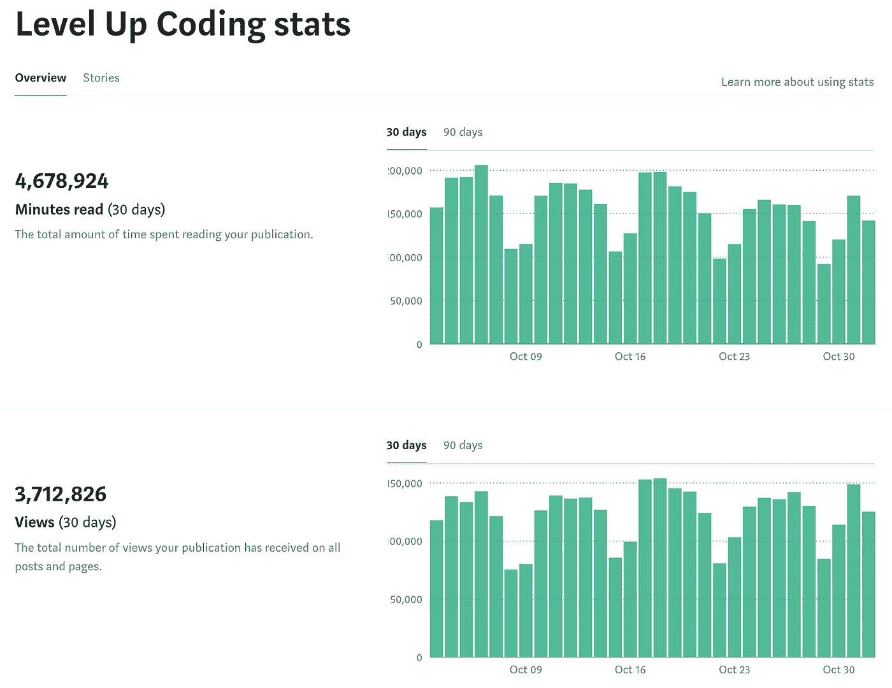

# 最佳升级编码(2022 年 11 月)

> 原文：<https://levelup.gitconnected.com/best-of-level-up-coding-november-2022-afe75bfeccf>

FAANG 公司的薪水，史蒂夫·乔布斯的建议，拒绝微软 100 亿美元的收购要约，React，TypeScript，Rust，Golang，Python，以及所有你喜欢的编程语言。查看在《升级编码》中分享的上个月的热门故事🔝。

```
🔥 **Meet the best startups and tech companies** Level Up is on a mission to disrupt tech recruiting. Have the best startups request to hire you.

👉 [**Join the Level Up talent collective ➡️**](https://jobs.levelup.dev/talent/welcome?referral=true)
```

招聘软件工程师？ [**现招➡️**](https://levelup.pallet.com/talent/welcome)

## 🏆热门文章🏆

[**【15 万美元亚马逊工程师 vs 30 万美元谷歌工程师**](/150-000-amazon-engineer-vs-300-000-google-engineer-b0976793cf56?sk=1c294e121465e6562cc28959b7412096) | [亚历山大·阮](https://medium.com/u/a148fd75c2e9?source=post_page-----afe75bfeccf--------------------------------)

[**史蒂夫·乔布斯的公式:如何在任何事情上取得成功**](/steve-jobs-formula-how-to-be-successful-at-anything-bc2366b0aa9?sk=6f4fa05422b089f1046853864e916212)|[entre programmer](https://medium.com/u/67a9c31b5a5f?source=post_page-----afe75bfeccf--------------------------------)

[**编程结束**](/the-end-of-programming-6e3f7ff0d8b4) | [马特威尔士](https://medium.com/u/98e549d0bb93?source=post_page-----afe75bfeccf--------------------------------)

[**2023 年成为前端高手可以做的 9 个项目**](/9-projects-you-can-do-to-become-a-front-end-master-in-2023-a4389153148c?sk=0cbdb04c35e4e218cc2acdee0304ffbb)|[Simon Holdorf](https://medium.com/u/9439af5bf72e?source=post_page-----afe75bfeccf--------------------------------)

[**巨蟒正在毁灭星球**](/python-is-destroying-the-planet-951e83f22748?sk=c136f8565cb90514861c23b35e30c2c8) | [穆罕默德·阿亚尔](https://medium.com/u/f2f097ed2ac0?source=post_page-----afe75bfeccf--------------------------------)

[**祖劳介绍:一款开源的卡夫卡监控&通知 App**](/introducing-zurau-an-all-in-one-kafka-monitoring-notification-app-for-devs-c5a13b7d95d) | [尼古拉斯·埃切瓦里](https://medium.com/u/d928a5039c2?source=post_page-----afe75bfeccf--------------------------------)

[**遇到一个程序员，他拒绝了微软**](/meet-a-programmer-who-rejected-a-10-000-000-000-acquisition-offer-from-microsoft-6dc984074961?sk=9dc904c893f83455f032e3384a268397) | [的 100 亿美元收购要约](https://medium.com/u/d8fc5db9b016?source=post_page-----afe75bfeccf--------------------------------)

[**破解你的加密非常简单**](/cracking-your-encryption-is-damn-simple-e4b9ce89c142?sk=236545c4b620ec947ec13815fb2a9be2) | [卢卡·皮奇内利](https://medium.com/u/7c4c3262f36e?source=post_page-----afe75bfeccf--------------------------------)

[**Linux/Ubuntu 命令加速你的日常工作**](/linux-ubuntu-commands-to-speed-up-your-daily-work-32f0d2517e8b?sk=5fb5bb58871e03926a6e089ac8fefc27)|[Shalitha Suranga](https://medium.com/u/ce00b3e87ebf?source=post_page-----afe75bfeccf--------------------------------)

[**这位软件工程师制作了一个聊天机器人，在工作时和他的女朋友聊天**](/this-software-engineer-made-a-chatbot-to-chat-with-his-girlfriend-while-at-work-6c68fe3e69ea?sk=5c0dc3b6bb8856a210665bf3ffff8174) | [女人](https://medium.com/u/71154650ecd4?source=post_page-----afe75bfeccf--------------------------------)

[**作为一名数据工程师你应该知道的 10 件事**](/10-things-you-should-know-as-a-data-engineer-2f1ad23abd9d?sk=19f05dd083e3cca3ff847110d9c757d8) | [米卡·安德里乌](https://medium.com/u/a0fef66b3c1f?source=post_page-----afe75bfeccf--------------------------------)

[**在 React Typescript 中管理类型，正确的方法**](/managing-types-in-react-typescript-the-right-way-fa1ecc50a2bf) | [艾哈迈德·马维亚](https://medium.com/u/3add2a0b60ea?source=post_page-----afe75bfeccf--------------------------------)

[**避免在编码面试中被拒绝的三大错误**](/top-three-mistakes-to-avoid-getting-rejected-in-coding-interviews-f62b1cee200e) | [Animesh Gaitonde](https://medium.com/u/307ef0382b4b?source=post_page-----afe75bfeccf--------------------------------)

[**了解堆内存分配:动手方法**](/understand-heap-memory-allocation-a-hands-on-approach-775151caf2ea) | [Chris Bao](https://medium.com/u/215cdd373f86?source=post_page-----afe75bfeccf--------------------------------)

[**在 React with Framer Motion**](/create-cool-page-navigation-animation-in-react-with-framer-motion-c08ed58d2b94)|[Kyle Le](https://medium.com/u/eec34ffd6541?source=post_page-----afe75bfeccf--------------------------------)

[**在 React 中实现认证和保护路由**](/implement-authentication-and-protect-routes-in-react-135a60b1e16f)|[Tara Prasad Routray](https://medium.com/u/73a30f4c867b?source=post_page-----afe75bfeccf--------------------------------)

[**设计模式:TypeScript 中的 Builder 模式**](/design-patterns-builder-pattern-in-typescript-2defc304954a?sk=2367749e407c560b7289008b9fa73c64) | [Bytefer](https://medium.com/u/ef5656df9c6c?source=post_page-----afe75bfeccf--------------------------------)

[**如何消除无处不在的注射工< T >。NET**](/how-to-eliminate-injecting-ilogger-t-everywhere-in-net-301be7b367a8?sk=786bf5ff8246c132f2326ff054184763)|[Tobias Streng](https://medium.com/u/c40fa101e695?source=post_page-----afe75bfeccf--------------------------------)

[**一个 Python 库，让预测时间序列变得简单**](/a-python-library-that-makes-it-simple-to-forecast-time-series-6a403da71542) | [法里德·汗](https://medium.com/u/b856005e5ecd?source=post_page-----afe75bfeccf--------------------------------)

比特币被采用的速度比互联网还快——你必须注意了，否则就太晚了。 | [袁晓超](https://medium.com/u/dfa24df0c833?source=post_page-----afe75bfeccf--------------------------------)

[**2022 年你家实验室的 10 款应用**](/10-apps-for-your-homelab-in-2022-867957bc9b2f?sk=6810898fabb4792d673401bf72ad53c0) | [亚伦·贝里](https://medium.com/u/2054724740ed?source=post_page-----afe75bfeccf--------------------------------)

[**在角度应用中键入路线路径管理**](/typed-route-path-management-in-an-angular-application-c50a0f89cec3)|[Dane Vanderbilt](https://medium.com/u/8df975002fb?source=post_page-----afe75bfeccf--------------------------------)

[**掌舵——流量控制**](/helm-flow-control-a085a67f22e) | [穆罕默德·沙米姆](https://medium.com/u/a96bc5a23088?source=post_page-----afe75bfeccf--------------------------------)

[**作为一名软件开发人员，我从观念转向黑曜石的两大原因**](/why-i-use-obsidian-for-note-taking-making-system-as-a-tech-writer-e208699e0011) | [李冠仪](https://medium.com/u/9f2dc23bfffa?source=post_page-----afe75bfeccf--------------------------------)

你可能从未用过的 12 个有用的 JavaScript 库。 | [托马斯·森特尔](https://medium.com/u/34e8cf71c960?source=post_page-----afe75bfeccf--------------------------------)

[**你应该写糟糕的代码**](/you-should-write-bad-code-78d4b5f31a38?sk=b7f8115eb2d5fe5de9f2e63b47bc44d1) | [大卫·阿莫斯](https://medium.com/u/2b3100272a2a?source=post_page-----afe75bfeccf--------------------------------)

[**亚里斯多德奠定了面向对象编程的基础**](/aristotle-laid-the-foundation-for-object-oriented-programming-c8ce840e8380?sk=144f205686f7b77bd69e53efd176151f) | [安托内洛萨尼尼](https://medium.com/u/282c7dc3a341?source=post_page-----afe75bfeccf--------------------------------)

[**Rust 和 Golang Web APIs 性能测试结果—评估数据点**](/rust-and-golang-web-apis-performance-testing-results-objective-data-points-to-choose-between-fd7a84c4272f?sk=ccf4c7bf90e170e211a8aa7a40c59dda) | [Shanmukh Sista](https://medium.com/u/5927256af5bf?source=post_page-----afe75bfeccf--------------------------------)

[**带打字稿的条件道具**](/conditional-props-with-typescript-78590139aa39)|[Kushal agr awal](https://medium.com/u/b262ef637524?source=post_page-----afe75bfeccf--------------------------------)

[**另一个奇异的电子替代物**](/another-fantastic-electron-alternative-cc3a5ce12462?sk=82062c4a0e395b576cf9f69d5d8346b4) | [艾德·卢瑟福](https://medium.com/u/218ea75e62c8?source=post_page-----afe75bfeccf--------------------------------)

系统设计面试:NoSQL 数据库以及何时使用它们。 | [阿尔斯兰·艾哈迈德](https://medium.com/u/2afa3b90b3f4?source=post_page-----afe75bfeccf--------------------------------)

[**如何从你的 Python 代码中消除循环**](/how-to-eliminate-loops-from-your-python-code-6dfb7c3578fa?sk=c7fc6bb617dd2e07dd20410ad7ff96e9) | [优素福·胡斯尼](https://medium.com/u/859af34925b7?source=post_page-----afe75bfeccf--------------------------------)

[**来自亚马逊、微软、谷歌**的薪酬细目表](/my-salary-progression-from-amazon-microsoft-google-ec58d0c3ba01?sk=c66c55fd3b1dc3df7c3e87aef6efbbdf) | [亚历山大阮](https://medium.com/u/a148fd75c2e9?source=post_page-----afe75bfeccf--------------------------------)

[**我重写了这 10 多行 JavaScript 代码，团队领导称赞这些代码非常优雅**](/i-re-wrote-these-10-single-lines-of-javascript-code-the-team-lead-praised-the-code-for-being-668ade4fea71) | [Rida F'kih](https://medium.com/u/9c88105465dc?source=post_page-----afe75bfeccf--------------------------------)

## 🔥本月的迷因🔥

我想对我们的社区大声疾呼，而不是一个迷因！10 月份，我们的读者人数超过 370 万，内容阅读时间超过 460 万分钟(创历史新高)。感谢你让 Level Up 成为网上最好的开发者社区。



*   🚀👉 [**加入升一级人才集体**](https://levelup.pallet.com/talent/welcome?referral=true) ➡
*   🔔跟随级别上升:[Twitter](https://twitter.com/gitconnected)|[LinkedIn](https://www.linkedin.com/company/gitconnected)|[时事通讯](https://newsletter.levelup.dev/)

— Trey ( [@treyhuffine](https://twitter.com/treyhuffine) )