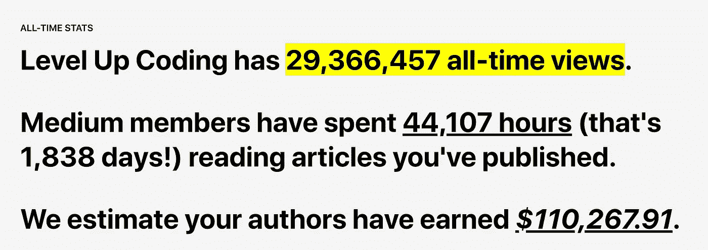

# 最佳升级编码(2020 年 10 月)

> 原文：<https://levelup.gitconnected.com/best-of-level-up-coding-october-2020-1ef85be6b071>

每个月我们都会分享来自高级编码的热门故事，以及关于出版物和我们社区的有趣统计数据。

我们已经达到了一些令人敬畏的里程碑—我们的作者总共赚了超过 100，000 美元！Level Up 编码中的文章超过了 40k 小时的中等会员阅读时间，我们即将创下 3000 万的历史故事浏览量。

> 我们就要发布了🚀对于 [***Skilled.dev 编码面试课程***](https://skilled.dev/)**——报名邮件列表获得专属 75%优惠💰！**

# *热门文章*

*[**用命令和处理程序替换 If-Else**](/replacing-if-else-with-commands-and-handlers-527e0abe2147?source=friends_link&sk=fd0a356c0b0a3669ab31a61cb6ef7ec4)|[尼克拉斯·米勒德](https://medium.com/u/7c7a43b3d9de?source=post_page-----1ef85be6b071--------------------------------)*

*[**成为一个更好的程序员你必须忘记的 4 件事**](/4-things-you-have-to-unlearn-to-become-a-better-programmer-547adf476445?source=friends_link&sk=303e378d2c88eb546780ef7a67f99c0f) | [龙立轩](https://medium.com/u/37d1339f42c5?source=post_page-----1ef85be6b071--------------------------------)*

*[**我们如何写出最快的 JavaScript UI 框架，又来了！**](/how-we-wrote-the-fastest-javascript-ui-framework-again-db097ddd99b6?source=friends_link&sk=f481c9e21020a7089c39e396912e734c) | [瑞安·卡尼亚托](https://medium.com/u/1789bbc16f7b?source=post_page-----1ef85be6b071--------------------------------)*

*[**像资深开发者一样使用 vs code**](/use-vscode-like-a-senior-developer-9b54054c452a?source=friends_link&sk=dc5b6dd52311580a7402f8d98a6ff23f)|[bitfish](https://medium.com/u/dac47b3482f4?source=post_page-----1ef85be6b071--------------------------------)*

***|[Shubham Dixit](https://medium.com/u/e1c455e7e36d?source=post_page-----1ef85be6b071--------------------------------)***

***[**为什么我要重新学习 Angular**](/why-i-am-relearning-angular-5308555f4e8e?source=friends_link&sk=34427b7e30873c5c46d3dc60ab157203)|[Bharath Ravi](https://medium.com/u/d3cb98938cdc?source=post_page-----1ef85be6b071--------------------------------)***

***[**这就是如今成为一名优秀前端开发人员的必备素质**](/this-is-what-it-takes-to-be-a-great-front-end-developer-these-days-6df25a9f8511?source=friends_link&sk=7363360c971ae3d78ca1b5f954dca7ca) | [金奎大](https://medium.com/u/9a5b40458190?source=post_page-----1ef85be6b071--------------------------------)***

***[**所有开发者都应该尝试的 6 个生产力工具**](/6-productivity-tools-that-all-developers-should-try-252191e523e4?source=friends_link&sk=801c7c7b904ba2c6301cce7216839e49)|[Galaxy web links](https://medium.com/u/d5cb76c79601?source=post_page-----1ef85be6b071--------------------------------)***

***[**系统设计:设计一个可扩展的&高可用的 URL 缩短器**](/system-design-designing-a-scalable-highly-available-url-shortener-eef5a5698d50?source=friends_link&sk=0205e9f0ff201e0edc112d2ae77845ec)|[Animesh gait onde](https://medium.com/u/307ef0382b4b?source=post_page-----1ef85be6b071--------------------------------)***

***[**想学编程却不知从何下手**](/i-want-to-learn-programming-but-i-dont-know-where-to-start-a8f82c333146?source=friends_link&sk=214f19ccc035dfb8283683b012ddeb45) | [约翰·塞拉斯基](https://medium.com/u/390a59d672a2?source=post_page-----1ef85be6b071--------------------------------)***

***[**MVC vs MVP vs MVVM**](/mvc-vs-mvp-vs-mvvm-35e0d4b933b4?source=friends_link&sk=36de89983b5df16caf229162e6a6c1cb)|[特朗普当](https://medium.com/u/7bea6a19463b?source=post_page-----1ef85be6b071--------------------------------)***

***[**将 VS 代码变成完美的书写工具**](/turn-vs-code-into-the-perfect-writing-tool-a22a136e4360?source=friends_link&sk=29c6a0d71094d6b63bd31187fb29269b) | [按键按键](https://medium.com/u/179527732133?source=post_page-----1ef85be6b071--------------------------------)***

***[**开发者应该知道的 10 个有用的 Golang 模块。布莱恩·迪克伊岑**](/10-useful-golang-modules-developers-should-know-d63a45438607?source=friends_link&sk=616e005c28bc68362d5e5e9544af3e10)***

***[**理解 setTimeout()**](/understanding-settimeout-15c7de9e5fd6?source=friends_link&sk=aa080ed64b0427a9a4890d119f9f3747) | [皮尤什·科赫哈尔](https://medium.com/u/f0106c58275d?source=post_page-----1ef85be6b071--------------------------------)***

***[**swift ui 中的微交互:动画波**](/micro-interactions-animated-wave-14e0b74a69a4?source=friends_link&sk=cdf4c8b924a4701b38ac78d6547f23a1)**|[Jean-Marc Boullianne](https://medium.com/u/8236d20ea410?source=post_page-----1ef85be6b071--------------------------------)*****

*****[**打字稿在角度上的优势**](/advantages-of-typescript-getters-and-setters-in-angular-668f4639ad0c?source=friends_link&sk=6eaf1e9fa993684f1b4a2753f44e59e7) | [万由里方法](https://medium.com/u/7f3aa841d947?source=post_page-----1ef85be6b071--------------------------------)*****

*****[**扑:中样文字编辑**](/flutter-medium-like-text-editor-b41157f50f0e?source=friends_link&sk=7408052d9f810a0284e1edb71e08b9cf) | [扬·布伦克霍斯特](https://medium.com/u/148c477871d0?source=post_page-----1ef85be6b071--------------------------------)*****

*****[**如何成为一名优秀的软件开发人员**](/how-to-become-an-outstanding-software-developer-8409f23716a?source=friends_link&sk=39dc083ffa8a1bfd9b8b67e2eb8e8771)|[Lokajit Tikayatray](https://medium.com/u/b2092d476f15?source=post_page-----1ef85be6b071--------------------------------)*****

*****[**在 5 天内建立一个软件开发者作品集网站**](/build-a-software-developer-portfolio-website-in-5-days-de3f86d1efee?source=friends_link&sk=b865d341edaba82c0c146904fb993548) | [玛丽亚·舒斯勒](https://medium.com/u/66998f99245c?source=post_page-----1ef85be6b071--------------------------------)*****

*****[**8 张证明软件工程师有幽默感的图片**](/8-pictures-that-prove-software-engineers-have-a-sense-of-humor-b4ffad6dfa90?source=friends_link&sk=99542e86353dc989b04eb882d9f74f67)**|[Varun Joshi](https://medium.com/u/6e252849a5f7?source=post_page-----1ef85be6b071--------------------------------)*******

*******如果你读了我写的关于我如何构建现代网络应用的文章，你会发现我是 TabNine 的超级粉丝。这是一个用于文本编辑器的人工智能自动完成插件，它让我变得非常有效率——它基本上为我做了编码。从那时起，我有机会了解他们的团队，他们很兴奋地给我们的社区 [**免费使用 TabNine 100 天**](https://bit.ly/3d4bqy3) ，不需要信用卡或订阅！*******

*****— Trey ( [@treyhuffine](https://twitter.com/treyhuffine) )*****