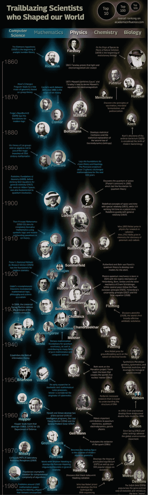

# 最佳升级编码(2022 年 10 月)

> 原文：<https://levelup.gitconnected.com/best-of-level-up-coding-october-2022-a35d03b3c854>

特色:编码采访，在工作中从事副业，通过离开 AWS 节省$$$的费用，在 FAANG 公司的生活，构建高性能的 web 应用程序，以及所有你喜欢的编程语言。查看在《升级编码》中分享的上个月的热门故事🔝。

```
**🚀🔥 Automate your developer career with gitconnected.com** gitconnected.com provides the missing toolkit to make it easy to find your next job: 
- [Build a resume automatically from your GitHub profile : View ➡️](https://gitconnected.com/resume-builder)
- [Power you portfolio website with an API : View ➡️](https://gitconnected.com/portfolio-api)
- [Coding interview course : View ➡️](https://skilled.dev/)
```

✨ **招聘软件工程师？** Level Up Coding 与 [1648 工厂](https://www.1648factory.com/engineering-studio)合作，向我们的 FAANG 级工程师全球社区提供访问权限。 [**现招➡️**](https://www.1648factory.com/engineering-studio)

# 🏆热门文章🏆

我的下级因为在上班时间做兼职项目而被解雇并被起诉

[**我们如何通过放弃 AWS 将我们的年度服务器成本降低了 80% —从 100 万美元降至 20 万美元**|](/how-we-reduced-our-annual-server-costs-by-80-from-1m-to-200k-by-moving-away-from-aws-2b98cbd21b46)[Trey Huffine](https://medium.com/u/47e700e59e44?source=post_page-----a35d03b3c854--------------------------------)

[**为什么在亚马逊工作不值 15 万美元**](/why-working-at-amazon-isnt-worth-150-000-e7b225391715?sk=fb930c00013c9c03787488c8de97e18d) | [亚历山大·阮](https://medium.com/u/a148fd75c2e9?source=post_page-----a35d03b3c854--------------------------------)

[**不只是 LeetCode 遵循编码模式而不是**](/dont-just-leetcode-follow-the-coding-patterns-instead-4beb6a197fdb?sk=09436bc9352d024ceac852f1da358cf5) | [阿尔斯兰·艾哈迈德](https://medium.com/u/2afa3b90b3f4?source=post_page-----a35d03b3c854--------------------------------)

[**17 年编程，7 天没学会 Javascript**](/17-years-in-programming-i-couldnt-learn-javascript-in-7-days-dd58d09568e0?sk=814108f4b9ab60bce6ee620cb109b23a)|[笔磁铁](https://medium.com/u/739ee1624074?source=post_page-----a35d03b3c854--------------------------------)

[**为什么 Python 的张量流正在慢慢消亡**](/why-tensorflow-for-python-is-dying-a-slow-death-ba4dafcb37e6?sk=6ce4ee035b1239ee6b693c5961de9846) | [Ari Joury 博士](https://medium.com/u/593908e0206?source=post_page-----a35d03b3c854--------------------------------)

[**桑德尔·皮帅如何在 2004 年一次棘手的面试中被谷歌录用**](/how-sundar-pichai-got-hired-by-google-in-a-tricky-interview-in-2004-370ac4fcb054?sk=e88328eebda7043689d827323cf1c157)|[entre programmer](https://medium.com/u/67a9c31b5a5f?source=post_page-----a35d03b3c854--------------------------------)

[**每个程序员都应该知道的 5 个数学概念**](/5-mathematical-concepts-that-every-programmer-should-know-b8e1813751ef?sk=a658de8a60304bbcbb9bfc6c1fc40327)|[Shalitha Suranga](https://medium.com/u/ce00b3e87ebf?source=post_page-----a35d03b3c854--------------------------------)

[**成功高级工程师的 6 大特征**](/6-characteristics-of-successful-senior-engineers-f84f902fa9e2) | [努尔·艾哈迈德](https://medium.com/u/8c06f89a3b9e?source=post_page-----a35d03b3c854--------------------------------)

[**OCI 得分高于 AWS 的少数地区**](/few-areas-where-oci-scores-above-aws-481e959140b9?sk=9d44ec5e7ec55863f09a1797c09096d4) | [P r a v e s h](https://medium.com/u/5c4cb49d77c7?source=post_page-----a35d03b3c854--------------------------------)

[**世界上最大的比特币持有者之一即将被清算**](/one-of-the-worlds-largest-bitcoin-holders-is-about-to-get-liquidated-193ef5fe3482?sk=5f35756a6c644cb3435262bf973cf0a5) | [袁晓超·莱维特](https://medium.com/u/dfa24df0c833?source=post_page-----a35d03b3c854--------------------------------)

[**React.js 性能优化技巧**](/react-js-performance-optimization-techniques-39728d89e56e) | [Mansi Manhas](https://medium.com/u/f47afc50919e?source=post_page-----a35d03b3c854--------------------------------)

[**上传文件到 S3 使用**](/upload-files-to-s3-using-angular-and-nestjs-64721d815d18?sk=7d3c43d11a7c5140ff12a2cc640fb444) | [向阳](https://medium.com/u/ed3c605e629d?source=post_page-----a35d03b3c854--------------------------------)

[**如何处理自定义。env Files in next . js**](/how-to-deal-with-custom-env-files-in-next-js-98d8c5b7899a?sk=1c454de3b91c9f6ca36269e555522288)|[安托内洛](https://medium.com/u/282c7dc3a341?source=post_page-----a35d03b3c854--------------------------------)

[**Angular Container/Presenter 模式讲解:2 个案例研究的重构**](/angular-container-presenter-pattern-a8f27a541802?sk=3d94db570edb6e0206ed77e367023059) | [拉基娅·本·萨希](https://medium.com/u/a5a3141be597?source=post_page-----a35d03b3c854--------------------------------)

[**你的编程技能的巨大市场**](/a-huge-market-for-your-programming-skills-79362bef613f?sk=9d50c97d354cb509b525608f92be4c66) | [按键按键](https://medium.com/u/179527732133?source=post_page-----a35d03b3c854--------------------------------)

[**面试经历:亚马逊 SDE 2**](/interview-experience-amazon-sde-2-978ecf4e5e93)|[Sandeep Kumar](https://medium.com/u/c20713e47357?source=post_page-----a35d03b3c854--------------------------------)

[**可扩展、可维护的 React 项目结构每个开发者都应该使用**](/scalable-and-maintainable-react-project-structure-every-developer-should-use-ae355bc57409) | [托马斯·森特](https://medium.com/u/34e8cf71c960?source=post_page-----a35d03b3c854--------------------------------)

[**2022 年面向所有开发者的 10 大特别 GitHub 回购**](/10-extraordinary-github-repos-for-all-developers-in-2022-be26d0181b0f?sk=9a724f459027b30a386282c86755cfbf) | [Simon Holdorf](https://medium.com/u/9439af5bf72e?source=post_page-----a35d03b3c854--------------------------------)

[**关于 CompletableFuture API 你需要知道的一切**](/everything-you-need-to-know-about-the-completablefuture-api-ec357e731a5c?sk=50b339dd78f657b9d162b3f7b8d8be6f) | [Vivek Naskar](https://medium.com/u/873738f2db55?source=post_page-----a35d03b3c854--------------------------------)

[**1000 个 Docker 容器从一个命令开始— Ultra Pro 可伸缩性**](/1000-docker-containers-start-with-one-command-ultra-pro-scalability-9b69305459f7) | [Guneet Singh](https://medium.com/u/a2ae00537885?source=post_page-----a35d03b3c854--------------------------------)

[**提高您的效率:开发团队的 5 大生产力插件**](/increase-your-efficiency-top-5-productivity-plugins-for-dev-teams-801118ffee5e) | [芭芭拉·拉维尼](https://medium.com/u/7331d5bd5639?source=post_page-----a35d03b3c854--------------------------------)

[**资深开发者都知道如何使用 Java 泛型通配符编写实用方法，但是你知道吗？**](/hmm-senior-developers-know-how-to-write-utility-methods-using-java-generics-wildcards-but-do-you-c41e5258c31a)|[Manoj Chemate](https://medium.com/u/2b2466cf324?source=post_page-----a35d03b3c854--------------------------------)

[**如何用 Python 把一张图像分割成小块**](/how-to-split-an-image-into-patches-with-python-e1cf42cf4f77?sk=f0be6a6719f2d18285443bd3ded37ef7) | [马蒂亚·加蒂](https://medium.com/u/19bc376db93c?source=post_page-----a35d03b3c854--------------------------------)

[**为什么埃隆·马斯克的双手测试非常有效**](/why-elon-musks-two-hand-test-for-hiring-is-very-effective-d4d366806319?sk=98a444bf7617636e227ff1b282eae7e8)|[entre programmer](https://medium.com/u/67a9c31b5a5f?source=post_page-----a35d03b3c854--------------------------------)

[**亚马逊软件工程师面试手册(2022)**](/amazon-software-engineer-interview-handbook-2022-fe64e7ad35a2?sk=4d1ddd9baf1ec88f88487ac5fceb7433) | [阿尔斯兰·艾哈迈德](https://medium.com/u/2afa3b90b3f4?source=post_page-----a35d03b3c854--------------------------------)

[**Python 是出了名的慢。现在它的创造者想把它的速度提高一倍**](/python-is-notoriously-slow-now-its-creators-want-to-make-it-twice-as-fast-acb41ad81f0a?sk=9d2b4831e11fe5f683a4d1a548069862) | [阿里·乔瑞博士](https://medium.com/u/593908e0206?source=post_page-----a35d03b3c854--------------------------------)

# 本月迷因(但不是本月真正的迷因……)



*   🚀👉 [**加入升一级的人才集体**](https://levelup.pallet.com/talent/welcome?referral=true) ➡
*   🔔跟随级别上升:[Twitter](https://twitter.com/gitconnected)|[LinkedIn](https://www.linkedin.com/company/gitconnected)|[时事通讯](https://newsletter.levelup.dev/)

— Trey ( [@treyhuffine](https://twitter.com/treyhuffine) )