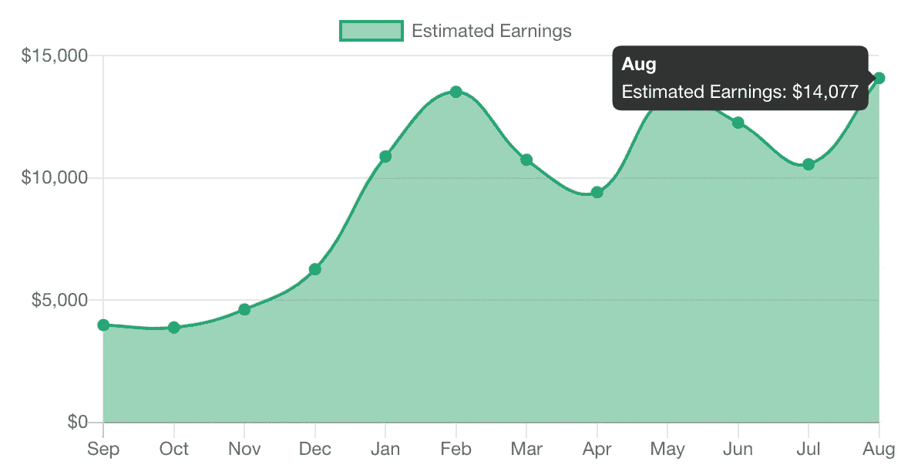

# 最佳升级编码(2020 年 9 月)

> 原文：<https://levelup.gitconnected.com/best-of-level-up-coding-september-2020-848ad3bed383>

每个月我们都会分享来自高级编码的热门故事，以及关于出版物和我们社区的有趣统计数据。

我们在 [Better Programming](https://medium.com/better-programming) (作者[扎克·夏皮罗](https://medium.com/u/a8530ab7d43e?source=post_page-----848ad3bed383--------------------------------))的朋友们一直在开发一个名为 Moneyball 的工具，提供中型作者和出版物的深度统计数据——他们现在正在推出测试版，寻找有兴趣注册的[作者。上个月，我们的作者获得了超过 14000 美元的报酬，创造了作者收入的记录。](https://usemoneyball.com/)

> *我还有一个月就要发布* [***Skilled.dev 编码面试教程***](https://skilled.dev/)**🙌！* *也有**[***订阅我们的 YouTube 频道***](https://www.youtube.com/c/treyhuffine1?sub_confirmation=1)**在那里我会分享我们项目的细节/见解(Level Up Coding，Skilled.dev，gitconnected.com)，带你浏览代码以及我们如何构建东西。我还将为面试问题编码制作视频，并提供职业发展建议。****

# **热门文章**

**[**6 个会让你 LOL 的编程笑话**](/6-programming-jokes-that-will-make-you-lol-131b8cae4dc5?source=friends_link&sk=f835d749c08f0b1097e46f8918d3220f) | [Varun Joshi](https://medium.com/u/6e252849a5f7?source=post_page-----848ad3bed383--------------------------------)**

**[**我如何为真实用户构建可扩展的现代 Web 应用**](/how-i-build-scalable-modern-web-applications-for-real-users-3910a3e32793?source=friends_link&sk=337df2319944743eac35e269a40e38c7) | [特雷·赫芬](https://medium.com/u/47e700e59e44?source=post_page-----848ad3bed383--------------------------------)**

**[**缺乏经验的开发者的 4 个标志**](/4-signs-of-an-inexperienced-developer-851966fdc6b1?source=friends_link&sk=ea7169a8f83ce8728f7ae69b6fac2040) 和 [**7 VS 让你想永远保持编码的代码扩展**](/7-vs-code-extensions-that-make-you-want-to-keep-coding-forever-f205e597ae34?source=friends_link&sk=fdf489f5c40c7b3c779dcf8437bd65ab) | [金奎大](https://medium.com/u/9a5b40458190?source=post_page-----848ad3bed383--------------------------------)**

**[**If-Else 是穷人的多态**](/if-else-is-a-poor-mans-polymorphism-ab0b333b7265?source=friends_link&sk=ac402db75f8be952c01ff5939ccac88d) | [尼可拉斯·米勒德](https://medium.com/u/7c7a43b3d9de?source=post_page-----848ad3bed383--------------------------------)**

**[**TailwindCSS 和 Angular:很配！**](/tailwindcss-and-angular-its-a-match-7bf68c15fc54?source=friends_link&sk=2bcaa8cfcd23d3c81d1020616065ebac) | [凯文·马蒂](https://medium.com/u/75d28c19747c?source=post_page-----848ad3bed383--------------------------------)**

**[**Rust Adventures:Collections 简介—Hash Maps**](/rust-adventures-introduction-to-collections-hash-maps-53ccc5e5a214?source=friends_link&sk=18362d3393cd170a9efade635de8b6e3)|[Floriano Victor 佩肖托](https://medium.com/u/ec76ef99bc09?source=post_page-----848ad3bed383--------------------------------)**

**[**从材质组件中学习角度组件设计模式**](/learn-angular-component-design-patterns-from-material-components-58f8d072854a?source=friends_link&sk=df5ea035997a3e6de7762e89a7a2b0fc) | [巴拉思·拉维](https://medium.com/u/d3cb98938cdc?source=post_page-----848ad3bed383--------------------------------)**

**[**具有计算机视觉的机器人**](/dynobot-with-computer-vision-eae8e9cd1b3c?source=friends_link&sk=deda6512d0bbfe9d1a7e865edc2e77e0) | [帕维尔·伊林](https://medium.com/u/8e2548400804?source=post_page-----848ad3bed383--------------------------------)**

**[**线程安全字典数据结构在 Golang 中的实现**](/implementation-of-thread-safe-dictionary-data-structure-in-golang-2bcb235fd9e4?source=friends_link&sk=ae2ce4ab1231c2f16dea447362edec3b)**|[Radhakishan Surwase](https://medium.com/u/a420c06501fe?source=post_page-----848ad3bed383--------------------------------)****

****[**我做软件工程师 5 年来学到的经验**](/lessons-ive-learned-in-5-years-as-a-software-engineer-ee483f12d83a?source=friends_link&sk=27aa586fcc27a23121dd00a975c30374) | [马尼什·贾恩](https://medium.com/u/728e7aeac31a?source=post_page-----848ad3bed383--------------------------------)****

****[**JS 中关于吊装的真相**](/the-truth-about-hoisting-in-js-8ac79a08a5f9?source=friends_link&sk=8a98e84a22cca4883acc6b44167dff1f) | [艾莉森·夸利亚](https://medium.com/u/c75ea57b8ce?source=post_page-----848ad3bed383--------------------------------)****

****[**我如何落榜旗面试**](/how-i-failed-the-flag-interviews-7c81cc6a82e0?source=friends_link&sk=b0b50f31a52b3be82dbb033a8225f399) | [袁林](https://medium.com/u/a1786ab6b038?source=post_page-----848ad3bed383--------------------------------)****

****[**Vue 3 来了—期待什么以及如何准备**](/vue-3-is-coming-what-to-expect-and-how-to-prepare-dbf35c67c52d?source=friends_link&sk=d28c416417ab55e60db14dac2ade4d1f) | [尼姆罗德·克莱默](https://medium.com/u/ca6d2ba8d64a?source=post_page-----848ad3bed383--------------------------------)****

****[**新手程序员的错误及如何避免**](/newbie-programmers-mistakes-and-how-to-avoid-them-f39a94bf753b?source=friends_link&sk=657d3fe8e542378b88d0e3377e289a1a) | [约翰·塞拉斯基](https://medium.com/u/390a59d672a2?source=post_page-----848ad3bed383--------------------------------)****

****[**如何使用上下文与 React 挂钩**](/how-to-use-context-with-react-hooks-5591a4010689?source=friends_link&sk=9724f77352013e4a07fc897f8e6b104b) | [迈克·克罗宁](https://medium.com/u/fabe5f8ed616?source=post_page-----848ad3bed383--------------------------------)****

****[**优化 Django 查询**](/optimizing-django-queries-28e96ad204de?source=friends_link&sk=adde0fbd1047f5f2967a8ebfea9779f8)|[Pommes 博士](https://medium.com/u/1b1eb65b0e5e?source=post_page-----848ad3bed383--------------------------------)****

****[**高级等级为角形无功形式**](/advanced-level-for-angular-reactive-form-6482e19add5c?source=friends_link&sk=759812f967979935ff67b931fc091eec) | [TRAN 子皇](https://medium.com/u/5e368bed066?source=post_page-----848ad3bed383--------------------------------)****

****[**语境在戈朗！**](/context-in-golang-98908f042a57?source=friends_link&sk=c3e8b263bc67488f3e952ad9eeff5541) | [里卡多·林克](https://medium.com/u/b032d91665cf?source=post_page-----848ad3bed383--------------------------------)****

****[**在围棋中打造自己的未来**](/build-your-own-future-in-go-f66c568e9a7a?source=friends_link&sk=c1b8934475db7b7f9d56b4840b221292) | [阿列克谢·索申](https://medium.com/u/c2859b77a925?source=post_page-----848ad3bed383--------------------------------)****

****[**为 Linux 编写插件**](/writing-plugins-for-linux-in-flutter-38e46bd7872f?source=friends_link&sk=d0618083798cbce4e2a067538e5a991d)**|[Yash Johri](https://medium.com/u/6ef0c408409e?source=post_page-----848ad3bed383--------------------------------)******

******如果你喜欢我们的每月更新，看看我们的每周简讯**。我们搜索整个网络，寻找技术、编码、创业和科学领域最有趣和最重要的故事。********

******— Trey ( [@treyhuffine](https://twitter.com/treyhuffine) )******