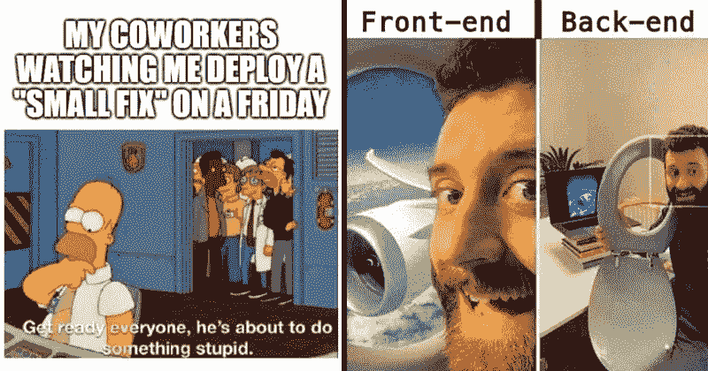

# 最佳升级编码(2021 年 9 月)

> 原文：<https://levelup.gitconnected.com/best-of-level-up-coding-september-2021-d9f0af4745dc>

开发人员的成长、TypeScript 4.4、干净的代码和开源软件——八月有很多你不想错过的精彩内容。像往常一样，非常感谢我们了不起的作家，他们在《升级编码》中分享了他们的故事，也非常感谢我们热情的社区。让我们来看看过去一个月的头条新闻。

```
We're offering a HUGE Labor Day sale on the Skilled.dev coding interview course. **Use code LABOR21 at checkout for a 40% discount** 💰 before midnight on Friday, Sept 10.👉 [**Coding Interview Course - Skilled.dev**](https://skilled.dev/) 👈
```

# 😂本月的迷因



# 🏆热门文章

[**一个月写 300+测试学到的 3 件事**](/3-things-i-learned-writing-300-tests-in-a-month-a9d48a7184c7?source=friends_link&sk=413ca6354ac09402c75133b2d3072acb) | [安东尼·奥列伊尼克](https://medium.com/u/252482b05eb?source=post_page-----d9f0af4745dc--------------------------------)

[**学会这 9 条规则，立即开始编写干净的代码**](/learn-these-9-rules-to-start-writing-clean-code-immediately-a7ee40fe1e1b?source=friends_link&sk=245e3a3fa11ec6ad02e61609ba9d768f) | [乔治·斯图德科](https://medium.com/u/5c8795610167?source=post_page-----d9f0af4745dc--------------------------------)

[**为什么全职程序员比以往减少得更快**](/why-full-time-programmers-are-decreasing-faster-than-ever-ad67d2697bbf?source=friends_link&sk=7ea200d7e8672d9ab2242e9be15cc39a) | [创业程序员](https://medium.com/u/67a9c31b5a5f?source=post_page-----d9f0af4745dc--------------------------------)

[**NFT 狂热是真实的——以下是你今天如何参与其中的方法**](/nft-mania-is-real-heres-how-you-can-get-involved-today-f3ffec8cc439?source=friends_link&sk=523d3c628f5845287fdc1bea6987c528) | [托比·黑兹伍德](https://medium.com/u/a4047ff95dbc?source=post_page-----d9f0af4745dc--------------------------------)

[**如果你想要高级开发人员，那么就让初级人员接触高级代码**](/if-you-want-senior-developers-then-expose-juniors-to-senior-code-446d04e28def?source=friends_link&sk=edcdacc847bb1aa53310aceca323c128) | [尼可拉斯·米勒德](https://medium.com/u/7c7a43b3d9de?source=post_page-----d9f0af4745dc--------------------------------)

[**Top 20+ Github Repos 每个开发者必须知道的**](/top-10-github-repos-every-developer-must-know-9da14292e284?source=friends_link&sk=6aaa881433378a52ed31cfc97fc28437) | [Anh Dang](https://medium.com/u/7bea6a19463b?source=post_page-----d9f0af4745dc--------------------------------)

[**科技行业常用的 5 个成语**](/demystifying-5-commonly-used-idioms-in-the-tech-industry-827e8a6d653a?source=friends_link&sk=e4e3f55aab9eaf906d79fef2690e056d) | [Karina Chow](https://medium.com/u/cbc941944705?source=post_page-----d9f0af4745dc--------------------------------)

[**一个糟糕的软件工程师的特征**](/characteristics-of-a-bad-software-engineer-29f38b176686?source=friends_link&sk=99ce861f47dd6590fa282b70aba670ad) | [马尼什·贾恩](https://medium.com/u/728e7aeac31a?source=post_page-----d9f0af4745dc--------------------------------)

[**React JS —令人困惑的部分**](/react-js-the-confusing-parts-4e9aea20c94c?source=friends_link&sk=968743d989e796c059aee3bc1cd2ce8a)|[jrpotodev](https://medium.com/u/e1ddaee057c5?source=post_page-----d9f0af4745dc--------------------------------)

[**4.4 打字稿的新功能和突破性变化**](/features-in-the-new-typescript-release-e5ef6ebba750?source=friends_link&sk=e5a716aec08d432b2d8e174ffd2bac69) | [拉基亚·本·萨希](https://medium.com/u/a5a3141be597?source=post_page-----d9f0af4745dc--------------------------------)

[**你应该知道的 15 个有用的 NPM 包**](/15-useful-npm-packages-that-you-should-know-71269a6531a4?source=friends_link&sk=f797386f39aa73f73dd0eb451c616840) | [内哈尔汗](https://medium.com/u/b1c60b289d9e?source=post_page-----d9f0af4745dc--------------------------------)

[**为不幸的路径设计**](/designing-for-unhappy-paths-90241cd7df59?source=friends_link&sk=988896358a9faa37f47a844170a23e70) | [H 洛克](https://medium.com/u/8af8791ca929?source=post_page-----d9f0af4745dc--------------------------------)

[**7 个你会爱上的迷人开源项目**](/7-fascinating-open-source-projects-you-will-fall-in-love-with-9402b3fabbbc?source=friends_link&sk=33a83a260ffff0fd960cfd06a0563872) | [Cinto](https://medium.com/u/80f4993f79be?source=post_page-----d9f0af4745dc--------------------------------)

[**计算机科学 vs .软件工程:哪个造就最好的程序员？**](/computer-science-vs-software-engineering-which-makes-the-best-programmers-352a0e56c87c?source=friends_link&sk=8d03aa3a22531ab32c66418c49dc4605) | [沙莉萨·苏朗加](https://medium.com/u/ce00b3e87ebf?source=post_page-----d9f0af4745dc--------------------------------)

[**软件工程师辞职的 13 个原因**](/13-reasons-why-software-engineers-quit-e4d312385d01?source=friends_link&sk=e13d5d2027c82949dfc416f13a326b12) | [P r a v e s h](https://medium.com/u/5c4cb49d77c7?source=post_page-----d9f0af4745dc--------------------------------)

[**Microfrontends:用哪个框架？**](/microfrontends-which-framework-to-use-457d5bed173e?source=friends_link&sk=a2d17da73333db870dff2176ebe87f1a) | [兰尼·埃尔豪斯尼](https://medium.com/u/2fe57836127?source=post_page-----d9f0af4745dc--------------------------------)

[**Linux 迎来 30 岁生日——以下 16 个事实让 Linux 成为有史以来最重要的操作系统**](/linux-turns-30-here-are-16-facts-that-make-linux-the-most-important-os-ever-created-5c854455d06c?source=friends_link&sk=8cc6b53c7895f6808a1af66a4e415a7a) | [Vivek Naskar](https://medium.com/u/873738f2db55?source=post_page-----d9f0af4745dc--------------------------------)

[**微服务很棒。但是不要使用微服务！**](/microservices-are-great-but-dont-use-microservices-for-the-heck-of-it-12d8ed75550a?source=friends_link&sk=4031455047e8405369d8ec42d1e7e194) | [安穆特·帕尔辛格](https://medium.com/u/30594823f191?source=post_page-----d9f0af4745dc--------------------------------)

[**成为软件开发人员的正确理由**](/if-you-feel-coding-is-a-trap-you-are-doing-it-wrong-e2160f521809?source=friends_link&sk=56262c7111302e7f64dd11e9cecf6f44)|[Lokajit Tikayatray](https://medium.com/u/b2092d476f15?source=post_page-----d9f0af4745dc--------------------------------)

[**搞笑代码评论说人家居然写了**](/50-funny-code-comments-that-people-actually-wrote-edc74618e633?source=friends_link&sk=309903426cfc8e6485ffc6bfdba29378)|[pran jal sa xena](https://medium.com/u/16dacdc2fd8?source=post_page-----d9f0af4745dc--------------------------------)

对交易、投资、加密货币、Python/AI/ML 感兴趣？**跟随全新的** [**InsiderFinance 出版👉**](https://wire.insiderfinance.io/)

你们已经使 Level Up 编码成为最好的编码社区之一，我很高兴能够继续拥有一个令人敬畏的 2021 年。注意安全！

— Trey ( [@treyhuffine](https://twitter.com/treyhuffine) )