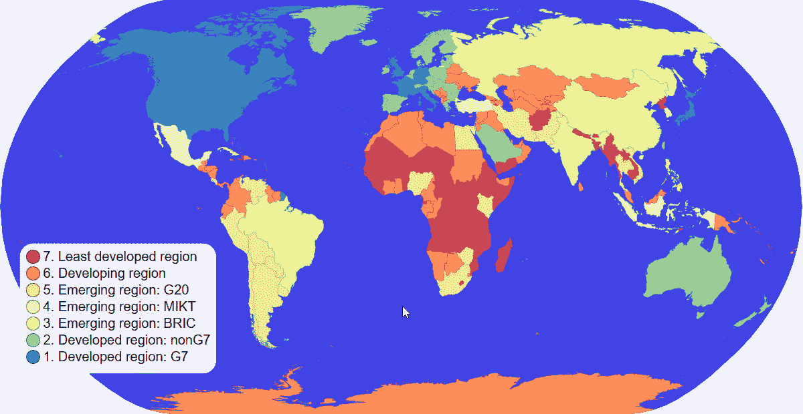

# 最佳在线 JavaScript 数据可视化课程[2020]

> 原文：<https://levelup.gitconnected.com/best-online-javascript-data-visualization-courses-2020-a5c6e4770eeb>

数据可视化的价值不能被高估。有了它，你可以让数据更有表现力和洞察力，而这在一开始是原始和枯燥的。只要方法正确，视觉化[让复杂的事物对观众来说显得更容易理解和掌握](https://www.webdatarocks.com/blog/power-of-data-visualization-and-charts/)。

通过用图表、地图或[数据透视表](https://www.webdatarocks.com/blog/what-is-pivot-table/)来描述数据，你可以更有效地传递同样的信息。当然，我们可以无限地列举数据可视化的好处。但是让我们直接进入这篇博文的目的。

这一次，我们建议你更接近数据可视化领域的能力。我们认为这不仅在劳动力市场上是一项关键技能，在日常生活中也是如此。它教会你以建设性和创造性的方式交流结果。

为了帮助你从一开始就走上正确的道路，我们使用 JavaScript 精心挑选了**数据可视化的最佳课程。**

所有这些课程在内容上有所不同，但有一个共同的目的:教你如何用一个通用的、低级的库来可视化数据。

这背后是有原因的。D3.js 是数据可视化领域公认的标准。从开发人员的角度来看，它只是一个低级的 JavaScript 库。大多数情况下，它在现代高级数据可视化库的保护下工作，因为它在交互和动画方面高度灵活、响应迅速。这就是为什么如果你想成为数据可视化领域的专家并从头开始构建独特的项目，理解 D3 的基础是必须的。

我们希望你能选择一两门最适合你学习方式的课程，一步一步地从初学者成长为专业人士。

让我们深入了解课程的亮点！

# [在 freeCodeCamp 上使用 D3.js](https://www.freecodecamp.org/news/data-visualization-using-d3-course/) 进行数据可视化📊

这个 13 小时的视频课程是独一无二的。它不仅是免费的，而且是高质量和难以置信的全面。Beau Carnes 以他的热情和幽默感分享了关于如何提出关于数据可视化目标的正确问题、讲述什么故事以及解决哪个问题的知识，这些都是每个数据可视化项目开始时的重要事项。

在学习了*数据可视化目标*之后，您将熟悉 JavaScript、HTML、CSS 和 SVG 的世界。所以，如果你是 web 开发的新手，那完全没问题。

然后您将深入研究 D3.js:构建各种可视化，定制它们，等等。你甚至可以了解网络上所有这些新奇的互动地图是如何构建的，并开发出你自己的地图。

所有这一切都以舒适的速度进行。

使用视频下的时间码从一个主题跳到另一个主题。但是如果你喜欢更经典的类似 Coursera 的方法，内容按周划分，我推荐你访问这个由[柯伦·凯莱赫](https://github.com/curran)准备的[页面](https://curran.github.io/dataviz-course-2018/)。它包含相同的内容，但分为不同的类别。在每个主题下，您可以看到相关资源的汇总汇编。

玩得开心！

# 信息可视化:用 Coursera 上的 D3.js 编程📈

本课程是纽约大学坦登工程学院[信息可视化专业](https://www.coursera.org/specializations/information-visualization)的一部分。

**必备条件**:需要有基本的编程经验。

一般来说，专业化集中在数据可视化的重要性上。特别是，课程本身带来了对使用 D3.js 库进行可视化编程的强烈关注。在学习了 HTML、CSS 和 JavaScript 的基础知识之后，您将对 D3.js 及其主要方面有一个基本的了解。通过它，您将学会如何:

*   加载、过滤、排序和转换原始数据
*   计算统计数据
*   使用 SVG 绘图。

其他主题包括画线，弧线，不同种类的图表，包括地图。最后，您将学习如何**可视化网络**和**分层** **数据**。

您的图表将是交互式的，因为您将学习如何收听事件和更新数据。

每周之后，你将通过编程作业将你的知识付诸实践，并通过测验对自己进行压力测试。我想不出比这更好的学习新事物的方法了。

# 在 Codecademy 上学习 D3 📉

**先决条件**:JavaScript 对象的基础知识及其基础。对 DOM 有很强的理解。

本课程是对 D3 的介绍。完成本课程需要 2 个小时。在此期间，您将了解 D3.js 的基础知识:选择、数据元素关系、“d”参数、数据样式、输入和追加数据、链接语法以及添加与事件的交互性。

作为期末项目，您将创建一个与气候变化相关的数据可视化。

请注意，本课程仅适用于 Codecademy 订阅。

# [通过前端主机上的 D3.js](https://frontendmasters.com/learn/d3-js/) 将数据转化为可视化📊

**必备条件**:JavaScript 基本功

本课程向您精彩地介绍了 D3.js，并带领您从初级水平到构建高级定制数据可视化。

它是由前端和数据可视化专家创建的，他们可以分享真实案例的知识。每一个视频都会激发你变得更擅长数据可视化。内容兼顾理论知识和代码实践。在观看过程中，您可以尝试自己构建可视化效果，看看数据是如何活跃起来的。

如果你是 React 开发者，你可能会对 React 课程的 [D3.js 感兴趣。](https://frontendmasters.com/courses/d3-js-react/)

付费会员可以参加这门课程。

# [用 D3](https://www.pluralsight.com/courses/geospatial-mapping-with-d3) 在 Pluralsight 上进行地理空间制图🗺️

**先决条件**:对 D3.js 和 JavaScript 有信心

如果您只想专注于创建地理空间可视化，本课程是正确的选择。您将学习如何使用 D3.js 库作为一种优秀的工具来渲染地图，并通过可视化使它们变得漂亮。

从了解 GeoJSON 和掌握交互式地图开始您的旅程。在本课程的高级部分，您将学习如何向地图添加缩放、城市和平移功能。

完成本课程需要 1 小时 14 分钟。可通过 Pluralsight 订阅获得。

完成这些课程后，您将能够:

*   理解使用 D3.js 的基础知识
*   知道如何设计、评估和开发数据可视化
*   知道如何交流见解
*   完成你自己的项目，这可能是你的投资组合的一个亮点。

无论技术趋势如何变化，所获得的知识都将在很长一段时间内发挥作用。您将能够在许多领域应用这些技能，同时，不局限于使用专有库。

⌨️觉得在开始使用 D3.js 之前需要提高你的 web 开发技能？我们知道在哪里做最好。

☝️surf[**git connected**](https://gitconnected.com/)——在那里你会找到教你 [JavaScript](https://gitconnected.com/learn/javascript) 、 [HTML](https://gitconnected.com/learn/html-5) 、 [CSS](https://gitconnected.com/learn/css) 等等的课程和教程。

*原载于*[*https://www.webdatarocks.com*](https://www.webdatarocks.com/blog/best-online-javascript-data-visualization-courses/)*。*